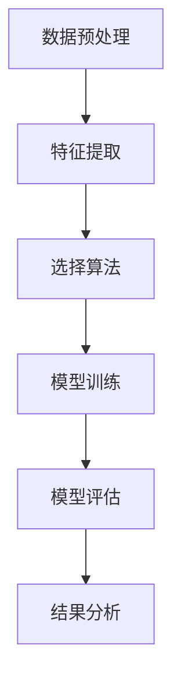
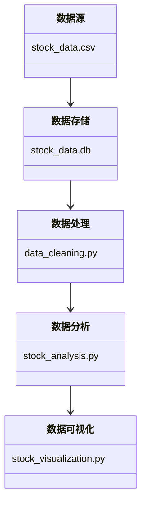
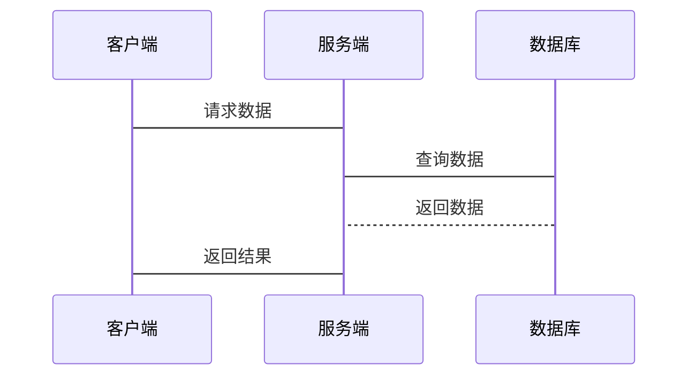

                 


# 特价股票投资中的数据分析和大数据应用

> 关键词：特价股票投资、数据分析、大数据应用、股票预测、投资策略

> 摘要：本文深入探讨了特价股票投资中的数据分析与大数据应用，从背景、核心概念、算法原理、系统架构到项目实战，结合具体案例，详细分析了如何利用数据分析和大数据技术优化股票投资策略，帮助投资者在复杂多变的股市中实现收益最大化。

---

# 第一部分: 特价股票投资中的数据分析与大数据应用基础

## 第1章: 特价股票投资的背景与目标

### 1.1 特价股票投资的背景

#### 1.1.1 特价股票的定义与特点
特价股票通常指价格低于市场平均水平的股票，具有低估值、高成长潜力的特点。其价格波动性较大，适合长期投资者或风险承受能力强的投资者。

#### 1.1.2 特价股票投资的目标与意义
投资目标是通过低价买入、高价卖出，实现收益最大化。其意义在于发现被市场低估的潜力股，规避高估的风险。

#### 1.1.3 特价股票投资的边界与外延
边界包括：价格波动范围、行业限制、公司基本面等；外延涉及技术分析、情绪分析等多维度因素。

### 1.2 数据分析在股票投资中的作用

#### 1.2.1 数据分析的基本概念
数据分析是通过处理和分析数据，提取有价值的信息，帮助决策的过程。

#### 1.2.2 数据分析在股票投资中的应用场景
场景包括：趋势预测、风险评估、投资组合优化等。

#### 1.2.3 数据分析对投资决策的影响
数据分析可以提供量化依据，帮助投资者做出更科学的决策，降低人为情绪干扰。

### 1.3 大数据技术在股票投资中的应用

#### 1.3.1 大数据技术的定义与特点
大数据指具有海量、多样化、高速生成等特点的数据集合，其处理需要依赖分布式计算和高效算法。

#### 1.3.2 大数据技术在股票市场中的优势
优势包括：处理海量数据、实时分析、预测能力等。

#### 1.3.3 大数据技术对股票投资的推动作用
大数据技术可以提高数据处理效率，增强预测准确性，为投资者提供实时动态支持。

## 第2章: 数据分析与大数据技术的核心概念

### 2.1 数据分析的核心原理

#### 2.1.1 数据分析的基本流程
流程包括：数据收集、清洗、分析、建模、可视化等。

#### 2.1.2 数据分析的关键技术
技术包括：数据清洗、特征提取、统计分析、机器学习等。

#### 2.1.3 数据分析的数学模型与公式
数学模型如线性回归、支持向量机等，用于预测和分类。

### 2.2 大数据技术的核心原理

#### 2.2.1 大数据的定义与特点
数据量大、类型多样、生成速度快是其主要特点。

#### 2.2.2 大数据技术的主要工具与平台
工具包括Hadoop、Spark、Flink等，平台包括云平台和分布式存储系统。

#### 2.2.3 大数据技术的架构与优势
架构包括数据存储层、计算层、分析层，优势是高效处理和分析海量数据。

### 2.3 数据分析与大数据技术的联系与区别

#### 2.3.1 数据分析与大数据技术的联系
数据分析是大数据技术的核心应用之一，大数据技术为数据分析提供了基础支持。

#### 2.3.2 数据分析与大数据技术的区别
数据分析侧重于数据处理和模型构建，大数据技术侧重于数据存储和计算效率。

## 第3章: 数据分析在股票投资中的算法原理

### 3.1 数据分析算法的基本原理

#### 3.1.1 数据预处理与特征提取
预处理包括数据清洗、缺失值处理，特征提取包括选择关键指标。

#### 3.1.2 数据分析算法的选择与优化
选择合适的算法，通过参数调整和模型优化提升预测准确性。

#### 3.1.3 数据分析算法的数学模型与公式
线性回归模型：$y = \beta_0 + \beta_1x + \epsilon$
支持向量机模型：构建超平面分离数据
随机森林模型：基于决策树的集成学习方法。

### 3.2 常见数据分析算法的实现

#### 3.2.1 线性回归模型
用于股票价格的趋势预测，通过最小二乘法拟合最佳回归线。

#### 3.2.2 支持向量机（SVM）模型
适用于分类问题，可以用于股票涨跌预测。

#### 3.2.3 随机森林模型
通过集成学习提高预测准确性和鲁棒性，适用于多特征数据。

### 3.3 算法实现的流程图与代码示例

#### 3.3.1 算法流程图（Mermaid）


#### 3.3.2 算法实现代码示例（Python）
```python
import pandas as pd
from sklearn.linear_model import LinearRegression
from sklearn.metrics import mean_squared_error

# 数据加载
data = pd.read_csv('stock_data.csv')

# 数据预处理
data = data.dropna()
X = data[['open', 'close', 'volume']]
y = data['price']

# 模型训练
model = LinearRegression()
model.fit(X, y)

# 模型预测
y_pred = model.predict(X)

# 模型评估
mse = mean_squared_error(y, y_pred)
print(f'均方误差：{mse}')
```

## 第4章: 特价股票投资中的大数据系统架构设计

### 4.1 系统架构设计

#### 4.1.1 问题场景介绍
系统需要处理海量股票数据，提供实时分析和预测功能。

#### 4.1.2 系统功能设计（领域模型Mermaid类图）


#### 4.1.3 系统架构设计（Mermaid架构图）
```mermaid
archiecture
    client --HTTP--> server
    server --RabbitMQ--> worker
    worker --HDFS--> storage
    storage --Spark--> analysis
    analysis --> result
```

#### 4.1.4 系统接口设计
接口包括数据获取、数据处理、模型调用、结果展示等。

#### 4.1.5 系统交互设计（Mermaid序列图）


---

# 第二部分: 项目实战与深度分析

## 第5章: 基于大数据的股票预测系统

### 5.1 项目背景与目标
开发一个基于大数据的股票预测系统，帮助投资者实现自动化分析和决策支持。

### 5.2 系统核心实现

#### 5.2.1 环境搭建
安装Python、Jupyter、Pandas、Scikit-learn、Hadoop、Spark等工具。

#### 5.2.2 数据收集与预处理
从公开数据源获取股票数据，清洗和转换数据，提取关键特征。

#### 5.2.3 模型实现与优化
选择合适的算法，进行模型训练和优化，评估模型性能。

#### 5.2.4 结果展示与分析
将预测结果可视化，分析模型的准确性和可行性。

### 5.3 代码实现与解读

#### 5.3.1 数据加载与预处理
```python
import pandas as pd

data = pd.read_csv('stock_data.csv')
data.dropna(inplace=True)
data['date'] = pd.to_datetime(data['date'])
data.set_index('date', inplace=True)
```

#### 5.3.2 特征提取与选择
```python
features = data[['open', 'high', 'low', 'close', 'volume']]
target = data['close'].shift(-1).dropna()
```

#### 5.3.3 模型训练与预测
```python
from sklearn.ensemble import RandomForestRegressor
from sklearn.metrics import mean_absolute_error

model = RandomForestRegressor(n_estimators=100, random_state=42)
model.fit(features, target)
```

#### 5.3.4 模型评估与优化
```python
importances = model.feature_importances_
print(importances)
```

### 5.4 项目小结

## 第6章: 最佳实践、小结与注意事项

### 6.1 最佳实践

#### 6.1.1 数据来源的选择
确保数据来源可靠，覆盖多维度信息。

#### 6.1.2 模型选择与优化
根据数据特点选择合适算法，持续优化模型性能。

#### 6.1.3 风险控制
设定止损点，避免重大损失。

### 6.2 项目小结

### 6.3 注意事项

#### 6.3.1 数据质量
确保数据准确性和完整性，避免错误决策。

#### 6.3.2 模型局限性
认识到模型的局限性，结合人工判断。

#### 6.3.3 市场风险
股票市场存在不确定性，投资需谨慎。

## 第7章: 拓展阅读与深入思考

### 7.1 拓展阅读

#### 7.1.1 经典书籍推荐
推荐《股票技术分析实战技巧》、《机器学习实战》等。

#### 7.1.2 行业动态与趋势
关注大数据在金融领域的最新应用和研究进展。

### 7.2 深入思考

#### 7.2.1 数据分析与投资决策的关系
数据分析是辅助工具，需结合市场理解和经验。

#### 7.2.2 大数据技术的未来发展
随着技术进步，数据分析将更加智能化、实时化。

---

# 作者：AI天才研究院 & 禅与计算机程序设计艺术

---

本文通过系统性的分析和实践，详细探讨了特价股票投资中的数据分析和大数据应用，从理论到实践，从基础到高级，帮助投资者和数据科学家更好地理解如何利用技术手段优化投资决策。

