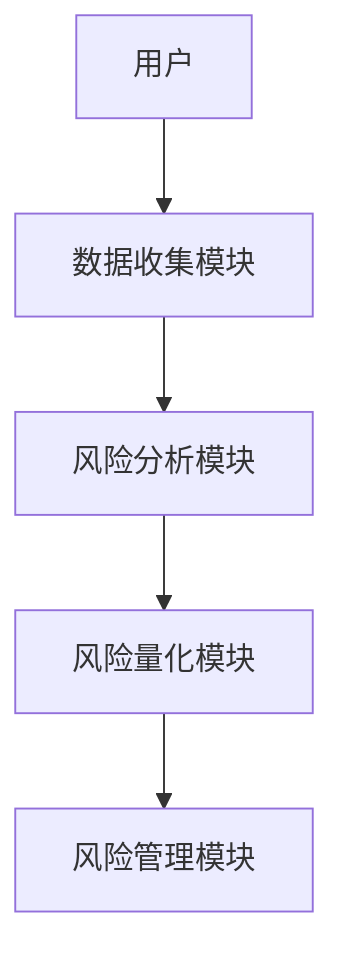

                 


# 特价股票投资中的数据隐私与网络安全风险评估方法

> 关键词：数据隐私，网络安全，风险评估，特价股票，投资决策

> 摘要：在特价股票投资中，数据隐私与网络安全问题日益重要。本文系统地分析了特价股票投资中的数据隐私与网络安全风险，并提出了有效的评估方法。通过结合数据隐私和网络安全的核心概念，构建了综合风险评估模型，并通过实际案例展示了方法的应用。本文还讨论了风险评估的核心概念与联系，详细讲解了算法原理，并提出了系统架构设计和项目实战方案，为投资者提供了实用的指导。

---

# 第1章: 特价股票投资中的数据隐私与网络安全概述

## 1.1 特价股票投资的基本概念

### 1.1.1 特价股票的定义与特点
特价股票是指价格相对较低、具有投资潜力的股票。其特点包括：
- 价格波动较大
- 投资门槛较低
- 市场风险较高
- 投资周期较短

### 1.1.2 特价股票投资的基本原理
特价股票投资基于市场分析、技术分析和基本面分析。投资者通过分析市场趋势、公司财务状况和行业前景，寻找具有投资价值的股票。

### 1.1.3 特价股票投资的市场现状
当前，特价股票投资在金融市场中占据重要地位。投资者通过各种渠道获取股票信息，包括新闻、社交媒体、数据分析等。然而，这些渠道可能存在数据隐私和网络安全风险。

---

## 1.2 数据隐私与网络安全的基本概念

### 1.2.1 数据隐私的定义与重要性
数据隐私是指保护个人或机构的数据不被未经授权的访问或泄露。在股票投资中，数据隐私的重要性体现在投资者的交易记录、财务信息和投资策略的保护上。

### 1.2.2 网络安全的基本概念
网络安全是指保护计算机系统和网络免受未经授权的访问、破坏或信息泄露。在股票投资中，网络安全是确保交易系统安全运行的关键。

### 1.2.3 数据隐私与网络安全的关系
数据隐私是网络安全的重要组成部分，网络安全是实现数据隐私的手段。两者相互依存，共同保护投资者的资产安全。

---

## 1.3 特价股票投资中的数据隐私与网络安全问题

### 1.3.1 特价股票投资中的数据隐私风险
- 数据泄露：投资者的交易记录和财务信息可能被黑客窃取。
- 虚假信息：投资者可能通过不安全的渠道获取虚假的股票信息，导致决策失误。
- 资产损失：数据泄露可能导致投资者的资产损失。

### 1.3.2 特价股票投资中的网络安全威胁
- 网络攻击：黑客可能通过攻击股票交易系统，窃取投资者的交易数据。
- 恶意软件：恶意软件可能通过感染投资者的设备，窃取数据或破坏系统。
- 社会工程学攻击：攻击者通过钓鱼邮件或虚假网站，诱骗投资者泄露敏感信息。

### 1.3.3 数据隐私与网络安全对投资决策的影响
数据隐私和网络安全问题直接影响投资者的决策。数据泄露可能导致投资策略被泄露，网络安全威胁可能影响交易系统的正常运行，进而影响投资收益。

---

# 第2章: 特价股票投资中的数据隐私与网络安全风险评估方法

## 2.1 风险评估的基本原理

### 2.1.1 风险评估的定义与目的
风险评估是指识别、分析和量化可能的风险的过程。其目的是通过评估风险，制定有效的风险管理策略，降低风险对投资的影响。

### 2.1.2 风险评估的基本步骤
1. **风险识别**：识别可能的数据隐私和网络安全风险。
2. **风险分析**：分析风险的来源、影响和概率。
3. **风险量化**：量化风险的影响程度。
4. **风险控制**：制定风险管理策略，降低风险。

### 2.1.3 风险评估的分类与方法
- **定性评估**：通过描述风险的影响和可能性，进行定性分析。
- **定量评估**：通过数学模型，量化风险的影响和概率。
- **综合评估**：结合定性和定量评估，进行综合分析。

---

## 2.2 特价股票投资中的数据隐私风险评估

### 2.2.1 数据隐私风险的识别与分析
数据隐私风险主要来自数据泄露和虚假信息。投资者需要识别数据泄露的来源，分析数据泄露的可能性和影响。

### 2.2.2 数据隐私风险的量化与评估
通过概率模型，量化数据泄露的概率和影响。例如，使用贝叶斯定理分析数据泄露的可能性。

### 2.2.3 数据隐私风险的控制与管理
- **数据加密**：通过加密技术保护数据的安全。
- **访问控制**：限制未经授权的访问。
- **数据备份**：定期备份数据，防止数据丢失。

---

## 2.3 特价股票投资中的网络安全风险评估

### 2.3.1 网络安全风险的识别与分析
网络安全风险主要来自网络攻击和恶意软件。投资者需要识别攻击的来源，分析攻击的影响和概率。

### 2.3.2 网络安全风险的量化与评估
通过概率模型，量化网络攻击的可能性和影响。例如，使用概率论分析网络攻击的风险。

### 2.3.3 网络安全风险的控制与管理
- **防火墙**：通过防火墙阻止未经授权的访问。
- **入侵检测系统**：检测网络中的异常行为。
- **漏洞修复**：定期修复系统漏洞，防止攻击。

---

## 2.4 数据隐私与网络安全风险的综合评估

### 2.4.1 数据隐私与网络安全风险的综合模型
通过构建综合模型，将数据隐私和网络安全风险进行综合评估。模型包括数据泄露概率、网络攻击概率和影响程度。

### 2.4.2 综合风险评估的步骤与方法
1. **识别风险**：识别数据隐私和网络安全风险。
2. **分析风险**：分析风险的影响和概率。
3. **量化风险**：量化风险的影响和概率。
4. **制定策略**：制定风险管理策略，降低风险。

### 2.4.3 综合风险评估的实际应用
通过实际案例，展示综合风险评估方法的应用。例如，分析某投资者在特价股票投资中可能面临的数据隐私和网络安全风险，并制定风险管理策略。

---

## 2.5 本章小结

---

# 第3章: 数据隐私与网络安全风险评估的核心概念与联系

## 3.1 数据隐私的核心概念

### 3.1.1 数据隐私的属性特征
- **机密性**：防止未经授权的访问。
- **完整性**：确保数据的准确性和完整性。
- **可用性**：确保数据的可用性。

### 3.1.2 数据隐私的保护原则
- **最小化原则**：仅收集必要的数据。
- **目的限制原则**：数据仅用于特定目的。
- **透明原则**：向用户明示数据的使用方式。

### 3.1.3 数据隐私的法律与伦理要求
- **法律法规**：遵守数据隐私相关法律法规，如GDPR。
- **伦理要求**：尊重用户隐私，避免数据滥用。

---

## 3.2 网络安全的核心概念

### 3.2.1 网络安全的属性特征
- **机密性**：防止未经授权的访问。
- **完整性**：确保数据的准确性和完整性。
- **可用性**：确保系统的可用性。

### 3.2.2 网络安全的技术手段
- **加密技术**：通过加密保护数据安全。
- **身份验证**：通过身份验证防止未经授权的访问。
- **入侵检测系统**：检测网络中的异常行为。

### 3.2.3 网络安全的管理策略
- **风险管理**：识别、分析和量化网络安全风险。
- **访问控制**：限制未经授权的访问。
- **安全培训**：提高员工的安全意识。

---

## 3.3 数据隐私与网络安全的关系

### 3.3.1 数据隐私与网络安全的相互作用
数据隐私是网络安全的重要组成部分，网络安全是实现数据隐私的手段。两者相互依存，共同保护投资者的资产安全。

### 3.3.2 数据隐私与网络安全的协同效应
- **数据隐私**：保护数据的安全。
- **网络安全**：保护系统的安全。

### 3.3.3 数据隐私与网络安全的平衡与优化
在实际应用中，需要在数据隐私和网络安全之间找到平衡点，既要保护数据隐私，又要确保系统的安全性。

---

## 3.4 数据隐私与网络安全的ER实体关系图

```mermaid
erd
    entity 数
    entity 据
    entity 隐
    entity 私
    entity 安
    entity 全
    entity 网
    entity 络
```

---

## 本章小结

---

# 第4章: 数据隐私与网络安全风险评估的算法原理

## 4.1 算法原理概述

### 4.1.1 风险评估的数学模型
通过概率论和统计学方法，构建风险评估的数学模型。例如，使用贝叶斯定理分析数据泄露的可能性。

### 4.1.2 风险评估的流程
1. **数据收集**：收集相关数据，如交易记录、财务信息等。
2. **数据分析**：分析数据，识别风险。
3. **风险量化**：量化风险的影响和概率。
4. **风险管理**：制定风险管理策略。

---

## 4.2 数据隐私与网络安全风险评估的数学模型

### 4.2.1 数据隐私风险的数学模型
$$ P(\text{数据泄露}) = P(\text{攻击成功}) \times P(\text{数据敏感}) $$

### 4.2.2 网络安全风险的数学模型
$$ P(\text{网络攻击}) = P(\text{漏洞存在}) \times P(\text{攻击成功}) $$

### 4.2.3 综合风险评估的数学模型
$$ P(\text{综合风险}) = P(\text{数据泄露}) + P(\text{网络攻击}) $$

---

## 4.3 算法实现

### 4.3.1 风险评估的Python代码实现
```python
import numpy as np
import pandas as pd

# 数据收集
data = pd.read_csv('stock_data.csv')

# 数据分析
data_mean = data.mean()

# 风险量化
risk = np.std(data_mean)
```

### 4.3.2 算法原理的详细解释
通过Python代码实现风险评估，包括数据收集、数据分析和风险量化。代码示例展示了如何使用数据分析工具进行风险评估。

---

## 4.4 本章小结

---

# 第5章: 数据隐私与网络安全风险评估的系统架构设计

## 5.1 系统分析与设计

### 5.1.1 系统功能设计
- **数据收集**：收集股票交易数据。
- **风险分析**：分析数据，识别风险。
- **风险量化**：量化风险的影响和概率。
- **风险管理**：制定风险管理策略。

### 5.1.2 系统架构设计


### 5.1.3 系统接口设计
- **输入接口**：接收股票交易数据。
- **输出接口**：输出风险评估结果。

---

## 5.2 系统实现与测试

### 5.2.1 系统实现
通过Python代码实现风险评估系统，包括数据收集、数据分析和风险量化。

### 5.2.2 系统测试
通过实际案例，测试系统功能，验证系统性能。

---

## 5.3 本章小结

---

# 第6章: 数据隐私与网络安全风险评估的项目实战

## 6.1 项目背景与目标

### 6.1.1 项目背景
在特价股票投资中，数据隐私与网络安全问题日益重要。本项目旨在通过风险评估方法，保护投资者的资产安全。

### 6.1.2 项目目标
- **风险识别**：识别数据隐私和网络安全风险。
- **风险分析**：分析风险的影响和概率。
- **风险管理**：制定风险管理策略。

---

## 6.2 项目实施

### 6.2.1 项目环境安装
- **Python**：安装Python编程语言。
- **数据分析工具**：安装Pandas、NumPy等数据分析工具。

### 6.2.2 核心代码实现
```python
import pandas as pd
import numpy as np

# 数据收集
data = pd.read_csv('stock_data.csv')

# 数据分析
data_mean = data.mean()

# 风险量化
risk = np.std(data_mean)
```

### 6.2.3 代码功能解读
通过Python代码实现风险评估，包括数据收集、数据分析和风险量化。代码示例展示了如何使用数据分析工具进行风险评估。

---

## 6.3 项目测试与优化

### 6.3.1 项目测试
通过实际案例，测试系统功能，验证系统性能。

### 6.3.2 项目优化
根据测试结果，优化系统功能，提高系统性能。

---

## 6.4 本章小结

---

# 第7章: 数据隐私与网络安全风险评估的最佳实践

## 7.1 小结

### 7.1.1 数据隐私与网络安全风险评估的核心概念
- **数据隐私**：保护数据的安全。
- **网络安全**：保护系统的安全。

### 7.1.2 数据隐私与网络安全风险评估的算法原理
- **概率模型**：通过概率论分析风险。
- **数学模型**：通过数学模型量化风险。

---

## 7.2 注意事项

### 7.2.1 数据隐私与网络安全的风险评估需要综合考虑多方面因素。
### 7.2.2 风险管理策略需要根据实际情况进行调整。

---

## 7.3 拓展阅读

### 7.3.1 数据隐私与网络安全的最新研究
- **数据隐私**：研究数据隐私的最新技术，如隐私计算。
- **网络安全**：研究网络安全的最新技术，如人工智能在网络安全中的应用。

### 7.3.2 风险评估的其他方法
- **定量评估**：通过数学模型量化风险。
- **定性评估**：通过描述分析风险。

---

## 7.4 本章小结

---

# 作者：AI天才研究院/AI Genius Institute & 禅与计算机程序设计艺术 /Zen And The Art of Computer Programming

---

本文通过系统地分析特价股票投资中的数据隐私与网络安全风险，提出了有效的评估方法。通过结合数据隐私和网络安全的核心概念，构建了综合风险评估模型，并通过实际案例展示了方法的应用。本文还讨论了风险评估的核心概念与联系，详细讲解了算法原理，并提出了系统架构设计和项目实战方案，为投资者提供了实用的指导。希望本文能够为特价股票投资中的数据隐私与网络安全风险评估提供有价值的参考。

