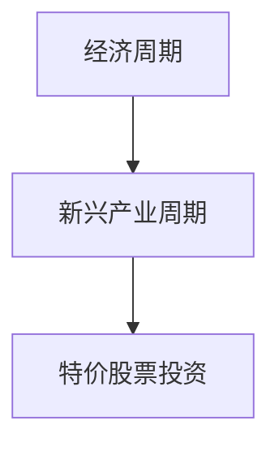
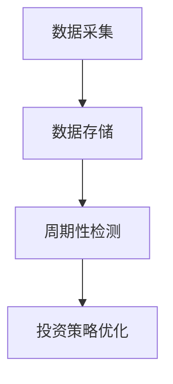
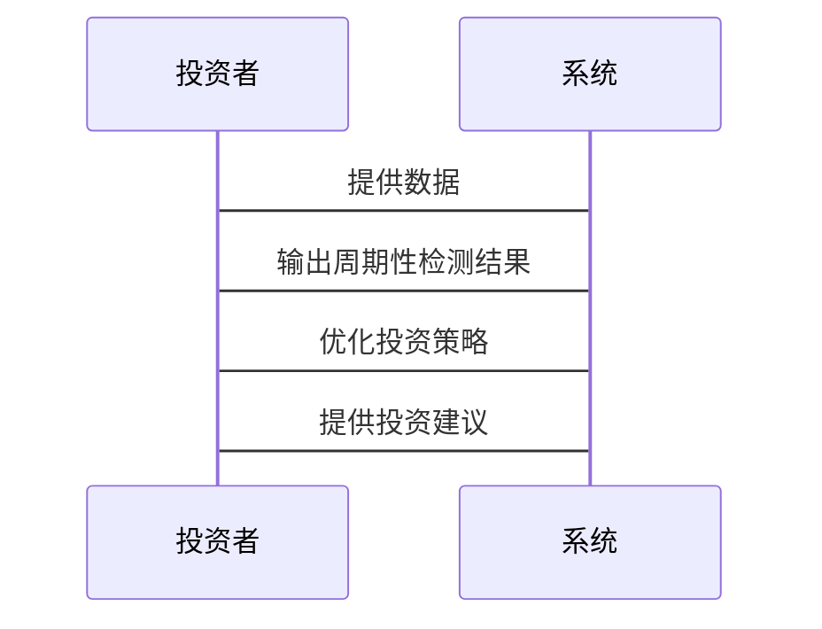

                 


```markdown
# 特价股票投资中的新兴产业周期性研究

> 关键词：特价股票，新兴产业，周期性研究，投资策略，经济周期，时间序列分析，数学模型

> 摘要：本文通过分析特价股票与新兴产业周期性之间的关系，探讨如何利用周期性规律进行投资决策。文章首先介绍特价股票和新兴产业周期性的基本概念，然后构建新兴产业周期性模型，分析其对投资策略的影响。接着，详细阐述周期性检测算法的原理和实现，结合数学模型和公式，提供实际案例分析。最后，总结最佳实践和投资建议。

---

## 第1章：特价股票投资与新兴产业周期性概述

### 1.1 特价股票投资的基本概念
#### 1.1.1 特价股票的定义与特点
特价股票通常指价格低于市场平均水平的股票，具有高波动性和高风险的特征。其特点包括低估值、高弹性、市场流动性较低等。

#### 1.1.2 特价股票与普通股票的区别
- **估值差异**：特价股票通常市盈率、市净率等估值指标低于市场平均水平。
- **波动性**：特价股票价格波动较大，容易受到市场情绪和周期性波动的影响。
- **风险与收益**：高风险伴随着高收益的潜在可能性。

#### 1.1.3 特价股票投资的潜在机会与风险
- **机会**：在经济周期的底部阶段，特价股票可能具有较高的增值潜力。
- **风险**：周期性波动可能导致股价大幅下跌，投资者需具备较高的风险承受能力。

### 1.2 新兴产业周期性研究的重要性
#### 1.2.1 新兴产业的定义与特征
新兴产业指新兴技术和商业模式驱动的产业，具有高成长性和高波动性的特征。

#### 1.2.2 新兴产业周期性波动的规律
新兴产业通常经历初创期、成长期、成熟期和衰退期，每个阶段具有不同的周期性特征。

#### 1.2.3 周期性研究对投资决策的意义
通过分析新兴产业的周期性，投资者可以更好地把握投资时机，优化投资组合。

### 1.3 特价股票与新兴产业周期性的关系
#### 1.3.1 特价股票在新兴产业周期中的位置
在新兴产业的初创期，许多公司可能估值较低，股价波动较大，适合特价股票的定义。

#### 1.3.2 周期性波动对特价股票投资的影响
新兴产业的周期性波动直接影响特价股票的估值和价格走势。

#### 1.3.3 投资者如何利用周期性规律
投资者可以通过分析周期性波动，选择在周期性底部阶段介入，周期性顶部阶段退出，以实现收益最大化。

---

## 第2章：新兴产业周期性理论与模型

### 2.1 周期性理论基础
#### 2.1.1 经济周期理论概述
经济周期包括衰退、复苏、繁荣和衰退四个阶段，对股票市场和产业发展有重要影响。

#### 2.1.2 产业周期理论的演变
从熊彼特的创新周期理论到现代的技术周期理论，产业周期理论不断发展。

#### 2.1.3 周期性波动的驱动因素
包括技术创新、市场需求、政策变化等。

### 2.2 新兴产业周期性模型构建
#### 2.2.1 模型构建的理论基础
基于经济周期理论和产业生命周期理论，构建新兴产业周期性模型。

#### 2.2.2 模型的变量选取与假设
- **变量**：股价、市盈率、行业指数、政策环境等。
- **假设**：新兴产业的发展与经济周期密切相关。

#### 2.2.3 模型的验证与优化
通过历史数据验证模型的准确性，并根据实际情况进行参数调整。

### 2.3 特价股票与周期性模型的结合
#### 2.3.1 模型在特价股票投资中的应用
通过模型预测新兴产业的周期性波动，指导特价股票的投资决策。

#### 2.3.2 模型的局限性与改进方向
模型的局限性包括假设条件的简化和数据的不完整性，未来可以引入更多变量进行优化。

#### 2.3.3 模型的实际案例分析
以某新兴产业为例，分析模型的应用过程和结果。

---

## 第3章：特价股票投资的核心概念与联系

### 3.1 特价股票投资的核心概念
#### 3.1.1 市场流动性与股票价格的关系
市场流动性低可能导致股价波动较大，影响特价股票的投资价值。

#### 3.1.2 市场情绪对特价股票的影响
市场情绪的波动直接影响特价股票的价格走势。

#### 3.1.3 特价股票的估值方法
包括市盈率、市净率等指标的比较和分析。

### 3.2 新兴产业周期性与投资策略的联系
#### 3.2.1 周期性波动对投资策略的影响
在不同周期阶段，投资策略应有所不同。

#### 3.2.2 不同周期阶段的投资策略选择
- **衰退期**：寻找估值低的特价股票，布局长期投资。
- **复苏期**：逐步增加仓位，关注行业龙头。
- **繁荣期**：减少仓位，规避风险。

#### 3.2.3 策略的动态调整与优化
根据市场变化和周期性波动，及时调整投资策略。

### 3.3 特价股票与新兴产业周期性的关系图
#### 3.3.1 ER实体关系图


#### 3.3.2 周期性波动的流程图


#### 3.3.3 概念属性特征对比表格
| 概念 | 特价股票 | 新兴产业周期性 |
|------|----------|----------------|
| 定义 | 价格低于市场平均水平的股票 | 新兴产业的发展阶段与波动规律 |
| 特征 | 低估值、高波动 | 高成长性、周期性波动 |
| 影响 | 投资风险高，收益潜力大 | 影响投资策略和决策 |

---

## 第4章：新兴产业周期性检测算法原理

### 4.1 周期性检测的基本原理
#### 4.1.1 时间序列分析方法
时间序列分析是研究周期性波动的重要工具。

#### 4.1.2 周期性检测的数学模型
常用的数学模型包括自回归移动平均模型（ARIMA）和傅里叶变换。

#### 4.1.3 算法的优缺点分析
- **优点**：能够捕捉周期性波动，提供量化依据。
- **缺点**：假设条件严格，实际应用中可能受限。

### 4.2 基于时间序列的周期性检测
#### 4.2.1 傅里叶变换在周期性检测中的应用
傅里叶变换可以将时间序列分解为不同频率的成分，识别周期性波动。

#### 4.2.2 自回归移动平均模型（ARIMA）
ARIMA模型通过历史数据预测未来趋势，帮助识别周期性。

#### 4.2.3 基于机器学习的周期性检测方法
使用神经网络等机器学习方法，提高周期性检测的准确性。

### 4.3 算法的实现与优化
#### 4.3.1 算法实现的步骤与流程
1. 数据收集与预处理。
2. 选择合适的数学模型。
3. 训练模型并进行预测。
4. 验证模型的准确性。

#### 4.3.2 算法优化的关键点
- 数据质量：确保数据的完整性和准确性。
- 模型选择：根据具体情况选择合适的算法。
- 参数调整：通过交叉验证优化模型参数。

#### 4.3.3 算法的性能评估与比较
通过准确率、召回率等指标评估算法的性能，并进行不同算法的对比分析。

---

## 第5章：数学模型与公式

### 5.1 周期性检测的数学模型
#### 5.1.1 时间序列模型的公式表示
$$ ARIMA(p, d, q) $$
其中，p为自回归阶数，d为差分阶数，q为移动平均阶数。

#### 5.1.2 傅里叶变换的公式推导
$$ X_k = \sum_{n=0}^{N-1} x_n e^{-j2\pi kn/N} $$

---

## 第6章：系统分析与架构设计方案

### 6.1 问题场景介绍
分析新兴产业周期性波动对特价股票投资的影响，构建预测模型，指导投资决策。

### 6.2 系统功能设计
- **数据采集**：收集新兴产业相关数据。
- **周期性检测**：应用数学模型检测周期性。
- **投资策略优化**：根据周期性波动优化投资策略。

### 6.3 系统架构设计


### 6.4 系统接口设计
- **输入接口**：接收新兴产业数据。
- **输出接口**：输出周期性检测结果和投资建议。

### 6.5 系统交互设计


---

## 第7章：项目实战

### 7.1 环境安装
- 安装Python、NumPy、Pandas、Matplotlib等工具。

### 7.2 核心代码实现
```python
import numpy as np
import pandas as pd
from statsmodels.tsa.arima_model import ARIMA

# 数据加载
data = pd.read_csv('industry_data.csv')

# 周期性检测
model = ARIMA(data['price'], order=(5, 1, 0))
model_fit = model.fit()
# 预测结果
forecast = model_fit.forecast(steps=10)
```

### 7.3 代码解读与分析
- **数据加载**：读取新兴产业数据。
- **周期性检测**：使用ARIMA模型进行预测。
- **结果分析**：根据预测结果制定投资策略。

### 7.4 实际案例分析
以某新兴产业为例，分析周期性波动对特价股票投资的影响，并制定相应的投资策略。

### 7.5 项目小结
总结项目实施过程中的经验教训，提出改进建议。

---

## 第8章：最佳实践与总结

### 8.1 最佳实践 tips
- **数据质量**：确保数据的准确性和完整性。
- **模型选择**：根据实际情况选择合适的周期性检测算法。
- **动态调整**：及时根据市场变化调整投资策略。

### 8.2 小结
本文通过分析特价股票与新兴产业周期性的关系，构建了周期性检测模型，并提出了相应的投资策略。

### 8.3 注意事项
- 投资者需具备较高的风险承受能力。
- 投资决策应结合多种因素，避免单一依赖周期性分析。

### 8.4 拓展阅读
建议阅读相关经济周期理论和时间序列分析的书籍，深入理解周期性波动的内在规律。

---

## 作者信息

作者：AI天才研究院/AI Genius Institute & 禅与计算机程序设计艺术 /Zen And The Art of Computer Programming

---

感谢您的阅读！希望本文对您的特价股票投资和新兴产业周期性研究有所帮助。
```

