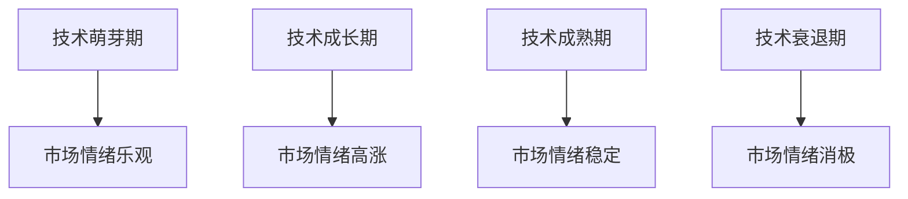
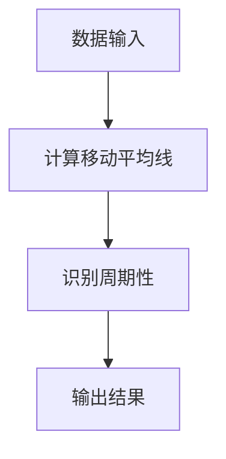
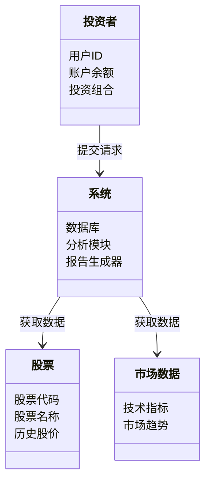
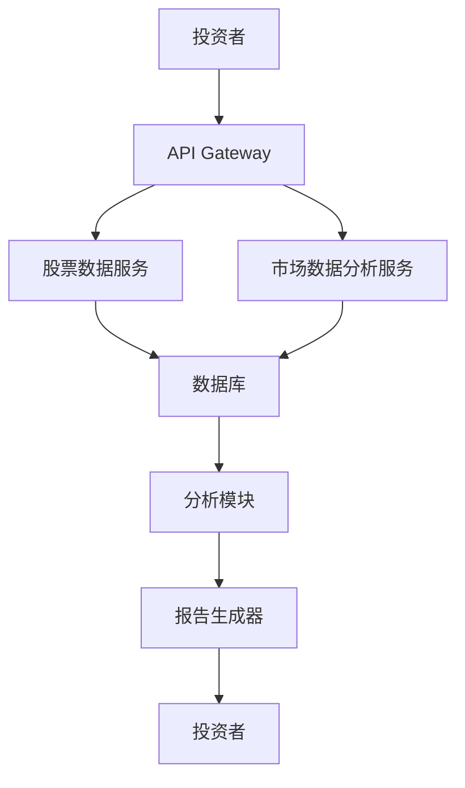

                 


# 特价股票投资中的新兴技术周期性研究

> 关键词：特价股票、技术周期性、股票投资、周期性分析、技术预测

> 摘要：本文探讨了新兴技术周期性对特价股票投资的影响，分析了技术周期性在股票市场中的表现，并提出了一种基于技术周期性分析的股票投资策略。文章从背景介绍、核心概念、算法原理、系统架构、项目实战等多方面展开，结合实际案例和数学模型，为投资者提供了深度的分析和指导。

---

## 第一章：背景介绍

### 1.1 特价股票投资的基本概念

#### 1.1.1 特价股票的定义与特点
特价股票通常指价格相对较低的股票，具有高波动性和高风险高回报的特点。这些股票往往属于小型企业或新兴行业，具备较大的增长潜力。

#### 1.1.2 特价股票投资的基本原理
特价股票投资基于市场周期、公司基本面和技术分析的结合。投资者通过分析股票价格波动、市场趋势和公司财务状况，寻找投资机会。

#### 1.1.3 特价股票投资的市场环境
特价股票投资受宏观经济、行业周期和市场情绪的影响较大。新兴技术的发展往往成为推动股价波动的重要因素。

### 1.2 新兴技术周期性与股票投资的关系

#### 1.2.1 技术周期性对股票市场的影响
新兴技术的周期性发展（如技术萌芽期、成长期、成熟期和衰退期）直接影响相关股票的市场表现。

#### 1.2.2 新兴技术周期性研究的必要性
通过对技术周期性的研究，投资者可以更好地把握市场趋势，预测股价波动，优化投资策略。

#### 1.2.3 技术周期性对特价股票投资的启示
技术周期性分析可以帮助投资者识别高增长潜力的股票，在市场波动中寻找投资机会。

### 1.3 技术周期性分析的基本方法

#### 1.3.1 技术周期的定义与分类
技术周期分为萌芽期、成长期、成熟期和衰退期，每个阶段对应不同的市场表现。

#### 1.3.2 技术周期性分析的步骤
1. 数据收集与整理
2. 周期性识别
3. 市场趋势预测
4. 投资决策优化

#### 1.3.3 技术周期性分析的工具与方法
- 数据分析工具：Python、R
- 技术分析方法：移动平均线、相对强弱指数（RSI）

---

## 第二章：技术周期性与股票投资的核心概念

### 2.1 技术周期性分析的核心概念

#### 2.1.1 技术周期的阶段划分
使用表格展示技术周期的阶段划分及其特点：

| 阶段 | 特性            |
|------|----------------|
| 萌芽期 | 价格波动大，风险高 |
| 成长期 | 价格稳步上升，投资回报稳定 |
| 成熟期 | 价格波动小，投资回报稳定 |
| 衰退期 | 价格持续下降，投资风险大 |

#### 2.1.2 技术周期性对市场情绪的影响
使用Mermaid图展示技术周期与市场情绪的关系：



#### 2.1.3 技术周期性与股票价格的关系
技术周期的不同阶段对应股票价格的不同走势。例如，在技术萌芽期，股票价格波动剧烈，而在技术成熟期，股票价格趋于稳定。

### 2.2 特价股票投资中的技术周期性模型

#### 2.2.1 模型的基本框架
模型包括数据输入、周期性识别、市场趋势预测和投资决策优化四个部分。

#### 2.2.2 模型的输入与输出
- 输入：历史股价数据、技术指标数据
- 输出：周期性判断结果、投资建议

#### 2.2.3 模型的验证与优化
通过历史数据验证模型的准确性，并根据实际效果进行参数调整。

### 2.3 技术周期性与股票投资的关联性分析

#### 2.3.1 技术周期性对股价波动的影响
技术周期性直接影响股价波动，特别是在技术萌芽期和衰退期，股价波动最为剧烈。

#### 2.3.2 技术周期性与市场参与者的决策
技术周期性影响投资者的决策，例如在技术成长期，投资者更倾向于买入股票。

#### 2.3.3 技术周期性与市场风险的关联
技术周期性与市场风险密切相关，特别是在技术衰退期，市场风险显著增加。

---

## 第三章：技术周期性分析的算法原理

### 3.1 周期性分析的基本算法

#### 3.1.1 移动平均线（MA）模型
使用Mermaid图展示移动平均线模型的流程：



#### 3.1.2 布林格带（Bollinger Bands）模型
布林格带模型用于识别股价的波动范围，帮助投资者判断股价是否处于超买或超卖状态。

#### 3.1.3 相对强弱指数（RSI）模型
RSI模型用于衡量股价的强弱，通常用于判断股价是否处于超买或超卖状态。

### 3.2 技术周期性分析的改进算法

#### 3.2.1 结合机器学习的周期性预测模型
使用神经网络模型预测技术周期性，代码示例：

```python
import numpy as np
from sklearn.neural_network import MLPRegressor

# 数据准备
X = np.array([[1, 2], [3, 4], [5, 6]])
y = np.array([7, 8, 9])

# 模型训练
model = MLPRegressor()
model.fit(X, y)

# 预测
print(model.predict([[7, 8]]))
```

#### 3.2.2 基于时间序列的周期性分析算法
使用ARIMA模型进行时间序列分析，代码示例：

```python
from statsmodels.tsa.arima_model import ARIMA

# 数据准备
data = [1, 2, 3, 4, 5]

# 模型训练
model = ARIMA(data, order=(1, 1, 1))
model_fit = model.fit()

# 预测
print(model_fit.forecast(steps=5))
```

#### 3.2.3 基于神经网络的周期性识别模型
使用LSTM网络识别技术周期性，代码示例：

```python
import keras
from keras.models import Sequential
from keras.layers import LSTM, Dense

# 数据准备
X_train = np.array(...)
y_train = np.array(...)

# 模型训练
model = Sequential()
model.add(LSTM(64, input_shape=(timesteps, features)))
model.add(Dense(1))
model.compile(loss='mean_squared_error', optimizer='adam')
model.fit(X_train, y_train, epochs=100, batch_size=32)
```

### 3.3 技术周期性分析的数学模型

#### 3.3.1 移动平均线模型
$$ MA_t = \frac{1}{n} \sum_{i=1}^{n} P_{t-i} $$
其中，$P_{t-i}$ 是第 $t-i$ 天的股价，$n$ 是窗口大小。

#### 3.3.2 相对强弱指数模型
$$ RSI_t = \frac{100}{1 + \frac{GD}{AD}} $$
其中，$GD$ 是上涨幅度的平均值，$AD$ 是下跌幅度的平均值。

---

## 第四章：系统分析与架构设计

### 4.1 问题场景介绍
设计一个基于新兴技术周期性分析的股票投资系统，帮助投资者优化投资决策。

### 4.2 项目介绍
项目目标是开发一个能够实时分析技术周期性并提供投资建议的系统。

### 4.3 系统功能设计

#### 4.3.1 领域模型设计
使用Mermaid图展示领域模型：



### 4.4 系统架构设计

#### 4.4.1 系统架构图
使用Mermaid图展示系统架构：



### 4.5 系统接口设计

#### 4.5.1 API接口设计
使用Mermaid图展示接口设计：

```mermaid
sequenceDiagram
    投资者 -> API Gateway: 请求数据
    API Gateway -> 股票数据服务: 获取股票数据
    API Gateway -> 市场数据分析服务: 获取市场数据
    API Gateway ->抽 股票数据服务: 返回股票数据
    API Gateway -> 报告生成器: 生成报告
    投资者 <- API Gateway: 报告
```

### 4.6 系统交互设计

#### 4.6.1 交互序列图
使用Mermaid图展示系统交互流程：

```mermaid
sequenceDiagram
    投资者 -> 系统: 提交投资请求
    系统 -> 数据库: 查询股票数据
    系统 -> 分析模块: 分析技术周期性
    系统 ->抽抽抽抽抽抽抽抽抽抽抽抽抽抽抽抽抽抽抽抽抽抽抽抽抽抽抽抽抽抽抽抽抽抽抽抽抽抽抽抽抽抽抽抽抽抽抽抽抽抽抽抽抽抽抽抽抽抽抽抽抽抽抽抽抽抽抽抽抽抽抽抽抽抽抽抽抽抽抽抽抽抽抽抽抽抽抽抽抽抽抽抽抽抽抽抽抽抽抽抽抽抽抽抽抽抽抽抽抽抽抽抽抽抽抽抽抽抽抽抽抽抽抽抽抽抽抽抽抽抽抽抽抽抽抽抽抽抽抽抽抽抽抽抽抽抽抽抽抽抽抽抽抽抽抽抽抽抽抽抽抽抽抽抽抽抽抽抽抽抽抽抽抽抽抽抽抽抽抽抽抽抽抽抽抽抽抽抽抽抽抽抽抽抽抽抽抽抽抽抽抽抽抽抽抽抽抽抽抽抽抽抽抽抽抽抽抽抽抽抽抽抽抽抽抽抽抽抽抽抽抽抽抽抽抽抽抽抽抽抽抽抽抽抽抽抽抽抽抽抽抽抽抽抽抽抽抽抽抽抽抽抽抽抽抽抽抽抽抽抽抽抽抽抽抽抽抽抽抽抽抽抽抽抽抽抽抽抽抽抽抽抽抽抽抽抽抽抽抽抽抽抽抽抽抽抽抽抽抽抽抽抽抽抽抽抽抽抽抽抽抽抽抽抽抽抽抽抽抽抽抽抽抽抽抽抽抽抽抽抽抽抽抽抽抽抽抽抽抽抽抽抽抽抽抽抽抽抽抽抽抽抽抽抽抽抽抽抽抽抽抽抽抽抽抽抽抽抽抽抽抽抽抽抽抽抽抽抽抽抽抽抽抽抽抽抽抽抽抽抽抽抽抽抽抽抽抽抽抽抽抽抽抽抽抽抽抽抽抽抽抽抽抽抽抽抽抽抽抽抽抽抽抽抽抽抽抽抽抽抽抽抽抽抽抽抽抽抽抽抽抽抽抽抽抽抽抽抽抽抽抽抽抽抽抽抽抽抽抽抽抽抽抽抽抽抽抽抽抽抽抽抽抽抽抽抽抽抽抽抽抽抽抽抽抽抽抽抽抽抽抽抽抽抽抽抽抽抽抽抽抽抽抽抽抽抽抽抽抽抽抽抽抽抽抽抽抽抽抽抽抽抽抽抽抽抽抽抽抽抽抽抽抽抽抽抽抽抽抽抽抽抽抽抽抽抽抽抽抽抽抽抽抽抽抽抽抽抽抽抽抽抽抽抽抽抽抽抽抽抽抽抽抽抽抽抽抽抽抽抽抽抽抽抽抽抽抽抽抽抽抽抽抽抽抽抽抽抽抽抽抽抽抽抽抽抽抽抽抽抽抽抽抽抽抽抽抽抽抽抽抽抽抽抽抽抽抽抽抽抽抽抽抽抽抽抽抽抽抽抽抽抽抽抽抽抽抽抽抽抽抽抽抽抽抽抽抽抽抽抽抽抽抽抽抽抽抽抽抽抽抽抽抽抽抽抽抽抽抽抽抽抽抽抽抽抽抽抽抽抽抽抽抽抽抽抽抽抽抽抽抽抽抽抽抽抽抽抽抽抽抽抽抽抽抽抽抽抽抽抽抽抽抽抽抽抽抽抽抽抽抽抽抽抽抽抽抽抽抽抽抽抽抽抽抽抽抽抽抽抽抽抽抽抽抽抽抽抽抽抽抽抽抽抽抽抽抽抽抽抽抽抽抽抽抽抽抽抽抽抽抽抽抽抽抽抽抽抽抽抽抽抽抽抽抽抽抽抽抽抽抽抽抽抽抽抽抽抽抽抽抽抽抽抽抽抽抽抽抽抽抽抽抽抽抽抽抽抽抽抽抽抽抽抽抽抽抽抽抽抽抽抽抽抽抽抽抽抽抽抽抽抽抽抽抽抽抽抽抽抽抽抽抽抽抽抽抽抽抽抽抽抽抽抽抽抽抽抽抽抽抽抽抽抽抽抽抽抽抽抽抽抽抽抽抽抽抽抽抽抽抽抽抽抽抽抽抽抽抽抽抽抽抽抽抽抽抽抽抽抽抽抽抽抽抽抽抽抽抽抽抽抽抽抽抽抽抽抽抽抽抽抽抽抽抽抽抽抽抽抽抽抽抽抽抽抽抽抽抽抽抽抽抽抽抽抽抽抽抽抽抽抽抽抽抽抽抽抽抽抽抽抽抽抽抽抽抽抽抽抽抽抽抽抽抽抽抽抽抽抽抽抽抽抽抽抽抽抽抽抽抽抽抽抽抽抽抽抽抽抽抽抽抽抽抽抽抽抽抽抽抽抽抽抽抽抽抽抽抽抽抽抽抽抽抽抽抽抽抽抽抽抽抽抽抽抽抽抽抽抽抽抽抽抽抽抽抽抽抽抽抽抽抽抽抽抽抽抽抽抽抽抽抽抽抽抽抽抽抽抽抽抽抽抽抽抽抽抽抽抽抽抽抽抽抽抽抽抽抽抽抽抽抽抽抽抽抽抽抽抽抽抽抽抽抽抽抽抽抽抽抽抽抽抽抽抽抽抽抽抽抽抽抽抽抽抽抽抽抽抽抽抽抽抽抽抽抽抽抽抽抽抽抽抽抽抽抽抽抽抽抽抽抽抽抽抽抽抽抽抽抽抽抽抽抽抽抽抽抽抽抽抽抽抽抽抽抽抽抽抽抽抽抽抽抽抽抽抽抽抽抽抽抽抽抽抽抽抽抽抽抽抽抽抽抽抽抽抽抽抽抽抽抽抽抽抽抽抽抽抽抽抽抽抽抽抽抽抽抽抽抽抽抽抽抽抽抽抽抽抽抽抽抽抽抽抽抽抽抽抽抽抽抽抽抽抽抽抽抽抽抽抽抽抽抽抽抽抽抽抽抽抽抽抽抽抽抽抽抽抽抽抽抽抽抽抽抽抽抽抽抽抽抽抽抽抽抽抽抽抽抽抽抽抽抽抽抽抽抽抽抽抽抽抽抽抽抽抽抽抽抽抽抽抽抽抽抽抽抽抽抽抽抽抽抽抽抽抽抽抽抽抽抽抽抽抽抽抽抽抽抽抽抽抽抽抽抽抽抽抽抽抽抽抽抽抽抽抽抽抽抽抽抽抽抽抽抽抽抽抽抽抽抽抽抽抽抽抽抽抽抽抽抽抽抽抽抽抽抽抽抽抽抽抽抽抽抽抽抽抽抽抽抽抽抽抽抽抽抽抽抽抽抽抽抽抽抽抽抽抽抽抽抽抽抽抽抽抽抽抽抽抽抽抽抽抽抽抽抽抽抽抽抽抽抽抽抽抽抽抽抽抽抽抽抽抽抽抽抽抽抽抽抽抽抽抽抽抽抽抽抽抽抽抽抽抽抽抽抽抽抽抽抽抽抽抽抽抽抽抽抽抽抽抽抽抽抽抽抽抽抽抽抽抽抽抽抽抽抽抽抽抽抽抽抽抽抽抽抽抽抽抽抽抽抽抽抽抽抽抽抽抽抽抽抽抽抽抽抽抽抽抽抽抽抽抽抽抽抽抽抽抽抽抽抽抽抽抽抽抽抽抽抽抽抽抽抽抽抽抽抽抽抽抽抽抽抽抽抽抽抽抽抽抽抽抽抽抽抽抽抽抽抽抽抽抽抽抽抽抽抽抽抽抽抽抽抽抽抽抽抽抽抽抽抽抽抽抽抽抽抽抽抽抽抽抽抽抽抽抽抽抽抽抽抽抽抽抽抽抽抽抽抽抽抽抽抽抽抽抽抽抽抽抽抽抽抽抽抽抽抽抽抽抽抽抽抽抽抽抽抽抽抽抽抽抽抽抽抽抽抽抽抽抽抽抽抽抽抽抽抽抽抽抽抽抽抽抽抽抽抽抽抽抽抽抽抽抽抽抽抽抽抽抽抽抽抽抽抽抽抽抽抽抽抽抽抽抽抽抽抽抽抽抽抽抽抽抽抽抽抽抽抽抽抽抽抽抽抽抽抽抽抽抽抽抽抽抽抽抽抽抽抽抽抽抽抽抽抽抽抽抽抽抽抽抽抽抽抽抽抽抽抽抽抽抽抽抽抽抽抽抽抽抽抽抽抽抽抽抽抽抽抽抽抽抽抽抽抽抽抽抽抽抽抽抽抽抽抽抽抽抽抽抽抽抽抽抽抽抽抽抽抽抽抽抽抽抽抽抽抽抽抽抽抽抽抽抽抽抽抽抽抽抽抽抽抽抽抽抽抽抽抽抽抽抽抽抽抽抽抽抽抽抽抽抽抽抽抽抽抽抽抽抽抽抽抽抽抽抽抽抽抽抽抽抽抽抽抽抽抽抽抽抽抽抽抽抽抽抽抽抽抽抽抽抽抽抽抽抽抽抽抽抽抽抽抽抽抽抽抽抽抽抽抽抽抽抽抽抽抽抽抽抽抽抽抽抽抽抽抽抽抽抽抽抽抽抽抽抽抽抽抽抽抽抽抽抽抽抽抽抽抽抽抽抽抽抽抽抽抽抽抽抽抽抽抽抽抽抽抽抽抽抽抽抽抽抽抽抽抽抽抽抽抽抽抽抽抽抽抽抽抽抽抽抽抽抽抽抽抽抽抽抽抽抽抽抽抽抽抽抽抽抽抽抽抽抽抽抽抽抽抽抽抽抽抽抽抽抽抽抽抽抽抽抽抽抽抽抽抽抽抽抽抽抽抽抽抽抽抽抽抽抽抽抽抽抽抽抽抽抽抽抽抽抽抽抽抽抽抽抽抽抽抽抽抽抽抽抽抽抽抽抽抽抽抽抽抽抽抽抽抽抽抽抽抽抽抽抽抽抽抽抽抽抽抽抽抽抽抽抽抽抽抽抽抽抽抽抽抽抽抽抽抽抽抽抽抽抽抽抽抽抽抽抽抽抽抽抽抽抽抽抽抽抽抽抽抽抽抽抽抽抽抽抽抽抽抽抽抽抽抽抽抽抽抽抽抽抽抽抽抽抽抽抽抽抽抽抽抽抽抽抽抽抽抽抽抽抽抽抽抽抽抽抽抽抽抽抽抽抽抽抽抽抽抽抽抽抽抽抽抽抽抽抽抽抽抽抽抽抽抽抽抽抽抽抽抽抽抽抽抽抽抽抽抽抽抽抽抽抽抽抽抽抽抽抽抽抽抽抽抽抽抽抽抽抽抽抽抽抽抽抽抽抽抽抽抽抽抽抽抽抽抽抽抽抽抽抽抽抽抽抽抽抽抽抽抽抽抽抽抽抽抽抽抽抽抽抽抽抽抽抽抽抽抽抽抽抽抽抽抽抽抽抽抽抽抽抽抽抽抽抽抽抽抽抽抽抽抽抽抽抽抽抽抽抽抽抽抽抽抽抽抽抽抽抽抽抽抽抽抽抽抽抽抽抽抽抽抽抽抽抽抽抽抽抽抽抽抽抽抽抽抽抽抽抽抽抽抽抽抽抽抽抽抽抽抽抽抽抽抽抽抽抽抽抽抽抽抽抽抽抽抽抽抽抽抽抽抽抽抽抽抽抽抽抽抽抽抽抽抽抽抽抽抽抽抽抽抽抽抽抽抽抽抽抽抽抽抽抽抽抽抽抽抽抽抽抽抽抽抽抽抽抽抽抽抽抽抽抽抽抽抽抽抽抽抽抽抽抽抽抽抽抽抽抽抽抽抽抽抽抽抽抽抽抽抽抽抽抽抽抽抽抽抽抽抽抽抽抽抽抽抽抽抽抽抽抽抽抽抽抽抽抽抽抽抽抽抽抽抽抽抽抽抽抽抽抽抽抽抽抽抽抽抽抽抽抽抽抽抽抽抽抽抽抽抽抽抽抽抽抽抽抽抽抽抽抽抽抽抽抽抽抽抽抽抽抽抽抽抽抽抽抽抽抽抽抽抽抽抽抽抽抽抽抽抽抽抽抽抽抽抽抽抽抽抽抽抽抽抽抽抽抽抽抽抽抽抽抽抽抽抽抽抽抽抽抽抽抽抽抽抽抽抽抽抽抽抽抽抽抽抽抽抽抽抽抽抽抽抽抽抽抽抽抽抽抽抽抽抽抽抽抽抽抽抽抽抽抽抽抽抽抽抽抽抽抽抽抽抽抽抽抽抽抽抽抽抽抽抽抽抽抽抽抽抽抽抽抽抽抽抽抽抽抽抽抽抽抽抽抽抽抽抽抽抽抽抽抽抽抽抽抽抽抽抽抽抽抽抽抽抽抽抽抽抽抽抽抽抽抽抽抽抽抽抽抽抽抽抽抽抽抽抽抽抽抽抽抽抽抽抽抽抽抽抽抽抽抽抽抽抽抽抽抽抽抽抽抽抽抽抽抽抽抽抽抽抽抽抽抽抽抽抽抽抽抽抽抽抽抽抽抽抽抽抽抽抽抽抽抽抽抽抽抽抽抽抽抽抽抽抽抽抽抽抽抽抽抽抽抽抽抽抽抽抽抽抽抽抽抽抽抽抽抽抽抽抽抽抽抽抽抽抽抽抽抽抽抽抽抽抽抽抽抽抽抽抽抽抽抽抽抽抽抽抽抽抽抽抽抽抽抽抽抽抽抽抽抽抽抽抽抽抽抽抽抽抽抽抽抽抽抽抽抽抽抽抽抽抽抽抽抽抽抽抽抽抽抽抽抽抽抽抽抽抽抽抽抽抽抽抽抽抽抽抽抽抽抽抽抽抽抽抽抽抽抽抽抽抽抽抽抽抽抽抽抽抽抽抽抽抽抽抽抽抽抽抽抽抽抽抽抽抽抽抽抽抽抽抽抽抽抽抽抽抽抽抽抽抽抽抽抽抽抽抽抽抽抽抽抽抽抽抽抽抽抽抽抽抽抽抽抽抽抽抽抽抽抽抽抽抽抽抽抽抽抽抽抽抽抽抽抽抽抽抽抽抽抽抽抽抽抽抽抽抽抽抽抽抽抽抽抽抽抽抽抽抽抽抽抽抽抽抽抽抽抽抽抽抽抽抽抽抽抽抽抽抽抽抽抽抽抽抽抽抽抽抽抽抽抽抽抽抽抽抽抽抽抽抽抽抽抽抽抽抽抽抽抽抽抽抽抽抽抽抽抽抽抽抽抽抽抽抽抽抽抽抽抽抽抽抽抽抽抽抽抽抽抽抽抽抽抽抽抽抽抽抽抽抽抽抽抽抽抽抽抽抽抽抽抽抽抽抽抽抽抽抽抽抽抽抽抽抽抽抽抽抽抽抽抽抽抽抽抽抽抽抽抽抽抽抽抽抽抽抽抽抽抽抽抽抽抽抽抽抽抽抽抽抽抽抽抽抽抽抽抽抽抽抽抽抽抽抽抽抽抽抽抽抽抽抽抽抽抽抽抽抽抽抽抽抽抽抽抽抽抽抽抽抽抽抽抽抽抽抽抽抽抽抽抽抽抽抽抽抽抽抽抽抽抽抽抽抽抽抽抽抽抽抽抽抽抽抽抽抽抽抽抽抽抽抽抽抽抽抽抽抽抽抽抽抽抽抽抽抽抽抽抽抽抽抽抽抽抽抽抽抽抽抽抽抽抽抽抽抽抽抽抽抽抽抽抽抽抽抽抽抽抽抽抽抽抽抽抽抽抽抽抽抽抽抽抽抽抽抽抽抽抽抽抽抽抽抽抽抽抽抽抽抽抽抽抽抽抽抽抽抽抽抽抽抽抽抽抽抽抽抽抽抽抽抽抽抽抽抽抽抽抽抽抽抽抽抽抽抽抽抽抽抽抽抽抽抽抽抽抽抽抽抽抽抽抽抽抽抽抽抽抽抽抽抽抽抽抽抽抽抽抽抽抽抽抽抽抽抽抽抽抽抽抽抽抽抽抽抽抽抽抽抽抽抽抽抽抽抽抽抽抽抽抽抽抽抽抽抽抽抽抽抽抽抽抽抽抽抽抽抽抽抽抽抽抽抽抽抽抽抽抽抽抽抽抽抽抽抽抽抽抽抽抽抽抽抽抽抽抽抽抽抽抽抽抽抽抽抽抽抽抽抽抽抽抽抽抽抽抽抽抽抽抽抽抽抽抽抽抽抽抽抽抽抽抽抽抽抽抽抽抽抽抽抽抽抽抽抽抽抽抽抽抽抽抽抽抽抽抽抽抽抽抽抽抽抽抽抽抽抽抽抽抽抽抽抽抽抽抽抽抽抽抽抽抽抽抽抽抽抽抽抽抽抽抽抽抽抽抽抽抽抽抽抽抽抽抽抽抽抽抽抽抽抽抽抽抽抽抽抽抽抽抽抽抽抽抽抽抽抽抽抽抽抽抽抽抽抽抽抽抽抽抽抽抽抽抽抽抽抽抽抽抽抽抽抽抽抽抽抽抽抽抽抽抽抽抽抽抽抽抽抽抽抽抽抽抽抽抽抽抽抽抽抽抽抽抽抽抽抽抽抽抽抽抽抽抽抽抽抽抽抽抽抽抽抽抽抽抽抽抽抽抽抽抽抽抽抽抽抽抽抽抽抽抽抽抽抽抽抽抽抽抽抽抽抽抽抽抽抽抽抽抽抽抽抽抽抽抽抽抽抽抽抽抽抽抽抽抽抽抽抽抽抽抽抽抽抽抽抽抽抽抽抽抽抽抽抽抽抽抽抽抽抽抽抽抽抽抽抽抽抽抽抽抽抽抽抽抽抽抽抽抽抽抽抽抽抽抽抽抽抽抽抽抽抽抽抽抽抽抽抽抽抽抽抽抽抽抽抽抽抽抽抽抽抽抽抽抽抽抽抽抽抽抽抽抽抽抽抽抽抽抽抽抽抽抽抽抽抽抽抽抽抽抽抽抽抽抽抽抽抽抽抽抽抽抽抽抽抽抽抽抽抽抽抽抽抽抽抽抽抽抽抽抽抽抽抽抽抽抽抽抽抽抽抽抽抽抽抽抽抽抽抽抽抽抽抽抽抽抽抽抽抽抽抽抽抽抽抽抽抽抽抽抽抽抽抽抽抽抽抽抽抽抽抽抽抽抽抽抽抽抽抽抽抽抽抽抽抽抽抽抽抽抽抽抽抽抽抽抽抽抽抽抽抽抽抽抽抽抽抽抽抽抽抽抽抽抽抽抽抽抽抽抽抽抽抽抽抽抽抽抽抽抽抽抽抽抽抽抽抽抽抽抽抽抽抽抽抽抽抽抽抽抽抽抽抽抽抽抽抽抽抽抽抽抽抽抽抽抽抽抽抽抽抽抽抽抽抽抽抽抽抽抽抽抽抽抽抽抽抽抽抽抽抽抽抽抽抽抽抽抽抽抽抽抽抽抽抽抽抽抽抽抽抽抽抽抽抽抽抽抽抽抽抽抽抽抽抽抽抽抽抽抽抽抽抽抽抽抽抽抽抽抽抽抽抽抽抽抽抽抽抽抽抽抽抽抽抽抽抽抽抽抽抽抽抽抽抽抽抽抽抽抽抽抽抽抽抽抽抽抽抽抽抽抽抽抽抽抽抽抽抽抽抽抽抽抽抽抽抽抽抽抽抽抽抽抽抽抽抽抽抽抽抽抽抽抽抽抽抽抽抽抽抽抽抽抽抽抽抽抽抽抽抽抽抽抽抽抽抽抽抽抽抽抽抽抽抽抽抽抽抽抽抽抽抽抽抽抽抽抽抽抽抽抽抽抽抽抽抽抽抽抽抽抽抽抽抽抽抽抽抽抽抽抽抽抽抽抽抽抽抽抽抽抽抽抽抽抽抽抽抽抽抽抽抽抽抽抽抽抽抽抽抽抽抽抽抽抽抽抽抽抽抽抽抽抽抽抽抽抽抽抽抽抽抽抽抽抽抽抽抽抽抽抽抽抽抽抽抽抽抽抽抽抽抽抽抽抽抽抽抽抽抽抽抽抽抽抽抽抽抽抽抽抽抽抽抽抽抽抽抽抽抽抽抽抽抽抽抽抽抽抽抽抽抽抽抽抽抽抽抽抽抽抽抽抽抽抽抽抽抽抽抽抽抽抽抽抽抽抽抽抽抽抽抽抽抽抽抽抽抽抽抽抽抽抽抽抽抽抽抽抽抽抽抽抽抽抽抽抽抽抽抽抽抽抽抽抽抽抽抽抽抽抽抽抽抽抽抽抽抽抽抽抽抽抽抽抽抽抽抽抽抽抽抽抽抽抽抽抽抽抽抽抽抽抽抽抽抽抽抽抽抽抽抽抽抽抽抽抽抽抽抽抽抽抽抽抽抽抽抽抽抽抽抽抽抽抽抽抽抽抽抽抽抽抽抽抽抽抽抽抽抽抽抽抽抽抽抽抽抽抽抽抽抽抽抽抽抽抽抽抽抽抽抽抽抽抽抽抽抽抽抽抽抽抽抽抽抽抽抽抽抽抽抽抽抽抽抽抽抽抽抽抽抽抽抽抽抽抽抽抽抽抽抽抽抽抽抽抽抽抽抽抽抽抽抽抽抽抽抽抽抽抽抽抽抽抽抽抽抽抽抽抽抽抽抽抽抽抽抽抽抽抽抽抽抽抽抽抽抽抽抽抽抽抽抽抽抽抽抽抽抽抽抽抽抽抽抽抽抽抽抽抽抽抽抽抽抽抽抽抽抽抽抽抽抽抽抽抽抽抽抽抽抽抽抽抽抽抽抽抽抽抽抽抽抽抽抽抽抽抽抽抽抽抽抽抽抽抽抽抽抽抽抽抽抽抽抽抽抽抽抽抽抽抽抽抽抽抽抽抽抽抽抽抽抽抽抽抽抽抽抽抽抽抽抽抽抽抽抽抽抽抽抽抽抽抽抽抽抽抽抽抽抽抽抽抽抽抽抽抽抽抽抽抽抽抽抽抽抽抽抽抽抽抽抽抽抽抽抽抽抽抽抽抽抽抽抽抽抽抽抽抽抽抽抽抽抽抽抽抽抽抽抽抽抽抽抽抽抽抽抽抽抽抽抽抽抽抽抽抽抽抽抽抽抽抽抽抽抽抽抽抽抽抽抽抽抽抽抽抽抽抽抽抽抽抽抽抽抽抽抽抽抽抽抽抽抽抽抽抽抽抽抽抽抽抽抽抽抽抽抽抽抽抽抽抽抽抽抽抽抽抽抽抽抽抽抽抽抽抽抽抽抽抽抽抽抽抽抽抽抽抽抽抽抽抽抽抽抽抽抽抽抽抽抽抽抽抽抽抽抽抽抽抽抽抽抽抽抽抽抽抽抽抽抽抽抽抽抽抽抽抽抽抽抽抽抽抽抽抽抽抽抽抽抽抽抽抽抽抽抽抽抽抽抽抽抽抽抽抽抽抽抽抽抽抽抽抽抽抽抽抽抽抽抽抽抽抽抽抽抽抽抽抽抽抽抽抽抽抽抽抽抽抽抽抽抽抽抽抽抽抽抽抽抽抽抽抽抽抽抽抽抽抽抽抽抽抽抽抽抽抽抽抽抽抽抽抽抽抽抽抽抽抽抽抽抽抽抽抽抽抽抽抽抽抽抽抽抽抽抽抽抽抽抽抽抽抽抽抽抽抽抽抽抽抽抽抽抽抽抽抽抽抽抽抽抽抽抽抽抽抽抽抽抽抽抽抽抽抽抽抽抽抽抽抽抽抽抽抽抽抽抽抽抽抽抽抽抽抽抽抽抽抽抽抽抽抽抽抽抽抽抽抽抽抽抽抽抽抽抽抽抽抽抽抽抽抽抽抽抽抽抽抽抽抽抽抽抽抽抽抽抽抽抽抽抽抽抽抽抽抽抽抽抽抽抽抽抽抽抽抽抽抽抽抽抽抽抽抽抽抽抽抽抽抽抽抽抽抽抽抽抽抽抽抽抽抽抽抽抽抽抽抽抽抽抽抽抽抽抽抽抽抽抽抽抽抽抽抽抽抽抽抽抽抽抽抽抽抽抽抽抽抽抽抽抽抽抽抽抽抽抽抽抽抽抽抽抽抽抽抽抽抽抽抽抽抽抽抽抽抽抽抽抽抽抽抽抽抽抽抽抽抽抽抽抽抽抽抽抽抽抽抽抽抽抽抽抽抽抽抽抽抽抽抽抽抽抽抽抽抽抽抽抽抽抽抽抽抽抽抽抽抽抽抽抽抽抽抽抽抽抽抽抽抽抽抽抽抽抽抽抽抽抽抽抽抽抽抽抽抽抽抽抽抽抽抽抽抽抽抽抽抽抽抽抽抽抽抽抽抽抽抽抽抽抽抽抽抽抽抽抽抽抽抽抽抽抽抽抽抽抽抽抽抽抽抽抽抽抽抽抽抽抽抽抽抽抽抽抽抽抽抽抽抽抽抽抽抽抽抽抽抽抽抽抽抽抽抽抽抽抽抽抽抽抽抽抽抽抽抽抽抽抽抽抽抽抽抽抽抽抽抽抽抽抽抽抽抽抽抽抽抽抽抽抽抽抽抽抽抽抽抽抽抽抽抽抽抽抽抽抽抽抽抽抽抽抽抽抽抽抽抽抽抽抽抽抽抽抽抽抽抽抽抽抽抽抽抽抽抽抽抽抽抽抽抽抽抽抽抽抽抽抽抽抽抽抽抽抽抽抽抽抽抽抽抽抽抽抽抽抽抽抽抽抽抽抽抽抽抽抽抽抽抽抽抽抽抽抽抽抽抽抽抽抽抽抽抽抽抽抽抽抽抽抽抽抽抽抽抽抽抽抽抽抽抽抽抽抽抽抽抽抽抽抽抽抽抽抽抽抽抽抽抽抽抽抽抽抽抽抽抽抽抽抽抽抽抽抽抽抽抽抽抽抽抽抽抽抽抽抽抽抽抽抽抽抽抽抽抽抽抽抽抽抽抽抽抽抽抽抽抽抽抽抽抽抽抽抽抽抽抽抽抽抽抽抽抽抽抽抽抽抽抽抽抽抽抽抽抽抽抽抽抽抽抽抽抽抽抽抽抽抽抽抽抽抽抽抽抽抽抽抽抽抽抽抽抽抽抽抽抽抽抽抽抽抽抽抽抽抽抽抽抽抽抽抽抽抽抽抽抽抽抽抽抽抽抽抽抽抽抽抽抽抽抽抽抽抽抽抽抽抽抽抽抽抽抽抽抽抽抽抽抽抽抽抽抽抽抽抽抽抽抽抽抽抽抽抽抽抽抽抽抽抽抽抽抽抽抽抽抽抽抽抽抽抽抽抽抽抽抽抽抽抽抽抽抽抽抽抽抽抽抽抽抽抽抽抽抽抽抽抽抽抽抽抽抽抽抽抽抽抽抽抽抽抽抽抽抽抽抽抽抽抽抽抽抽抽抽抽抽抽抽抽抽抽抽抽抽抽抽抽抽抽抽抽抽抽抽抽抽抽抽抽抽抽抽抽抽抽抽抽抽抽抽抽抽抽抽抽抽抽抽抽抽抽抽抽抽抽抽抽抽抽抽抽抽抽抽抽抽抽抽抽抽抽抽抽抽抽抽抽抽抽抽抽抽抽抽抽抽抽抽抽抽抽抽抽抽抽抽抽抽抽抽抽抽抽抽抽抽抽抽抽抽抽抽抽抽抽抽抽抽抽抽抽抽抽抽抽抽抽抽抽抽抽抽抽抽抽抽抽抽抽抽抽抽抽抽抽抽抽抽抽抽抽抽抽抽抽抽抽抽抽抽抽抽抽抽抽抽抽抽抽抽抽抽抽抽抽抽抽抽抽抽抽抽抽抽抽抽抽抽抽抽抽抽抽抽抽抽抽抽抽抽抽抽抽抽抽抽抽抽抽抽抽抽抽抽抽抽抽抽抽抽抽抽抽抽抽抽抽抽抽抽抽抽抽抽抽抽抽抽抽抽抽抽抽抽抽抽抽抽抽抽抽抽抽抽抽抽抽抽抽抽抽抽抽抽抽抽抽抽抽抽抽抽抽抽抽抽抽抽抽抽抽抽抽抽抽抽抽抽抽抽抽抽抽抽抽抽抽抽抽抽抽抽抽抽抽抽抽抽抽抽抽抽抽抽抽抽抽抽抽抽抽抽抽抽抽抽抽抽抽抽抽抽抽抽抽抽抽抽抽抽抽抽抽抽抽抽抽抽抽抽抽抽抽抽抽抽抽抽抽抽抽抽抽抽抽抽抽抽抽抽抽抽抽抽抽抽抽抽抽抽抽抽抽抽抽抽抽抽抽抽抽抽抽抽抽抽抽抽抽抽抽抽抽抽抽抽抽抽抽抽抽抽抽抽抽抽抽抽抽抽抽抽抽抽抽抽抽抽抽抽抽抽抽抽抽抽抽抽抽抽抽抽抽抽抽抽抽抽抽抽抽抽抽抽抽抽抽抽抽抽抽抽抽抽抽抽抽抽抽抽抽抽抽抽抽抽抽抽抽抽抽抽抽抽抽抽抽抽抽抽抽抽抽抽抽抽抽抽抽抽抽抽抽抽抽抽抽抽抽抽抽抽抽抽抽抽抽抽抽抽抽抽抽抽抽抽抽抽抽抽抽抽抽抽抽抽抽抽抽抽抽抽抽抽抽抽抽抽抽抽抽抽抽抽抽抽抽抽抽抽抽抽抽抽抽抽抽抽抽抽抽抽抽抽抽抽抽抽抽抽抽抽抽抽抽抽抽抽抽抽抽抽抽抽抽抽抽抽抽抽抽抽抽抽抽抽抽抽抽抽抽抽抽抽抽抽抽抽抽抽抽抽抽抽抽抽抽抽抽抽抽抽抽抽抽抽抽抽抽抽抽抽抽抽抽抽抽抽抽抽抽抽抽抽抽抽抽抽抽抽抽抽抽抽抽抽抽抽抽抽抽抽抽抽抽抽抽抽抽抽抽抽抽抽抽抽抽抽抽抽抽抽抽抽抽抽抽抽抽抽抽抽抽抽抽抽抽抽抽抽抽抽抽抽抽抽抽抽抽抽抽抽抽抽抽抽抽抽抽抽抽抽抽抽抽抽抽抽抽抽抽抽抽抽抽抽抽抽抽抽抽抽抽抽抽抽抽抽抽抽抽抽抽抽抽抽抽抽抽抽抽抽抽抽抽抽抽抽抽抽抽抽抽抽抽抽抽抽抽抽抽抽抽抽抽抽抽抽抽抽抽抽抽抽抽抽抽抽抽抽抽抽抽抽抽抽抽抽抽抽抽抽抽抽抽抽抽抽抽抽抽抽抽抽抽抽抽抽抽抽抽抽抽抽抽抽抽抽抽抽抽抽抽抽抽抽抽抽抽抽抽抽抽抽抽抽抽抽抽抽抽抽抽抽抽抽抽抽抽抽抽抽抽抽抽抽抽抽抽抽抽抽抽抽抽抽抽抽抽抽抽抽抽抽抽抽抽抽抽抽抽抽抽抽抽抽抽抽抽抽抽抽抽抽抽抽抽抽抽抽抽抽抽抽抽抽抽抽抽抽抽抽抽抽抽抽抽抽抽抽抽抽抽抽抽抽抽抽抽抽抽抽抽抽抽抽抽抽抽抽抽抽抽抽抽抽抽抽抽抽抽抽抽抽抽抽抽抽抽抽抽抽抽抽抽抽抽抽抽抽抽抽抽抽抽抽抽抽抽抽抽抽抽抽抽抽抽抽抽抽抽抽抽抽抽抽抽抽抽抽抽抽抽抽抽抽抽抽抽抽抽抽抽抽抽抽抽抽抽抽抽抽抽抽抽抽抽抽抽抽抽抽抽抽抽抽抽抽抽抽抽抽抽抽抽抽抽抽抽抽抽抽抽抽抽抽抽抽抽抽抽抽抽抽抽抽抽抽抽抽抽抽抽抽抽抽抽抽抽抽抽抽抽抽抽抽抽抽抽抽抽抽抽抽抽抽抽抽抽抽抽抽抽抽抽抽抽抽抽抽抽抽抽抽抽抽抽抽抽抽抽抽抽抽抽抽抽抽抽抽抽抽抽抽抽抽抽抽抽抽抽抽抽抽抽抽抽抽抽抽抽抽抽抽抽抽抽抽抽抽抽抽抽抽抽抽抽抽抽抽抽抽抽抽抽抽抽抽抽抽抽抽抽抽抽抽抽抽抽抽抽抽抽抽抽抽抽抽抽抽抽抽抽抽抽抽抽抽抽抽抽抽抽抽抽抽抽抽抽抽抽抽抽抽抽抽抽抽抽抽抽抽抽抽抽抽抽抽抽抽抽抽抽抽抽抽抽抽抽抽抽抽抽抽抽抽抽抽抽抽抽抽抽抽抽抽抽抽抽抽抽抽抽抽抽抽抽抽抽抽抽抽抽抽抽抽抽抽抽抽抽抽抽抽抽抽抽抽抽抽抽抽抽抽抽抽抽抽抽抽抽抽抽抽抽抽抽抽抽抽抽抽抽抽抽抽抽抽抽抽抽抽抽抽抽抽抽抽抽抽抽抽抽抽抽抽抽抽抽抽抽抽抽抽抽抽抽抽抽抽抽抽抽抽抽抽抽抽抽抽抽抽抽抽抽抽抽抽抽抽抽抽抽抽抽抽抽抽抽抽抽抽抽抽抽抽抽抽抽抽抽抽抽抽抽抽抽抽抽抽抽抽抽抽抽抽抽抽抽抽抽抽抽抽抽抽抽抽抽抽抽抽抽抽抽抽抽抽抽抽抽抽抽抽抽抽抽抽抽抽抽抽抽抽抽抽抽抽抽抽抽抽抽抽抽抽抽抽抽抽抽抽抽抽抽抽抽抽抽抽抽抽抽抽抽抽抽抽抽抽抽抽抽抽抽抽抽抽抽抽抽抽抽抽抽抽抽抽抽抽抽抽抽抽抽抽抽抽抽抽抽抽抽抽抽抽抽抽抽抽抽抽抽抽抽抽抽抽抽抽抽抽抽抽抽抽抽抽抽抽抽抽抽抽抽抽抽抽抽抽抽抽抽抽抽抽抽抽抽抽抽抽抽抽抽抽抽抽抽抽抽抽抽抽抽抽抽抽抽抽抽抽抽抽抽抽抽抽抽抽抽抽抽抽抽抽抽抽抽抽抽抽抽抽抽抽抽抽抽抽抽抽抽抽抽抽抽抽抽抽抽抽抽抽抽抽抽抽抽抽抽抽抽抽抽抽抽抽抽抽抽抽抽抽抽抽抽抽抽抽抽抽抽抽抽抽抽抽抽抽抽抽抽抽抽抽抽抽抽抽抽抽抽抽抽抽抽抽抽抽抽抽抽抽抽抽抽抽抽抽抽抽抽抽抽抽抽抽抽抽抽抽抽抽抽抽抽抽抽抽抽抽抽抽抽抽抽抽抽抽抽抽抽抽抽抽抽抽抽抽抽抽抽抽抽抽抽抽抽抽抽抽抽抽抽抽抽抽抽抽抽抽抽抽抽抽抽抽抽抽抽抽抽抽抽抽抽抽抽抽抽抽抽抽抽抽抽抽抽抽抽抽抽抽抽抽抽抽抽抽抽抽抽抽抽抽抽抽抽抽抽抽抽抽抽抽抽抽抽抽抽抽抽抽抽抽抽抽抽抽抽抽抽抽抽抽抽抽抽抽抽抽抽抽抽抽抽抽抽抽抽抽抽抽抽抽抽抽抽抽抽抽抽抽抽抽抽抽抽抽抽抽抽抽抽抽抽抽抽抽抽抽抽抽抽抽抽抽抽抽抽抽抽抽抽抽抽抽抽抽抽抽抽抽抽抽抽抽抽抽抽抽抽抽抽抽抽抽抽抽抽抽抽抽抽抽抽抽抽抽抽抽抽抽抽抽抽抽抽抽抽抽抽抽抽抽抽抽抽抽抽抽抽抽抽抽抽抽抽抽抽抽抽抽抽抽抽抽抽抽抽抽抽抽抽抽抽抽抽抽抽抽抽抽抽抽抽抽抽抽抽抽抽抽抽抽抽抽抽抽抽抽抽抽抽抽抽抽抽抽抽抽抽抽抽抽抽抽抽抽抽抽抽抽抽抽抽抽抽抽抽抽抽抽抽抽抽抽抽抽抽抽抽抽抽抽抽抽抽抽抽抽抽抽抽抽抽抽抽抽抽抽抽抽抽抽抽抽抽抽抽抽抽抽抽抽抽抽抽抽抽抽抽抽抽抽抽抽抽抽抽抽抽抽抽抽抽抽抽抽抽抽抽抽抽抽抽抽抽抽抽抽抽抽抽抽抽抽抽抽抽抽抽抽抽抽抽抽抽抽抽抽抽抽抽抽抽抽抽抽抽抽抽抽抽抽抽抽抽抽抽抽抽抽抽抽抽抽抽抽抽抽抽抽抽抽抽抽抽抽抽抽抽抽抽抽抽抽抽抽抽抽抽抽抽抽抽抽抽抽抽抽抽抽抽抽抽抽抽抽抽抽抽抽抽抽抽抽抽抽抽抽抽抽抽抽抽抽抽抽抽抽抽抽抽抽抽抽抽抽抽抽抽抽抽抽抽抽抽抽抽抽抽抽抽抽抽抽抽抽抽抽抽抽抽抽抽抽抽抽抽抽抽抽抽抽抽抽抽抽抽抽抽抽抽抽抽抽抽抽抽抽抽抽抽抽抽抽抽抽抽抽抽抽抽抽抽抽抽抽抽抽抽抽抽抽抽抽抽抽抽抽抽抽抽抽抽抽抽抽抽抽抽抽抽抽抽抽抽抽抽抽抽抽抽抽抽抽抽抽抽抽抽抽抽抽抽抽抽抽抽抽抽抽抽抽抽抽抽抽抽抽抽抽抽抽抽抽抽抽抽抽抽抽抽抽抽抽抽抽抽抽抽抽抽抽抽抽抽抽抽抽抽抽抽抽抽抽抽抽抽抽抽抽抽抽抽抽抽抽抽抽抽抽抽抽抽抽抽抽抽抽抽抽抽抽抽抽抽抽抽抽抽抽抽抽抽抽抽抽抽抽抽抽抽抽抽抽抽抽抽抽抽抽抽抽抽抽抽抽抽抽抽抽抽抽抽抽抽抽抽抽抽抽抽抽抽抽抽抽抽抽抽抽抽抽抽抽抽抽抽抽抽抽抽抽抽抽抽抽抽抽抽抽抽抽抽抽抽抽抽抽抽抽抽抽抽抽抽抽抽抽抽抽抽抽抽抽抽抽抽抽抽抽抽抽抽抽抽抽抽抽抽抽抽抽抽抽抽抽抽抽抽抽抽抽抽抽抽抽抽抽抽抽抽抽抽抽抽抽抽抽抽抽抽抽抽抽抽抽抽抽抽抽抽抽抽抽抽抽抽抽抽抽抽抽抽抽抽抽抽抽抽抽抽抽抽抽抽抽抽抽抽抽抽抽抽抽抽抽抽抽抽抽抽抽抽抽抽抽抽抽抽抽抽抽抽抽抽抽抽抽抽抽抽抽抽抽抽抽抽抽抽抽抽抽抽抽抽抽抽抽抽抽抽抽抽抽抽抽抽抽抽抽抽抽抽抽抽抽抽抽抽抽抽抽抽抽抽抽抽抽抽抽抽抽抽抽抽抽抽抽抽抽抽抽抽抽抽抽抽抽抽抽抽抽抽抽抽抽抽抽抽抽抽抽抽抽抽抽抽抽抽抽抽抽抽抽抽抽抽抽抽抽抽抽抽抽抽抽抽抽抽抽抽抽抽抽抽抽抽抽抽抽抽抽抽抽抽抽抽抽抽抽抽抽抽抽抽抽抽抽抽抽抽抽抽抽抽抽抽抽抽抽抽抽抽抽抽抽抽抽抽抽抽抽抽抽抽抽抽抽抽抽抽抽抽抽抽抽抽抽抽抽抽抽抽抽抽抽抽抽抽抽抽抽抽抽抽抽抽抽抽抽抽抽抽抽抽抽抽抽抽抽抽抽抽抽抽抽抽抽抽抽抽抽抽抽抽抽抽抽抽抽抽抽抽抽抽抽抽抽抽抽抽抽抽抽抽抽抽抽抽抽抽抽抽抽抽抽抽抽抽抽抽抽抽抽抽抽抽抽抽抽抽抽抽抽抽抽抽抽抽抽抽抽抽抽抽抽抽抽抽抽抽抽抽抽抽抽抽抽抽抽抽抽抽抽抽抽抽抽抽抽抽抽抽抽抽抽抽抽抽抽抽抽抽抽抽抽抽抽抽抽抽抽抽抽抽抽抽抽抽抽抽抽抽抽抽抽抽抽抽抽抽抽抽抽抽抽抽抽抽抽抽抽抽抽抽抽抽抽抽抽抽抽抽抽抽抽抽抽抽抽抽抽抽抽抽抽抽抽抽抽抽抽抽抽抽抽抽抽抽抽抽抽抽抽抽抽抽抽抽抽抽抽抽抽抽抽抽抽抽抽抽抽抽抽抽抽抽抽抽抽抽抽抽抽抽抽抽抽抽抽抽抽抽抽抽抽抽抽抽抽抽抽抽抽抽抽抽抽抽抽抽抽抽抽抽抽抽抽抽抽抽抽抽抽抽抽抽抽抽抽抽抽抽抽抽抽抽抽抽抽抽抽抽抽抽抽抽抽抽抽抽抽抽抽抽抽抽抽抽抽抽抽抽抽抽抽抽抽抽抽抽抽抽抽抽抽抽抽抽抽抽抽抽抽抽抽抽抽抽抽抽抽抽抽抽抽抽抽抽抽抽抽抽抽抽抽抽抽抽抽抽抽抽抽抽抽抽抽抽抽抽抽抽抽抽抽抽抽抽抽抽抽抽抽抽抽抽抽抽抽抽抽抽抽抽抽抽抽抽抽抽抽抽抽抽抽抽抽抽抽抽抽抽抽抽抽抽抽抽抽抽抽抽抽抽抽抽抽抽抽抽抽抽抽抽抽抽抽抽抽抽抽抽抽抽抽抽抽抽抽抽抽抽抽抽抽抽抽抽抽抽抽抽抽抽抽抽抽抽抽抽抽抽抽抽抽抽抽抽抽抽抽抽抽抽抽抽抽抽抽抽抽抽抽抽抽抽抽抽抽抽抽抽抽抽抽抽抽抽抽抽抽抽抽抽抽抽抽抽抽抽抽抽抽抽抽抽抽抽抽抽抽抽抽抽抽抽抽抽抽抽抽抽抽抽抽抽抽抽抽抽抽抽抽抽抽抽抽抽抽抽抽抽抽抽抽抽抽抽抽抽抽抽抽抽抽抽抽抽抽抽抽抽抽抽抽抽抽抽抽抽抽抽抽抽抽抽抽抽抽抽抽抽抽抽抽抽抽抽抽抽抽抽抽抽抽抽抽抽抽抽抽抽抽抽抽抽抽抽抽抽抽抽抽抽抽抽抽抽抽抽抽抽抽抽抽抽抽抽抽抽抽抽抽抽抽抽抽抽抽抽抽抽抽抽抽抽抽抽抽抽抽抽抽抽抽抽抽抽抽抽抽抽抽抽抽抽抽抽抽抽抽抽抽抽抽抽抽抽抽抽抽抽抽抽抽抽抽抽抽抽抽抽抽抽抽抽抽抽抽抽抽抽抽抽抽抽抽抽抽抽抽抽抽抽抽抽抽抽抽抽抽抽抽抽抽抽抽抽抽抽抽抽抽抽抽抽抽抽抽抽抽抽抽抽抽抽抽抽抽抽抽抽抽抽抽抽抽抽抽抽抽抽抽抽抽抽抽抽抽抽抽抽抽抽抽抽抽抽抽抽抽抽抽抽抽抽抽抽抽抽抽抽抽抽抽抽抽抽抽抽抽抽抽抽抽抽抽抽抽抽抽抽抽抽抽抽抽抽抽抽抽抽抽抽抽抽抽抽抽抽抽抽抽抽抽抽抽抽抽抽抽抽抽抽抽抽抽抽抽抽抽抽抽抽抽抽抽抽抽抽抽抽抽抽抽抽抽抽抽抽抽抽抽抽抽抽抽抽抽抽抽抽抽抽抽抽抽抽抽抽抽抽抽抽抽抽抽抽抽抽抽抽抽抽抽抽抽抽抽抽抽抽抽抽抽抽抽抽抽抽抽抽抽抽抽抽抽抽抽抽抽抽抽抽抽抽抽抽抽抽抽抽抽抽抽抽抽抽抽抽抽抽抽抽抽抽抽抽抽抽抽抽抽抽抽抽抽抽抽抽抽抽抽抽抽抽抽抽抽抽抽抽抽抽抽抽抽抽抽抽抽抽抽抽抽抽抽抽抽抽抽抽抽抽抽抽抽抽抽抽抽抽抽抽抽抽抽抽抽抽抽抽抽抽抽抽抽抽抽抽抽抽抽抽抽抽抽抽抽抽抽抽抽抽抽抽抽抽抽抽抽抽抽抽抽抽抽抽抽抽抽抽抽抽抽抽抽抽抽抽抽抽抽抽抽抽抽抽抽抽抽抽抽抽抽抽抽抽抽抽抽抽抽抽抽抽抽抽抽抽抽抽抽抽抽抽抽抽抽抽抽抽抽抽抽抽抽抽抽抽抽抽抽抽抽抽抽抽抽抽抽抽抽抽抽抽抽抽抽抽抽抽抽抽抽抽抽抽抽抽抽抽抽抽抽抽抽抽抽抽抽抽抽抽抽抽抽抽抽抽抽抽抽抽抽抽抽抽抽抽抽抽抽抽抽抽抽抽抽抽抽抽抽抽抽抽抽抽抽抽抽抽抽抽抽抽抽抽抽抽抽抽抽抽抽抽抽抽抽抽抽抽抽抽抽抽抽抽抽抽抽抽抽抽抽抽抽抽抽抽抽抽抽抽抽抽抽抽抽抽抽抽抽抽抽抽抽抽抽抽抽抽抽抽抽抽抽抽抽抽抽抽抽抽抽抽抽抽抽抽抽抽抽抽抽抽抽抽抽抽抽抽抽抽抽抽抽抽抽抽抽抽抽抽抽抽抽抽抽抽抽抽抽抽抽抽抽抽抽抽抽抽抽抽抽抽抽抽抽抽抽抽抽抽抽抽抽抽抽抽抽抽抽抽抽抽抽抽抽抽抽抽抽抽抽抽抽抽抽抽抽抽抽抽抽抽抽抽抽抽抽抽抽抽抽抽抽抽抽抽抽抽抽抽抽抽抽抽抽抽抽抽抽抽抽抽抽抽抽抽抽抽抽抽抽抽抽抽抽抽抽抽抽抽抽抽抽抽抽抽抽抽抽抽抽抽抽抽抽抽抽抽抽抽抽抽抽抽抽抽抽抽抽抽抽抽抽抽抽抽抽抽抽抽抽抽抽抽抽抽抽抽抽抽抽抽抽抽抽抽抽抽抽抽抽抽抽抽抽抽抽抽抽抽抽抽抽抽抽抽抽抽抽抽抽抽抽抽抽抽抽抽抽抽抽抽抽抽抽抽抽抽抽抽抽抽抽抽抽抽抽抽抽抽抽抽抽抽抽抽抽抽抽抽抽抽抽抽抽抽抽抽抽抽抽抽抽抽抽抽抽抽抽抽抽抽抽抽抽抽抽抽抽抽抽抽抽抽抽抽抽抽抽抽抽抽抽抽抽抽抽抽抽抽抽抽抽抽抽抽抽抽抽抽抽抽抽抽抽抽抽抽抽抽抽抽抽抽抽抽抽抽抽抽抽抽抽抽抽抽抽抽抽抽抽抽抽抽抽抽抽抽抽抽抽抽抽抽抽抽抽抽抽抽抽抽抽抽抽抽抽抽抽抽抽抽抽抽抽抽抽抽抽抽抽抽抽抽抽抽抽抽抽抽抽抽抽抽抽抽抽抽抽抽抽抽抽抽抽抽抽抽抽抽抽抽抽抽抽抽抽抽抽抽抽抽抽抽抽抽抽抽抽抽抽抽抽抽抽抽抽抽抽抽抽抽抽抽抽抽抽抽抽抽抽抽抽抽抽抽抽抽抽抽抽抽抽抽抽抽抽抽抽抽抽抽抽抽抽抽抽抽抽抽抽抽抽抽抽抽抽抽抽抽抽抽抽抽抽抽抽抽抽抽抽抽抽抽抽抽抽抽抽抽抽抽抽抽抽抽抽抽抽抽抽抽抽抽抽抽抽抽抽抽抽抽抽抽抽抽抽抽抽抽抽抽抽抽抽抽抽抽抽抽抽抽抽抽抽抽抽抽抽抽抽抽抽抽抽抽抽抽抽抽抽抽抽抽抽抽抽抽抽抽抽抽抽抽抽抽抽抽抽抽抽抽抽抽抽抽抽抽抽抽抽抽抽抽抽抽抽抽抽抽抽抽抽抽抽抽抽抽抽抽抽抽抽抽抽抽抽抽抽抽抽抽抽抽抽抽抽抽抽抽抽抽抽抽抽抽抽抽抽抽抽抽抽抽抽抽抽抽抽抽抽抽抽抽抽抽抽抽抽抽抽抽抽抽抽抽抽抽抽抽抽抽抽抽抽抽抽抽抽抽抽抽抽抽抽抽抽抽抽抽抽抽抽抽抽抽抽抽抽抽抽抽抽抽抽抽抽抽抽抽抽抽抽抽抽抽抽抽抽抽抽抽抽抽抽抽抽抽抽抽抽抽抽抽抽抽抽抽抽抽抽抽抽抽抽抽抽抽抽抽抽抽抽抽抽抽抽抽抽抽抽抽抽抽抽抽抽抽抽抽抽抽抽抽抽抽抽抽抽抽抽抽抽抽抽抽抽抽抽抽抽抽抽抽抽抽抽抽抽抽抽抽抽抽抽抽抽抽抽抽抽抽抽抽抽抽抽抽抽抽抽抽抽抽抽抽抽抽抽抽抽抽抽抽抽抽抽抽抽抽抽抽抽抽抽抽抽抽抽抽抽抽抽抽抽抽抽抽抽抽抽抽抽抽抽抽抽抽抽抽抽抽抽抽抽抽抽抽抽抽抽抽抽抽抽抽抽抽抽抽抽抽抽抽抽抽抽抽抽抽抽抽抽抽抽抽抽抽抽抽抽抽抽抽抽抽抽抽抽抽抽抽抽抽抽抽抽抽抽抽抽抽抽抽抽抽抽抽抽抽抽抽抽抽抽抽抽抽抽抽抽抽抽抽抽抽抽抽抽抽抽抽抽抽抽抽抽抽抽抽抽抽抽抽抽抽抽抽抽抽抽抽抽抽抽抽抽抽抽抽抽抽抽抽抽抽抽抽抽抽抽抽抽抽抽抽抽抽抽抽抽抽抽抽抽抽抽抽抽抽抽抽抽抽抽抽抽抽抽抽抽抽抽抽抽抽抽抽抽抽抽抽抽抽抽抽抽抽抽抽抽抽抽抽抽抽抽抽抽抽抽抽抽抽抽抽抽抽抽抽抽抽抽抽抽抽抽抽抽抽抽抽抽抽抽抽抽抽抽抽抽抽抽抽抽抽抽抽抽抽抽抽抽抽抽抽抽抽抽抽抽抽抽抽抽抽抽抽抽抽抽抽抽抽抽抽抽抽抽抽抽抽抽抽抽抽抽抽抽抽抽抽抽抽抽抽抽抽抽抽抽抽抽抽抽抽抽抽抽抽抽抽抽抽抽抽抽抽抽抽抽抽抽抽抽抽抽抽抽抽抽抽抽抽抽抽抽抽抽抽抽抽抽抽抽抽抽抽抽抽抽抽抽抽抽抽抽抽抽抽抽抽抽抽抽抽抽抽抽抽抽抽抽抽抽抽抽抽抽抽抽抽抽抽抽抽抽抽抽抽抽抽抽抽抽抽抽抽抽抽抽抽抽抽抽抽抽抽抽抽抽抽抽抽抽抽抽抽抽抽抽抽抽抽抽抽抽抽抽抽抽抽抽抽抽抽抽抽抽抽抽抽抽抽抽抽抽抽抽抽抽抽抽抽抽抽抽抽抽抽抽抽抽抽抽抽抽抽抽抽抽抽抽抽抽抽抽抽抽抽抽抽抽抽抽抽抽抽抽抽抽抽抽抽抽抽抽抽抽抽抽抽抽抽抽抽抽抽抽抽抽抽抽抽抽抽抽抽抽抽抽抽抽抽抽抽抽抽抽抽抽抽抽抽抽抽抽抽抽抽抽抽抽抽抽抽抽抽抽抽抽抽抽抽抽抽抽抽抽抽抽抽抽抽抽抽抽抽抽抽抽抽抽抽抽抽抽抽抽抽抽抽抽抽抽抽抽抽抽抽抽抽抽抽抽抽抽抽抽抽抽抽抽抽抽抽抽抽抽抽抽抽抽抽抽抽抽抽抽抽抽抽抽抽抽抽抽抽抽抽抽抽抽抽抽抽抽抽抽抽抽抽抽抽抽抽抽抽抽抽抽抽抽抽抽抽抽抽抽抽抽抽抽抽抽抽抽抽抽抽抽抽抽抽抽抽抽抽抽抽抽抽抽抽抽抽抽抽抽抽抽抽抽抽抽抽抽抽抽抽抽抽抽抽抽抽抽抽抽抽抽抽抽抽抽抽抽抽抽抽抽抽抽抽抽抽抽抽抽抽抽抽抽抽抽抽抽抽抽抽抽抽抽抽抽抽抽抽抽抽抽抽抽抽抽抽抽抽抽抽抽抽抽抽抽抽抽抽抽抽抽抽抽抽抽抽抽抽抽抽抽抽抽抽抽抽抽抽抽抽抽抽抽抽抽抽抽抽抽抽抽抽抽抽抽抽抽抽抽抽抽抽抽抽抽抽抽抽抽抽抽抽抽抽抽抽抽抽抽抽抽抽抽抽抽抽抽抽抽抽抽抽抽抽抽抽抽抽抽抽抽抽抽抽抽抽抽抽抽抽抽抽抽抽抽抽抽抽抽抽抽抽抽抽抽抽抽抽抽抽抽抽抽抽抽抽抽抽抽抽抽抽抽抽抽抽抽抽抽抽抽抽抽抽抽抽抽抽抽抽抽抽抽抽抽抽抽抽抽抽抽抽抽抽抽抽抽抽抽抽抽抽抽抽抽抽抽抽抽抽抽抽抽抽抽抽抽抽抽抽抽抽抽抽抽抽抽抽抽抽抽抽抽抽抽抽抽抽抽抽抽抽抽抽抽抽抽抽抽抽抽抽抽抽抽抽抽抽抽抽抽抽抽抽抽抽抽抽抽抽抽抽抽抽抽抽抽抽抽抽抽抽抽抽抽抽抽抽抽抽抽抽抽抽抽抽抽抽抽抽抽抽抽抽抽抽抽抽抽抽抽抽抽抽抽抽抽抽抽抽抽抽抽抽抽抽抽抽抽抽抽抽抽抽抽抽抽抽抽抽抽抽抽抽抽抽抽抽抽抽抽抽抽抽抽抽抽抽抽抽抽抽抽抽抽抽抽抽抽抽抽抽抽抽抽抽抽抽抽抽抽抽抽抽抽抽抽抽抽抽抽抽抽抽抽抽抽抽抽抽抽抽抽抽抽抽抽抽抽抽抽抽抽抽抽抽抽抽抽抽抽抽抽抽抽抽抽抽抽抽抽抽抽抽抽抽抽抽抽抽抽抽抽抽抽抽抽抽抽抽抽抽抽抽抽抽抽抽抽抽抽抽抽抽抽抽抽抽抽抽抽抽抽抽抽抽抽抽抽抽抽抽抽抽抽抽抽抽抽抽抽抽抽抽抽抽抽抽抽抽抽抽抽抽抽抽抽抽抽抽抽抽抽抽抽抽抽抽抽抽抽抽抽抽抽抽抽抽抽抽抽抽抽抽抽抽抽抽抽抽抽抽抽抽抽抽抽抽抽抽抽抽抽抽抽抽抽抽抽抽抽抽抽抽抽抽抽抽抽抽抽抽抽抽抽抽抽抽抽抽抽抽抽抽抽抽抽抽抽抽抽抽抽抽抽抽抽抽抽抽抽抽抽抽抽抽抽抽抽抽抽抽抽抽抽抽抽抽抽抽抽抽抽抽抽抽抽抽抽抽抽抽抽抽抽抽抽抽抽抽抽抽抽抽抽抽抽抽抽抽抽抽抽抽抽抽抽抽抽抽抽抽抽抽抽抽抽抽抽抽抽抽抽抽抽抽抽抽抽抽抽抽抽抽抽抽抽抽抽抽抽抽抽抽抽抽抽抽抽抽抽抽抽抽抽抽抽抽抽抽抽抽抽抽抽抽抽抽抽抽抽抽抽抽抽抽抽抽抽抽抽抽抽抽抽抽抽抽抽抽抽抽抽抽抽抽抽抽抽抽抽抽抽抽抽抽抽抽抽抽抽抽抽抽抽抽抽抽抽抽抽抽抽抽抽抽抽抽抽抽抽抽抽抽抽抽抽抽抽抽抽抽抽抽抽抽抽抽抽抽抽抽抽抽抽抽抽抽抽抽抽抽抽抽抽抽抽抽抽抽抽抽抽抽抽抽抽抽抽抽抽抽抽抽抽抽抽抽抽抽抽抽抽抽抽抽抽抽抽抽抽抽抽抽抽抽抽抽抽抽抽抽抽抽抽抽抽抽抽抽抽抽抽抽抽抽抽抽抽抽抽抽抽抽抽抽抽抽抽抽抽抽抽抽抽抽抽抽抽抽抽抽抽抽抽抽抽抽抽抽抽抽抽抽抽抽抽抽抽抽抽抽抽抽抽抽抽抽抽抽抽抽抽抽抽抽抽抽抽抽抽抽抽抽抽抽抽抽抽抽抽抽抽抽抽抽抽抽抽抽抽抽抽抽抽抽抽抽抽抽抽抽抽抽抽抽抽抽抽抽抽抽抽抽抽抽抽抽抽抽抽抽抽抽抽抽抽抽抽抽抽抽抽抽抽抽抽抽抽抽抽抽抽抽抽抽抽抽抽抽抽抽抽抽抽抽抽抽抽抽抽抽抽抽抽抽抽抽抽抽抽抽抽抽抽抽抽抽抽抽抽抽抽抽抽抽抽抽抽抽抽抽抽抽抽抽抽抽抽抽抽抽抽抽抽抽抽抽抽抽抽抽抽抽抽抽抽抽抽抽抽抽抽抽抽抽抽抽抽抽抽抽抽抽抽抽抽抽抽抽抽抽抽抽抽抽抽抽抽抽抽抽抽抽抽抽抽抽抽抽抽抽抽抽抽抽抽抽抽抽抽抽抽抽抽抽抽抽抽抽抽抽抽抽抽抽抽抽抽抽抽抽抽抽抽抽抽抽抽抽抽抽抽抽抽抽抽抽抽抽抽抽抽抽抽抽抽抽抽抽抽抽抽抽抽抽抽抽抽抽抽抽抽抽抽抽抽抽抽抽抽抽抽抽抽抽抽抽抽抽抽抽抽抽抽抽抽抽抽抽抽抽抽抽抽抽抽抽抽抽抽抽抽抽抽抽抽抽抽抽抽抽抽抽抽抽抽抽抽抽抽抽抽抽抽抽抽抽抽抽抽抽抽抽抽抽抽抽抽抽抽抽抽抽抽抽抽抽抽抽抽抽抽抽抽抽抽抽抽抽抽抽抽抽抽抽抽抽抽抽抽抽抽抽抽抽抽抽抽抽抽抽抽抽抽抽抽抽抽抽抽抽抽抽抽抽抽抽抽抽抽抽抽抽抽抽抽抽抽抽抽抽抽抽抽抽抽抽抽抽抽抽抽抽抽抽抽抽抽抽抽抽抽抽抽抽抽抽抽抽抽抽抽抽抽抽抽抽抽抽抽抽抽抽抽抽抽抽抽抽抽抽抽抽抽抽抽抽抽抽抽抽抽抽抽抽抽抽抽抽抽抽抽抽抽抽抽抽抽抽抽抽抽抽抽抽抽抽抽抽抽抽抽抽抽抽抽抽抽抽抽抽抽抽抽抽抽抽抽抽抽抽抽抽抽抽抽抽抽抽抽抽抽抽抽抽抽抽抽抽抽抽抽抽抽抽抽抽抽抽抽抽抽抽抽抽抽抽抽抽抽抽抽抽抽抽抽抽抽抽抽抽抽抽抽抽抽抽抽抽抽抽抽抽抽抽抽抽抽抽抽抽抽抽抽抽抽抽抽抽抽抽抽抽抽抽抽抽抽抽抽抽抽抽抽抽抽抽抽抽抽抽抽抽抽抽抽抽抽抽抽抽抽抽抽抽抽抽抽抽抽抽抽抽抽抽抽抽抽抽抽抽抽抽抽抽抽抽抽抽抽抽抽抽抽抽抽抽抽抽抽抽抽抽抽抽抽抽抽抽抽抽抽抽抽抽抽抽抽抽抽抽抽抽抽抽抽抽抽抽抽抽抽抽抽抽抽抽抽抽抽抽抽抽抽抽抽抽抽抽抽抽抽抽抽抽抽抽抽抽抽抽抽抽抽抽抽抽抽抽抽抽抽抽抽抽抽抽抽抽抽抽抽抽抽抽抽抽抽抽抽抽抽抽抽抽抽抽抽抽抽抽抽抽抽抽抽抽抽抽抽抽抽抽抽抽抽抽抽抽抽抽抽抽抽抽抽抽抽抽抽抽抽抽抽抽抽抽抽抽抽抽抽抽抽抽抽抽抽抽抽抽抽抽抽抽抽抽抽抽抽抽抽抽抽抽抽抽抽抽抽抽抽抽抽抽抽抽抽抽抽抽抽抽抽抽抽抽抽抽抽抽抽抽抽抽抽抽抽抽抽抽抽抽抽抽抽抽抽抽抽抽抽抽抽抽抽抽抽抽抽抽抽抽抽抽抽抽抽抽抽抽抽抽抽抽抽抽抽抽抽抽抽抽抽抽抽抽抽抽抽抽抽抽抽抽抽抽抽抽抽抽抽抽抽抽抽抽抽抽抽抽抽抽抽抽抽抽抽抽抽抽抽抽抽抽抽抽抽抽抽抽抽抽抽抽抽抽抽抽抽抽抽抽抽抽抽抽抽抽抽抽抽抽抽抽抽抽抽抽抽抽抽抽抽抽抽抽抽抽抽抽抽抽抽抽抽抽抽抽抽抽抽抽抽抽抽抽抽抽抽抽抽抽抽抽抽抽抽抽抽抽抽抽抽抽抽抽抽抽抽抽抽抽抽抽抽抽抽抽抽抽抽抽抽抽抽抽抽抽抽抽抽抽抽抽抽抽抽抽抽抽抽抽抽抽抽抽抽抽抽抽抽抽抽抽抽抽抽抽抽抽抽抽抽抽抽抽抽抽抽抽抽抽抽抽抽抽抽抽抽抽抽抽抽抽抽抽抽抽抽抽抽抽抽抽抽抽抽抽抽抽抽抽抽抽抽抽抽抽抽抽抽抽抽抽抽抽抽抽抽抽抽抽抽抽抽抽抽抽抽抽抽抽抽抽抽抽抽抽抽抽抽抽抽抽抽抽抽抽抽抽抽抽抽抽抽抽抽抽抽抽抽抽抽抽抽抽抽抽抽抽抽抽抽抽抽抽抽抽抽抽抽抽抽抽抽抽抽抽抽抽抽抽抽抽抽抽抽抽抽抽抽抽抽抽抽抽抽抽抽抽抽抽抽抽抽抽抽抽抽抽抽抽抽抽抽抽抽抽抽抽抽抽抽抽抽抽抽抽抽抽抽抽抽抽抽抽抽抽抽抽抽抽抽抽抽抽抽抽抽抽抽抽抽抽抽抽抽抽抽抽抽抽抽抽抽抽抽抽抽抽抽抽抽抽抽抽抽抽抽抽抽抽抽抽抽抽抽抽抽抽抽抽抽抽抽抽抽抽抽抽抽抽抽抽抽抽抽抽抽抽抽抽抽抽抽抽抽抽抽抽抽抽抽抽抽抽抽抽抽抽抽抽抽抽抽抽抽抽抽抽抽抽抽抽抽抽抽抽抽抽抽抽抽抽抽抽抽抽抽抽抽抽抽抽抽抽抽抽抽抽抽抽抽抽抽抽抽抽抽抽抽抽抽抽抽抽抽抽抽抽抽抽抽抽抽抽抽抽抽抽抽抽抽抽抽抽抽抽抽抽抽抽抽抽抽抽抽抽抽抽抽抽抽抽抽抽抽抽抽抽抽抽抽抽抽抽抽抽抽抽抽抽抽抽抽抽抽抽抽抽抽抽抽抽抽抽抽抽抽抽抽抽抽抽抽抽抽抽抽抽抽抽抽抽抽抽抽抽抽抽抽抽抽抽抽抽抽抽抽抽抽抽抽抽抽抽抽抽抽抽抽抽抽抽抽抽抽抽抽抽抽抽抽抽抽抽抽抽抽抽抽抽抽抽抽抽抽抽抽抽抽抽抽抽抽抽抽抽抽抽抽抽抽抽抽抽抽抽抽抽抽抽抽抽抽抽抽抽抽抽抽抽抽抽抽抽抽抽抽抽抽抽抽抽抽抽抽抽抽抽抽抽抽抽抽抽抽抽抽抽抽抽抽抽抽抽抽抽抽抽抽抽抽抽抽抽抽抽抽抽抽抽抽抽抽抽抽抽抽抽抽抽抽抽抽抽抽抽抽抽抽抽抽抽抽抽抽抽抽抽抽抽抽抽抽抽抽抽抽抽抽抽抽抽抽抽抽抽抽抽抽抽抽抽抽抽抽抽抽抽抽抽抽抽抽抽抽抽抽抽抽抽抽抽抽抽抽抽抽抽抽抽抽抽抽抽抽抽抽抽抽抽抽抽抽抽抽抽抽抽抽抽抽抽抽抽抽抽抽抽抽抽抽抽抽抽抽抽抽抽抽抽抽抽抽抽抽抽抽抽抽抽抽抽抽抽抽抽抽抽抽抽抽抽抽抽抽抽抽抽抽抽抽抽抽抽抽抽抽抽抽抽抽抽抽抽抽抽抽抽抽抽抽抽抽抽抽抽抽抽抽抽抽抽抽抽抽抽抽抽抽抽抽抽抽抽抽抽抽抽抽抽抽抽抽抽抽抽抽抽抽抽抽抽抽抽抽抽抽抽抽抽抽抽抽抽抽抽抽抽抽抽抽抽抽抽抽抽抽抽抽抽抽抽抽抽抽抽抽抽抽抽抽抽抽抽抽抽抽抽抽抽抽抽抽抽抽抽抽抽抽抽抽抽抽抽抽抽抽抽抽抽抽抽抽抽抽抽抽抽抽抽抽抽抽抽抽抽抽抽抽抽抽抽抽抽抽抽抽抽抽抽抽抽抽抽抽抽抽抽抽抽抽抽抽抽抽抽抽抽抽抽抽抽抽抽抽抽抽抽抽抽抽抽抽抽抽抽抽抽抽抽抽抽抽抽抽抽抽抽抽抽抽抽抽抽抽抽抽抽抽抽抽抽抽抽抽抽抽抽抽抽抽抽抽抽抽抽抽抽抽抽抽抽抽抽抽抽抽抽抽抽抽抽抽抽抽抽抽抽抽抽抽抽抽抽抽抽抽抽抽抽抽抽抽抽抽抽抽抽抽抽抽抽抽抽抽抽抽抽抽抽抽抽抽抽抽抽抽抽抽抽抽抽抽抽抽抽抽抽抽抽抽抽抽抽抽抽抽抽抽抽抽抽抽抽抽抽抽抽抽抽抽抽抽抽抽抽抽抽抽抽抽抽抽抽抽抽抽抽抽抽抽抽抽抽抽抽抽抽抽抽抽抽抽抽抽抽抽抽抽抽抽抽抽抽抽抽抽抽抽抽抽抽抽抽抽抽抽抽抽抽抽抽抽抽抽抽抽抽抽抽抽抽抽抽抽抽抽抽抽抽抽抽抽抽抽抽抽抽抽抽抽抽抽抽抽抽抽抽抽抽抽抽抽抽抽抽抽抽抽抽抽抽抽抽抽抽抽抽抽抽抽抽抽抽抽抽抽抽抽抽抽抽抽抽抽抽抽抽抽抽抽抽抽抽抽抽抽抽抽抽抽抽抽抽抽抽抽抽抽抽抽抽抽抽抽抽抽抽抽抽抽抽抽抽抽抽抽抽抽抽抽抽抽抽抽抽抽抽抽抽抽抽抽抽抽抽抽抽抽抽抽抽抽抽抽抽抽抽抽抽抽抽抽抽抽抽抽抽抽抽抽抽抽抽抽抽抽抽抽抽抽抽抽抽抽抽抽抽抽抽抽抽抽抽抽抽抽抽抽抽抽抽抽抽抽抽抽抽抽抽抽抽抽抽抽抽抽抽抽抽抽抽抽抽抽抽抽抽抽抽抽抽抽抽抽抽抽抽抽抽抽抽抽抽抽抽抽抽抽抽抽抽抽抽抽抽抽抽抽抽抽抽抽抽抽抽抽抽抽抽抽抽抽抽抽抽抽抽抽抽抽抽抽抽抽抽抽抽抽抽抽抽抽抽抽抽抽抽抽抽抽抽抽抽抽抽抽抽抽抽抽抽抽抽抽抽抽抽抽抽抽抽抽抽抽抽抽抽抽抽抽抽抽抽抽抽抽抽抽抽抽抽抽抽抽抽抽抽抽抽抽抽抽抽抽抽抽抽抽抽抽抽抽抽抽抽抽抽抽抽抽抽抽抽抽抽抽抽抽抽抽抽抽抽抽抽抽抽抽抽抽抽抽抽抽抽抽抽抽抽抽抽抽抽抽抽抽抽抽抽抽抽抽抽抽抽抽抽抽抽抽抽抽抽抽抽抽抽抽抽抽抽抽抽抽抽抽抽抽抽抽抽抽抽抽抽抽抽抽抽抽抽抽抽抽抽抽抽抽抽抽抽抽抽抽抽抽抽抽抽抽抽抽抽抽抽抽抽抽抽抽抽抽抽抽抽抽抽抽抽抽抽抽抽抽抽抽抽抽抽抽抽抽抽抽抽抽抽抽抽抽抽抽抽抽抽抽抽抽抽抽抽抽抽抽抽抽抽抽抽抽抽抽抽抽抽抽抽抽抽抽抽抽抽抽抽抽抽抽抽抽抽抽抽抽抽抽抽抽抽抽抽抽抽抽抽抽抽抽抽抽抽抽抽抽抽抽抽抽抽抽抽抽抽抽抽抽抽抽抽抽抽抽抽抽抽抽抽抽抽抽抽抽抽抽抽抽抽抽抽抽抽抽抽抽抽抽抽抽抽抽抽抽抽抽抽抽抽抽抽抽抽抽抽抽抽抽抽抽抽抽抽抽抽抽抽抽抽抽抽抽抽抽抽抽抽抽抽抽抽抽抽抽抽抽抽抽抽抽抽抽抽抽抽抽抽抽抽抽抽抽抽抽抽抽抽抽抽抽抽抽抽抽抽抽抽抽抽抽抽抽抽抽抽抽抽抽抽抽抽抽抽抽抽抽抽抽抽抽抽抽抽抽抽抽抽抽抽抽抽抽抽抽抽抽抽抽抽抽抽抽抽抽抽抽抽抽抽抽抽抽抽抽抽抽抽抽抽抽抽抽抽抽抽抽抽抽抽抽抽抽抽抽抽抽抽抽抽抽抽抽抽抽抽抽抽抽抽抽抽抽抽抽抽抽抽抽抽抽抽抽抽抽抽抽抽抽抽抽抽抽抽抽抽抽抽抽抽抽抽抽抽抽抽抽抽抽抽抽抽抽抽抽抽抽抽抽抽抽抽抽抽抽抽抽抽抽抽抽抽抽抽抽抽抽抽抽抽抽抽抽抽抽抽抽抽抽抽抽抽抽抽抽抽抽抽抽抽抽抽抽抽抽抽抽抽抽抽抽抽抽抽抽抽抽抽抽抽抽抽抽抽抽抽抽抽抽抽抽抽抽抽抽抽抽抽抽抽抽抽抽抽抽抽抽抽抽抽抽抽抽抽抽抽抽抽抽抽抽抽抽抽抽抽抽抽抽抽抽抽抽抽抽抽抽抽抽抽抽抽抽抽抽抽抽抽抽抽抽抽抽抽抽抽抽抽抽抽抽抽抽抽抽抽抽抽抽抽抽抽抽抽抽抽抽抽抽抽抽抽抽抽抽抽抽抽抽抽抽抽抽抽抽抽抽抽抽抽抽抽抽抽抽抽抽抽抽抽抽抽抽抽抽抽抽抽抽抽抽抽抽抽抽抽抽抽抽抽抽抽抽抽抽抽抽抽抽抽抽抽抽抽抽抽抽抽抽抽抽抽抽抽抽抽抽抽抽抽抽抽抽抽抽抽抽抽抽抽抽抽抽抽抽抽抽抽抽抽抽抽抽抽抽抽抽抽抽抽抽抽抽抽抽抽抽抽抽抽抽抽抽抽抽抽抽抽抽抽抽抽抽抽抽抽抽抽抽抽抽抽抽抽抽抽抽抽抽抽抽抽抽抽抽抽抽抽抽抽抽抽抽抽抽抽抽抽抽抽抽抽抽抽抽抽抽抽抽抽抽抽抽抽抽抽抽抽抽抽抽抽抽抽抽抽抽抽抽抽抽抽抽抽抽抽抽抽抽抽抽抽抽抽抽抽抽抽抽抽抽抽抽抽抽抽抽抽抽抽抽抽抽抽抽抽抽抽抽抽抽抽抽抽抽抽抽抽抽抽抽抽抽抽抽抽抽抽抽抽抽抽抽抽抽抽抽抽抽抽抽抽抽抽抽抽抽抽抽抽抽抽抽抽抽抽抽抽抽抽抽抽抽抽抽抽抽抽抽抽抽抽抽抽抽抽抽抽抽抽抽抽抽抽抽抽抽抽抽抽抽抽抽抽抽抽抽抽抽抽抽抽抽抽抽抽抽抽抽抽抽抽抽抽抽抽抽抽抽抽抽抽抽抽抽抽抽抽抽抽抽抽抽抽抽抽抽抽抽抽抽抽抽抽抽抽抽抽抽抽抽抽抽抽抽抽抽抽抽抽抽抽抽抽抽抽抽抽抽抽抽抽抽抽抽抽抽抽抽抽抽抽抽抽抽抽抽抽抽抽抽抽抽抽抽抽抽抽抽抽抽抽抽抽抽抽抽抽抽抽抽抽抽抽抽抽抽抽抽抽抽抽抽抽抽抽抽抽抽抽抽抽抽抽抽抽抽抽抽抽抽抽抽抽抽抽抽抽抽抽抽抽抽抽抽抽抽抽抽抽抽抽抽抽抽抽抽抽抽抽抽抽抽抽抽抽抽抽抽抽抽抽抽抽抽抽抽抽抽抽抽抽抽抽抽抽抽抽抽抽抽抽抽抽抽抽抽抽抽抽抽抽抽抽抽抽抽抽抽抽抽抽抽抽抽抽抽抽抽抽抽抽抽抽抽抽抽抽抽抽抽抽抽抽抽抽抽抽抽抽抽抽抽抽抽抽抽抽抽抽抽抽抽抽抽抽抽抽抽抽抽抽抽抽抽抽抽抽抽抽抽抽抽抽抽抽抽抽抽抽抽抽抽抽抽抽抽抽抽抽抽抽抽抽抽抽抽抽抽抽抽抽抽抽抽抽抽抽抽抽抽抽抽抽抽抽抽抽抽抽抽抽抽抽抽抽抽抽抽抽抽抽抽抽抽抽抽抽抽抽抽抽抽抽抽抽抽抽抽抽抽抽抽抽抽抽抽抽抽抽抽抽抽抽抽抽抽抽抽抽抽抽抽抽抽抽抽抽抽抽抽抽抽抽抽抽抽抽抽抽抽抽抽抽抽抽抽抽抽抽抽抽抽抽抽抽抽抽抽抽抽抽抽抽抽抽抽抽抽抽抽抽抽抽抽抽抽抽抽抽抽抽抽抽抽抽抽抽抽抽抽抽抽抽抽抽抽抽抽抽抽抽抽抽抽抽抽抽抽抽抽抽抽抽抽抽抽抽抽抽抽抽抽抽抽抽抽抽抽抽抽抽抽抽抽抽抽抽抽抽抽抽抽抽抽抽抽抽抽抽抽抽抽抽抽抽抽抽抽抽抽抽抽抽抽抽抽抽抽抽抽抽抽抽抽抽抽抽抽抽抽抽抽抽抽抽抽抽抽抽抽抽抽抽抽抽抽抽抽抽抽抽抽抽抽抽抽抽抽抽抽抽抽抽抽抽抽抽抽抽抽抽抽抽抽抽抽抽抽抽抽抽抽抽抽抽抽抽抽抽抽抽抽抽抽抽抽抽抽抽抽抽抽抽抽抽抽抽抽抽抽抽抽抽抽抽抽抽抽抽抽抽抽抽抽抽抽抽抽抽抽抽抽抽抽抽抽抽抽抽抽抽抽抽抽抽抽抽抽抽抽抽抽抽抽抽抽抽抽抽抽抽抽抽抽抽抽抽抽抽抽抽抽抽抽抽抽抽抽抽抽抽抽抽抽抽抽抽抽抽抽抽抽抽抽抽抽抽抽抽抽抽抽抽抽抽抽抽抽抽抽抽抽抽抽抽抽抽抽抽抽抽抽抽抽抽抽抽抽抽抽抽抽抽抽抽抽抽抽抽抽抽抽抽抽抽抽抽抽抽抽抽抽抽抽抽抽抽抽抽抽抽抽抽抽抽抽抽抽抽抽抽抽抽抽抽抽抽抽抽抽抽抽抽抽抽抽抽抽抽抽抽抽抽抽抽抽抽抽抽抽抽抽抽抽抽抽抽抽抽抽抽抽抽抽抽抽抽抽抽抽抽抽抽抽抽抽抽抽抽抽抽抽抽抽抽抽抽抽抽抽抽抽抽抽抽抽抽抽抽抽抽抽抽抽抽抽抽抽抽抽抽抽抽抽抽抽抽抽抽抽抽抽抽抽抽抽抽抽抽抽抽抽抽抽抽抽抽抽抽抽抽抽抽抽抽抽抽抽抽抽抽抽抽抽抽抽抽抽抽抽抽抽抽抽抽抽抽抽抽抽抽抽抽抽抽抽抽抽抽抽抽抽抽抽抽抽抽抽抽抽抽抽抽抽抽抽抽抽抽抽抽抽抽抽抽抽抽抽抽抽抽抽抽抽抽抽抽抽抽抽抽抽抽抽抽抽抽抽抽抽抽抽抽抽抽抽抽抽抽抽抽抽抽抽抽抽抽抽抽抽抽抽抽抽抽抽抽抽抽抽抽抽抽抽抽抽抽抽抽抽抽抽抽抽抽抽抽抽抽抽抽抽抽抽抽抽抽抽抽抽抽抽抽抽抽抽抽抽抽抽抽抽抽抽抽抽抽抽抽抽抽抽抽抽抽抽抽抽抽抽抽抽抽抽抽抽抽抽抽抽抽抽抽抽抽抽抽抽抽抽抽抽抽抽抽抽抽抽抽抽抽抽抽抽抽抽抽抽抽抽抽抽抽抽抽抽抽抽抽抽抽抽抽抽抽抽抽抽抽抽抽抽抽抽抽抽抽抽抽抽抽抽抽抽抽抽抽抽抽抽抽抽抽抽抽抽抽抽抽抽抽抽抽抽抽抽抽抽抽抽抽抽抽抽抽抽抽抽抽抽抽抽抽抽抽抽抽抽抽抽抽抽抽抽抽抽抽抽抽抽抽抽抽抽抽抽抽抽抽抽抽抽抽抽抽抽抽抽抽抽抽抽抽抽抽抽抽抽抽抽抽抽抽抽抽抽抽抽抽抽抽抽抽抽抽抽抽抽抽抽抽抽抽抽抽抽抽抽抽抽抽抽抽抽抽抽抽抽抽抽抽抽抽抽抽抽抽抽抽抽抽抽抽抽抽抽抽抽抽抽抽抽抽抽抽抽抽抽抽抽抽抽抽抽抽抽抽抽抽抽抽抽抽抽抽抽抽抽抽抽抽抽抽抽抽抽抽抽抽抽抽抽抽抽抽抽抽抽抽抽抽抽抽抽抽抽抽抽抽抽抽抽抽抽抽抽抽抽抽抽抽抽抽抽抽抽抽抽抽抽抽抽抽抽抽抽抽抽抽抽抽抽抽抽抽抽抽抽抽抽抽抽抽抽抽抽抽抽抽抽抽抽抽抽抽抽抽抽抽抽抽抽抽抽抽抽抽抽抽抽抽抽抽抽抽抽抽抽抽抽抽抽抽抽抽抽抽抽抽抽抽抽抽抽抽抽抽抽抽抽抽抽抽抽抽抽抽抽抽抽抽抽抽抽抽抽抽抽抽抽抽抽抽抽抽抽抽抽抽抽抽抽抽抽抽抽抽抽抽抽抽抽抽抽抽抽抽抽抽抽抽抽抽抽抽抽抽抽抽抽抽抽抽抽抽抽抽抽抽抽抽抽抽抽抽抽抽抽抽抽抽抽抽抽抽抽抽抽抽抽抽抽抽抽抽抽抽抽抽抽抽抽抽抽抽抽抽抽抽抽抽抽抽抽抽抽抽抽抽抽抽抽抽抽抽抽抽抽抽抽抽抽抽抽抽抽抽抽抽抽抽抽抽抽抽抽抽抽抽抽抽抽抽抽抽抽抽抽抽抽抽抽抽抽抽抽抽抽抽抽抽抽抽抽抽抽抽抽抽抽抽抽抽抽抽抽抽抽抽抽抽抽抽抽抽抽抽抽抽抽抽抽抽抽抽抽抽抽抽抽抽抽抽抽抽抽抽抽抽抽抽抽抽抽抽抽抽抽抽抽抽抽抽抽抽抽抽抽抽抽抽抽抽抽抽抽抽抽抽抽抽抽抽抽抽抽抽抽抽抽抽抽抽抽抽抽抽抽抽抽抽抽抽抽抽抽抽抽抽抽抽抽抽抽抽抽抽抽抽抽抽抽抽抽抽抽抽抽抽抽抽抽抽抽抽抽抽抽抽抽抽抽抽抽抽抽抽抽抽抽抽抽抽抽抽抽抽抽抽抽抽抽抽抽抽抽抽抽抽抽抽抽抽抽抽抽抽抽抽抽抽抽抽抽抽抽抽抽抽抽抽抽抽抽抽抽抽抽抽抽抽抽抽抽抽抽抽抽抽抽抽抽抽抽抽抽抽抽抽抽抽抽抽抽抽抽抽抽抽抽抽抽抽抽抽抽抽抽抽抽抽抽抽抽抽抽抽抽抽抽抽抽抽抽抽抽抽抽抽抽抽抽抽抽抽抽抽抽抽抽抽抽抽抽抽抽抽抽抽抽抽抽抽抽抽抽抽抽抽抽抽抽抽抽抽抽抽抽抽抽抽抽抽抽抽抽抽抽抽抽抽抽抽抽抽抽抽抽抽抽抽抽抽抽抽抽抽抽抽抽抽抽抽抽抽抽抽抽抽抽抽抽抽抽抽抽抽抽抽抽抽抽抽抽抽抽抽抽抽抽抽抽抽抽抽抽抽抽抽抽抽抽抽抽抽抽抽抽抽抽抽抽抽抽抽抽抽抽抽抽抽抽抽抽抽抽抽抽抽抽抽抽抽抽抽抽抽抽抽抽抽抽抽抽抽抽抽抽抽抽抽抽抽抽抽抽抽抽抽抽抽抽抽抽抽抽抽抽抽抽抽抽抽抽抽抽抽抽抽抽抽抽抽抽抽抽抽抽抽抽抽抽抽抽抽抽抽抽抽抽抽抽抽抽抽抽抽抽抽抽抽抽抽抽抽抽抽抽抽抽抽抽抽抽抽抽抽抽抽抽抽抽抽抽抽抽抽抽抽抽抽抽抽抽抽抽抽抽抽抽抽抽抽抽抽抽抽抽抽抽抽抽抽抽抽抽抽抽抽抽抽抽抽抽抽抽抽抽抽抽抽抽抽抽抽抽抽抽抽抽抽抽抽抽抽抽抽抽抽抽抽抽抽抽抽抽抽抽抽抽抽抽抽抽抽抽抽抽抽抽抽抽抽抽抽抽抽抽抽抽抽抽抽抽抽抽抽抽抽抽抽抽抽抽抽抽抽抽抽抽抽抽抽抽抽抽抽抽抽抽抽抽抽抽抽抽抽抽抽抽抽抽抽抽抽抽抽抽抽抽抽抽抽抽抽抽抽抽抽抽抽抽抽抽抽抽抽抽抽抽抽抽抽抽抽抽抽抽抽抽抽抽抽抽抽抽抽抽抽抽抽抽抽抽抽抽抽抽抽抽抽抽抽抽抽抽抽抽抽抽抽抽抽抽抽抽抽抽抽抽抽抽抽抽抽抽抽抽抽抽抽抽抽抽抽抽抽抽抽抽抽抽抽抽抽抽抽抽抽抽抽抽抽抽抽抽抽抽抽抽抽抽抽抽抽抽抽抽抽抽抽抽抽抽抽抽抽抽抽抽抽抽抽抽抽抽抽抽抽抽抽抽抽抽抽抽抽抽抽抽抽抽抽抽抽抽抽抽抽抽抽抽抽抽抽抽抽抽抽抽抽抽抽抽抽抽抽抽抽抽抽抽抽抽抽抽抽抽抽抽抽抽抽抽抽抽抽抽抽抽抽抽抽抽抽抽抽抽抽抽抽抽抽抽抽抽抽抽抽抽抽抽抽抽抽抽抽抽抽抽抽抽抽抽抽抽抽抽抽抽抽抽抽抽抽抽抽抽抽抽抽抽抽抽抽抽抽抽抽抽抽抽抽抽抽抽抽抽抽抽抽抽抽抽抽抽抽抽抽抽抽抽抽抽抽抽抽抽抽抽抽抽抽抽抽抽抽抽抽抽抽抽抽抽抽抽抽抽抽抽抽抽抽抽抽抽抽抽抽抽抽抽抽抽抽抽抽抽抽抽抽抽抽抽抽抽抽抽抽抽抽抽抽抽抽抽抽抽抽抽抽抽抽抽抽抽抽抽抽抽抽抽抽抽抽抽抽抽抽抽抽抽抽抽抽抽抽抽抽抽抽抽抽抽抽抽抽抽抽抽抽抽抽抽抽抽抽抽抽抽抽抽抽抽抽抽抽抽抽抽抽抽抽抽抽抽抽抽抽抽抽抽抽抽抽抽抽抽抽抽抽抽抽抽抽抽抽抽抽抽抽抽抽抽抽抽抽抽抽抽抽抽抽抽抽抽抽抽抽抽抽抽抽抽抽抽抽抽抽抽抽抽抽抽抽抽抽抽抽抽抽抽抽抽抽抽抽抽抽抽抽抽抽抽抽抽抽抽抽抽抽抽抽抽抽抽抽抽抽抽抽抽抽抽抽抽抽抽抽抽抽抽抽抽抽抽抽抽抽抽抽抽抽抽抽抽抽抽抽抽抽抽抽抽抽抽抽抽抽抽抽抽抽抽抽抽抽抽抽抽抽抽抽抽抽抽抽抽抽抽抽抽抽抽抽抽抽抽抽抽抽抽抽抽抽抽抽抽抽抽抽抽抽抽抽抽抽抽抽抽抽抽抽抽抽抽抽抽抽抽抽抽抽抽抽抽抽抽抽抽抽抽抽抽抽抽抽抽抽抽抽抽抽抽抽抽抽抽抽抽抽抽抽抽抽抽抽抽抽抽抽抽抽抽抽抽抽抽抽抽抽抽抽抽抽抽抽抽抽抽抽抽抽抽抽抽抽抽抽抽抽抽抽抽抽抽抽抽抽抽抽抽抽抽抽抽抽抽抽抽抽抽抽抽抽抽抽抽抽抽抽抽抽抽抽抽抽抽抽抽抽抽抽抽抽抽抽抽抽抽抽抽抽抽抽抽抽抽抽抽抽抽抽抽抽抽抽抽抽抽抽抽抽抽抽抽抽抽抽抽抽抽抽抽抽抽抽抽抽抽抽抽抽抽抽抽抽抽抽抽抽抽抽抽抽抽抽抽抽抽抽抽抽抽抽抽抽抽抽抽抽抽抽抽抽抽抽抽抽抽抽抽抽抽抽抽抽抽抽抽抽抽抽抽抽抽抽抽抽抽抽抽抽抽抽抽抽抽抽抽抽抽抽抽抽抽抽抽抽抽抽抽抽抽抽抽抽抽抽抽抽抽抽抽抽抽抽抽抽抽抽抽抽抽抽抽抽抽抽抽抽抽抽抽抽抽抽抽抽抽抽抽抽抽抽抽抽抽抽抽抽抽抽抽抽抽抽抽抽抽抽抽抽抽抽抽抽抽抽抽抽抽抽抽抽抽抽抽抽抽抽抽抽抽抽抽抽抽抽抽抽抽抽抽抽抽抽抽抽抽抽抽抽抽抽抽抽抽抽抽抽抽抽抽抽抽抽抽抽抽抽抽抽抽抽抽抽抽抽抽抽抽抽抽抽抽抽抽抽抽抽抽抽抽抽抽抽抽抽抽抽抽抽抽抽抽抽抽抽抽抽抽抽抽抽抽抽抽抽抽抽抽抽抽抽抽抽抽抽抽抽抽抽抽抽抽抽抽抽抽抽抽抽抽抽抽抽抽抽抽抽抽抽抽抽抽抽抽抽抽抽抽抽抽抽抽抽抽抽抽抽抽抽抽抽抽抽抽抽抽抽抽抽抽抽抽抽抽抽抽抽抽抽抽抽抽抽抽抽抽抽抽抽抽抽抽抽抽抽抽抽抽抽抽抽抽抽抽抽抽抽抽抽抽抽抽抽抽抽抽抽抽抽抽抽抽抽抽抽抽抽抽抽抽抽抽抽抽抽抽抽抽抽抽抽抽抽抽抽抽抽抽抽抽抽抽抽抽抽抽抽抽抽抽抽抽抽抽抽抽抽抽抽抽抽抽抽抽抽抽抽抽抽抽抽抽抽抽抽抽抽抽抽抽抽抽抽抽抽抽抽抽抽抽抽抽抽抽抽抽抽抽抽抽抽抽抽抽抽抽抽抽抽抽抽抽抽抽抽抽抽抽抽抽抽抽抽抽抽抽抽抽抽抽抽抽抽抽抽抽抽抽抽抽抽抽抽抽抽抽抽抽抽抽抽抽抽抽抽抽抽抽抽抽抽抽抽抽抽抽抽抽抽抽抽抽抽抽抽抽抽抽抽抽抽抽抽抽抽抽抽抽抽抽抽抽抽抽抽抽抽抽抽抽抽抽抽抽抽抽抽抽抽抽抽抽抽抽抽抽抽抽抽抽抽抽抽抽抽抽抽抽抽抽抽抽抽抽抽抽抽抽抽抽抽抽抽抽抽抽抽抽抽抽抽抽抽抽抽抽抽抽抽抽抽抽抽抽抽抽抽抽抽抽抽抽抽抽抽抽抽抽抽抽抽抽抽抽抽抽抽抽抽抽抽抽抽抽抽抽抽抽抽抽抽抽抽抽抽抽抽抽抽抽抽抽抽抽抽抽抽抽抽抽抽抽抽抽抽抽抽抽抽抽抽抽抽抽抽抽抽抽抽抽抽抽抽抽抽抽抽抽抽抽抽抽抽抽抽抽抽抽抽抽抽抽抽抽抽抽抽抽抽抽抽抽抽抽抽抽抽抽抽抽抽抽抽抽抽抽抽抽抽抽抽抽抽抽抽抽抽抽抽抽抽抽抽抽抽抽抽抽抽抽抽抽抽抽抽抽抽抽抽抽抽抽抽抽抽抽抽抽抽抽抽抽抽抽抽抽抽抽抽抽抽抽抽抽抽抽抽抽抽抽抽抽抽抽抽抽抽抽抽抽抽抽抽抽抽抽抽抽抽抽抽抽抽抽抽抽抽抽抽抽抽抽抽抽抽抽抽抽抽抽抽抽抽抽抽抽抽抽抽抽抽抽抽抽抽抽抽抽抽抽抽抽抽抽抽抽抽抽抽抽抽抽抽抽抽抽抽抽抽抽抽抽抽抽抽抽抽抽抽抽抽抽抽抽抽抽抽抽抽抽抽抽抽抽抽抽抽抽抽抽抽抽抽抽抽抽抽抽抽抽抽抽抽抽抽抽抽抽抽抽抽抽抽抽抽抽抽抽抽抽抽抽抽抽抽抽抽抽抽抽抽抽抽抽抽抽抽抽抽抽抽抽抽抽抽抽抽抽抽抽抽抽抽抽抽抽抽抽抽抽抽抽抽抽抽抽抽抽抽抽抽抽抽抽抽抽抽抽抽抽抽抽抽抽抽抽抽抽抽抽抽抽抽抽抽抽抽抽抽抽抽抽抽抽抽抽抽抽抽抽抽抽抽抽抽抽抽抽抽抽抽抽抽抽抽抽抽抽抽抽抽抽抽抽抽抽抽抽抽抽抽抽抽抽抽抽抽抽抽抽抽抽抽抽抽抽抽抽抽抽抽抽抽抽抽抽抽抽抽抽抽抽抽抽抽抽抽抽抽抽抽抽抽抽抽抽抽抽抽抽抽抽抽抽抽抽抽抽抽抽抽抽抽抽抽抽抽抽抽抽抽抽抽抽抽抽抽抽抽抽抽抽抽抽抽抽抽抽抽抽抽抽抽抽抽抽抽抽抽抽抽抽抽抽抽抽抽抽抽抽抽抽抽抽抽抽抽抽抽抽抽抽抽抽抽抽抽抽抽抽抽抽抽抽抽抽抽抽抽抽抽抽抽抽抽抽抽抽抽抽抽抽抽抽抽抽抽抽抽抽抽抽抽抽抽抽抽抽抽抽抽抽抽抽抽抽抽抽抽抽抽抽抽抽抽抽抽抽抽抽抽抽抽抽抽抽抽抽抽抽抽抽抽抽抽抽抽抽抽抽抽抽抽抽抽抽抽抽抽抽抽抽抽抽抽抽抽抽抽抽抽抽抽抽抽抽抽抽抽抽抽抽抽抽抽抽抽抽抽抽抽抽抽抽抽抽抽抽抽抽抽抽抽抽抽抽抽抽抽抽抽抽抽抽抽抽抽抽抽抽抽抽抽抽抽抽抽抽抽抽抽抽抽抽抽抽抽抽抽抽抽抽抽抽抽抽抽抽抽抽抽抽抽抽抽抽抽抽抽抽抽抽抽抽抽抽抽抽抽抽抽抽抽抽抽抽抽抽抽抽抽抽抽抽抽抽抽抽抽抽抽抽抽抽抽抽抽抽抽抽抽抽抽抽抽抽抽抽抽抽抽抽抽抽抽抽抽抽抽抽抽抽抽抽抽抽抽抽抽抽抽抽抽抽抽抽抽抽抽抽抽抽抽抽抽抽抽抽抽抽抽抽抽抽抽抽抽抽抽抽抽抽抽抽抽抽抽抽抽抽抽抽抽抽抽抽抽抽抽抽抽抽抽抽抽抽抽抽抽抽抽抽抽抽抽抽抽抽抽抽抽抽抽抽抽抽抽抽抽抽抽抽抽抽抽抽抽抽抽抽抽抽抽抽抽抽抽抽抽抽抽抽抽抽抽抽抽抽抽抽抽抽抽抽抽抽抽抽抽抽抽抽抽抽抽抽抽抽抽抽抽抽抽抽抽抽抽抽抽抽抽抽抽抽抽抽抽抽抽抽抽抽抽抽抽抽抽抽抽抽抽抽抽抽抽抽抽抽抽抽抽抽抽抽抽抽抽抽抽抽抽抽抽抽抽抽抽抽抽抽抽抽抽抽抽抽抽抽抽抽抽抽抽抽抽抽抽抽抽抽抽抽抽抽抽抽抽抽抽抽抽抽抽抽抽抽抽抽抽抽抽抽抽抽抽抽抽抽抽抽抽抽抽抽抽抽抽抽抽抽抽抽抽抽抽抽抽抽抽抽抽抽抽抽抽抽抽抽抽抽抽抽抽抽抽抽抽抽抽抽抽抽抽抽抽抽抽抽抽抽抽抽抽抽抽抽抽抽抽抽抽抽抽抽抽抽抽抽抽抽抽抽抽抽抽抽抽抽抽抽抽抽抽抽抽抽抽抽抽抽抽抽抽抽抽抽抽抽抽抽抽抽抽抽抽抽抽抽抽抽抽抽抽抽抽抽抽抽抽抽抽抽抽抽抽抽抽抽抽抽抽抽抽抽抽抽抽抽抽抽抽抽抽抽抽抽抽抽抽抽抽抽抽抽抽抽抽抽抽抽抽抽抽抽抽抽抽抽抽抽抽抽抽抽抽抽抽抽抽抽抽抽抽抽抽抽抽抽抽抽抽抽抽抽抽抽抽抽抽抽抽抽抽抽抽抽抽抽抽抽抽抽抽抽抽抽抽抽抽抽抽抽抽抽抽抽抽抽抽抽抽抽抽抽抽抽抽抽抽抽抽抽抽抽抽抽抽抽抽抽抽抽抽抽抽抽抽抽抽抽抽抽抽抽抽抽抽抽抽抽抽抽抽抽抽抽抽抽抽抽抽抽抽抽抽抽抽抽抽抽抽抽抽抽抽抽抽抽抽抽抽抽抽抽抽抽抽抽抽抽抽抽抽抽抽抽抽抽抽抽抽抽抽抽抽抽抽抽抽抽抽抽抽抽抽抽抽抽抽抽抽抽抽抽抽抽抽抽抽抽抽抽抽抽抽抽抽抽抽抽抽抽抽抽抽抽抽抽抽抽抽抽抽抽抽抽抽抽抽抽抽抽抽抽抽抽抽抽抽抽抽抽抽抽抽抽抽抽抽抽抽抽抽抽抽抽抽抽抽抽抽抽抽抽抽抽抽抽抽抽抽抽抽抽抽抽抽抽抽抽抽抽抽抽抽抽抽抽抽抽抽抽抽抽抽抽抽抽抽抽抽抽抽抽抽抽抽抽抽抽抽抽抽抽抽抽抽抽抽抽抽抽抽抽抽抽抽抽抽抽抽抽抽抽抽抽抽抽抽抽抽抽抽抽抽抽抽抽抽抽抽抽抽抽抽抽抽抽抽抽抽抽抽抽抽抽抽抽抽抽抽抽抽抽抽抽抽抽抽抽抽抽抽抽抽抽抽抽抽抽抽抽抽抽抽抽抽抽抽抽抽抽抽抽抽抽抽抽抽抽抽抽抽抽抽抽抽抽抽抽抽抽抽抽抽抽抽抽抽抽抽抽抽抽抽抽抽抽抽抽抽抽抽抽抽抽抽抽抽抽抽抽抽抽抽抽抽抽抽抽抽抽抽抽抽抽抽抽抽抽抽抽抽抽抽抽抽抽抽抽抽抽抽抽抽抽抽抽抽抽抽抽抽抽抽抽抽抽抽抽抽抽抽抽抽抽抽抽抽抽抽抽抽抽抽抽抽抽抽抽抽抽抽抽抽抽抽抽抽抽抽抽抽抽抽抽抽抽抽抽抽抽抽抽抽抽抽抽抽抽抽抽抽抽抽抽抽抽抽抽抽抽抽抽抽抽抽抽抽抽抽抽抽抽抽抽抽抽抽抽抽抽抽抽抽抽抽抽抽抽抽抽抽抽抽抽抽抽抽抽抽抽抽抽抽抽抽抽抽抽抽抽抽抽抽抽抽抽抽抽抽抽抽抽抽抽抽抽抽抽抽抽抽抽抽抽抽抽抽抽抽抽抽抽抽抽抽抽抽抽抽抽抽抽抽抽抽抽抽抽抽抽抽抽抽抽抽抽抽抽抽抽抽抽抽抽抽抽抽抽抽抽抽抽抽抽抽抽抽抽抽抽抽抽抽抽抽抽抽抽抽抽抽抽抽抽抽抽抽抽抽抽抽抽抽抽抽抽抽抽抽抽抽抽抽抽抽抽抽抽抽抽抽抽抽抽抽抽抽抽抽抽抽抽抽抽抽抽抽抽抽抽抽抽抽抽抽抽抽抽抽抽抽抽抽抽抽抽抽抽抽抽抽抽抽抽抽抽抽抽抽抽抽抽抽抽抽抽抽抽抽抽抽抽抽抽抽抽抽抽抽抽抽抽抽抽抽抽抽抽抽抽抽抽抽抽抽抽抽抽抽抽抽抽抽抽抽抽抽抽抽抽抽抽抽抽抽抽抽抽抽抽抽抽抽抽抽抽抽抽抽抽抽抽抽抽抽抽抽抽抽抽抽抽抽抽抽抽抽抽抽抽抽抽抽抽抽抽抽抽抽抽抽抽抽抽抽抽抽抽抽抽抽抽抽抽抽抽抽抽抽抽抽抽抽抽抽抽抽抽抽抽抽抽抽抽抽抽抽抽抽抽抽抽抽抽抽抽抽抽抽抽抽抽抽抽抽抽抽抽抽抽抽抽抽抽抽抽抽抽抽抽抽抽抽抽抽抽抽抽抽抽抽抽抽抽抽抽抽抽抽抽抽抽抽抽抽抽抽抽抽抽抽抽抽抽抽抽抽抽抽抽抽抽抽抽抽抽抽抽抽抽抽抽抽抽抽抽抽抽抽抽抽抽抽抽抽抽抽抽抽抽抽抽抽抽抽抽抽抽抽抽抽抽抽抽抽抽抽抽抽抽抽抽抽抽抽抽抽抽抽抽抽抽抽抽抽抽抽抽抽抽抽抽抽抽抽抽抽抽抽抽抽抽抽抽抽抽抽抽抽抽抽抽抽抽抽抽抽抽抽抽抽抽抽抽抽抽抽抽抽抽抽抽抽抽抽抽抽抽抽抽抽抽抽抽抽抽抽抽抽抽抽抽抽抽抽抽抽抽抽抽抽抽抽抽抽抽抽抽抽抽抽抽抽抽抽抽抽抽抽抽抽抽抽抽抽抽抽抽抽抽抽抽抽抽抽抽抽抽抽抽抽抽抽抽抽抽抽抽抽抽抽抽抽抽抽抽抽抽抽抽抽抽抽抽抽抽抽抽抽抽抽抽抽抽抽抽抽抽抽抽抽抽抽抽抽抽抽抽抽抽抽抽抽抽抽抽抽抽抽抽抽抽抽抽抽抽抽抽抽抽抽抽抽抽抽抽抽抽抽抽抽抽抽抽抽抽抽抽抽抽抽抽抽抽抽抽抽抽抽抽抽抽抽抽抽抽抽抽抽抽抽抽抽抽抽抽抽抽抽抽抽抽抽抽抽抽抽抽抽抽抽抽抽抽抽抽抽抽抽抽抽抽抽抽抽抽抽抽抽抽抽抽抽抽抽抽抽抽抽抽抽抽抽抽抽抽抽抽抽抽抽抽抽抽抽抽抽抽抽抽抽抽抽抽抽抽抽抽抽抽抽抽抽抽抽抽抽抽抽抽抽抽抽抽抽抽抽抽抽抽抽抽抽抽抽抽抽抽抽抽抽抽抽抽抽抽抽抽抽抽抽抽抽抽抽抽抽抽抽抽抽抽抽抽抽抽抽抽抽抽抽抽抽抽抽抽抽抽抽抽抽抽抽抽抽抽抽抽抽抽抽抽抽抽抽抽抽抽抽抽抽抽抽抽抽抽抽抽抽抽抽抽抽抽抽抽抽抽抽抽抽抽抽抽抽抽抽抽抽抽抽抽抽抽抽抽抽抽抽抽抽抽抽抽抽抽抽抽抽抽抽抽抽抽抽抽抽抽抽抽抽抽抽抽抽抽抽抽抽抽抽抽抽抽抽抽抽抽抽抽抽抽抽抽抽抽抽抽抽抽抽抽抽抽抽抽抽抽抽抽抽抽抽抽抽抽抽抽抽抽抽抽抽抽抽抽抽抽抽抽抽抽抽抽抽抽抽抽抽抽抽抽抽抽抽抽抽抽抽抽抽抽抽抽抽抽抽抽抽抽抽抽抽抽抽抽抽抽抽抽抽抽抽抽抽抽抽抽抽抽抽抽抽抽抽抽抽抽抽抽抽抽抽抽抽抽抽抽抽抽抽抽抽抽抽抽抽抽抽抽抽抽抽抽抽抽抽抽抽抽抽抽抽抽抽抽抽抽抽抽抽抽抽抽抽抽抽抽抽抽抽抽抽抽抽抽抽抽抽抽抽抽抽抽抽抽抽抽抽抽抽抽抽抽抽抽抽抽抽抽抽抽抽抽抽抽抽抽抽抽抽抽抽抽抽抽抽抽抽抽抽抽抽抽抽抽抽抽抽抽抽抽抽抽抽抽抽抽抽抽抽抽抽抽抽抽抽抽抽抽抽抽抽抽抽抽抽抽抽抽抽抽抽抽抽抽抽抽抽抽抽抽抽抽抽抽抽抽抽抽抽抽抽抽抽抽抽抽抽抽抽抽抽抽抽抽抽抽抽抽抽抽抽抽抽抽抽抽抽抽抽抽抽抽抽抽抽抽抽抽抽抽抽抽抽抽抽抽抽抽抽抽抽抽抽抽抽抽抽抽抽抽抽抽抽抽抽抽抽抽抽抽抽抽抽抽抽抽抽抽抽抽抽抽抽抽抽抽抽抽抽抽抽抽抽抽抽抽抽抽抽抽抽抽抽抽抽抽抽抽抽抽抽抽抽抽抽抽抽抽抽抽抽抽抽抽抽抽抽抽抽抽抽抽抽抽抽抽抽抽抽抽抽抽抽抽抽抽抽抽抽抽抽抽抽抽抽抽抽抽抽抽抽抽抽抽抽抽抽抽抽抽抽抽抽抽抽抽抽抽抽抽抽抽抽抽抽抽抽抽抽抽抽抽抽抽抽抽抽抽抽抽抽抽抽抽抽抽抽抽抽抽抽抽抽抽抽抽抽抽抽抽抽抽抽抽抽抽抽抽抽抽抽抽抽抽抽抽抽抽抽抽抽抽抽抽抽抽抽抽抽抽抽抽抽抽抽抽抽抽抽抽抽抽抽抽抽抽抽抽抽抽抽抽抽抽抽抽抽抽抽抽抽抽抽抽抽抽抽抽抽抽抽抽抽抽抽抽抽抽抽抽抽抽抽抽抽抽抽抽抽抽抽抽抽抽抽抽抽抽抽抽抽抽抽抽抽抽抽抽抽抽抽抽抽抽抽抽抽抽抽抽抽抽抽抽抽抽抽抽抽抽抽抽抽抽抽抽抽抽抽抽抽抽抽抽抽抽抽抽抽抽抽抽抽抽抽抽抽抽抽抽抽抽抽抽抽抽抽抽抽抽抽抽抽抽抽抽抽抽抽抽抽抽抽抽抽抽抽抽抽抽抽抽抽抽抽抽抽抽抽抽抽抽抽抽抽抽抽抽抽抽抽抽抽抽抽抽抽抽抽抽抽抽抽抽抽抽抽抽抽抽抽抽抽抽抽抽抽抽抽抽抽抽抽抽抽抽抽抽抽抽抽抽抽抽抽抽抽抽抽抽抽抽抽抽抽抽抽抽抽抽抽抽抽抽抽抽抽抽抽抽抽抽抽抽抽抽抽抽抽抽抽抽抽抽抽抽抽抽抽抽抽抽抽抽抽抽抽抽抽抽抽抽抽抽抽抽抽抽抽抽抽抽抽抽抽抽抽抽抽抽抽抽抽抽抽抽抽抽抽抽抽抽抽抽抽抽抽抽抽抽抽抽抽抽抽抽抽抽抽抽抽抽抽抽抽抽抽抽抽抽抽抽抽抽抽抽抽抽抽抽抽抽抽抽抽抽抽抽抽抽抽抽抽抽抽抽抽抽抽抽抽抽抽抽抽抽抽抽抽抽抽抽抽抽抽抽抽抽抽抽抽抽抽抽抽抽抽抽抽抽抽抽抽抽抽抽抽抽抽抽抽抽抽抽抽抽抽抽抽抽抽抽抽抽抽抽抽抽抽抽抽抽抽抽抽抽抽抽抽抽抽抽抽抽抽抽抽抽抽抽抽抽抽抽抽抽抽抽抽抽抽抽抽抽抽抽抽抽抽抽抽抽抽抽抽抽抽抽抽抽抽抽抽抽抽抽抽抽抽抽抽抽抽抽抽抽抽抽抽抽抽抽抽抽抽抽抽抽抽抽抽抽抽抽抽抽抽抽抽抽抽抽抽抽抽抽抽抽抽抽抽抽抽抽抽抽抽抽抽抽抽抽抽抽抽抽抽抽抽抽抽抽抽抽抽抽抽抽抽抽抽抽抽抽抽抽抽抽抽抽抽抽抽抽抽抽抽抽抽抽抽抽抽抽抽抽抽抽抽抽抽抽抽抽抽抽抽抽抽抽抽抽抽抽抽抽抽抽抽抽抽抽抽抽抽抽抽抽抽抽抽抽抽抽抽抽抽抽抽抽抽抽抽抽抽抽抽抽抽抽抽抽抽抽抽抽抽抽抽抽抽抽抽抽抽抽抽抽抽抽抽抽抽抽抽抽抽抽抽抽抽抽抽抽抽抽抽抽抽抽抽抽抽抽抽抽抽抽抽抽抽抽抽抽抽抽抽抽抽抽抽抽抽抽抽抽抽抽抽抽抽抽抽抽抽抽抽抽抽抽抽抽抽抽抽抽抽抽抽抽抽抽抽抽抽抽抽抽抽抽抽抽抽抽抽抽抽抽抽抽抽抽抽抽抽抽抽抽抽抽抽抽抽抽抽抽抽抽抽抽抽抽抽抽抽抽抽抽抽抽抽抽抽抽抽抽抽抽抽抽抽抽抽抽抽抽抽抽抽抽抽抽抽抽抽抽抽抽抽抽抽抽抽抽抽抽抽抽抽抽抽抽抽抽抽抽抽抽抽抽抽抽抽抽抽抽抽抽抽抽抽抽抽抽抽抽抽抽抽抽抽抽抽抽抽抽抽抽抽抽抽抽抽抽抽抽抽抽抽抽抽抽抽抽抽抽抽抽抽抽抽抽抽抽抽抽抽抽抽抽抽抽抽抽抽抽抽抽抽抽抽抽抽抽抽抽抽抽抽抽抽抽抽抽抽抽抽抽抽抽抽抽抽抽抽抽抽抽抽抽抽抽抽抽抽抽抽抽抽抽抽抽抽抽抽抽抽抽抽抽抽抽抽抽抽抽抽抽抽抽抽抽抽抽抽抽抽抽抽抽抽抽抽抽抽抽抽抽抽抽抽抽抽抽抽抽抽抽抽抽抽抽抽抽抽抽抽抽抽抽抽抽抽抽抽抽抽抽抽抽抽抽抽抽抽抽抽抽抽抽抽抽抽抽抽抽抽抽抽抽抽抽抽抽抽抽抽抽抽抽抽抽抽抽抽抽抽抽抽抽抽抽抽抽抽抽抽抽抽抽抽抽抽抽抽抽抽抽抽抽抽抽抽抽抽抽抽抽抽抽抽抽抽抽抽抽抽抽抽抽抽抽抽抽抽抽抽抽抽抽抽抽抽抽抽抽抽抽抽抽抽抽抽抽抽抽抽抽抽抽抽抽抽抽抽抽抽抽抽抽抽抽抽抽抽抽抽抽抽抽抽抽抽抽抽抽抽抽抽抽抽抽抽抽抽抽抽抽抽抽抽抽抽抽抽抽抽抽抽抽抽抽抽抽抽抽抽抽抽抽抽抽抽抽抽抽抽抽抽抽抽抽抽抽抽抽抽抽抽抽抽抽抽抽抽抽抽抽抽抽抽抽抽抽抽抽抽抽抽抽抽抽抽抽抽抽抽抽抽抽抽抽抽抽抽抽抽抽抽抽抽抽抽抽抽抽抽抽抽抽抽抽抽抽抽抽抽抽抽抽抽抽抽抽抽抽抽抽抽抽抽抽抽抽抽抽抽抽抽抽抽抽抽抽抽抽抽抽抽抽抽抽抽抽抽抽抽抽抽抽抽抽抽抽抽抽抽抽抽抽抽抽抽抽抽抽抽抽抽抽抽抽抽抽抽抽抽抽抽抽抽抽抽抽抽抽抽抽抽抽抽抽抽抽抽抽抽抽抽抽抽抽抽抽抽抽抽抽抽抽抽抽抽抽抽抽抽抽抽抽抽抽抽抽抽抽抽抽抽抽抽抽抽抽抽抽抽抽抽抽抽抽抽抽抽抽抽抽抽抽抽抽抽抽抽抽抽抽抽抽抽抽抽抽抽抽抽抽抽抽抽抽抽抽抽抽抽抽抽抽抽抽抽抽抽抽抽抽抽抽抽抽抽抽抽抽抽抽抽抽抽抽抽抽抽抽抽抽抽抽抽抽抽抽抽抽抽抽抽抽抽抽抽抽抽抽抽抽抽抽抽抽抽抽抽抽抽抽抽抽抽抽抽抽抽抽抽抽抽抽抽抽抽抽抽抽抽抽抽抽抽抽抽抽抽抽抽抽抽抽抽抽抽抽抽抽抽抽抽抽抽抽抽抽抽抽抽抽抽抽抽抽抽抽抽抽抽抽抽抽抽抽抽抽抽抽抽抽抽抽抽抽抽抽抽抽抽抽抽抽抽抽抽抽抽抽抽抽抽抽抽抽抽抽抽抽抽抽抽抽抽抽抽抽抽抽抽抽抽抽抽抽抽抽抽抽抽抽抽抽抽抽抽抽抽抽抽抽抽抽抽抽抽抽抽抽抽抽抽抽抽抽抽抽抽抽抽抽抽抽抽抽抽抽抽抽抽抽抽抽抽抽抽抽抽抽抽抽抽抽抽抽抽抽抽抽抽抽抽抽抽抽抽抽抽抽抽抽抽抽抽抽抽抽抽抽抽抽抽抽抽抽抽抽抽抽抽抽抽抽抽抽抽抽抽抽抽抽抽抽抽抽抽抽抽抽抽抽抽抽抽抽抽抽抽抽抽抽抽抽抽抽抽抽抽抽抽抽抽抽抽抽抽抽抽抽抽抽抽抽抽抽抽抽抽抽抽抽抽抽抽抽抽抽抽抽抽抽抽抽抽抽抽抽抽抽抽抽抽抽抽抽抽抽抽抽抽抽抽抽抽抽抽抽抽抽抽抽抽抽抽抽抽抽抽抽抽抽抽抽抽抽抽抽抽抽抽抽抽抽抽抽抽抽抽抽抽抽抽抽抽抽抽抽抽抽抽抽抽抽抽抽抽抽抽抽抽抽抽抽抽抽抽抽抽抽抽抽抽抽抽抽抽抽抽抽抽抽抽抽抽抽抽抽抽抽抽抽抽抽抽抽抽抽抽抽抽抽抽抽抽抽抽抽抽抽抽抽抽抽抽抽抽抽抽抽抽抽抽抽抽抽抽抽抽抽抽抽抽抽抽抽抽抽抽抽抽抽抽抽抽抽抽抽抽抽抽抽抽抽抽抽抽抽抽抽抽抽抽抽抽抽抽抽抽抽抽抽抽抽抽抽抽抽抽抽抽抽抽抽抽抽抽抽抽抽抽抽抽抽抽抽抽抽抽抽抽抽抽抽抽抽抽抽抽抽抽抽抽抽抽抽抽抽抽抽抽抽抽抽抽抽抽抽抽抽抽抽抽抽抽抽抽抽抽抽抽抽抽抽抽抽抽抽抽抽抽抽抽抽抽抽抽抽抽抽抽抽抽抽抽抽抽抽抽抽抽抽抽抽抽抽抽抽抽抽抽抽抽抽抽抽抽抽抽抽抽抽抽抽抽抽抽抽抽抽抽抽抽抽抽抽抽抽抽抽抽抽抽抽抽抽抽抽抽抽抽抽抽抽抽抽抽抽抽抽抽抽抽抽抽抽抽抽抽抽抽抽抽抽抽抽抽抽抽抽抽抽抽抽抽抽抽抽抽抽抽抽抽抽抽抽抽抽抽抽抽抽抽抽抽抽抽抽抽抽抽抽抽抽抽抽抽抽抽抽抽抽抽抽抽抽抽抽抽抽抽抽抽抽抽抽抽抽抽抽抽抽抽抽抽抽抽抽抽抽抽抽抽抽抽抽抽抽抽抽抽抽抽抽抽抽抽抽抽抽抽抽抽抽抽抽抽抽抽抽抽抽抽抽抽抽抽抽抽抽抽抽抽抽抽抽抽抽抽抽抽抽抽抽抽抽抽抽抽抽抽抽抽抽抽抽抽抽抽抽抽抽抽抽抽抽抽抽抽抽抽抽抽抽抽抽抽抽抽抽抽抽抽抽抽抽抽抽抽抽抽抽抽抽抽抽抽抽抽抽抽抽抽抽抽抽抽抽抽抽抽抽抽抽抽抽抽抽抽抽抽抽抽抽抽抽抽抽抽抽抽抽抽抽抽抽抽抽抽抽抽抽抽抽抽抽抽抽抽抽抽抽抽抽抽抽抽抽抽抽抽抽抽抽抽抽抽抽抽抽抽抽抽抽抽抽抽抽抽抽抽抽抽抽抽抽抽抽抽抽抽抽抽抽抽抽抽抽抽抽抽抽抽抽抽抽抽抽抽抽抽抽抽抽抽抽抽抽抽抽抽抽抽抽抽抽抽抽抽抽抽抽抽抽抽抽抽抽抽抽抽抽抽抽抽抽抽抽抽抽抽抽抽抽抽抽抽抽抽抽抽抽抽抽抽抽抽抽抽抽抽抽抽抽抽抽抽抽抽抽抽抽抽抽抽抽抽抽抽抽抽抽抽抽抽抽抽抽抽抽抽抽抽抽抽抽抽抽抽抽抽抽抽抽抽抽抽抽抽抽抽抽抽抽抽抽抽抽抽抽抽抽抽抽抽抽抽抽抽抽抽抽抽抽抽抽抽抽抽抽抽抽抽抽抽抽抽抽抽抽抽抽抽抽抽抽抽抽抽抽抽抽抽抽抽抽抽抽抽抽抽抽抽抽抽抽抽抽抽抽抽抽抽抽抽抽抽抽抽抽抽抽抽抽抽抽抽抽抽抽抽抽抽抽抽抽抽抽抽抽抽抽抽抽抽抽抽抽抽抽抽抽抽抽抽抽抽抽抽抽抽抽抽抽抽抽抽抽抽抽抽抽抽抽抽抽抽抽抽抽抽抽抽抽抽抽抽抽抽抽抽抽抽抽抽抽抽抽抽抽抽抽抽抽抽抽抽抽抽抽抽抽抽抽抽抽抽抽抽抽抽抽抽抽抽抽抽抽抽抽抽抽抽抽抽抽抽抽抽抽抽抽抽抽抽抽抽抽抽抽抽抽抽抽抽抽抽抽抽抽抽抽抽抽抽抽抽抽抽抽抽抽抽抽抽抽抽抽抽抽抽抽抽抽抽抽抽抽抽抽抽抽抽抽抽抽抽抽抽抽抽抽抽抽抽抽抽抽抽抽抽抽抽抽抽抽抽抽抽抽抽抽抽抽抽抽抽抽抽抽抽抽抽抽抽抽抽抽抽抽抽抽抽抽抽抽抽抽抽抽抽抽抽抽抽抽抽抽抽抽抽抽抽抽抽抽抽抽抽抽抽抽抽抽抽抽抽抽抽抽抽抽抽抽抽抽抽抽抽抽抽抽抽抽抽抽抽抽抽抽抽抽抽抽抽抽抽抽抽抽抽抽抽抽抽抽抽抽抽抽抽抽抽抽抽抽抽抽抽抽抽抽抽抽抽抽抽抽抽抽抽抽抽抽抽抽抽抽抽抽抽抽抽抽抽抽抽抽抽抽抽抽抽抽抽抽抽抽抽抽抽抽抽抽抽抽抽抽抽抽抽抽抽抽抽抽抽抽抽抽抽抽抽抽抽抽抽抽抽抽抽抽抽抽抽抽抽抽抽抽抽抽抽抽抽抽抽抽抽抽抽抽抽抽抽抽抽抽抽抽抽抽抽抽抽抽抽抽抽抽抽抽抽抽抽抽抽抽抽抽抽抽抽抽抽抽抽抽抽抽抽抽抽抽抽抽抽抽抽抽抽抽抽抽抽抽抽抽抽抽抽抽抽抽抽抽抽抽抽抽抽抽抽抽抽抽抽抽抽抽抽抽抽抽抽抽抽抽抽抽抽抽抽抽抽抽抽抽抽抽抽抽抽抽抽抽抽抽抽抽抽抽抽抽抽抽抽抽抽抽抽抽抽抽抽抽抽抽抽抽抽抽抽抽抽抽抽抽抽抽抽抽抽抽抽抽抽抽抽抽抽抽抽抽抽抽抽抽抽抽抽抽抽抽抽抽抽抽抽抽抽抽抽抽抽抽抽抽抽抽抽抽抽抽抽抽抽抽抽抽抽抽抽抽抽抽抽抽抽抽抽抽抽抽抽抽抽抽抽抽抽抽抽抽抽抽抽抽抽抽抽抽抽抽抽抽抽抽抽抽抽抽抽抽抽抽抽抽抽抽抽抽抽抽抽抽抽抽抽抽抽抽抽抽抽抽抽抽抽抽抽抽抽抽抽抽抽抽抽抽抽抽抽抽抽抽抽抽抽抽抽抽抽抽抽抽抽抽抽抽抽抽抽抽抽抽抽抽抽抽抽抽抽抽抽抽抽抽抽抽抽抽抽抽抽抽抽抽抽抽抽抽抽抽抽抽抽抽抽抽抽抽抽抽抽抽抽抽抽抽抽抽抽抽抽抽抽抽抽抽抽抽抽抽抽抽抽抽抽抽抽抽抽抽抽抽抽抽抽抽抽抽抽抽抽抽抽抽抽抽抽抽抽抽抽抽抽抽抽抽抽抽抽抽抽抽抽抽抽抽抽抽抽抽抽抽抽抽抽抽抽抽抽抽抽抽抽抽抽抽抽抽抽抽抽抽抽抽抽抽抽抽抽抽抽抽抽抽抽抽抽抽抽抽抽抽抽抽抽抽抽抽抽抽抽抽抽抽抽抽抽抽抽抽抽抽抽抽抽抽抽抽抽抽抽抽抽抽抽抽抽抽抽抽抽抽抽抽抽抽抽抽抽抽抽抽抽抽抽抽抽抽抽抽抽抽抽抽抽抽抽抽抽抽抽抽抽抽抽抽抽抽抽抽抽抽抽抽抽抽抽抽抽抽抽抽抽抽抽

