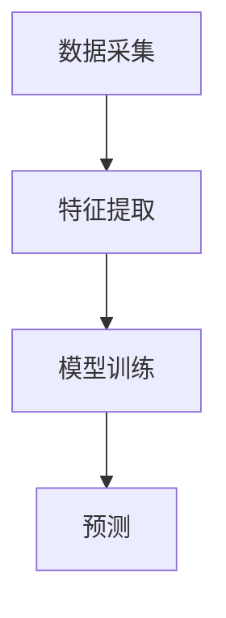

                 


# 特价股票投资中的新兴科技融合周期性研究

## 关键词：
- 特价股票
- 新兴科技
- 科技周期性
- 股票投资
- 算法模型

## 摘要：
本文深入探讨了特价股票投资中新兴科技与周期性之间的融合，分析了科技周期性对股票市场的影响，提出了基于时间序列分析和机器学习的算法模型，帮助投资者在特价股票投资中捕捉周期性机会。

---

# 第一部分: 特价股票与新兴科技概述

## 第1章: 特价股票与新兴科技概述

### 1.1 特价股票的定义与特点

#### 1.1.1 特价股票的定义
特价股票是指价格相对较低的股票，通常具有较高的增长潜力。其特点包括高波动性、高风险和高回报。

#### 1.1.2 特价股票的特点
- 价格低廉：通常在低市盈率或低市净率的情况下。
- 高波动性：价格波动较大，容易受到市场情绪影响。
- 高风险：风险较高，适合风险承受能力强的投资者。

#### 1.1.3 特价股票的投资价值与风险
- 投资价值：潜在的高回报，尤其在新兴科技领域。
- 风险：市场波动大，容易受到外部因素影响。

### 1.2 新兴科技的定义与特点

#### 1.2.1 新兴科技的定义
新兴科技指的是最近发展起来的技术，具有创新性和前瞻性，如人工智能、区块链、5G等。

#### 1.2.2 新兴科技的核心技术领域
- 人工智能：AI技术在各个领域的应用。
- 区块链：去中心化技术的应用。
- 5G技术：高速通信技术。

#### 1.2.3 新兴科技对经济的推动作用
- 提高生产效率：通过自动化和智能化提升生产力。
- 创新商业模式：改变传统商业模式，创造新的经济价值。

### 1.3 特价股票与新兴科技的融合

#### 1.3.1 特价股票与新兴科技融合的背景
- 科技创新推动经济发展。
- 特价股票提供高增长潜力。

#### 1.3.2 融合的模式与路径
- 通过科技周期性分析，选择合适的投资时机。
- 结合新兴科技企业的发展阶段，制定投资策略。

#### 1.3.3 融合对投资的影响
- 提高投资回报率：通过科技周期性分析，抓住新兴科技企业的成长机会。
- 分散投资风险：通过多元化投资降低风险。

---

## 第2章: 科技周期性对股票投资的影响

### 2.1 科技周期性概述

#### 2.1.1 科技周期性的定义
科技周期性指的是科技从发展到成熟再到衰退的过程，具有一定的周期性。

#### 2.1.2 科技周期性的特征
- 波动性：科技发展具有周期性波动。
- 阶段性：分为初创期、成长期、成熟期和衰退期。

#### 2.1.3 科技周期性对经济的影响
- 驱动经济增长：新兴科技推动经济发展。
- 影响市场结构：科技周期性影响市场供需关系。

### 2.2 科技周期性与股票投资的关系

#### 2.2.1 科技周期性对股票价格的影响
- 在初创期，股票价格可能较低，但增长潜力大。
- 在成熟期，股票价格趋于稳定，回报率相对稳定。

#### 2.2.2 科技周期性对投资策略的影响
- 初创期：适合风险投资，追求高回报。
- 成熟期：适合稳健投资，追求稳定回报。

#### 2.2.3 科技周期性对投资风险的控制
- 通过周期性分析，合理配置资产。
- 在不同周期选择不同的投资策略，降低风险。

### 2.3 科技周期性对新兴科技企业的影响

#### 2.3.1 新兴科技企业的生命周期
- 初创期：企业成立初期，资金需求大，风险高。
- 成长期：企业快速扩张，市场占有率提高。
- 成熟期：企业稳定发展，利润增长稳定。
- 衰退期：企业竞争力下降，市场份额减少。

#### 2.3.2 科技周期性对新兴科技企业股价的影响
- 在初创期，股价波动大，可能有较大的上涨空间。
- 在成熟期，股价趋于稳定，可能进入横盘状态。
- 在衰退期，股价可能下跌，投资者需谨慎。

#### 2.3.3 新兴科技企业在不同周期中的表现
- 初创期：高增长，高风险。
- 成长期：高增长，股价稳步上升。
- 成熟期：稳定增长，股价趋于平稳。
- 衰退期：增长放缓，股价下跌。

---

## 第3章: 特价股票投资中的科技周期性分析

### 3.1 特价股票投资中的科技周期性模型

#### 3.1.1 模型构建
- 数据来源：历史股价数据、科技发展周期数据。
- 数据预处理：清洗数据，处理缺失值。
- 特征提取：提取股价波动性、科技发展阶段等特征。
- 模型训练：使用时间序列分析模型，如ARIMA，进行训练。

#### 3.1.2 模型应用
- 预测未来股价走势。
- 分析科技周期性对股价的影响。

#### 3.1.3 模型评估
- 使用均方误差（MSE）和R平方值评估模型性能。
- 通过实际案例验证模型的有效性。

### 3.2 特价股票投资中的周期性分析

#### 3.2.1 数据预处理
- 数据清洗：处理缺失值和异常值。
- 数据转换：将数据转换为适合模型输入的格式。

#### 3.2.2 特征提取
- 提取股价的波动性特征。
- 提取科技发展的周期性特征。

#### 3.2.3 模型训练
- 使用LSTM模型进行时间序列预测。
- 通过网格搜索优化模型参数。

### 3.3 投资策略优化

#### 3.3.1 策略构建
- 结合周期性分析，制定投资策略。
- 根据科技发展周期，选择合适的投资时机。

#### 3.3.2 策略优化
- 调整投资组合，分散风险。
- 根据市场变化动态调整策略。

---

## 第4章: 系统架构与实现

### 4.1 系统架构设计

#### 4.1.1 系统功能模块
- 数据采集模块：收集股价数据和科技发展数据。
- 特征提取模块：提取周期性特征。
- 模型训练模块：训练时间序列模型。
- 预测模块：预测未来股价走势。

#### 4.1.2 系统架构图


### 4.2 系统实现

#### 4.2.1 数据预处理代码
```python
import pandas as pd

# 读取数据
data = pd.read_csv('stock_data.csv')

# 处理缺失值
data = data.dropna()

# 标准化处理
from sklearn.preprocessing import StandardScaler
scaler = StandardScaler()
data_scaled = scaler.fit_transform(data)
```

#### 4.2.2 模型训练代码
```python
from keras.models import Sequential
from keras.layers import LSTM, Dense

# 构建模型
model = Sequential()
model.add(LSTM(64, input_shape=(timesteps, features)))
model.add(Dense(1))
model.compile(loss='mean_squared_error', optimizer='adam')

# 训练模型
model.fit(x_train, y_train, epochs=50, batch_size=32)
```

#### 4.2.3 模型预测代码
```python
# 预测
y_pred = model.predict(x_test)
```

### 4.3 系统优化

#### 4.3.1 模型优化
- 调整LSTM层数和节点数。
- 使用网格搜索优化超参数。

#### 4.3.2 性能优化
- 提升数据处理效率。
- 优化模型训练速度。

---

## 第5章: 项目实战与分析

### 5.1 项目实战

#### 5.1.1 环境安装
- 安装Python和相关库：pandas、numpy、keras、scikit-learn。

#### 5.1.2 核心代码实现
```python
import pandas as pd
import numpy as np
from sklearn.preprocessing import StandardScaler
from keras.models import Sequential
from keras.layers import LSTM, Dense

# 读取数据
data = pd.read_csv('stock_data.csv')

# 数据预处理
data = data.dropna()
scaled_data = StandardScaler().fit_transform(data)

# 划分训练集和测试集
train_data = scaled_data[:1000]
test_data = scaled_data[1000:]

# 构建数据集
timesteps = 50
features = train_data.shape[1]

x_train = np.zeros((len(train_data) - timesteps, timesteps, features))
y_train = np.zeros((len(train_data) - timesteps, 1))

for i in range(len(train_data) - timesteps):
    x_train[i] = train_data[i:i+timesteps]
    y_train[i] = train_data[i+timesteps]

# 构建模型
model = Sequential()
model.add(LSTM(64, input_shape=(timesteps, features)))
model.add(Dense(1))
model.compile(loss='mean_squared_error', optimizer='adam')

# 训练模型
model.fit(x_train, y_train, epochs=50, batch_size=32)

# 预测
x_test = np.zeros((len(test_data) - timesteps, timesteps, features))
y_pred = model.predict(x_test)
```

#### 5.1.3 代码解读与分析
- 数据预处理：清洗数据并标准化。
- 模型训练：使用LSTM进行时间序列预测。
- 模型预测：预测未来股价走势。

### 5.2 实际案例分析

#### 5.2.1 案例背景
选取一家新兴科技公司，分析其股价周期性。

#### 5.2.2 数据分析
- 数据特征提取：提取周期性特征。
- 模型预测：预测未来股价走势。

#### 5.2.3 案例总结
通过周期性分析，制定投资策略，抓住新兴科技企业的成长机会。

---

## 第6章: 最佳实践与总结

### 6.1 小结

#### 6.1.1 核心观点回顾
- 特价股票与新兴科技融合的周期性影响。
- 科技周期性对股价的影响。

#### 6.1.2 技术总结
- 时间序列分析的应用。
- LSTM模型的优势。

### 6.2 注意事项

#### 6.2.1 投资风险
- 特价股票风险高，需谨慎投资。
- 科技周期性分析需结合市场实际情况。

#### 6.2.2 技术实现
- 数据预处理需仔细清洗数据。
- 模型训练需选择合适的参数。

### 6.3 拓展阅读

#### 6.3.1 相关书籍
- 《股票投资实战技术》
- 《科技周期性分析》

#### 6.3.2 技术博客
- Keras官方文档
- TensorFlow官方文档

---

## 作者信息

作者：AI天才研究院/AI Genius Institute & 禅与计算机程序设计艺术/Zen And The Art of Computer Programming

---

# 结语

通过本文的分析，我们深入了解了特价股票投资中的新兴科技融合周期性研究，掌握了科技周期性对股票投资的影响，学会了如何利用时间序列分析和机器学习模型进行周期性预测，为投资者提供了科学的投资决策依据。

