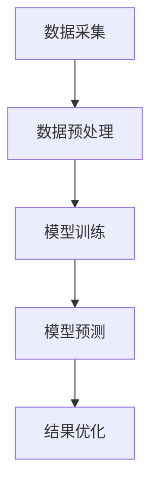
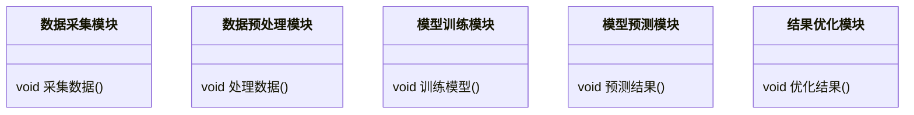
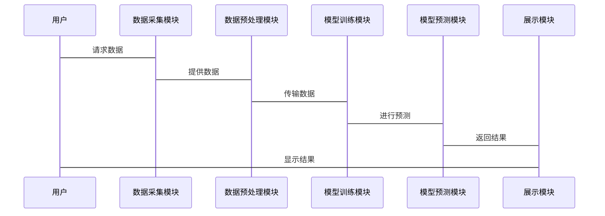

                 


# 特价股票投资中的新兴科技融合指数研究

> 关键词：特价股票，新兴科技，指数模型，人工智能，大数据，融合指数

> 摘要：本文探讨了在特价股票投资中，新兴科技与指数模型的融合应用。通过分析特价股票的特点、新兴科技在金融领域的应用，以及融合指数的概念与意义，本文详细介绍了融合指数的算法原理、系统架构设计、项目实战案例，最后总结了最佳实践和注意事项。文章旨在为投资者和技术开发者提供理论与实践相结合的指导，助力他们在特价股票投资中实现更精准的决策。

---

## 第一部分：背景介绍

### 第1章：特价股票投资与新兴科技的背景介绍

#### 1.1 特价股票投资的基本概念

##### 1.1.1 特价股票的定义与特点

特价股票是指价格相对较低的股票，通常具有较高的增长潜力。其特点包括低估值、高增长潜力、风险较高、流动性较低等。投资者通过投资特价股票，希望能够以较低的成本获得较高的收益。

##### 1.1.2 特价股票投资的历史发展

特价股票投资历史悠久，起源于早期的股票市场，随着市场的发展，投资者逐渐认识到特价股票的潜在价值。近年来，随着金融市场的波动加剧，特价股票投资再次受到关注。

##### 1.1.3 特价股票投资的现状与趋势

当前，特价股票投资呈现多样化趋势，投资者通过多种策略进行投资，包括技术分析、基本面分析、量化投资等。同时，随着科技的进步，新兴科技的应用为特价股票投资带来了新的机遇。

#### 1.2 新兴科技在金融领域的应用

##### 1.2.1 人工智能在金融中的应用

人工智能技术在金融领域的应用广泛，包括智能投顾、风险评估、市场预测等。人工智能通过大数据分析和机器学习算法，帮助投资者做出更精准的决策。

##### 1.2.2 大数据技术在金融中的应用

大数据技术通过收集和分析海量数据，帮助投资者发现市场趋势和投资机会。大数据技术在金融领域的应用包括市场情绪分析、交易行为分析等。

##### 1.2.3 区块链技术在金融中的应用

区块链技术在金融领域的应用包括去中心化金融、智能合约、安全交易等。区块链技术为金融行业提供了更高的安全性和透明度。

#### 1.3 融合指数的概念与意义

##### 1.3.1 指数的基本定义与作用

指数是一种衡量一组股票表现的指标，能够反映市场的整体走势。指数的作用包括提供市场参考、分散投资风险等。

##### 1.3.2 新兴科技与指数融合的背景

随着科技的进步，指数模型逐渐引入新兴科技，以提高预测的准确性和效率。融合指数的概念应运而生。

##### 1.3.3 融合指数的意义与价值

融合指数通过结合新兴科技和传统指数模型，能够更准确地反映市场动态，为投资者提供更科学的投资决策依据。

---

## 第二部分：核心概念与联系

### 第2章：特价股票投资中的核心概念与联系

#### 2.1 核心概念的定义与属性特征

##### 2.1.1 特价股票的属性特征

| 属性 | 特性描述 |
|------|----------|
| 价格 | 低估值    |
| 风险 | 高风险    |
| 潜力 | 高增长潜力 |

##### 2.1.2 新兴科技的属性特征

| 技术 | 特性描述       |
|------|----------------|
| 人工智能 | 高精度预测     |
| 大数据 | 数据处理能力强 |
| 区块链 | 高安全性       |

##### 2.1.3 融合指数的属性特征

| 属性 | 特性描述       |
|------|----------------|
| 数据来源 | 多源化         |
| 计算方式 | 综合化         |
| 应用场景 | 投资决策支持   |

#### 2.2 核心概念的对比分析

##### 2.2.1 特价股票与传统股票的对比

| 对比维度 | 特价股票       | 传统股票       |
|----------|---------------|---------------|
| 价格     | 低             | 高             |
| 风险     | 高             | 中             |
| 潜力     | 高             | 低             |

##### 2.2.2 新兴科技与传统科技的对比

| 对比维度 | 新兴科技       | 传统科技       |
|----------|---------------|---------------|
| 效率     | 高             | 低             |
| 精度     | 高             | 中             |
| 可扩展性 | 强             | 弱             |

##### 2.2.3 融合指数与传统指数的对比

| 对比维度 | 融合指数       | 传统指数       |
|----------|---------------|---------------|
| 数据来源 | 多源化         | 单一化         |
| 计算方式 | 综合化         | 简单化         |
| 应用场景 | 投资决策支持   | 市场趋势反映    |

#### 2.3 实体关系图（ER图）

```mermaid
erd
  外部实体
    投资者
    市场数据
    系统
  实体
    特价股票
    新兴科技
    融合指数
  关系
    投资者 -> 特价股票: 投资
    新兴科技 <-!-> 融合指数: 应用
    市场数据 -> 融合指数: 计算
```

---

## 第三部分：算法原理与数学模型

### 第3章：融合指数的算法原理与数学模型

#### 3.1 融合指数的算法原理

##### 3.1.1 算法原理的概述

融合指数的算法原理是将新兴科技与传统指数模型相结合，通过大数据分析和机器学习算法，预测股票价格走势，从而指导投资决策。

##### 3.1.2 算法原理的详细解释

融合指数算法的核心步骤包括数据采集、数据预处理、模型训练、结果预测和优化调整。

##### 3.1.3 算法原理的数学模型

融合指数的数学模型如下：

$$
\text{融合指数} = \alpha \times \text{传统指数} + \beta \times \text{新兴科技指数}
$$

其中，$$\alpha$$ 和 $$\beta$$ 是权重系数，需通过训练数据确定。

#### 3.2 融合指数的算法实现

##### 3.2.1 代码实现

```python
import numpy as np
import pandas as pd
from sklearn.linear_model import LinearRegression

# 数据加载
data = pd.read_csv('data.csv')

# 数据预处理
X = data[['传统指数', '新兴科技指数']]
y = data['融合指数']

# 模型训练
model = LinearRegression()
model.fit(X, y)

# 模型预测
new_data = pd.DataFrame({'传统指数': [x1], '新兴科技指数': [x2]})
predicted_index = model.predict(new_data)
```

##### 3.2.2 算法流程图



---

## 第四部分：系统分析与架构设计

### 第4章：融合指数系统的架构设计

#### 4.1 项目背景

融合指数系统旨在通过新兴科技提升股票投资的精准度，帮助投资者在特价股票市场中获得更好的收益。

#### 4.2 系统功能设计

##### 4.2.1 功能模块

1. 数据采集模块
2. 数据预处理模块
3. 模型训练模块
4. 模型预测模块
5. 结果优化模块

##### 4.2.2 领域模型（类图）



#### 4.3 系统架构设计

##### 4.3.1 系统架构图


#### 4.4 系统接口设计

##### 4.4.1 接口描述

1. 数据接口：用于数据采集和预处理
2. 模型接口：用于模型训练和预测
3. 展示接口：用于结果展示和用户交互

#### 4.5 系统交互设计

##### 4.5.1 交互流程图



---

## 第五部分：项目实战

### 第5章：融合指数项目实战

#### 5.1 环境安装

##### 5.1.1 安装Python

安装Python 3.8及以上版本，确保环境稳定。

##### 5.1.2 安装依赖库

安装必要的Python库，如NumPy、Pandas、Scikit-learn等。

#### 5.2 核心代码实现

##### 5.2.1 数据采集与处理

```python
import pandas as pd

# 数据采集
data = pd.read_csv('data.csv')

# 数据预处理
data.dropna(inplace=True)
data = pd.get_dummies(data)
```

##### 5.2.2 模型训练与预测

```python
from sklearn.model

