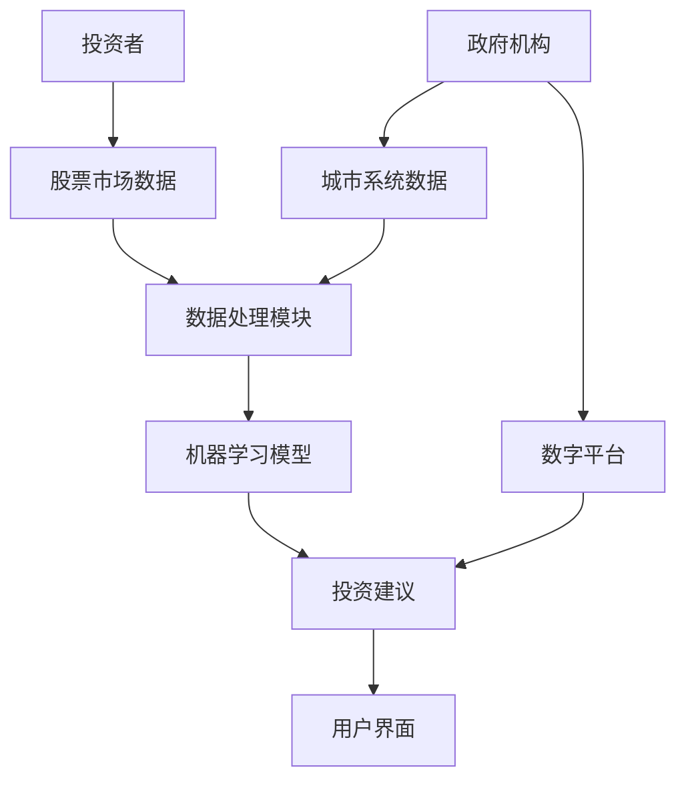

                 


# 特价股票投资中的智慧城市与数字公民参与度整合方法

> 关键词：特价股票投资、智慧城市、数字公民参与度、数据驱动投资、机器学习算法、系统架构设计

> 摘要：本文探讨如何将特价股票投资与智慧城市的数字公民参与度相结合，通过数据驱动的方法和机器学习算法，优化股票分析和投资策略。文章首先介绍相关背景，然后详细阐述核心概念，接着分析算法原理，设计系统架构，最后通过项目实战展示整合方法的应用，并提出最佳实践和未来研究方向。

---

## 第一部分：背景介绍

### 第1章：特价股票投资与智慧城市概述

#### 1.1 特价股票投资的基本概念
特价股票是指价格相对较低、具有潜在增长空间的股票。投资者通过分析市场趋势、公司基本面等因素，寻找被低估的投资机会。然而，股票市场受多种因素影响，包括经济波动、政策变化等，增加了投资的复杂性和不确定性。

#### 1.2 智慧城市的基本概念
智慧城市利用信息技术和数据驱动的方法，优化城市资源的配置和管理。智慧城市的核心组成部分包括智能交通系统、物联网、大数据分析等，旨在提升城市居民的生活质量，降低资源消耗，提高城市管理效率。

#### 1.3 数字公民参与度的概念
数字公民是指能够利用数字技术参与社会事务的公民。数字参与度衡量公民通过数字渠道参与公共事务的程度，包括在线投票、意见反馈、信息获取等。数字公民参与度的提升有助于提高城市管理的透明度和效率。

---

### 第2章：整合特价股票投资与智慧城市的必要性

#### 2.1 智慧城市数据在股票分析中的应用
智慧城市产生的大量数据，如交通流量、能源消耗、人口流动等，可以为股票分析提供新的视角。例如，交通数据可以反映企业的供应链效率，能源消耗数据可以评估企业的生产成本。

#### 2.2 数字公民参与度对股票市场的间接影响
数字公民的积极参与可以提高市场信息的透明度，降低信息不对称，从而影响股票价格的波动。此外，数字公民的参与可以促进政策的透明化和公正性，进而影响投资者的决策。

---

## 第二部分：核心概念与联系

### 第3章：核心概念与联系

#### 3.1 特价股票投资的核心要素
- **市场趋势**：股票价格受宏观经济、行业趋势等因素影响。
- **公司基本面**：包括财务状况、盈利能力、管理团队等。
- **投资者情绪**：市场情绪波动会影响股票价格。

#### 3.2 智慧城市的核心组成部分
- **智能交通系统**：优化交通流量，减少拥堵。
- **物联网**：实时监测城市资源的使用情况。
- **大数据分析**：挖掘城市数据，支持决策。

#### 3.3 数字公民参与度的衡量指标
- **在线参与度**：公民通过在线平台参与的比例。
- **信息获取渠道**：公民获取信息的渠道是否多样。
- **反馈机制**：公民意见是否被政府机构采纳。

#### 3.4 概念属性特征对比
| 概念               | 特价股票投资 | 智慧城市 | 数字公民参与度 |
|--------------------|--------------|----------|----------------|
| 核心目标           | 获取投资收益 | 提升城市管理效率 | 提高公民参与度 |
| 数据驱动           | 是           | 是        | 是              |
| 技术依赖           | 大数据、机器学习 | 物联网、大数据 | 数字平台、移动应用 |
| 影响因素           | 市场趋势、公司基本面 | 城市资源、政策 | 公民技术素养、政策支持 |

#### 3.5 ER实体关系图
```mermaid
erDiagram
    actor 投资者 {
        <属性> 帐户余额
        <属性> 投资组合
    }
    actor 公民 {
        <属性> 数字参与度
        <属性> 意见反馈
    }
    actor 政府机构 {
        <属性> 政策
        <属性> 城市数据
    }
    entity 股票市场 {
        <属性> 股票价格
        <属性> 市场趋势
    }
    entity 城市系统 {
        <属性> 交通流量
        <属性> 能源消耗
    }
    entity 数字平台 {
        <属性> 在线投票
        <属性> 信息共享
    }
    投资者 -> 股票市场 : 进行投资
    公民 -> 数字平台 : 参与事务
    政府机构 -> 城市系统 : 管理资源
    股票市场 -> 政府机构 : 受政策影响
    数字平台 <- 政府机构 : 提供数据
```

---

## 第三部分：算法原理

### 第4章：算法原理与实现

#### 4.1 数据驱动投资的基本原理
数据驱动投资通过分析大量历史数据，识别市场模式和趋势，从而预测未来的价格走势。常用的方法包括时间序列分析、机器学习等。

#### 4.2 基于机器学习的股票预测算法
```mermaid
graph TD
    A[数据预处理] -> B[特征提取]
    B -> C[选择模型]
    C -> D[训练模型]
    D -> E[评估模型]
    E -> F[预测股票价格]
```

#### 4.3 算法实现
以下是一个基于线性回归的股票价格预测模型的Python代码示例：

```python
import pandas as pd
import numpy as np
from sklearn.linear_model import LinearRegression
from sklearn.metrics import mean_squared_error

# 数据加载与预处理
data = pd.read_csv('stock_data.csv')
data = data.dropna()

# 特征提取
X = data[['volume', 'open', 'high', 'low']]
y = data['close']

# 模型训练
model = LinearRegression()
model.fit(X, y)

# 模型评估
y_pred = model.predict(X)
mse = mean_squared_error(y, y_pred)
print(f'均方误差：{mse}')
```

#### 4.4 数学模型与公式
股票价格预测模型的数学公式：
$$
\hat{y} = \beta_0 + \beta_1 x_1 + \beta_2 x_2 + \ldots + \beta_n x_n
$$
其中，$\hat{y}$ 是预测的股票价格，$x_i$ 是输入特征，$\beta_i$ 是模型参数。

---

## 第四部分：系统分析与架构设计

### 第5章：系统分析与架构设计

#### 5.1 问题场景介绍
在智慧城市建设中，如何利用城市数据优化股票分析，同时提高公民参与度，是一个值得探索的方向。

#### 5.2 系统功能设计
- **数据采集**：从智慧城市系统中获取相关数据。
- **数据分析**：利用机器学习算法分析数据，生成投资建议。
- **用户界面**：提供直观的界面，供投资者和公民使用。

#### 5.3 系统架构设计


#### 5.4 接口设计与交互流程
- **接口设计**：API用于数据传输和模型调用。
- **交互流程**：投资者通过数字平台提交请求，系统分析后返回投资建议。

---

## 第五部分：项目实战

### 第6章：项目实战

#### 6.1 环境安装与配置
- **Python**：安装Python 3.x
- **库**：安装pandas、numpy、scikit-learn等库

#### 6.2 核心代码实现
```python
import pandas as pd
from sklearn.linear_model import LinearRegression
from sklearn.metrics import mean_squared_error

# 数据加载
data = pd.read_csv('stock_data.csv')

# 数据处理
data = data.dropna()
X = data[['volume', 'open', 'high', 'low']]
y = data['close']

# 模型训练
model = LinearRegression()
model.fit(X, y)

# 预测与评估
y_pred = model.predict(X)
mse = mean_squared_error(y, y_pred)
print(f'均方误差：{mse}')
```

#### 6.3 项目总结
通过项目实战，验证了智慧城市数据在股票分析中的应用潜力，同时也展示了数字公民参与度对投资决策的影响。

---

## 第六部分：小结与展望

### 第7章：小结与展望

#### 7.1 小结
本文探讨了如何将特价股票投资与智慧城市的数字公民参与度整合，通过数据驱动的方法和机器学习算法，优化股票分析和投资策略。文章详细介绍了相关背景、核心概念、算法原理、系统架构，并通过项目实战展示了整合方法的应用。

#### 7.2 展望
未来的研究可以进一步探索更多数据源和算法，提高模型的预测精度和鲁棒性。此外，还可以研究数字公民参与度对投资决策的长期影响。

---

## 第七部分：注意事项与拓展阅读

### 第8章：注意事项与拓展阅读

#### 8.1 注意事项
- 数据质量和完整性对模型的准确性至关重要。
- 投资者需谨慎使用模型结果，结合市场动态进行决策。
- 数字公民参与度的提升需要政府和企业的共同努力。

#### 8.2 拓展阅读
- 《机器学习在金融领域的应用》
- 《智慧城市的建设与管理》
- 《数字公民与社会治理》

---

## 作者信息

作者：AI天才研究院/AI Genius Institute & 禅与计算机程序设计艺术/Zen And The Art of Computer Programming

---

本文通过系统的分析和实践，展示了如何将特价股票投资与智慧城市的数字公民参与度整合，为投资者和城市管理者提供了新的思路和方法。希望本文能为相关领域的研究和实践提供有价值的参考。

