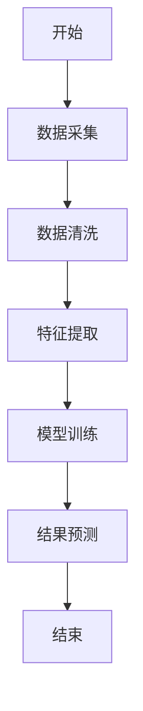
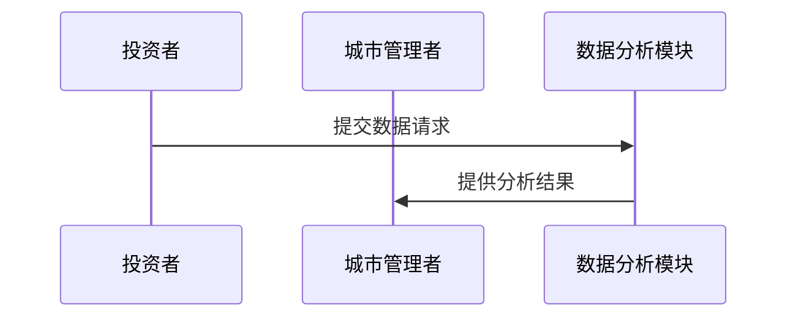

                 


# 特价股票投资中的智慧城市发展整合方法

## 关键词：
- 特价股票投资
- 智慧城市
- 整合方法
- 数据分析
- 人工智能
- 系统架构

## 摘要：
本文探讨了将特价股票投资与智慧城市发展的整合方法，分析了两者的结合如何促进智慧城市的可持续发展。通过数学模型和算法流程图，详细阐述了整合方法的原理和实现步骤，结合实际案例分析，提供了系统的解决方案。

## 第一部分: 特价股票投资与智慧城市发展整合的背景与核心概念

### 第1章: 特价股票投资与智慧城市发展概述

#### 1.1 特价股票投资的基本概念
##### 1.1.1 特价股票的定义与特点
特价股票是指市场价格低于其内在价值的股票，具有低估值、高成长潜力的特点。

##### 1.1.2 特价股票投资的市场环境分析
包括宏观经济环境、行业趋势、公司基本面等因素，分析这些因素如何影响股票价格。

##### 1.1.3 特价股票投资的核心策略
如价值投资、趋势投资等，强调长期持有和风险管理。

#### 1.2 智慧城市发展的基本概念
##### 1.2.1 智慧城市的定义与特征
智慧城市整合了信息技术，以优化城市资源利用和居民生活质量。

##### 1.2.2 智慧城市发展的关键领域
包括交通管理、能源优化、公共安全等领域，强调技术创新和数据驱动。

##### 1.2.3 智慧城市与传统城市的对比
从技术应用、管理效率、居民参与等方面分析两者的差异。

#### 1.3 特价股票投资与智慧城市整合的背景
##### 1.3.1 特价股票投资在智慧城市中的潜在作用
通过投资智慧城市相关企业，促进技术创新和城市发展。

##### 1.3.2 智慧城市发展的资金需求与投资机会
智慧城市需要大量资金，而特价股票投资提供了一种低成本的资金来源。

##### 1.3.3 当前市场环境下的整合趋势
分析当前市场环境下，整合特价股票投资与智慧城市发展的必要性和可行性。

### 第2章: 特价股票投资与智慧城市整合的核心概念

#### 2.1 整合方法的定义与目标
##### 2.1.1 整合方法的定义
整合方法是指将特价股票投资策略应用于智慧城市建设中的系统方法。

##### 2.1.2 整合方法的目标
通过优化资源配置和提升投资效率，推动智慧城市的可持续发展。

##### 2.1.3 整合方法的核心要素
包括数据采集、分析、投资决策、风险控制等。

#### 2.2 整合方法的原理与机制
##### 2.2.1 市场供需分析
通过分析市场供需关系，确定投资机会和风险。

##### 2.2.2 投资收益模型
建立数学模型，预测投资收益，评估项目可行性。

##### 2.2.3 风险控制机制
采用多元化投资策略、风险评估模型等方法，降低投资风险。

#### 2.3 整合方法的属性特征对比
##### 2.3.1 特价股票投资的属性特征
表格展示特价股票的流动性、风险性、成长性等属性。

##### 2.3.2 智慧城市发展的属性特征
表格展示智慧城市的可持续性、技术依赖性、社会影响性等属性。

##### 2.3.3 两者的对比与联系
分析两者在属性特征上的异同，及其如何相互作用。

### 第3章: 整合方法的ER实体关系图

#### 3.1 实体关系图的定义
ER图展示系统中的实体及其关系。

#### 3.2 实体关系图的构建
```mermaid
er
actor: 投资者
actor: 城市管理者
actor: 企业
```

#### 3.3 实体关系图的分析
分析投资者、城市管理者、企业之间的关系，明确数据流和交互。

## 第4章: 整合方法的算法原理

### 4.1 算法流程图


### 4.2 算法数学模型

#### 4.2.1 数据预处理公式
$$ y = f(x) $$

#### 4.2.2 模型训练公式
$$ y = \beta_0 + \beta_1x + \epsilon $$

## 第二部分: 系统分析与架构设计

### 第5章: 系统分析

#### 5.1 项目背景介绍
阐述智慧城市建设的背景和目标。

#### 5.2 系统功能设计
领域模型类图展示系统功能模块及其交互。

#### 5.3 系统架构设计
微服务架构图展示系统各模块的交互和依赖关系。

#### 5.4 系统接口设计
API接口设计文档，描述接口的功能和调用方式。

#### 5.5 系统交互序列图


### 第6章: 项目实战

#### 6.1 环境安装
安装Python、Pandas、Scikit-learn等工具。

#### 6.2 核心代码实现
实现股票价格预测模型的代码，如：
```python
import pandas as pd
from sklearn.linear_model import LinearRegression

# 数据加载
data = pd.read_csv('stock_data.csv')

# 特征与目标分离
X = data[['feature1', 'feature2']]
y = data['target']

# 模型训练
model = LinearRegression()
model.fit(X, y)

# 预测结果
y_pred = model.predict(X)
```

#### 6.3 代码应用解读
解释代码的功能和实现逻辑，分析模型的准确性和适用性。

#### 6.4 实际案例分析
以某个智慧城市项目为例，分析整合方法的应用效果和经济效益。

#### 6.5 项目总结
总结项目实施的经验和教训，提出改进建议。

## 第三部分: 最佳实践与小结

### 第7章: 最佳实践

#### 7.1 投资策略优化
建议采用多元化投资策略，分散风险。

#### 7.2 技术应用建议
推荐使用先进的人工智能技术，提高数据分析效率。

#### 7.3 风险管理技巧
强调定期评估和调整投资组合，及时应对市场变化。

### 第8章: 小结

总结全文，强调整合方法的重要性和应用前景，鼓励读者进一步研究和实践。

## 作者：
作者：AI天才研究院/AI Genius Institute  
作者：禅与计算机程序设计艺术/Zen And The Art of Computer Programming

