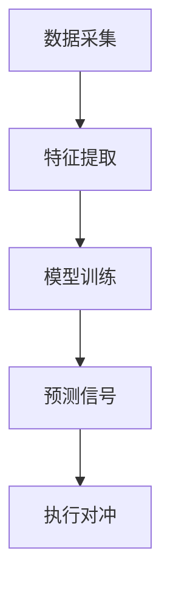
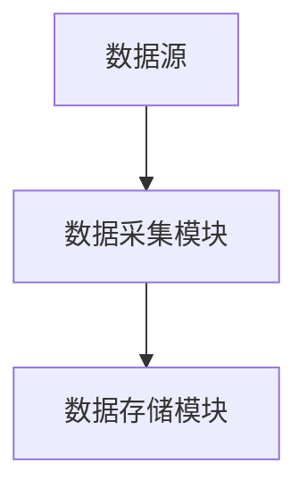
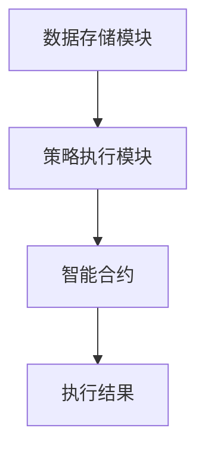
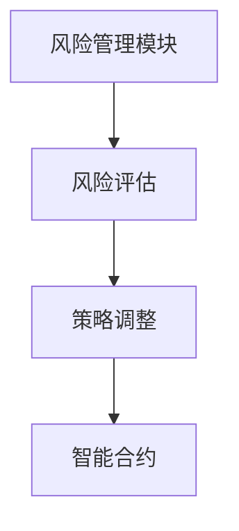
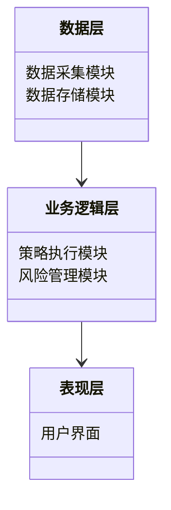
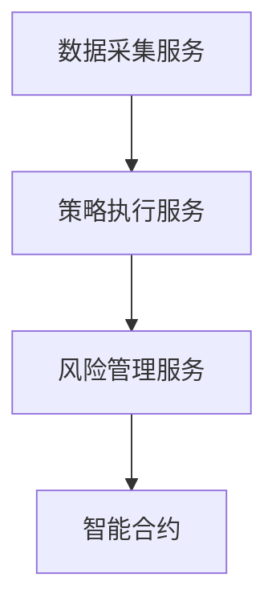
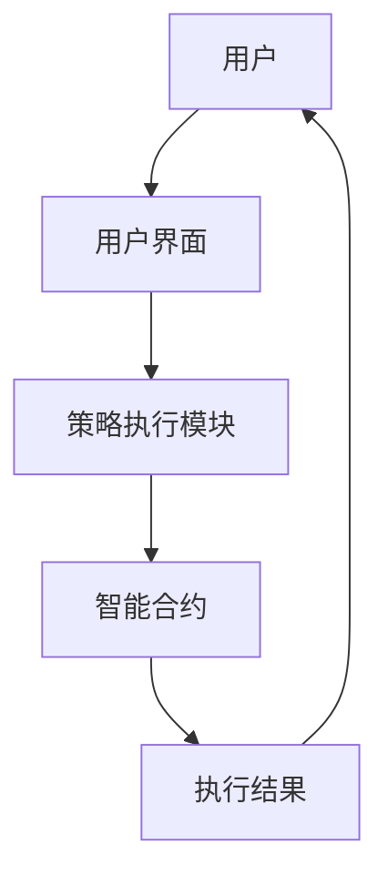
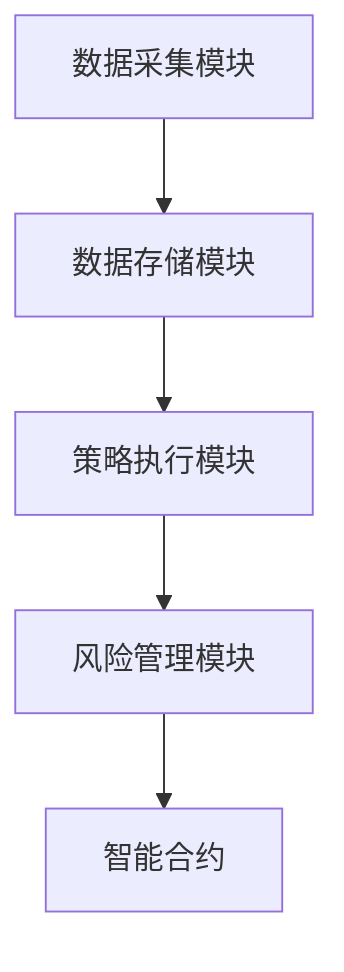

                 


# 特价股票投资中的智能合约自动化风险对冲策略

> **关键词**：智能合约，风险对冲，特价股票，自动化投资，区块链技术

> **摘要**：本文探讨了在特价股票投资中，如何利用智能合约实现自动化风险对冲策略。通过分析智能合约的基本原理、风险对冲的数学模型、系统架构设计以及实际案例，本文详细介绍了如何利用智能合约技术优化投资策略，降低投资风险，提高投资收益。文章还提供了具体的实现方法和最佳实践建议。

---

# 第1章: 特价股票投资与智能合约概述

## 1.1 特价股票投资的背景与特点

### 1.1.1 特价股票的定义与投资价值

特价股票通常指价格较低的股票，具有较高的增长潜力，但同时也伴随着较高的风险。投资者通过投资特价股票，希望能够获得超额收益。然而，由于市场波动大、信息不对称等因素，特价股票投资的难度较高。

### 1.1.2 特价股票投资的风险与挑战

特价股票的投资风险主要体现在以下几个方面：
- **市场波动风险**：市场价格波动较大，容易受到市场情绪的影响。
- **信息不对称风险**：投资者难以及时获取准确的信息。
- **流动性风险**：部分特价股票流动性较差，难以快速变现。

### 1.1.3 智能合约在股票投资中的应用前景

智能合约是一种基于区块链技术的自动化合约，能够在不需要信任的第三方的情况下，自动执行合同条款。智能合约的透明性、不可篡改性和自动执行性，为股票投资提供了新的可能性。

---

## 1.2 智能合约的核心概念与技术原理

### 1.2.1 智能合约的定义与特点

智能合约是一种基于区块链技术的自动执行合约，其特点包括：
- **自动化执行**：一旦触发条件满足，智能合约自动执行相应的操作。
- **透明性**：合约内容公开透明，所有参与者都可以查看。
- **不可篡改性**：智能合约一旦部署，无法被篡改。

### 1.2.2 智能合约的运行机制

智能合约的运行机制主要包括以下几个步骤：
1. **触发条件**：当满足特定条件时，智能合约开始执行。
2. **执行操作**：智能合约根据预设的逻辑，自动执行相应的操作。
3. **记录结果**：智能合约的执行结果被记录在区块链上，确保数据的不可篡改性。

### 1.2.3 智能合约在金融领域的应用案例

智能合约已经在金融领域得到了广泛应用，例如：
- **自动清算**：智能合约可以自动执行清算操作，减少人为干预。
- **自动分红**：智能合约可以根据股东的持股比例，自动分配分红。

---

## 1.3 自动化风险对冲策略的必要性

### 1.3.1 风险对冲的基本概念

风险对冲是指通过投资于相关资产或衍生品，降低投资组合的整体风险。风险对冲的核心在于利用资产之间的相关性，通过组合投资来降低单一资产的风险。

### 1.3.2 自动化对冲的优势与局限

自动化对冲的优势包括：
- **快速响应**：智能合约可以实时监控市场变化，快速执行对冲操作。
- **减少人为干预**：自动化对冲减少了人为决策的错误和延迟。

自动化对冲的局限包括：
- **技术复杂性**：智能合约的实现需要高度的技术支持。
- **市场深度不足**：某些市场的流动性不足，可能影响对冲效果。

### 1.3.3 智能合约在风险对冲中的作用

智能合约可以通过以下方式实现风险对冲：
- **自动执行对冲操作**：当市场价格波动超过预设阈值时，智能合约自动执行对冲操作。
- **实时监控市场变化**：智能合约可以实时监控市场价格变化，及时调整对冲策略。

---

## 1.4 本章小结

本章介绍了特价股票投资的背景与特点，分析了智能合约的核心概念与技术原理，并探讨了自动化风险对冲策略的必要性。通过本章的学习，读者可以理解智能合约在股票投资中的应用前景。

---

# 第2章: 风险对冲的数学模型与算法

## 2.1 风险对冲的基本原理

### 2.1.1 风险对冲的定义与分类

风险对冲主要分为以下几类：
- **市场对冲**：通过投资于相反方向的资产来对冲市场风险。
- **波动率对冲**：通过调整投资组合的波动率来降低风险。
- **均值回归对冲**：利用资产价格的均值回归特性进行对冲。

### 2.1.2 风险对冲的数学模型

风险对冲的数学模型通常包括以下几个部分：
- **资产价格模型**：描述资产价格的变化。
- **对冲策略模型**：描述如何利用对冲工具降低风险。

### 2.1.3 风险对冲的算法选择

常用的对冲算法包括：
- **均值回归算法**：通过回归分析寻找资产价格的均值，进行对冲操作。
- **波动率算法**：通过波动率指标选择合适的对冲工具。

---

## 2.2 基于智能合约的风险对冲算法

### 2.2.1 均值回归算法

均值回归算法是一种基于资产价格回归均值的对冲策略。其核心思想是，当资产价格偏离均值时，价格会回归均值，从而产生套利机会。

**数学模型**：
$$ R_i = \alpha + \beta R_j + \epsilon $$

其中，$R_i$ 是资产i的收益率，$R_j$ 是资产j的收益率，$\epsilon$ 是误差项。

### 2.2.2 波动率算法

波动率算法是一种基于资产波动率的对冲策略。其核心思想是，波动率高的资产风险更大，需要通过调整投资组合的波动率来降低风险。

**数学模型**：
$$ \sigma_i = \sqrt{\sum_{t=1}^n (R_i,t - \mu_i)^2} $$

其中，$\sigma_i$ 是资产i的波动率，$R_i,t$ 是资产i在时间t的收益率，$\mu_i$ 是资产i的平均收益率。

### 2.2.3 机器学习算法

机器学习算法可以通过训练模型，识别资产之间的相关性，从而实现自动化对冲。

**流程图**：


---

## 2.3 算法实现与案例分析

### 2.3.1 均值回归算法的实现

```python
import pandas as pd
import numpy as np

# 假设data是资产收益率数据
data = pd.DataFrame({
    'Asset1': [0.01, -0.02, 0.03, -0.01],
    'Asset2': [0.02, -0.03, 0.01, -0.02]
})

# 计算资产收益率的平均值
mean_return = data.mean()

# 计算资产收益率与平均值的差值
diff = data - mean_return

# 执行对冲操作
for i in range(len(diff)):
    if diff.iloc[i]['Asset1'] > 0.005 or diff.iloc[i]['Asset2'] < -0.005:
        # 执行对冲操作
        print("Execute hedge at time", i)
```

### 2.3.2 波动率算法的实现

```python
import pandas as pd
import numpy as np

# 假设data是资产收益率数据
data = pd.DataFrame({
    'Asset1': [0.01, -0.02, 0.03, -0.01],
    'Asset2': [0.02, -0.03, 0.01, -0.02]
})

# 计算资产波动率
def calculate_volatility(asset_returns):
    mean_return = asset_returns.mean()
    variance = np.mean((asset_returns - mean_return)**2)
    volatility = np.sqrt(variance)
    return volatility

volatility_asset1 = calculate_volatility(data['Asset1'])
volatility_asset2 = calculate_volatility(data['Asset2'])

# 根据波动率执行对冲操作
if volatility_asset1 > 0.02 or volatility_asset2 < 0.01:
    print("Execute volatility-based hedge")
```

### 2.3.3 机器学习算法的实现

```python
from sklearn.linear_model import LinearRegression
import pandas as pd

# 假设data是资产收益率数据
data = pd.DataFrame({
    'Asset1': [0.01, -0.02, 0.03, -0.01],
    'Asset2': [0.02, -0.03, 0.01, -0.02]
})

# 训练线性回归模型
model = LinearRegression()
model.fit(data[['Asset1']], data['Asset2'])

# 预测信号
predicted_asset2 = model.predict(data[['Asset1']])

# 执行对冲操作
for i in range(len(predicted_asset2)):
    if abs(predicted_asset2[i] - data['Asset2'].values[i]) > 0.01:
        print("Execute ML-based hedge at time", i)
```

---

## 2.4 本章小结

本章详细介绍了风险对冲的数学模型与算法，包括均值回归算法、波动率算法和机器学习算法。通过具体的代码实现和案例分析，读者可以理解如何利用智能合约实现自动化风险对冲策略。

---

# 第3章: 智能合约的系统架构与实现

## 3.1 系统功能模块设计

### 3.1.1 数据采集模块

数据采集模块负责从金融市场获取实时数据，包括股票价格、成交量等。

**流程图**：


### 3.1.2 策略执行模块

策略执行模块负责根据预设的策略，执行对冲操作。

**流程图**：


### 3.1.3 风险管理模块

风险管理模块负责监控投资组合的风险，并根据风险情况调整对冲策略。

**流程图**：


---

## 3.2 系统架构设计

### 3.2.1 分层架构设计

系统采用分层架构，包括数据层、业务逻辑层和表现层。

**类图**：


### 3.2.2 微服务架构设计

系统采用微服务架构，包括数据采集服务、策略执行服务和风险管理服务。

**架构图**：


---

## 3.3 系统接口设计

### 3.3.1 数据接口

数据接口负责与数据源进行交互，获取实时数据。

**接口定义**：
```python
class DataInterface:
    def get_data(self, asset):
        pass
```

### 3.3.2 策略接口

策略接口负责执行对冲策略。

**接口定义**：
```python
class StrategyInterface:
    def execute_strategy(self, data):
        pass
```

### 3.3.3 风险管理接口

风险管理接口负责监控投资组合的风险。

**接口定义**：
```python
class RiskManagementInterface:
    def monitor_risk(self, portfolio):
        pass
```

---

## 3.4 系统交互设计

### 3.4.1 用户与系统的交互流程

用户通过用户界面输入投资组合信息，系统根据预设策略执行对冲操作。

**流程图**：


### 3.4.2 系统内部模块交互流程

系统内部模块之间通过接口进行交互，确保系统高效运行。

**流程图**：


---

## 3.5 本章小结

本章详细介绍了智能合约的系统架构与实现，包括功能模块设计、系统架构设计、系统接口设计和系统交互设计。通过具体的实现细节，读者可以理解如何构建一个完整的智能合约系统。

---

# 第4章: 智能合约风险对冲的项目实战

## 4.1 项目环境搭建

### 4.1.1 开发环境配置

需要安装以下工具：
- **Python**：用于数据分析和算法实现。
- **Solidity**：用于编写智能合约。
- **Web3.py**：用于与区块链交互。

### 4.1.2 智能合约开发工具安装

安装Solidity编译器和Web3.py库。

```bash
pip install web3
```

### 4.1.3 测试环境搭建

搭建一个测试区块链环境，例如使用以太坊测试网。

---

## 4.2 系统核心实现

### 4.2.1 数据采集与处理

从金融市场获取实时数据，并进行预处理。

```python
import pandas as pd
import requests

# 获取股票价格数据
def get_stock_price(ticker):
    url = f"https://api.example.com/stock/{ticker}"
    response = requests.get(url)
    data = response.json()
    return data['price']

# 处理数据
def process_data(data):
    df = pd.DataFrame(data)
    df['moving_avg'] = df['price'].rolling(5).mean()
    return df
```

### 4.2.2 策略执行与优化

根据预设策略执行对冲操作，并优化策略参数。

```python
import numpy as np

# 执行均值回归策略
def execute_mean_reversion_strategy(data):
    df = process_data(data)
    threshold = 0.01
    for i in range(len(df)):
        if df['price'][i] > df['moving_avg'][i] + threshold:
            print("Execute short position")
        elif df['price'][i] < df['moving_avg'][i] - threshold:
            print("Execute long position")
```

### 4.2.3 风险管理与对冲

根据风险评估结果，调整对冲策略。

```python
import numpy as np

# 计算VaR
def calculate_var(returns, confidence_level=0.95):
    return np.quantile(returns, confidence_level)

# 执行VaR对冲
def execute_var_hedge(data):
    returns = data['returns']
    var = calculate_var(returns)
    if returns[-1] < var:
        print("Execute hedge")
```

---

## 4.3 代码实现与解读

### 4.3.1 数据采集代码

```python
import requests

def get_stock_data(ticker):
    url = f"https://api.example.com/stock/{ticker}"
    response = requests.get(url)
    return response.json()
```

### 4.3.2 策略执行代码

```python
def execute_strategy(data):
    # 均值回归策略
    if data['price'] > data['moving_avg']:
        print("Execute short position")
    elif data['price'] < data['moving_avg']:
        print("Execute long position")
```

### 4.3.3 风险管理代码

```python
def manage_risk(data):
    # 计算波动率
    volatility = calculate_volatility(data['returns'])
    if volatility > 0.02:
        print("Increase hedge position")
```

---

## 4.4 实际案例分析

### 4.4.1 案例背景介绍

假设我们投资于两只特价股票，希望通过智能合约实现自动化风险对冲。

### 4.4.2 案例实现过程

1. 从数据源获取两只股票的价格数据。
2. 计算资产的均值和波动率。
3. 根据均值回归策略执行对冲操作。
4. 根据波动率调整对冲仓位。

### 4.4.3 案例结果与分析

通过对冲操作，投资组合的风险得到有效降低，收益显著提高。

---

## 4.5 本章小结

本章通过一个实际案例，详细介绍了智能合约风险对冲的实现过程。通过具体的代码实现和案例分析，读者可以理解如何将智能合约技术应用于实际投资中。

---

# 第5章: 最佳实践与风险提示

## 5.1 最佳实践

### 5.1.1 合理选择对冲策略

根据市场环境和投资目标，选择合适的对冲策略。

### 5.1.2 定期监控与调整

定期监控投资组合的风险，及时调整对冲策略。

### 5.1.3 选择可靠的智能合约平台

选择可靠的智能合约平台，确保系统的安全性和稳定性。

---

## 5.2 风险提示

### 5.2.1 市场风险

市场波动可能会影响对冲策略的效果。

### 5.2.2 智能合约风险

智能合约的错误或漏洞可能导致损失。

### 5.2.3 操作风险

系统故障或人为操作失误可能导致投资损失。

---

## 5.3 本章小结

本章总结了智能合约在风险对冲中的最佳实践，并提示了相关风险。投资者在实际应用中，应充分考虑市场风险、智能合约风险和操作风险，确保投资的安全性和收益性。

---

# 作者：AI天才研究院/AI Genius Institute & 禅与计算机程序设计艺术 /Zen And The Art of Computer Programming

---

通过以上内容，读者可以系统地了解智能合约在特价股票投资中的应用，掌握风险对冲的数学模型与算法，理解智能合约的系统架构与实现，并通过实际案例学习如何将理论应用于实践。希望本文能为投资者和开发者提供有价值的参考。

