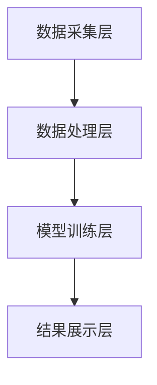
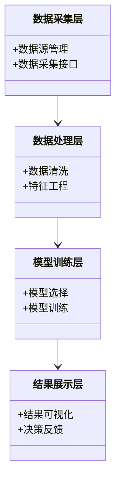
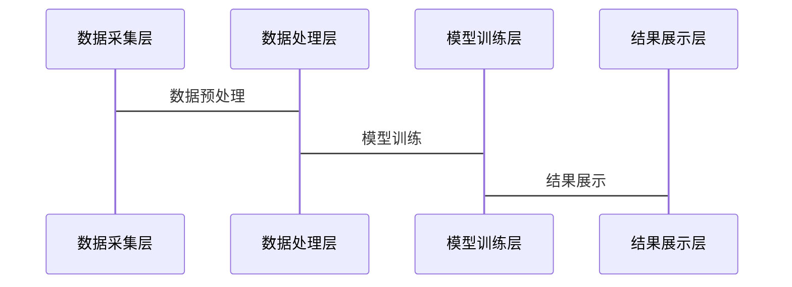

                 


# 特价股票投资中的替代数据分析与边缘人工智能应用

## 关键词：
- 特价股票投资
- 替代数据分析
- 边缘人工智能
- 金融投资
- 数据处理

## 摘要：
本文探讨了在特价股票投资中，如何利用替代数据和边缘人工智能技术来提升投资决策的效率和准确性。通过分析替代数据的来源与处理方法，结合边缘人工智能的优势，提出了基于时间序列分析和机器学习模型的投资策略，并通过实际案例展示了系统的架构设计和实现过程。本文旨在为投资者提供一种新的数据分析方法，帮助其在复杂市场环境中捕捉投资机会。

---

## 第1章：特价股票投资的背景与挑战

### 1.1 特价股票投资的背景

#### 1.1.1 特价股票的定义与特点
特价股票是指价格低于市场价或历史价的股票，通常出现在市场波动、公司重组或促销活动时。其特点是价格波动大、投资风险高，但潜在收益也较高。

#### 1.1.2 投资者行为分析
投资者在特价股票投资中通常表现出高风险偏好和短期获利动机。他们可能利用市场波动，寻找被低估的股票进行投资。

#### 1.1.3 市场波动与投资机会
市场波动为特价股票投资提供了机会，但也带来了挑战。投资者需要及时捕捉市场信号，做出快速决策。

### 1.2 替代数据的定义与作用

#### 1.2.1 替代数据的来源与类型
替代数据包括社交媒体、新闻、公司财报等非传统数据源。这些数据能够提供市场情绪、公司动态等信息，帮助投资者做出更全面的决策。

#### 1.2.2 数据处理的基本流程
数据处理包括数据清洗、预处理和特征工程，确保数据质量和可用性。

#### 1.2.3 数据对投资决策的影响
替代数据能够提供市场情绪和趋势分析，帮助投资者预测市场变化，提高投资决策的准确性。

### 1.3 边缘人工智能的定义与特点

#### 1.3.1 边缘计算的基本概念
边缘计算是指在数据生成的边缘（如移动设备、传感器）进行数据处理和分析，减少数据传输延迟。

#### 1.3.2 边缘AI的优势与挑战
边缘AI的优势包括低延迟、高实时性和资源高效利用。挑战包括数据隐私、计算资源限制和模型更新问题。

#### 1.3.3 边缘AI在金融领域的应用
边缘AI在金融领域的应用包括实时交易监控、风险评估和客户行为分析。

### 1.4 替代数据与边缘AI的结合

#### 1.4.1 数据处理的实时性需求
特价股票投资需要实时数据处理，边缘AI能够满足这一需求。

#### 1.4.2 边缘AI在数据处理中的优势
边缘AI能够在数据源附近快速处理数据，减少传输延迟，提高投资决策的实时性。

#### 1.4.3 两者的协同作用
替代数据与边缘AI的结合能够实现高效、实时的数据分析，帮助投资者捕捉市场机会。

---

## 第2章：替代数据的类型与处理

### 2.1 替代数据的来源

#### 2.1.1 文本数据：新闻、社交媒体
文本数据包括新闻标题、社交媒体帖子等，能够反映市场情绪和趋势。

#### 2.1.2 图像数据：图表、图片
图像数据包括公司财报图表、市场趋势图等，提供视觉化的市场信息。

#### 2.1.3 语音数据：播客、电话会议
语音数据包括行业专家的播客、公司电话会议，提供市场动态和公司战略信息。

### 2.2 数据预处理方法

#### 2.2.1 数据清洗与标准化
数据清洗包括去除噪声、填充缺失值等，标准化处理确保数据一致性。

#### 2.2.2 数据增强技术
数据增强包括文本扩增、图像增强等，增加数据多样性，提高模型泛化能力。

#### 2.2.3 数据标注与分类
数据标注包括将文本分类为正面、负面或中性，图像标注为涨、跌或持平。

### 2.3 数据特征工程

#### 2.3.1 特征提取方法
特征提取包括关键词提取、情感分析等，提取数据中的有用信息。

#### 2.3.2 特征选择策略
特征选择包括基于相关性的特征选择和基于模型的特征选择，选择对投资决策影响大的特征。

#### 2.3.3 特征工程对模型性能的影响
特征工程能够提高模型的准确性和鲁棒性，降低过拟合风险。

---

## 第3章：边缘人工智能的核心概念

### 3.1 边缘计算的基本原理

#### 3.1.1 边缘计算的定义与架构
边缘计算是在数据源附近进行数据处理和分析，架构包括数据采集、数据处理、数据存储和数据通信。

#### 3.1.2 边缘计算与云计算的区别
边缘计算强调实时性和低延迟，云计算强调数据存储和大规模计算。

#### 3.1.3 边缘计算的优势
边缘计算的优势包括低延迟、高实时性和资源高效利用。

### 3.2 边缘人工智能的关键技术

#### 3.2.1 边缘计算中的数据处理
边缘计算中的数据处理包括数据清洗、特征提取和模型训练。

#### 3.2.2 边缘AI的模型部署
模型部署包括模型轻量化、分布式部署和动态更新。

#### 3.2.3 边缘计算中的通信协议
通信协议包括MQTT、HTTP等，确保数据高效传输。

### 3.3 边缘AI在金融领域的应用

#### 3.3.1 实时交易监控
实时交易监控通过边缘AI快速检测异常交易，防止欺诈行为。

#### 3.3.2 风险评估
风险评估利用边缘AI分析市场数据和公司信息，评估投资风险。

#### 3.3.3 客户行为分析
客户行为分析通过边缘AI分析客户行为数据，提供个性化服务。

---

## 第4章：替代数据与边缘AI的结合

### 4.1 数据处理的实时性需求

#### 4.1.1 实时数据流处理
实时数据流处理包括数据采集、清洗、分析和反馈，确保数据处理的实时性。

#### 4.1.2 边缘AI的实时分析能力
边缘AI能够在数据源附近快速分析数据，提供实时反馈。

#### 4.1.3 实时分析对投资决策的影响
实时分析能够快速捕捉市场变化，提高投资决策的及时性和准确性。

### 4.2 边缘AI在数据处理中的优势

#### 4.2.1 低延迟与高实时性
边缘AI能够在数据源附近快速处理数据，减少延迟，提高实时性。

#### 4.2.2 高效资源利用
边缘AI能够在资源受限的环境下高效处理数据，降低计算成本。

#### 4.2.3 数据隐私与安全
边缘AI能够在数据源附近处理数据，减少数据传输过程中的隐私泄露风险。

### 4.3 两者的协同作用

#### 4.3.1 数据的高效处理与分析
替代数据与边缘AI的结合能够实现高效、实时的数据处理与分析，提高投资决策的效率。

#### 4.3.2 投资决策的实时性与准确性
结合替代数据和边缘AI，投资者能够快速捕捉市场机会，提高投资决策的准确性和实时性。

#### 4.3.3 系统的可扩展性与灵活性
替代数据与边缘AI的结合使得系统具有良好的可扩展性和灵活性，能够适应市场变化和数据源的增加。

---

## 第5章：算法原理与实现

### 5.1 时间序列分析

#### 5.1.1 时间序列分析的定义与应用
时间序列分析是一种统计方法，用于分析随时间变化的数据序列，常用于预测市场趋势。

#### 5.1.2 时间序列分析的数学模型
时间序列分析的数学模型包括ARIMA、GARCH等，用于建模和预测数据序列。

#### 5.1.3 时间序列分析的实现步骤
时间序列分析的实现步骤包括数据预处理、模型选择、模型训练和模型预测。

### 5.2 机器学习模型

#### 5.2.1 机器学习模型的定义与分类
机器学习模型包括监督学习、无监督学习和半监督学习，用于分类、回归和聚类等任务。

#### 5.2.2 机器学习模型的训练过程
机器学习模型的训练过程包括数据预处理、特征工程、模型选择、模型训练和模型评估。

#### 5.2.3 机器学习模型的应用
机器学习模型在特价股票投资中的应用包括市场趋势预测、风险评估和投资组合优化。

### 5.3 算法实现

#### 5.3.1 时间序列分析的Python代码实现
```python
import pandas as pd
import numpy as np
from statsmodels.tsa.arima.model import ARIMA

# 加载数据
data = pd.read_csv('stock_price.csv')

# 建立ARIMA模型
model = ARIMA(data['price'], order=(1, 1, 1))
model_fit = model.fit()

# 预测未来价格
forecast = model_fit.forecast(steps=5)
print(forecast)
```

#### 5.3.2 机器学习模型的数学公式
时间序列分析的数学模型可以表示为：
$$ ARIMA(p, d, q) = \phi(B)^p \Phi(B)^d (1-B)^q y_t $$

#### 5.3.3 算法实现的注意事项
算法实现需要注意数据质量、模型选择和模型调优，确保模型的准确性和稳定性。

---

## 第6章：系统设计与架构

### 6.1 系统架构设计

#### 6.1.1 系统架构概述
系统架构包括数据采集层、数据处理层、模型训练层和结果展示层，各层协同工作，完成数据处理和分析。

#### 6.1.2 系统架构图


#### 6.1.3 系统架构的特点
系统架构具有模块化设计、高扩展性和高可维护性，能够适应数据源和模型的增加。

### 6.2 系统功能设计

#### 6.2.1 功能模块设计
功能模块包括数据采集、数据预处理、模型训练和结果展示，每个模块负责特定的功能。

#### 6.2.2 功能模块设计图


#### 6.2.3 功能模块的交互流程
功能模块的交互流程包括数据采集、数据处理、模型训练和结果展示，各模块协同工作，完成数据处理和分析。

### 6.3 系统接口设计

#### 6.3.1 系统接口设计概述
系统接口设计包括数据接口、模型接口和结果接口，确保系统各部分之间的数据传输和交互。

#### 6.3.2 系统接口设计图


---

## 第7章：项目实战

### 7.1 环境搭建

#### 7.1.1 环境搭建概述
环境搭建包括安装必要的库和工具，配置开发环境，确保项目能够顺利运行。

#### 7.1.2 开发环境配置
开发环境配置包括安装Python、Jupyter Notebook、TensorFlow等工具，配置虚拟环境。

#### 7.1.3 数据源获取
数据源获取包括从社交媒体、新闻网站获取替代数据，清洗和预处理数据，建立数据集。

### 7.2 核心实现

#### 7.2.1 数据采集与预处理
数据采集与预处理包括数据清洗、特征工程和数据增强，确保数据质量和可用性。

#### 7.2.2 模型训练与优化
模型训练与优化包括选择合适的模型，进行参数调优，提高模型的准确性和稳定性。

#### 7.2.3 系统集成与测试
系统集成与测试包括各模块的集成测试，确保系统各部分协同工作，达到预期效果。

### 7.3 实际案例分析

#### 7.3.1 案例分析概述
案例分析概述包括选择一个具体的投资案例，分析数据处理和模型训练的过程，评估模型的性能。

#### 7.3.2 数据处理与分析
数据处理与分析包括数据清洗、特征提取和模型训练，展示数据处理和分析的过程。

#### 7.3.3 投资决策与结果解读
投资决策与结果解读包括基于模型预测结果做出投资决策，解读结果，评估投资效果。

### 7.4 项目小结

#### 7.4.1 项目总结
项目总结包括回顾项目的主要目标、实现过程和取得的成果，评估项目的成功与否。

#### 7.4.2 经验与教训
经验与教训包括总结项目中的经验，分析项目中的不足，提出改进建议。

---

## 第8章：最佳实践与总结

### 8.1 最佳实践

#### 8.1.1 数据处理的最佳实践
数据处理的最佳实践包括数据清洗、特征工程和数据增强，确保数据质量和可用性。

#### 8.1.2 模型选择与调优的建议
模型选择与调优的建议包括选择合适的模型，进行参数调优，提高模型的准确性和稳定性。

#### 8.1.3 系统设计的注意事项
系统设计的注意事项包括模块化设计、高扩展性和高可维护性，确保系统的灵活性和可扩展性。

### 8.2 小结

#### 8.2.1 项目总结
项目总结包括回顾项目的主要目标、实现过程和取得的成果，评估项目的成功与否。

#### 8.2.2 未来展望
未来展望包括提出未来的研究方向，探讨替代数据分析和边缘人工智能的进一步应用，如多模态数据分析、模型可解释性提升等。

### 8.3 注意事项

#### 8.3.1 数据隐私与安全
数据隐私与安全需要注意数据的保密性和安全性，防止数据泄露和滥用。

#### 8.3.2 模型的可解释性
模型的可解释性需要注意模型的可解释性，便于投资者理解和信任模型的决策过程。

#### 8.3.3 系统的可扩展性
系统的可扩展性需要注意系统的可扩展性，能够适应数据源和模型的增加，确保系统的长期可用性。

### 8.4 拓展阅读

#### 8.4.1 推荐的书籍与资源
推荐的书籍与资源包括《时间序列分析》、《机器学习实战》等，帮助读者深入学习相关知识。

#### 8.4.2 相关领域的最新研究
相关领域的最新研究包括替代数据在金融中的应用、边缘人工智能的最新进展等，帮助读者了解领域的最新动态。

---

## 作者：AI天才研究院/AI Genius Institute & 禅与计算机程序设计艺术/Zen And The Art of Computer Programming

---

以上是《特价股票投资中的替代数据分析与边缘人工智能应用》的完整目录大纲和文章内容，涵盖了从背景介绍、数据处理、算法原理到系统设计和项目实战的各个方面，为读者提供了全面的技术指导和实践指南。

