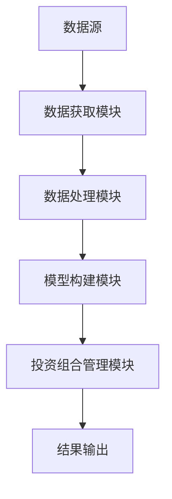
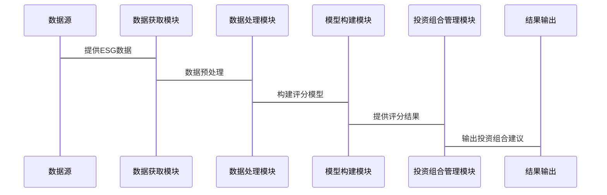

                 


# 特价股票投资中的环境、社会和治理(ESG)因素考虑

## 关键词：
- 特价股票投资
- ESG因素
- 环境、社会、治理
- 投资策略
- 量化评估

## 摘要：
本文深入探讨了在特价股票投资中考虑环境、社会和治理（ESG）因素的重要性。通过分析ESG的核心概念、量化评估方法、算法模型以及系统架构设计，本文为投资者提供了基于ESG因素的量化投资策略。文章结合实际案例，详细讲解了如何通过数据驱动的方法优化投资决策，帮助投资者在复杂多变的市场环境中实现长期稳健的收益。

---

# 第1章: ESG投资的背景与重要性

## 1.1 ESG投资的定义与内涵

### 1.1.1 环境（Environmental）的定义与内涵
环境因素关注企业在运营过程中对环境的影响，包括碳排放、能源使用效率、资源消耗、污染排放等。企业在生产和供应链中的环境表现直接影响其长期可持续发展能力。

### 1.1.2 社会（Social）的定义与内涵
社会因素关注企业在社会中的责任履行情况，包括员工权益、劳动条件、社会责任、社区关系等。员工的福祉和企业的社会贡献是衡量企业社会责任的重要指标。

### 1.1.3 治理（Governance）的定义与内涵
治理因素关注企业的管理结构和治理效率，包括董事会结构、内部控制、透明度、风险管理等。良好的公司治理是企业长期稳定发展的基石。

### 1.1.4 ESG的整合与综合评估
ESG的整合不仅仅是对环境、社会和治理因素的简单相加，而是通过量化方法将这些因素转化为可操作的投资策略。综合评估需要考虑不同行业之间的差异性，以及企业在不同阶段的动态变化。

## 1.2 ESG投资的发展历程

### 1.2.1 国际ESG投资的发展历史
国际ESG投资起源于20世纪60年代的社会责任投资（SRI），随着全球气候变化和可持续发展议题的兴起，ESG投资逐渐成为主流。机构投资者开始将ESG因素纳入投资决策，推动了ESG评级体系的发展。

### 1.2.2 国内ESG投资的现状与趋势
国内ESG投资起步较晚，但随着政策支持和市场环境的变化，越来越多的投资者开始关注ESG因素。监管机构也在逐步完善ESG信息披露标准，推动ESG投资的规范化发展。

### 1.2.3 ESG投资与社会责任投资（SRI）的区别与联系
社会责任投资（SRI）更注重企业的社会影响，而ESG投资则更加全面，涵盖了环境、社会和治理三个维度。两者都强调企业的可持续发展，但ESG投资更注重量化评估和数据驱动的决策。

## 1.3 ESG投资的重要性

### 1.3.1 ESG因素对股票价值的影响
ESG表现良好的企业通常具有更强的抗风险能力和长期增长潜力。研究表明，ESG评分高的企业往往在股价波动中表现更稳定，且在长期收益上具有优势。

### 1.3.2 ESG投资与风险控制的关系
通过关注环境、社会和治理风险，投资者可以更好地识别和规避潜在的风险，从而降低投资组合的波动性。ESG因素能够帮助投资者在风险可控的前提下实现收益最大化。

### 1.3.3 ESG投资与长期收益的关联
长期来看，ESG投资不仅能够带来经济效益，还能促进社会的可持续发展。通过选择ESG表现优异的企业，投资者可以支持那些具有社会责任感和可持续发展能力的企业，从而实现共赢。

---

# 第2章: ESG核心概念与量化评估

## 2.1 ESG核心概念的系统分析

### 2.1.1 环境因素的关键指标
- **碳排放**：企业的碳足迹是衡量环境表现的重要指标，包括直接和间接的碳排放。
- **能源使用效率**：企业是否采用节能技术，能源消耗是否合理。
- **资源消耗**：企业对自然资源的依赖程度和可持续性。

### 2.1.2 社会因素的关键指标
- **员工权益**：员工的工资、福利、工作条件是否符合法律规定。
- **社会责任**：企业是否积极参与社会公益事业，支持社区发展。
- **员工满意度**：员工对工作环境和企业文化的满意度。

### 2.1.3 治理因素的关键指标
- **董事会结构**：董事会成员的多元化、独立性和专业性。
- **内部控制**：企业是否建立了有效的内部控制体系，防范财务造假。
- **透明度**：企业信息披露的及时性、准确性和完整性。

## 2.2 ESG量化评估的框架

### 2.2.1 ESG评分模型的构建
ESG评分模型通常基于量化指标，采用加权评分的方法。权重的设定需要根据行业特点和投资目标进行调整。

### 2.2.2 数据收集与处理方法
- **数据来源**：企业公开报告、第三方评级机构数据、政府监管数据。
- **数据清洗**：剔除无效数据，处理异常值，确保数据的准确性和一致性。
- **特征工程**：将非结构化数据转化为可量化的指标，例如将文本数据转化为情感分析得分。

### 2.2.3 评分标准的制定与优化
评分标准需要结合行业特点和企业的实际情况，动态调整权重和阈值。例如，对于高碳排放行业，环境因素的权重可以适当提高。

## 2.3 ESG量化评估的挑战与解决方案

### 2.3.1 数据获取的困难与解决方案
- **数据获取难度**：部分企业可能未公开完整的ESG数据。
- **解决方案**：通过大数据技术挖掘非结构化数据，利用机器学习模型进行预测。

### 2.3.2 不同行业间ESG指标的差异性
不同行业的ESG表现差异显著，例如科技行业更关注环境因素，而金融行业更关注治理因素。

### 2.3.3 如何平衡定量与定性评估
定量评估需要依赖数据和模型，而定性评估则需要结合行业专家的主观判断。可以通过混合模型（Hybrid Model）将两者有机结合。

---

# 第3章: ESG投资的量化模型与算法

## 3.1 ESG评分模型的构建

### 3.1.1 数据预处理与特征提取
- **数据清洗**：处理缺失值、异常值。
- **特征选择**：从大量特征中筛选出对ESG评分影响较大的特征。
- **特征工程**：将非结构化特征转化为可量化的指标。

### 3.1.2 基于机器学习的评分模型
- **模型选择**：常用的模型包括随机森林、支持向量机（SVM）、神经网络等。
- **训练过程**：使用历史数据对模型进行训练，调整超参数以优化性能。
- **验证与测试**：通过交叉验证评估模型的泛化能力，避免过拟合。

### 3.1.3 基于统计学的评分模型
- **回归分析**：通过线性回归模型预测ESG评分。
- **聚类分析**：将企业分为不同的类别，评估其在类别中的相对位置。

## 3.2 多因子模型在ESG投资中的应用

### 3.2.1 多因子模型的构建与优化
- **因子选择**：结合ESG指标和其他传统因子（如市值、收益波动率）。
- **因子权重**：根据历史表现和风险偏好调整因子权重。
- **模型优化**：通过历史回测优化模型参数，确保模型的稳定性和收益性。

### 3.2.2 ESG因子与其他因子的结合
- **因子交互作用**：不同因子之间的相互作用可能会影响投资组合的表现。
- **因子权重调整**：根据市场环境动态调整因子权重，以适应市场变化。

### 3.2.3 基于多因子模型的投资组合优化
- **组合构建**：根据因子评分筛选出优质股票，构建投资组合。
- **风险控制**：通过分散投资降低组合风险，平衡不同因子的权重。

## 3.3 基于ESG的主动投资策略

### 3.3.1 基于ESG评分的选股策略
- **评分筛选**：根据ESG评分筛选出表现优异的股票。
- **动态调整**：定期更新评分，根据市场变化调整投资组合。

### 3.3.2 基于ESG因子的多因子回归模型
- **回归分析**：通过回归模型评估ESG因子对股票收益的影响。
- **模型预测**：利用回归结果预测股票未来表现，指导投资决策。

### 3.3.3 基于ESG的动态投资组合调整
- **实时监控**：实时跟踪ESG评分变化，及时调整投资组合。
- **风险管理**：根据ESG评分变化评估投资组合风险，采取相应的风险管理措施。

---

# 第4章: ESG投资的系统分析与架构设计

## 4.1 ESG量化分析系统的功能需求

### 4.1.1 系统目标
- 提供实时ESG评分查询。
- 支持多因子模型构建与优化。
- 提供投资组合管理功能。

### 4.1.2 系统模块划分
- **数据获取模块**：负责获取企业ESG数据和市场数据。
- **数据处理模块**：对数据进行清洗、特征提取和预处理。
- **模型构建模块**：构建ESG评分模型和多因子模型。
- **投资组合管理模块**：根据模型结果构建投资组合，并实时监控表现。

## 4.2 ESG量化分析系统的架构设计

### 4.2.1 系统架构设计


### 4.2.2 系统交互流程


## 4.3 系统接口设计

### 4.3.1 数据接口
- **输入接口**：接收企业ESG数据和市场数据。
- **输出接口**：提供ESG评分和投资组合建议。

### 4.3.2 模型接口
- **输入接口**：接收预处理后的数据。
- **输出接口**：提供ESG评分和因子权重。

### 4.3.3 投资组合管理接口
- **输入接口**：接收模型输出结果。
- **输出接口**：提供投资组合建议和实时监控结果。

---

# 第5章: 项目实战

## 5.1 环境搭建

### 5.1.1 安装Python环境
- 安装Anaconda或PyPy。
- 安装必要的Python包：`pandas`, `numpy`, `scikit-learn`, `matplotlib`。

### 5.1.2 数据获取
- 从公开数据源获取企业ESG数据。
- 处理数据，提取关键特征。

## 5.2 核心实现

### 5.2.1 ESG评分模型实现
```python
import pandas as pd
from sklearn.ensemble import RandomForestRegressor
from sklearn.metrics import mean_squared_error

# 数据加载
df = pd.read_csv('esg_data.csv')

# 特征选择
features = df.drop('esg_score', axis=1)
target = df['esg_score']

# 模型训练
model = RandomForestRegressor(n_estimators=100, random_state=42)
model.fit(features, target)

# 模型预测
predictions = model.predict(features)
print(mean_squared_error(target, predictions))
```

### 5.2.2 多因子模型实现
```python
import pandas as pd
import numpy as np
from sklearn.linear_model import LinearRegression

# 数据加载
df = pd.read_csv('factor_data.csv')

# 因子选择
features = df[['market_cap', 'beta', 'esg_score']]
target = df['return']

# 模型训练
model = LinearRegression()
model.fit(features, target)

# 模型预测
predictions = model.predict(features)
print('Coefficients:', model.coef_)
print('Intercept:', model.intercept_)
```

### 5.2.3 投资组合管理实现
```python
import pandas as pd
import numpy as np

# 数据加载
df = pd.read_csv('portfolio_data.csv')

# 计算权重
weights = np.random.dirichlet([1,1,1])
print('Weights:', weights)

# 计算投资组合收益
returns = df['return'].values
portfolio_return = np.dot(weights, returns)
print('Portfolio Return:', portfolio_return)
```

---

# 第6章: 实际案例分析

## 6.1 案例背景

### 6.1.1 行业选择
选择新能源行业作为案例，因为该行业对环境因素高度敏感。

## 6.2 案例分析

### 6.2.1 数据分析
- 计算企业的ESG评分。
- 分析企业的环境、社会和治理表现。

### 6.2.2 投资决策
- 根据ESG评分筛选出优质企业。
- 构建投资组合并进行风险评估。

### 6.2.3 结果展示
- 展示投资组合的收益和风险表现。
- 对比传统投资策略和ESG投资策略的表现差异。

---

# 第7章: 结论与展望

## 7.1 研究总结

### 7.1.1 主要结论
- ESG投资能够有效降低风险，提高长期收益。
- 数据驱动的方法是实现ESG量化投资的关键。

### 7.1.2 实践意义
- 为投资者提供科学的投资决策依据。
- 促进企业更好地履行社会责任。

## 7.2 未来展望

### 7.2.1 技术发展
- AI技术在ESG投资中的应用将更加广泛。
- 大数据技术将推动ESG评估的精准化。

### 7.2.2 市场趋势
- ESG投资将逐步成为主流投资策略。
- 机构投资者将更加重视ESG因素。

## 7.3 注意事项

### 7.3.1 数据风险
- 数据来源的可靠性和准确性是ESG投资的关键。
- 数据获取的成本和难度可能限制中小投资者的参与。

### 7.3.2 模型局限性
- 量化模型可能无法完全捕捉ESG的复杂性。
- 模型的泛化能力需要进一步验证。

### 7.3.3 市场波动
- ESG投资并不能完全避免市场的短期波动。
- 需要结合市场环境动态调整投资策略。

## 7.4 拓展阅读

### 7.4.1 推荐书籍
- 《ESG投资实战》
- 《量化投资：数据驱动的投资策略》

### 7.4.2 推荐网站
- MSCI ESG Research
- 瑞士信贷ESG报告

---

# 作者：AI天才研究院/AI Genius Institute & 禅与计算机程序设计艺术 /Zen And The Art of Computer Programming

---

通过以上内容，您已经了解了特价股票投资中的环境、社会和治理（ESG）因素考虑的详细分析。希望这篇文章能为您提供有价值的信息和启发。

