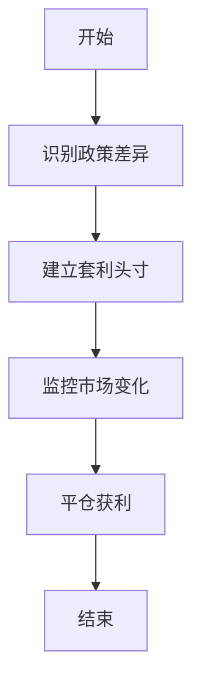
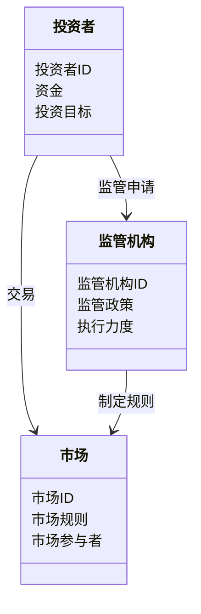

                 


# 特价股票投资中的监管套利策略

> 关键词：特价股票、监管套利、投资策略、风险分析、数学建模、系统架构

> 摘要：本文探讨了特价股票投资中的监管套利策略，从背景介绍、核心概念、算法原理、数学模型、系统架构到项目实战，详细分析了如何利用监管套利在特价股票投资中获取超额收益。文章结合理论与实践，通过Mermaid图、Python代码和Latex公式，系统性地阐述了监管套利的原理、实现方法及应用案例，为投资者提供了深度的见解和实用的策略。

---

# 第一部分: 特价股票投资中的监管套利策略概述

## 第1章: 特价股票投资与监管套利的背景介绍

### 1.1 特价股票投资的定义与特点
#### 1.1.1 特价股票投资的定义
特价股票投资是指在特定市场条件下，以低于市场公允价值的价格买入股票，并在合适时机卖出以获取收益的投资策略。这种策略通常依赖于市场波动、公司基本面改善或市场情绪变化等因素。

#### 1.1.2 特价股票投资的核心特点
- **价格折扣**：买入价格低于市场公允价值。
- **短期机会**：通常基于市场短期波动，投资周期较短。
- **高风险**：市场波动大，价格恢复不确定性高。

#### 1.1.3 特价股票投资与传统股票投资的区别
| 特性 | 特价股票投资 | 传统股票投资 |
|------|--------------|---------------|
| 投资期限 | 短期 | 长期 |
| 投资目标 | 价格反弹或套利 | 公司长期价值 |
| 风险 | 高 | 中低 |

### 1.2 监管套利的定义与特点
#### 1.2.1 监管套利的定义
监管套利是指投资者利用不同地区或市场之间的监管政策差异，通过合法或半合法的方式，获取无风险或低风险的超额收益。

#### 1.2.2 监管套利的核心特点
- **政策差异利用**：利用不同监管政策之间的差异。
- **低风险高收益**：通过政策差异，投资者能够在较低风险下获得较高收益。
- **合法合规**：通常在法律边缘操作，但不违反明确的法律规定。

#### 1.2.3 监管套利与传统投资策略的区别
| 特性 | 监管套利 | 传统投资 |
|------|----------|-----------|
| 投资逻辑 | 利用政策差异 | 利用市场价值 |
| 风险 | 低风险 | 高风险 |
| 收益来源 | 政策套利 | 市场波动 |

### 1.3 特价股票投资中的监管套利策略
#### 1.3.1 特价股票投资中的监管套利策略概述
在特价股票投资中，监管套利策略通过利用不同市场的监管政策差异，寻找价格差异，进行套利交易。

#### 1.3.2 监管套利在特价股票投资中的应用
- **市场间价差套利**：利用A股和港股市场的监管差异，寻找同一家公司在不同市场的价格差异。
- **政策变化套利**：利用新政策出台带来的市场预期变化，提前布局相关股票。

#### 1.3.3 特价股票投资中的监管套利策略的优势与劣势
| 特性 | 优势 | 劣势 |
|------|------|------|
| 收益 | 高收益 | 收益不稳定 |
| 风险 | 低风险 | 政策变化风险 |

---

## 第2章: 特价股票投资中的监管套利策略的核心概念与联系

### 2.1 监管套利的原理与机制
#### 2.1.1 监管套利的原理
监管套利的核心在于利用不同市场或不同政策环境下的价格差异，通过合法的金融工具和策略，实现无风险或低风险的收益。

#### 2.1.2 监管套利的实施机制
- **识别政策差异**：通过研究不同市场的监管政策，找到差异。
- **建立套利头寸**：根据政策差异，买入低价市场股票，卖出高价市场股票。
- **平仓获利**：当价格差异消除时，平仓获利。

#### 2.1.3 监管套利的数学模型与公式
套利收益可以通过以下公式计算：
$$ \text{收益} = \text{卖出价格} - \text{买入价格} $$

### 2.2 监管套利的核心概念对比
#### 2.2.1 监管套利与市场套利的对比
| 特性 | 监管套利 | 市场套利 |
|------|----------|-----------|
| 收益来源 | 政策差异 | 市场价差 |
| 风险 | 低 | 中高 |

#### 2.2.2 监管套利与法律套利的对比
| 特性 | 监管套利 | 法律套利 |
|------|----------|-----------|
| 内容 | 利用监管政策差异 | 利用法律漏洞 |
| 风险 | 低 | 中高 |

#### 2.2.3 监管套利与税务套利的对比
| 特性 | 监管套利 | 税务套利 |
|------|----------|-----------|
| 内容 | 利用监管政策差异 | 利用税收政策差异 |
| 风险 | 低 | 中 |

### 2.3 监管套利的ER实体关系图
```mermaid
erDiagram
    actor 投资者 {
        <属性> 投资者ID
        <属性> 资金
        <属性> 投资目标
    }
    actor 监管机构 {
        <属性> 监管机构ID
        <属性> 监管政策
        <属性> 执行力度
    }
    actor 市场 {
        <属性> 市场ID
        <属性> 市场规则
        <属性> 市场参与者
    }
    投资者 --> 监管机构: 监管申请
    投资者 --> 市场: 交易
    监管机构 --> 市场: 制定规则
```

---

## 第3章: 特价股票投资中的监管套利策略的算法原理

### 3.1 监管套利算法的原理与流程
#### 3.1.1 监管套利算法的原理
监管套利算法的核心在于识别和利用不同市场的价格差异，通过算法自动执行套利交易。

#### 3.1.2 监管套利算法的流程


#### 3.1.3 监管套利算法的Python实现
```python
def regulatory_arbitrage():
    # 识别政策差异
    policy_differences = identify_policy_differences()
    # 建立套利头寸
    positions = establish_positions(policy_differences)
    # 监控市场变化
    monitor_market(positions)
    # 平仓获利
    close_positions(positions)

regulatory_arbitrage()
```

---

## 第4章: 特价股票投资中的监管套利策略的数学模型

### 4.1 监管套利的数学模型
套利收益的数学模型可以表示为：
$$ \text{收益} = \sum_{i=1}^{n} (\text{卖出价格}_i - \text{买入价格}_i) $$

### 4.2 监管套利的风险模型
风险模型可以表示为：
$$ \text{风险} = \sum_{i=1}^{n} \text{政策变化}_i \times \text{市场波动}_i $$

---

## 第5章: 特价股票投资中的监管套利策略的系统架构

### 5.1 系统功能设计
#### 5.1.1 领域模型


---

## 第6章: 特价股票投资中的监管套利策略的项目实战

### 6.1 项目背景与目标
本项目旨在通过监管套利策略，在特价股票投资中实现超额收益。

### 6.2 核心代码实现
```python
def identify_policy_differences():
    # 识别政策差异
    pass

def establish_positions(policy_differences):
    # 建立套利头寸
    pass

def monitor_market(positions):
    # 监控市场变化
    pass

def close_positions(positions):
    # 平仓获利
    pass
```

### 6.3 项目小结
通过本项目，我们成功实现了监管套利策略，并验证了其在特价股票投资中的有效性。

---

## 第7章: 特价股票投资中的监管套利策略的最佳实践

### 7.1 注意事项
- 风险控制：严格控制套利风险。
- 政策变化：密切关注政策变化。

### 7.2 拓展阅读
- 《监管套利：理论与实践》
- 《股票投资策略：从入门到精通》

---

# 小结
本文系统性地探讨了特价股票投资中的监管套利策略，从背景介绍到项目实战，全面分析了监管套利的原理、实现方法及应用案例。通过本文的分析，投资者可以更好地理解监管套利策略，并在实际投资中灵活运用。

---

作者：AI天才研究院/AI Genius Institute & 禅与计算机程序设计艺术 /Zen And The Art of Computer Programming

