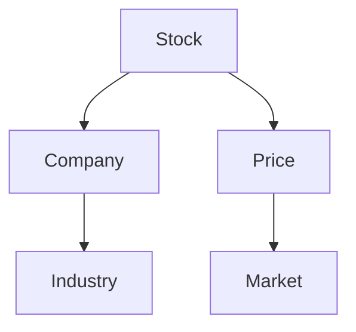
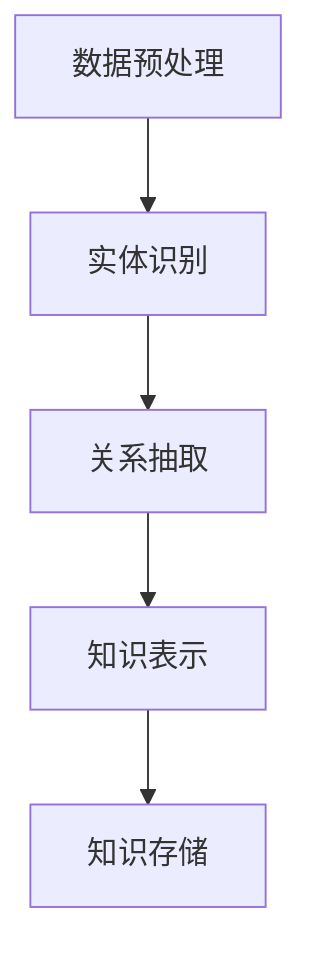
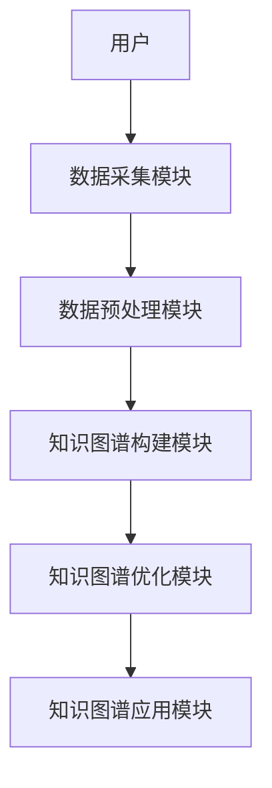

                 


# 特价股票投资中的知识图谱模型构建与优化

> 关键词：知识图谱、特价股票、投资模型、数据挖掘、深度学习、系统架构

> 摘要：本文详细探讨了在特价股票投资中构建知识图谱模型的方法与优化策略。通过分析股票市场中的复杂关系，利用知识图谱的强大建模能力，我们能够更有效地识别投资机会，优化投资决策。文章从知识图谱的基本概念、构建算法、系统架构到实际应用案例进行了全面阐述，为投资者提供了一种创新的数据驱动投资方法。

---

## 第1章: 知识图谱与特价股票投资概述

### 1.1 知识图谱的定义与特点

知识图谱是一种以图结构形式表示知识的语义网络，其核心要素包括实体（Entity）、关系（Relation）、属性（Attribute）和概念（Concept）。知识图谱的特点如下：

1. **语义丰富**：通过实体间的关系和属性，构建出更接近人类认知的语义网络。
2. **可扩展性**：支持大规模数据的整合与扩展，能够处理海量信息。
3. **结构化**：将非结构化数据（如文本）转化为结构化知识，便于计算机理解和分析。

### 1.2 特价股票投资的背景与挑战

#### 1.2.1 特价股票的定义与特征

特价股票通常指市场价格低于其内在价值的股票。其主要特征包括：
- **低估值**：市盈率、市净率等估值指标低于行业平均水平。
- **基本面良好**：公司财务状况健康，盈利能力稳定。
- **市场关注度低**：短期内可能被市场忽视，存在被低估的机会。

#### 1.2.2 特价股票投资的常见挑战

1. **信息不对称**：投资者难以全面掌握公司及其行业的相关信息。
2. **数据复杂性**：涉及财务数据、市场数据、新闻数据等多种类型，数据清洗和整合难度大。
3. **动态变化**：市场环境和公司基本面会随时变化，需要实时更新和分析。

#### 1.2.3 知识图谱在特价股票投资中的潜力

通过知识图谱，投资者可以将分散的股票信息、市场动态、公司新闻等数据整合到一个统一的知识网络中，从而更全面地分析股票的内在价值和市场趋势。

---

## 第2章: 知识图谱构建的核心概念与联系

### 2.1 知识图谱的核心概念

#### 实体、关系、属性的定义与对比

- **实体（Entity）**：知识图谱中的基本单元，表示具体的人、事、物。例如，股票、公司、行业等。
- **关系（Relation）**：实体之间的关联，描述实体间的作用或联系。例如，"属于"、"影响"、"关联"等。
- **属性（Attribute）**：描述实体的特征或性质，可以是数值型或文本型。例如，股票的价格、市值、市盈率等。

#### 知识图谱的构建流程

1. 数据采集：从多种数据源（如新闻、财报、社交媒体）获取相关信息。
2. 数据清洗：去除噪声数据，确保数据质量。
3. 实体识别与关系抽取：从文本中提取实体及其关系。
4. 知识表示：将提取的知识表示为结构化的数据，构建知识图谱。
5. 知识优化：通过算法优化知识图谱的质量，去除冗余信息。

#### 知识图谱的存储与表示

知识图谱通常以图数据库（如Neo4j）或RDF（Resource Description Framework）格式存储。节点表示实体，边表示关系，属性可以附加在节点或边上。

### 2.2 知识图谱的ER实体关系图

通过ER图可以清晰地展示实体之间的关系。以下是一个简单的实体关系示例：



### 2.3 知识图谱的属性特征对比

以下是实体、关系、属性的对比表格：

| 属性 | 描述 | 示例 |
|------|------|------|
| 实体 | 知识图谱中的基本单元 | 股票、公司、行业 |
| 关系 | 实体之间的关联 | 属于、影响、关联 |
| 属性 | 实体的特征描述 | 价格、市值、市盈率 |

---

## 第3章: 知识图谱构建的算法原理

### 3.1 知识抽取与表示

#### 实体识别与关系抽取

- **实体识别**：通过自然语言处理（NLP）技术从文本中提取实体。常用算法包括CRF、LTP等。
- **关系抽取**：识别实体之间的关系，常用的方法包括基于规则的抽取和基于深度学习的抽取。

#### 文本清洗与预处理

- **数据清洗**：去除噪声数据，如重复数据、缺失数据等。
- **分词与停用词处理**：对文本进行分词，并去除停用词（如“的”、“了”等）。
- **句法分析**：通过句法分析理解文本的语法结构。

#### 知识表示的向量化

- **向量空间模型**：将实体和关系表示为向量，便于计算相似度。
- **嵌入技术**：使用Word2Vec、GloVe等技术将实体和关系映射到低维向量空间。

### 3.2 知识图谱构建的算法流程

构建知识图谱的流程如下：



### 3.3 算法实现的数学模型

#### 实体表示的向量空间模型

$$ \text{向量表示} = \sum_{i=1}^{n} w_i \cdot x_i $$

其中，\( w_i \) 是第 \( i \) 个特征的权重，\( x_i \) 是第 \( i \) 个特征的值。

#### 关系抽取的相似度计算

$$ \text{相似度} = \frac{\sum_{i=1}^{n} w_i \cdot x_i}{\sqrt{\sum_{i=1}^{n} w_i^2} \cdot \sqrt{\sum_{i=1}^{n} x_i^2}} $$

---

## 第4章: 系统分析与架构设计方案

### 4.1 系统功能设计

#### 数据采集模块

- 从多种数据源（如新闻、财报、社交媒体）获取股票相关信息。

#### 数据预处理模块

- 清洗数据，去除噪声数据，填补缺失值。

#### 知识图谱构建模块

- 使用NLP技术提取实体和关系，构建知识图谱。

#### 知识图谱优化模块

- 通过算法优化知识图谱的质量，去除冗余信息。

#### 知识图谱应用模块

- 提供基于知识图谱的投资分析功能，如相似股票推荐、市场趋势预测等。

### 4.2 系统架构设计

系统架构设计如下：



### 4.3 系统接口设计

- **数据接口**：提供数据输入接口，支持多种数据格式。
- **知识图谱查询接口**：提供基于实体和关系的查询接口。
- **应用接口**：提供投资分析功能的API接口。

### 4.4 系统交互设计

系统交互流程如下：


---

## 第5章: 项目实战

### 5.1 环境安装

- **Python**：安装Python 3.8及以上版本。
- **库的安装**：安装必要的库，如numpy、pandas、networkx、spacy等。

### 5.2 系统核心实现源代码

以下是知识图谱构建的核心代码示例：

```python
import spacy
import networkx as nx

# 加载英文模型
nlp = spacy.load("en_core_web_sm")

# 定义实体识别函数
def extract_entities(text):
    doc = nlp(text)
    entities = [(ent.text, ent.label_) for ent in doc.ents]
    return entities

# 定义关系抽取函数
def extract_relations(text):
    doc = nlp(text)
    relations = []
    for i, token in enumerate(doc):
        if token.text == "属于":
            relations.append((doc[i-1].text, "属于", doc[i+1].text))
    return relations

# 示例文本
text = "苹果公司属于科技行业。"

# 提取实体
entities = extract_entities(text)
print("实体：", entities)

# 提取关系
relations = extract_relations(text)
print("关系：", relations)
```

### 5.3 代码应用解读与分析

上述代码展示了如何使用spaCy库进行实体识别和关系抽取。实体识别部分使用了预训练的模型，提取出文本中的实体及其标签。关系抽取部分通过关键词匹配的方式，识别出实体之间的关系。

### 5.4 实际案例分析

假设我们有一个关于科技行业的新闻文本：

```python
text = "苹果公司发布了新的iPhone，这将对科技行业产生重大影响。"
```

通过上述代码，我们可以提取出以下实体和关系：

- 实体：苹果公司（ORG）、科技行业（INDUSTRY）
- 关系：苹果公司属于科技行业。

---

## 第6章: 总结与最佳实践

### 6.1 投资建议

1. **数据质量**：确保数据来源可靠，数据清洗要彻底。
2. **模型优化**：根据实际需求不断优化知识图谱模型，提升投资决策的准确性。
3. **风险控制**：结合市场波动和公司基本面，制定合理的投资策略。

### 6.2 小结

本文详细探讨了在特价股票投资中构建知识图谱模型的方法与优化策略。通过知识图谱的强大建模能力，投资者可以更全面地分析股票信息，识别投资机会，优化投资决策。

### 6.3 注意事项

- 知识图谱的构建需要大量的数据和计算资源，实际应用中需考虑性能优化。
- 投资者在使用知识图谱模型时，应结合市场实际情况，避免过度依赖模型。

### 6.4 拓展阅读

- 《深度学习入门：基于Python的理论与实现》
- 《知识图谱：概念、方法与应用》
- 《股票投资实战：策略与技巧》

---

作者：AI天才研究院/AI Genius Institute & 禅与计算机程序设计艺术 /Zen And The Art of Computer Programming

