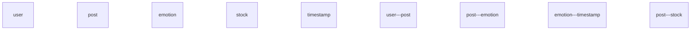

                 


---

# 特价股票投资中的社交媒体情绪动态分析与应用

## 第1章: 背景介绍与核心概念

### 1.1 问题背景

#### 1.1.1 特价股票投资的定义与特点

特价股票投资是指在股票市场中，以低于其内在价值的价格买入股票，并在价格回升时卖出以获取利润的投资策略。其特点是高波动性、高风险和高收益并存。特价股票通常具有较高的市场关注度，投资者情绪的变化对股价影响显著。

#### 1.1.2 社会媒体在金融投资中的应用

社交媒体已成为投资者获取信息、分享观点和影响市场情绪的重要渠道。通过社交媒体，投资者可以实时了解市场动态、公司新闻和分析师观点。此外，社交媒体上的讨论和评论往往会影响市场情绪，进而影响股票价格。

#### 1.1.3 情绪分析在股票投资中的重要性

情绪分析通过分析社交媒体上的文本数据，识别市场情绪的变化趋势。这种分析可以帮助投资者预测市场走势、识别投资机会和风险。例如，当社交媒体上的积极情绪达到一定强度时，投资者可能需要考虑买入股票，反之则卖出。

#### 1.1.4 特价股票投资的特点

特价股票投资具有以下特点：
- **低估的价格**：相对于其内在价值，股票价格被市场低估。
- **高波动性**：由于市场关注度高，股票价格波动较大。
- **高风险与高收益**：投资者可能面临较大的风险，但也有较高的潜在收益。

### 1.2 核心概念与问题描述

#### 1.2.1 情绪分析的定义与目标

情绪分析是通过自然语言处理技术，对文本中的情感倾向进行分类的过程。其目标是将文本内容转化为情感指标，如积极、消极或中性。

#### 1.2.2 情绪动态分析的定义与目标

情绪动态分析是对情绪状态随时间变化的模式进行分析，以识别情绪周期和趋势。其目标是通过分析情绪变化，预测市场情绪的波动趋势。

#### 1.2.3 问题的边界与外延

- **数据范围**：仅关注社交媒体上的公开文本数据。
- **分析目标**：情绪状态的变化对股票价格的影响。
- **时间范围**：主要分析短期情绪变化对股价的影响。

### 1.3 核心概念与联系

#### 1.3.1 情绪分析的核心要素

- **文本数据**：社交媒体上的帖子、评论等。
- **情感指标**：文本的情感倾向（积极、消极、中性）。
- **情感强度**：情感的强烈程度。
- **情感时间序列**：情感随时间的变化趋势。

#### 1.3.2 情感分析与股票价格的关系

市场情绪直接影响投资者的决策，从而影响股票价格。例如，社交媒体上的积极情绪增加，可能导致投资者买入股票，推高股价。

#### 1.3.3 实体关系图（ER图）



解释：
- `user`：社交媒体用户。
- `post`：社交媒体帖子。
- `emotion`：情感指标。
- `stock`：股票。
- `timestamp`：时间戳。

## 第2章: 情绪分析的核心原理与算法

### 2.1 情绪分析的原理

#### 2.1.1 情感分析的基本原理

情感分析通过自然语言处理技术，对文本进行分类，识别情感倾向。常用的方法包括基于词典、机器学习和深度学习的方法。

#### 2.1.2 基于文本的情感分析流程

1. **数据采集**：从社交媒体获取文本数据。
2. **预处理**：清洗、分词和去除停用词。
3. **特征提取**：提取情感相关特征。
4. **情感分类**：利用算法对文本进行分类。
5. **结果分析**：提取情感指标和时间序列。

#### 2.1.3 情感分析的特征提取

- **情感词汇**：如“好”、“坏”。
- **句式结构**：如感叹号、问号。
- **上下文信息**：语境中的关键词。

### 2.2 情绪分析的核心算法

#### 2.2.1 基于机器学习的情感分析算法

- **朴素贝叶斯**：简单高效，适合小规模数据。
- **支持向量机（SVM）**：准确率高，适合小规模数据。
- **随机森林**：适合特征较多的情况。

#### 2.2.2 基于深度学习的情感分析算法

- **循环神经网络（RNN）**：适合序列数据。
- **长短期记忆网络（LSTM）**：捕捉长距离依赖。
- **变压器（Transformer）**：适合大规模数据。

#### 2.2.3 情感分析算法的优缺点对比

| 算法名称         | 优点                           | 缺点                           |
|------------------|--------------------------------|--------------------------------|
| 朴素贝叶斯       | 简单高效，适合小规模数据       | 对特征工程依赖较高             |
| 支持向量机       | 高准确率，适合小规模数据       | 不适合大规模数据               |
| 随机森林         | 高准确率，适合特征较多的情况   | 计算复杂度较高                 |
| RNN             | 适合序列数据，捕捉时序信息     | 难以捕捉长距离依赖             |
| LSTM            | 适合长序列数据，捕捉长距离依赖 | 计算复杂，训练时间较长         |
| Transformer      | 高准确率，适合大规模数据       | 计算资源消耗较大               |

### 2.3 情感分析的数学模型

#### 2.3.1 朴素贝叶斯模型

$$ P(c|x) = \frac{P(x|c)P(c)}{P(x)} $$

- $$P(c|x)$$：给定特征 $$x$$ 的情况下，类别 $$c$$ 的概率。
- $$P(x|c)$$：类别 $$c$$ 下特征 $$x$$ 的概率。
- $$P(c)$$：类别 $$c$$ 的先验概率。
- $$P(x)$$：特征 $$x$$ 的总概率。

#### 2.3.2 LSTM模型

LSTM通过输入门、遗忘门和输出门捕捉长距离依赖：

- 输入门：决定当前时刻输入的信息是否保存。
- 遗忘门：决定当前时刻遗忘多少之前的信息。
- 输出门：决定当前时刻输出的信息。

LSTM细胞状态更新公式：

$$ c_t = \sigma(f_{\text{forget}} \cdot c_{t-1} + f_{\text{input}} \cdot x_t) $$

$$ h_t = o_{\text{gate}} \cdot \tanh(c_t) $$

- $$\sigma$$：sigmoid函数。
- $$f_{\text{forget}}$$ 和 $$f_{\text{input}}$$：遗忘门和输入门的权重。
- $$x_t$$：输入向量。
- $$c_t$$：当前细胞状态。
- $$h_t$$：当前隐藏状态。

#### 2.3.3 情感分析的数学公式与推导

以二分类问题为例，使用逻辑回归作为分类器：

$$ L = - \sum_{i=1}^{n} y_i \log(p_i) + (1 - y_i) \log(1 - p_i) $$

- $$y_i$$：标签。
- $$p_i$$：预测概率。

通过求解损失函数的梯度，更新模型参数，优化分类性能。

## 第3章: 特价股票投资中的情绪动态分析

### 3.1 特价股票投资的特点

#### 3.1.1 特价股票的定义与分类

特价股票分为以下几类：
- **低波动特价股票**：价格波动较小。
- **高波动特价股票**：价格波动较大。
- **成长型特价股票**：具有较高增长潜力。
- **价值型特价股票**：价格被市场低估。

#### 3.1.2 特价股票投资的风险与收益

- **风险**：市场波动大，投资风险高。
- **收益**：潜在收益高，适合高风险承受能力的投资者。

#### 3.1.3 特价股票市场的波动性

市场情绪的变化显著影响股票价格波动。投资者需密切关注市场情绪的变化，及时调整投资策略。

### 3.2 社会媒体情绪对股票价格的影响

#### 3.2.1 情绪传播机制

- **信息传播**：投资者通过社交媒体获取信息，影响其决策。
- **情绪传染**：投资者的情绪通过社交媒体传播，影响整体市场情绪。
- **市场反馈**：市场情绪反过来影响社交媒体上的信息传播。

#### 3.2.2 情绪强度与股价波动的关系

情绪强度与股价波动呈正相关。情绪强度越高，股价波动越大。

#### 3.2.3 情绪周期与投资策略

情绪周期包括平静期、上升期、峰值期和下降期。投资者需根据情绪周期调整投资策略：
- **平静期**：保持观望。
- **上升期**：适当增加持仓。
- **峰值期**：警惕风险，考虑减仓。
- **下降期**：寻找抄底机会。

### 3.3 情绪动态分析的算法实现

#### 3.3.1 基于时间序列的情绪分析

常用算法：
- **ARIMA模型**：适用于线性时间序列数据。
- **LSTM模型**：适用于非线性时间序列数据。

#### 3.3.2 基于情绪强度的情绪预测模型

通过历史数据，建立情绪强度与股票价格波动的回归模型，预测未来情绪变化趋势。

#### 3.3.3 情绪动态分析的数学公式

ARIMA模型一般形式：

$$ ARIMA(p, d, q) $$

- $$p$$：自回归阶数。
- $$d$$：差分阶数。
- $$q$$：移动平均阶数。

## 第4章: 情绪分析的系统架构与实现

### 4.1 系统架构设计

#### 4.1.1 系统功能模块划分

- **数据采集模块**：获取社交媒体文本数据。
- **预处理模块**：清洗和特征提取。
- **情绪分析模块**：生成情绪指标。
- **情绪动态分析模块**：识别情绪周期和趋势。
- **投资策略模块**：制定投资策略。

#### 4.1.2 模块关系与交互

数据流：
1. 数据采集模块获取文本数据。
2. 预处理模块进行清洗和特征提取。
3. 情绪分析模块生成情绪指标。
4. 情绪动态分析模块分析情绪趋势。
5. 投资策略模块制定投资策略。

### 4.2 数据采集与预处理

#### 4.2.1 数据来源与采集方法

- **社交媒体API**：如Twitter API、Reddit API。
- **新闻网站**：如Yahoo Finance、Google News。
- **交易数据**：股票价格、交易量等。

#### 4.2.2 数据清洗与特征提取

- **清洗**：去除停用词、处理特殊字符。
- **特征提取**：提取情感词汇、句式结构、上下文信息。

### 4.3 情绪分析模块实现

#### 4.3.1 算法选择与实现

- **选择算法**：根据数据规模和任务需求选择合适的算法。
- **实现步骤**：数据预处理、特征提取、模型训练、结果分析。

#### 4.3.2 情绪分析结果的可视化

- **情感强度分布图**：展示不同时间点的情绪强度。
- **情感时间序列图**：展示情绪随时间的变化趋势。
- **情感词云图**：展示高频出现的情感词汇。

### 4.4 系统接口设计与实现

#### 4.4.1 系统接口设计

- **数据接口**：数据的输入和输出。
- **算法接口**：情绪分析算法的调用。
- **可视化接口**：结果的展示。

#### 4.4.2 系统交互设计

- **用户界面设计**：用户友好的界面。
- **用户流程设计**：用户操作流程。

### 4.5 系统实现的注意事项

- **数据隐私与安全**：确保数据安全和隐私。
- **系统性能优化**：优化系统运行效率。
- **算法可解释性**：确保算法的可解释性。

## 第5章: 项目实战与经验分享

### 5.1 项目背景与目标

- **项目背景**：利用社交媒体情绪分析，帮助投资者进行特价股票投资。
- **项目目标**：实现一个基于社交媒体情绪分析的特价股票投资辅助系统。

### 5.2 项目实现

#### 5.2.1 环境安装与配置

安装所需的工具和库：

```bash
pip install pandas numpy scikit-learn nltk python-twitter
```

#### 5.2.2 核心代码实现

```python
import tweepy
from textblob import TextBlob

# 授权认证
auth = tweepy.OAuthHandler(consumer_key, consumer_secret)
api = tweepy.API(auth)

# 获取推文
tweets = api.search(q=keyword, count=100)

# 情感分析
for tweet in tweets:
    blob = TextBlob(tweet.text)
    print(tweet.text, blob.sentiment.polarity)
```

#### 5.2.3 代码解读与分析

- **授权认证**：使用Twitter API进行授权认证。
- **数据获取**：通过搜索关键词，获取推文数据。
- **情感分析**：使用TextBlob库对每条推文进行情感分析，输出情感倾向。

### 5.3 项目经验与总结

- **经验总结**：
  - 确保数据的准确性和完整性。
  - 根据数据规模和任务需求选择合适的算法。
  - 优化系统性能，确保在大规模数据下的运行效率。
- **注意事项**：
  - 数据隐私与安全。
  - 系统稳定性与可靠性。
  - 持续优化系统和算法。

## 第6章: 总结与展望

### 6.1 总结

本文详细探讨了如何利用社交媒体情绪分析技术，帮助投资者进行特价股票投资。通过分析社交媒体上的情绪数据，识别市场情绪的变化趋势，制定相应的投资策略，从而提高投资收益。

### 6.2 未来展望

未来的研究方向：
1. **多模态情绪分析**：结合图像、视频等多种媒体形式，进行更全面的情绪分析。
2. **实时情绪监控**：开发实时情绪监控系统，提供更及时的投资决策支持。
3. **智能投资顾问**：结合情绪分析和机器学习技术，开发智能投资顾问系统，为投资者提供个性化的投资建议。

### 6.3 注意事项与最佳实践

- **风险管理**：合理配置资产，分散投资风险。
- **信息来源**：确保信息来源的可靠性和准确性。
- **持续学习**：关注市场动态和新技术，不断优化投资策略。

## 第7章: 最佳实践 Tips、小结、注意事项、拓展阅读

### 7.1 最佳实践 Tips

1. **数据预处理**：在进行情绪分析之前，确保数据的清洗和特征提取。
2. **算法选择**：根据数据规模和任务需求，选择合适的算法。
3. **结果可视化**：将分析结果进行可视化展示，便于理解和分析。

### 7.2 小结

通过本文的分析，我们了解了如何利用社交媒体情绪分析技术，帮助投资者进行特价股票投资。通过识别市场情绪的变化趋势，制定相应的投资策略，从而提高投资收益。

### 7.3 注意事项

- **数据隐私**：确保数据的安全性和隐私性。
- **系统稳定性**：确保系统的稳定性和可靠性。
- **持续优化**：定期优化系统和算法，确保系统的性能和准确性。

### 7.4 拓展阅读

1. **《Python机器学习实战》**：了解机器学习的基本原理和应用。
2. **《自然语言处理实战》**：学习自然语言处理技术的应用。
3. **《股票投资策略》**：了解股票投资的基本策略和技巧。

---

# 结语

通过本文的详细分析，我们了解了如何利用社交媒体情绪分析技术，帮助投资者进行特价股票投资。希望本文的内容能够为投资者提供有价值的参考和启发。如果需要进一步探讨或交流，请随时联系。

作者：AI天才研究院/AI Genius Institute & 禅与计算机程序设计艺术 /Zen And The Art of Computer Programming

