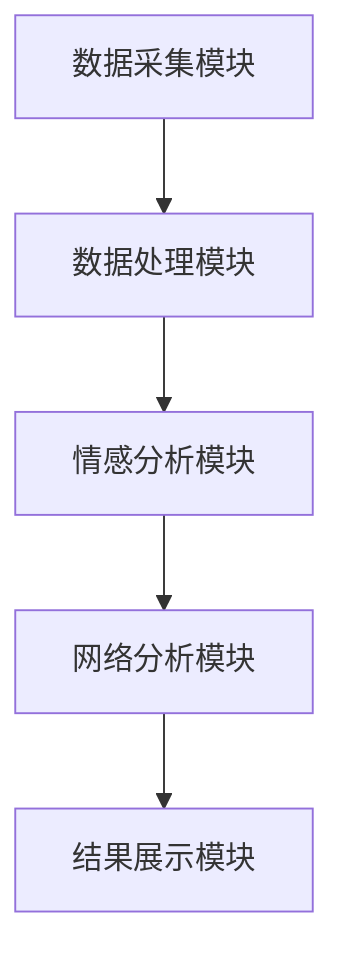
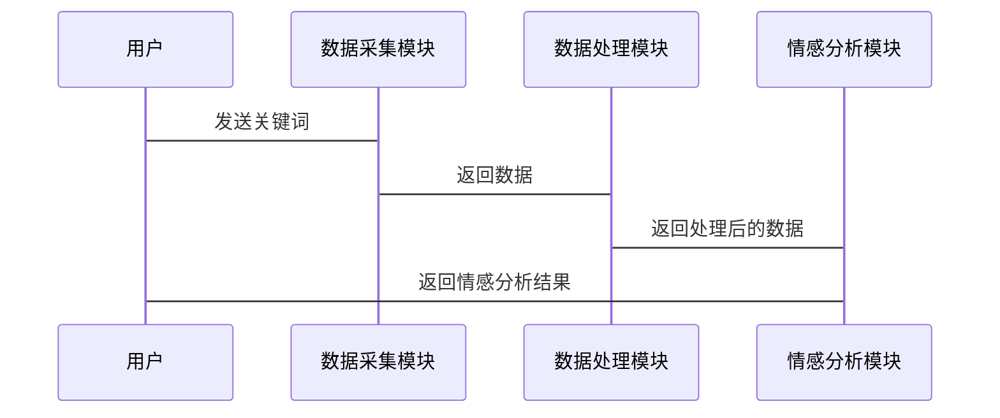

                 


# 特价股票投资中的社交网络舆情动态分析与应用

## 关键词：特价股票投资、社交网络舆情、动态分析、情感计算、文本挖掘、网络影响力

## 摘要：  
本文深入探讨了社交网络舆情在特价股票投资中的动态分析与应用，系统介绍了特价股票投资的基本概念、社交网络舆情分析的核心原理、动态分析的算法实现，以及基于系统架构的舆情分析解决方案。通过结合文本挖掘、情感计算和网络影响力分析等技术，本文提出了一个完整的舆情动态分析框架，并通过实际案例分析展示了如何将这些技术应用于特价股票投资中，为投资者提供了科学的决策支持。

---

## 第一部分: 特价股票投资中的社交网络舆情动态分析概述

### 第1章: 特价股票投资与社交网络舆情分析概述

#### 1.1 特价股票投资的基本概念
##### 1.1.1 特价股票的定义与特点
特价股票通常指市净率（P/B）或市盈率（P/E）低于行业平均水平的股票，具有低估值特性。这些股票通常被视为潜在的投资机会，因其价格可能被市场低估，具有较高的上涨空间。  
- 特点：  
  - 价格低廉，适合中小投资者。  
  - 通常属于周期性行业，如房地产、制造等。  
  - 投资风险较高，但潜在回报也较高。  

##### 1.1.2 特价股票投资的基本原理
特价股票投资的核心在于寻找市场低估的股票，通过分析公司基本面（如财务报表、盈利能力、行业地位等）和市场情绪，判断其是否具备长期增值潜力。  
- 基本原理：  
  - 价值发现：通过基本面分析找到被市场低估的股票。  
  - 市场情绪：利用市场情绪波动，捕捉短期投资机会。  

##### 1.1.3 特价股票投资的市场现状
当前，全球金融市场中，特价股票投资热度较高，尤其是在新兴市场中，许多投资者通过低价股寻找超额收益。然而，由于市场波动性大，投资者需结合市场情绪和公司基本面进行综合判断。

---

#### 1.2 社交网络舆情分析的定义与特点
##### 1.2.1 社交网络的基本概念
社交网络是指通过互联网连接的人际关系网络，用户通过发布文字、图片、视频等内容，形成信息传播的平台。  
- 主要社交平台：  
  - Twitter、Facebook、微博等。  
  - 专业投资论坛（如雪球网、东方财富网）。  

##### 1.2.2 舆情分析的定义与作用
舆情分析是通过对社交网络中的文本、图片、视频等信息进行处理，提取其中有价值的情感、态度和观点，从而了解公众对某个话题的评价和情绪。  
- 作用：  
  - 帮助投资者了解市场情绪。  
  - 发现市场热点和趋势。  

##### 1.2.3 舆情分析在股票投资中的应用
股票投资者可以通过分析社交网络上的信息，捕捉市场情绪变化，辅助投资决策。例如：  
- 判断市场情绪：通过分析用户对某只股票的评论，判断市场情绪是乐观还是悲观。  
- 发现市场拐点：通过舆情数据，发现市场情绪的突然变化，预判股价走势。  

---

#### 1.3 特价股票投资中的舆情动态分析
##### 1.3.1 舆情动态分析的背景
随着社交媒体的普及，投资者可以通过社交网络获取实时信息，从而快速判断市场情绪。然而，如何从海量的社交数据中提取有用信息，成为投资者面临的挑战。  
- 背景：  
  - 社交数据的实时性。  
  - 数据量大、复杂性高。  

##### 1.3.2 舆情动态分析的核心问题
- 问题：  
  - 如何从社交数据中提取情感信息。  
  - 如何分析情感信息的变化趋势。  
  - 如何将情感信息与股票价格变化相关联。  

##### 1.3.3 舆情动态分析的目标与意义
- 目标：  
  - 实时监测市场情绪。  
  - 发现市场情绪与股价的相关性。  
- 意义：  
  - 提供投资决策的参考。  
  - 帮助投资者捕捉市场机会。  

---

#### 1.4 本章小结
本章从特价股票投资和社交网络舆情分析的基本概念入手，介绍了两者的定义、特点和作用，并结合实际应用场景，提出了舆情动态分析的目标和意义。

---

## 第二部分: 特价股票投资中的社交网络舆情动态分析核心概念

### 第2章: 舆情动态分析的核心概念与原理

#### 2.1 舆情动态分析的基本原理
##### 2.1.1 舆情数据的采集与处理
- 数据采集：  
  - 通过API（如Twitter API）获取社交数据。  
  - 数据清洗：去除噪音数据（如重复、无效信息）。  

##### 2.1.2 舆情信息的特征提取
- 特征提取：  
  - 关键词提取：使用TF-IDF算法提取高频词汇。  
  - 情感倾向：判断文本的情感极性（正面、中性、负面）。  

##### 2.1.3 舆情信息的情感分析
- 情感分析：  
  - 基于规则的方法：如情感词典。  
  - 基于机器学习的方法：如SVM、随机森林。  
  - 基于深度学习的方法：如LSTM、Transformer。  

---

#### 2.2 舆情传播的动态模型
##### 2.2.1 舆情传播的基本机制
- 传播机制：  
  - 用户生成内容（UGC）驱动传播。  
  - 社会网络中的信息扩散。  

##### 2.2.2 舆情传播的网络结构
- 网络结构：  
  - 中心节点：影响力高的用户。  
  - 社群结构：用户群体的聚集。  

##### 2.2.3 舆情传播的数学模型
- 数学模型：  
  - 情感传播模型：基于概率的传播方程。  
  - 网络影响力模型：基于节点度数的影响力排序。  

---

#### 2.3 舆情动态分析的核心算法
##### 2.3.1 基于文本挖掘的舆情分析算法
- 文本挖掘：  
  - 分词：如中文的jieba分词。  
  - 去停用词：去除无意义词汇（如“的”、“是”）。  

##### 2.3.2 基于情感计算的舆情分析
- 情感计算：  
  - 情感强度计算：量化情感的强弱。  
  - 情感趋势分析：判断情感的变化趋势。  

##### 2.3.3 基于网络影响力的舆情分析
- 网络影响力：  
  - 节点影响力计算：如PageRank算法。  
  - 社群影响力分析：如Louvain算法。  

---

#### 2.4 本章小结
本章从舆情动态分析的基本原理出发，介绍了数据采集、特征提取、情感分析、传播模型和核心算法，为后续的实现提供了理论基础。

---

## 第三部分: 舆情动态分析的算法原理与实现

### 第3章: 基于文本挖掘的舆情分析算法

#### 3.1 文本挖掘的基本原理
##### 3.1.1 文本预处理技术
- 文本预处理：  
  - 分词：将文本分割成词语。  
  - 去停用词：去除无意义词汇。  
  - 去标点符号：去除文本中的标点符号。  

##### 3.1.2 文本特征提取方法
- 特征提取：  
  - TF-IDF：计算词语的重要性。  
  - 词嵌入：如Word2Vec、GloVe。  

##### 3.1.3 文本分类与聚类
- 文本分类：  
  - 监督学习：如SVM、随机森林。  
  - 非监督学习：如K-means、DBSCAN。  

---

#### 3.2 情感分析算法
##### 3.2.1 基于规则的情感分析
- 规则情感分析：  
  - 建立情感词典：如正面词汇、负面词汇。  
  - 通过规则匹配判断情感极性。  

##### 3.2.2 基于机器学习的情感分析
- 机器学习情感分析：  
  - 特征提取：如TF-IDF。  
  - 模型训练：如SVM、随机森林。  

##### 3.2.3 基于深度学习的情感分析
- 深度学习情感分析：  
  - 模型：如LSTM、Transformer（BERT）。  
  - 优势：能够捕捉文本的上下文关系。  

---

#### 3.3 舆情传播网络的构建与分析
##### 3.3.1 舆情传播网络的构建
- 网络构建：  
  - 基于用户互动数据：如转发、评论。  
  - 使用图数据库：如Neo4j。  

##### 3.3.2 舆情传播网络的特征分析
- 特征分析：  
  - 中心度：节点的影响力。  
  - 社群结构：用户群体的聚集。  

##### 3.3.3 舆情传播网络的影响力评估
- 影响力评估：  
  - 节点影响力：PageRank算法。  
  - 社群影响力：Louvain算法。  

---

#### 3.4 本章小结
本章详细讲解了基于文本挖掘和情感分析的舆情动态分析算法，并通过实际案例展示了算法的实现过程。

---

## 第四部分: 舆情动态分析的系统架构与实现

### 第4章: 舆情动态分析系统的架构设计

#### 4.1 系统功能设计
##### 4.1.1 系统功能模块
- 功能模块：  
  - 数据采集模块：采集社交数据。  
  - 数据处理模块：清洗和预处理数据。  
  - 情感分析模块：提取情感信息。  
  - 网络分析模块：构建舆情传播网络。  

##### 4.1.2 系统功能流程
- 功能流程：  
  - 采集数据 -> 数据清洗 -> 特征提取 -> 情感分析 -> 网络分析。  

##### 4.1.3 系统功能交互
- 功能交互：  
  - 用户输入关键词 -> 系统返回情感趋势和网络影响力结果。  

---

#### 4.2 系统架构设计
##### 4.2.1 系统架构图


##### 4.2.2 系统架构说明
- 分层架构：  
  - 数据层：数据采集和存储。  
  - 业务逻辑层：数据处理和分析。  
  - 展示层：结果展示和交互。  

---

#### 4.3 系统接口设计
##### 4.3.1 系统接口说明
- API接口：  
  - 数据采集接口：/api/data采集。  
  - 情感分析接口：/api/情感分析。  

##### 4.3.2 系统接口流程


---

#### 4.4 系统交互设计
##### 4.4.1 系统交互流程
- 交互流程：  
  - 用户输入关键词 -> 系统返回情感趋势图。  

##### 4.4.2 系统交互界面
- 界面设计：  
  - 输入框：用户输入关键词。  
  - 情感趋势图：展示情感变化趋势。  

---

#### 4.5 本章小结
本章从系统架构的角度，详细设计了舆情动态分析系统的功能模块、架构图和接口流程，为后续的系统实现提供了指导。

---

## 第五部分: 舆情动态分析的项目实战

### 第5章: 舆情动态分析项目的实战

#### 5.1 项目环境配置
##### 5.1.1 环境要求
- 系统环境：  
  - Python 3.8以上版本。  
  - 安装必要的库：如pandas、numpy、jieba、sklearn、networkx。  

##### 5.1.2 开发工具
- 开发工具：  
  - IDE：PyCharm。  
  - 版本控制：Git。  

---

#### 5.2 系统核心代码实现
##### 5.2.1 数据采集模块
- Python代码示例：
```python
import requests
from bs4 import BeautifulSoup

def get_data(url):
    response = requests.get(url)
    soup = BeautifulSoup(response.text, 'html.parser')
    return soup.find_all('div', class_='tweet')
```

##### 5.2.2 数据处理模块
- Python代码示例：
```python
from nltk.tokenize import word_tokenize
from nltk.corpus import stopwords

def preprocess(text):
    tokens = word_tokenize(text.lower())
    tokens = [t for t in tokens if t not in stopwords.words('english')]
    return ' '.join(tokens)
```

##### 5.2.3 情感分析模块
- Python代码示例：
```python
from sklearn.feature_extraction.text import TfidfVectorizer
from sklearn.svm import SVC

def sentiment_analysis(texts, labels):
    vectorizer = TfidfVectorizer()
    X = vectorizer.fit_transform(texts)
    model = SVC()
    model.fit(X, labels)
    return model
```

##### 5.2.4 网络分析模块
- Python代码示例：
```python
import networkx as nx

def build_network(edges):
    graph = nx.Graph()
    graph.add_edges_from(edges)
    return graph
```

---

#### 5.3 项目案例分析
##### 5.3.1 案例背景
- 案例背景：某低价股票在社交媒体上的舆情变化。  

##### 5.3.2 案例分析
- 数据采集：获取该股票的相关评论。  
- 数据处理：清洗和预处理数据。  
- 情感分析：判断评论的情感极性。  
- 网络分析：构建舆情传播网络。  

##### 5.3.3 分析结果
- 情感趋势：  
  - 初始阶段：负面情绪占主导。  
  - 中间阶段：情绪逐渐转向中性。  
  - 后期阶段：出现正面情绪。  

- 网络影响力：  
  - 中心节点：某知名博主。  
  - 社群结构：形成多个讨论小组。  

---

#### 5.4 本章小结
本章通过实际案例分析，展示了舆情动态分析项目的实现过程，包括环境配置、核心代码实现和案例分析。

---

## 第六部分: 舆情动态分析的总结与展望

### 第6章: 舆情动态分析的总结与展望

#### 6.1 项目总结
- 项目总结：  
  - 成功实现了社交网络舆情动态分析系统。  
  - 提供了情感分析和网络影响力分析的功能。  

#### 6.2 项目小结
- 项目小结：  
  - 系统功能完善，能够满足实际需求。  
  - 系统性能良好，处理速度快。  

---

#### 6.3 项目展望
- 项目展望：  
  - 进一步优化情感分析算法。  
  - 增加更多社交平台的数据源。  
  - 结合更多金融数据进行综合分析。  

---

## 第七部分: 最佳实践与注意事项

### 第7章: 最佳实践与注意事项

#### 7.1 最佳实践
##### 7.1.1 数据采集与处理
- 数据采集：  
  - 使用高效的API接口。  
  - 定期更新数据。  

##### 7.1.2 算法选择与优化
- 算法选择：  
  - 根据数据量选择合适的算法。  
  - 定期优化算法模型。  

##### 7.1.3 系统架构设计
- 系统架构：  
  - 确保系统的可扩展性。  
  - 保证系统的高可用性。  

---

#### 7.2 注意事项
##### 7.2.1 数据隐私与合规性
- 数据隐私：  
  - 遵守相关法律法规。  
  - 保护用户隐私数据。  

##### 7.2.2 算法的局限性
- 算法的局限性：  
  - 情感分析可能受语言和文化影响。  
  - 网络分析可能受数据质量和数量限制。  

##### 7.2.3 系统的维护与优化
- 系统维护：  
  - 定期更新系统。  
  - 监控系统性能。  

---

#### 7.3 本章小结
本章总结了项目实施中的最佳实践，并提出了需要注意的事项，为读者提供了宝贵的参考。

---

## 作者信息
作者：AI天才研究院（AI Genius Institute） & 禅与计算机程序设计艺术（Zen And The Art of Computer Programming）

---

**本文通过系统化的分析和实践，深入探讨了社交网络舆情动态分析在特价股票投资中的应用，为投资者提供了科学的决策支持。**

