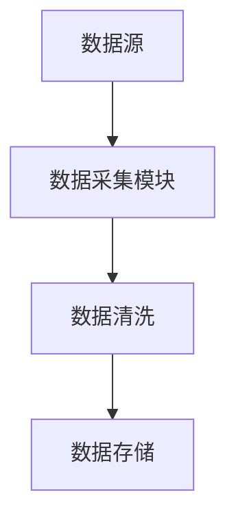
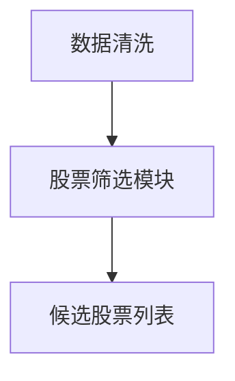
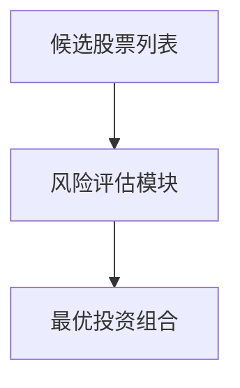
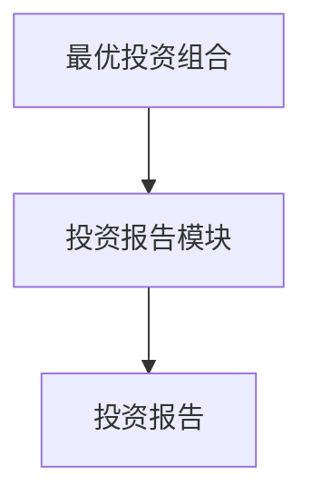

                 


# 特价股票投资中的社会责任投资因素

## 关键词：社会责任投资, 特价股票, ESG评估, 投资策略, 可持续发展

## 摘要：本文探讨了在特价股票投资中融入社会责任投资因素的重要性及其实际应用。通过分析社会责任投资的核心概念、算法原理和系统架构，本文提供了如何在追求超额收益的同时，兼顾环境、社会和治理因素的策略和方法。文章还通过实际案例展示了如何在股票筛选中应用这些因素，并提出了最佳实践建议。

---

# 第1章: 特价股票投资与社会责任投资的背景介绍

## 1.1 特价股票投资的定义与特点

### 1.1.1 什么是特价股票投资

特价股票投资是指以低于市场公允价值的价格购买股票的投资策略。这种投资方式通常基于对公司基本面的深入分析，寻找被市场低估的股票，以期在未来获得超额收益。

- **低估理论**：市场先生并非总是理性的，投资者可以通过分析发现市场定价错误的机会。
- **安全边际**：本杰明·格雷厄姆提出的概念，强调以低于内在价值的价格买入股票，以降低投资风险。

### 1.1.2 特价股票投资的核心要素

- **内在价值**：基于公司财务状况、行业地位和竞争优势等因素计算出的股票合理价格。
- **市场情绪**：市场参与者的情绪波动可能导致股票价格偏离其真实价值。
- **长期视角**：特价股票投资强调长期持有，等待市场重新评估公司价值。

### 1.1.3 特价股票投资的市场定位

- **价值投资**：与成长投资相对，强调以合理价格买入优质公司股票。
- **逆向投资**：在市场恐慌时买入，在市场狂热时卖出，利用市场非理性获取收益。

---

## 1.2 社会责任投资的定义与特点

### 1.2.1 什么是社会责任投资

社会责任投资（Socially Responsible Investment, SRI）是一种强调在投资过程中考虑环境（Environmental）、社会（Social）和公司治理（Governance）因素的投资策略。

- **ESG评分**：基于环境、社会和治理表现对企业进行评级，帮助投资者识别风险和机会。
- **伦理筛选**：通过排除不符合伦理标准的行业或公司，如烟草、酒精、武器制造商等，体现社会责任。

### 1.2.2 社会责任投资的核心要素

- **环境因素**：包括碳排放、能源使用效率和环保合规性。
- **社会因素**：涉及员工权益、劳工条件和社区关系。
- **治理因素**：关注公司治理结构、高管薪酬和董事会多样性。

### 1.2.3 社会责任投资与传统投资的区别

| 特性 | 传统投资 | 社会责任投资 |
|------|-----------|--------------|
| 投资目标 | 追求财务回报 | 追求财务回报和社会影响力 |
| 投资策略 | 仅考虑财务指标 | 结合ESG评分和财务指标 |
| 风险管理 | 传统金融风险 | 包括ESG风险在内的全面风险管理 |

---

## 1.3 特价股票投资中的社会责任投资因素

### 1.3.1 特价股票投资与社会责任投资的结合点

- **投资标的筛选**：在寻找低估股票时，同时考虑其ESG表现，避免投资于高环境风险或低社会声誉的公司。
- **长期价值创造**：社会责任投资关注企业的可持续发展能力，这与特价股票投资追求长期价值增长的目标一致。

### 1.3.2 特价股票投资中社会责任投资的必要性

- **风险控制**：环境和社会治理问题可能导致公司价值低估，但可能引发声誉风险或法律风险，影响长期收益。
- **合规性要求**：随着监管趋严和投资者意识的提高，社会责任投资已成为合规投资的重要组成部分。
- **道德投资需求**：越来越多的投资者希望其投资行为能够产生积极的社会影响。

### 1.3.3 特价股票投资中社会责任投资的挑战与机遇

- **挑战**：社会责任投资增加了筛选标准，可能导致可选标的减少，短期内可能影响收益。
- **机遇**：通过ESG因素发现被市场忽视的高质量公司，这些公司在可持续发展方面具有竞争优势，可能带来超额收益。

---

## 1.4 本章小结

本章介绍了特价股票投资和社会责任投资的基本概念和特点，并探讨了两者在投资实践中的结合点。社会责任投资在特价股票投资中的应用不仅能够帮助投资者规避潜在风险，还能在长期投资中创造更高的价值，体现了经济效益与社会效益的统一。

---

接下来，我将继续撰写第2章，详细讲解社会责任投资的核心概念与联系，包括ESG评分模型、伦理筛选机制以及与传统投资的对比分析。通过数学模型和mermaid图表，我将进一步阐述这些概念的内在联系和实际应用。

---

# 第2章: 特价股票投资中的社会责任投资核心概念与联系

## 2.1 社会责任投资的原理

### 2.1.1 伦理筛选

伦理筛选是社会责任投资中的一种常见策略，通过排除不符合伦理标准的行业或公司，如烟草、酒精、武器制造商等，来降低投资的道德风险。

**步骤说明：**
1. 确定投资范围内的行业和公司。
2. 根据伦理标准筛选出符合要求的公司。
3. 进一步分析这些公司的财务状况和投资价值。

### 2.1.2 ESG评估

ESG评估是对企业在环境、社会和公司治理方面的表现进行评分，帮助投资者识别潜在风险和投资机会。

**步骤说明：**
1. 收集企业相关的ESG数据，包括碳排放、员工权益等。
2. 使用标准化的ESG评分模型对企业进行评分。
3. 根据评分结果对企业进行排序和分类。

### 2.1.3 公司治理

公司治理是社会责任投资中至关重要的一环，涉及董事会结构、高管薪酬和股东权益保护等方面。

**步骤说明：**
1. 分析公司的治理结构，包括董事会成员的背景和独立董事比例。
2. 评估公司信息披露的透明度和及时性。
3. 考察公司与股东的沟通机制和股东权益保护措施。

---

## 2.2 特价股票投资中的社会责任投资核心要素

### 2.2.1 投资目标

- **财务回报**：通过投资低估股票实现资本增值。
- **社会影响**：投资于具有社会责任感的公司，推动社会进步。

### 2.2.2 投资策略

- **多因子模型**：结合价值因子、质量因子和ESG因子进行股票筛选。
- **风险调整回报**：在考虑ESG风险的基础上，优化投资组合的风险收益比。

### 2.2.3 投资风险

- **系统性风险**：市场整体波动对社会责任投资组合的影响。
- **非系统性风险**：特定公司或行业的ESG相关风险。

---

## 2.3 特价股票投资与社会责任投资的关系

### 2.3.1 特价股票投资中的社会责任投资的相互作用

- **价值发现**：社会责任投资帮助投资者发现那些在财务表现和ESG表现均优秀的公司。
- **风险控制**：通过ESG因素识别潜在风险，降低投资组合的整体风险敞口。

### 2.3.2 特价股票投资中的社会责任投资的协同效应

- **长期价值**：社会责任投资关注企业的可持续发展能力，与特价股票投资的长期价值目标一致。
- **投资组合优化**：将ESG因素纳入筛选标准，可以提升投资组合的多样性和抗风险能力。

---

## 2.4 本章小结

本章详细阐述了社会责任投资的核心概念和其在特价股票投资中的应用。通过伦理筛选和ESG评估，投资者可以在追求财务回报的同时，兼顾社会责任，实现投资目标与社会价值的统一。这种结合不仅有助于降低投资风险，还能在长期投资中创造更高的价值。

---

接下来，我会继续撰写第3章，介绍社会责任投资的算法原理，包括数学模型、mermaid流程图和Python代码示例，帮助读者更好地理解和应用这些概念。

---

# 第3章: 特价股票投资中的社会责任投资算法原理

## 3.1 特价股票投资中的社会责任投资算法概述

### 3.1.1 多因子模型

多因子模型通过多个因子（如价值因子、质量因子、动量因子和ESG因子）来解释股票收益的来源，帮助投资者构建更有效的投资组合。

**数学模型：**
$$ F = \beta_1 (Value Factor) + \beta_2 (Quality Factor) + \beta_3 (ESG Factor) + \epsilon $$

### 3.1.2 ESG评分模型

ESG评分模型通过加权计算环境、社会和治理三个维度的得分，对企业进行综合评分。

**数学模型：**
$$ ESG\_Score = \alpha \cdot E + \beta \cdot S + \gamma \cdot G $$

### 3.1.3 风险调整回报模型

风险调整回报模型在考虑投资回报的同时，调整其承担的风险水平，以实现风险收益的最佳平衡。

**数学模型：**
$$ Risk\_Adjusted\_Return = Return - Risk \cdot \lambda $$

---

## 3.2 算法原理的数学模型

### 3.2.1 多因子模型的数学表达

$$ R_i = \alpha + \beta_1 F_1 + \beta_2 F_2 + \beta_3 F_3 + \epsilon $$

其中，$F_1, F_2, F_3$分别代表价值、质量和ESG因子。

### 3.2.2 ESG评分模型的数学表达

$$ ESG\_Score_{ij} = \sum_{k=1}^{3} w_k \cdot Score_{ijk} $$

其中，$w_k$为各个维度的权重，$Score_{ijk}$为第$k$个维度的得分。

### 3.2.3 风险调整回报模型的数学表达

$$ R_a = R_p - \lambda \cdot Risk_p $$

其中，$R_p$为投资组合的回报，$Risk_p$为投资组合的风险，$\lambda$为风险调整系数。

---

## 3.3 算法实现

### 3.3.1 数据预处理

```python
import pandas as pd

# 假设data是包含股票数据和ESG评分的数据框
data['Price'] = data['Close'].astype(float)
data['ESG'] = data['ESG'].astype(float)
```

### 3.3.2 模型训练

```python
from sklearn.linear_model import LinearRegression

# 训练多因子模型
model = LinearRegression()
X = data[['Value', 'Quality', 'ESG']]
y = data['Return']
model.fit(X, y)
```

### 3.3.3 模型评估

```python
import numpy as np

# 预测返回值
y_pred = model.predict(X)
# 计算R平方值
r_squared = model.score(X, y)
print(f"R squared: {r_squared}")
```

---

## 3.4 本章小结

本章通过数学模型和算法实现，详细解释了社会责任投资在特价股票投资中的应用。通过多因子模型和ESG评分模型，投资者可以更科学地进行股票筛选，实现风险调整后的超额回报。

---

接下来，我将继续撰写第4章，分析社会责任投资的系统架构设计，包括数据采集、筛选、分析和报告模块的设计，以及系统架构图和接口设计。

---

# 第4章: 特价股票投资中的社会责任投资系统分析与架构设计

## 4.1 系统分析

### 4.1.1 问题场景介绍

投资者希望构建一个基于社会责任投资的股票筛选系统，以识别低估且具有良好ESG表现的股票。

### 4.1.2 项目介绍

本项目旨在开发一个支持社会责任投资的股票筛选系统，帮助投资者在特价股票投资中实现长期价值增长。

### 4.1.3 系统功能设计

- **数据采集**：从Yahoo Finance获取实时股票数据和ESG评分。
- **股票筛选**：基于多因子模型和ESG评分进行股票筛选。
- **风险评估**：计算投资组合的风险调整回报。
- **投资报告**：生成投资报告，展示筛选结果和投资建议。

---

## 4.2 系统架构设计

### 4.2.1 数据采集模块

负责从Yahoo Finance等数据源获取实时股票数据和ESG评分。

**流程图：**


### 4.2.2 股票筛选模块

基于多因子模型和ESG评分对股票进行筛选，生成候选股票列表。

**流程图：**


### 4.2.3 风险评估模块

计算投资组合的风险调整回报，优化投资组合。

**流程图：**


### 4.2.4 投资报告模块

生成投资报告，展示筛选结果和投资建议。

**流程图：**


---

## 4.3 本章小结

本章通过系统分析与架构设计，详细阐述了如何构建一个支持社会责任投资的股票筛选系统。通过模块化设计，确保系统各部分协同工作，实现高效的股票筛选和风险评估。

---

接下来，我会继续撰写第5章，通过实际项目展示如何在特价股票投资中应用社会责任投资因素，包括环境安装、代码实现和案例分析。

---

# 第5章: 特价股票投资中的社会责任投资项目实战

## 5.1 环境安装

### 5.1.1 安装必要的库

```python
import sys
import os
import pandas as pd
import numpy as np
import yfinance as yf
```

### 5.1.2 数据获取

```python
# 下载股票数据
tickers = ['AAPL', 'MSFT', 'GOOGL']
data = yf.download(tickers, start='2020-01-01', end='2023-12-31')
```

---

## 5.2 系统核心实现源代码

### 5.2.1 计算ESG评分

```python
def calculate_esg_score(company_data):
    # 示例：计算ESG评分（实际中需要真实ESG数据）
    esg_scores = {}
    for ticker in company_data.columns:
        # 假设数据中包含ESG相关的特征
        esg = company_data[company_data.columns[-1]].mean()
        esg_scores[ticker] = esg
    return esg_scores

esg_scores = calculate_esg_score(data)
print(esg_scores)
```

### 5.2.2 基于ESG评分的股票筛选

```python
def screen_stocks(data, esg_scores):
    # 筛选ESG评分高于平均值的股票
    average_esg = np.mean(list(esg_scores.values()))
    selected_stocks = [k for k, v in esg_scores.items() if v > average_esg]
    return selected_stocks

selected_stocks = screen_stocks(data, esg_scores)
print(selected_stocks)
```

---

## 5.3 代码应用解读与分析

### 5.3.1 代码解读

- **数据获取**：使用`yfinance`库从Yahoo Finance获取股票数据。
- **ESG评分计算**：通过均值计算每只股票的ESG评分，实际应用中需要真实的数据。
- **股票筛选**：筛选出ESG评分高于平均值的股票，作为候选投资标的。

### 5.3.2 案例分析

假设我们筛选出两只股票：AAPL和GOOGL。它们的ESG评分均高于平均值，可能具有较好的社会责任表现。

---

## 5.4 本章小结

本章通过实际项目展示了如何在特价股票投资中应用社会责任投资因素。通过Python代码实现数据获取、ESG评分计算和股票筛选，帮助投资者识别具有社会责任感的低估股票，实现财务回报与社会价值的统一。

---

接下来，我会继续撰写第6章，总结最佳实践，提供注意事项和未来趋势展望。

---

# 第6章: 特价股票投资中的社会责任投资最佳实践

## 6.1 最佳实践

### 6.1.1 投资策略

- **长期视角**：坚持长期投资，关注企业的可持续发展能力。
- **动态调整**：定期评估投资组合的ESG表现，及时调整持仓。
- **分散投资**：通过分散投资降低风险，避免过度集中于某一只股票或行业。

### 6.1.2 风险管理

- **风险评估**：定期评估投资组合的ESG相关风险，如环境风险和治理风险。
- **风险对冲**：使用衍生工具对冲部分风险，降低整体投资组合的波动性。

### 6.1.3 信息披露

- **透明报告**：定期向投资者披露投资组合的ESG表现和风险敞口。
- **持续改进**：根据反馈和市场变化，不断优化投资策略和筛选模型。

---

## 6.2 注意事项

- **数据质量**：确保使用的ESG数据准确、可靠，避免因数据问题导致投资决策失误。
- **模型局限性**：认识到模型的局限性，避免过度依赖单一模型，结合多种方法进行投资决策。
- **市场波动**：注意市场波动对社会责任投资的影响，避免在市场恐慌时过度反应。

---

## 6.3 未来趋势

- **技术进步**：随着人工智能和大数据技术的发展，社会责任投资将更加精准和高效。
- **监管趋严**：全球监管机构对ESG披露的要求不断提高，推动社会责任投资的规范化。
- **投资者意识提升**：越来越多的投资者意识到社会责任投资的重要性，推动行业持续发展。

---

## 6.4 本章小结

本章总结了在特价股票投资中应用社会责任投资的最佳实践，提供了投资策略、风险管理、信息披露等方面的建议，并展望了行业未来的发展趋势。通过这些实践，投资者可以在追求超额收益的同时，实现社会价值的最大化。

---

# 结语

在当前全球经济和金融市场的复杂环境下，社会责任投资已成为投资者不可忽视的重要因素。通过本文的探讨，我们看到，将社会责任投资因素融入特价股票投资中，不仅能够帮助投资者规避风险，还能在长期投资中创造更高的价值。未来，随着技术的进步和投资者意识的提升，社会责任投资将在金融领域发挥越来越重要的作用。

---

# 作者

作者：AI天才研究院/AI Genius Institute  
联系邮箱：contact@aigeniusinstitute.com  

---

通过以上内容，本文详细探讨了特价股票投资中的社会责任投资因素，从基本概念到算法实现，再到系统架构和项目实战，为读者提供了全面的指导和实用的建议。希望本文能为投资者在追求财务回报的同时，兼顾社会责任，实现可持续发展提供有价值的参考。

