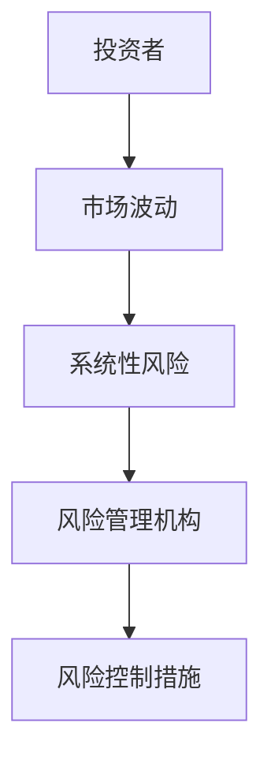
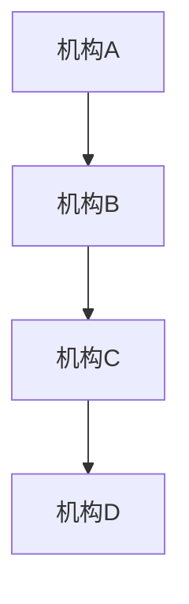
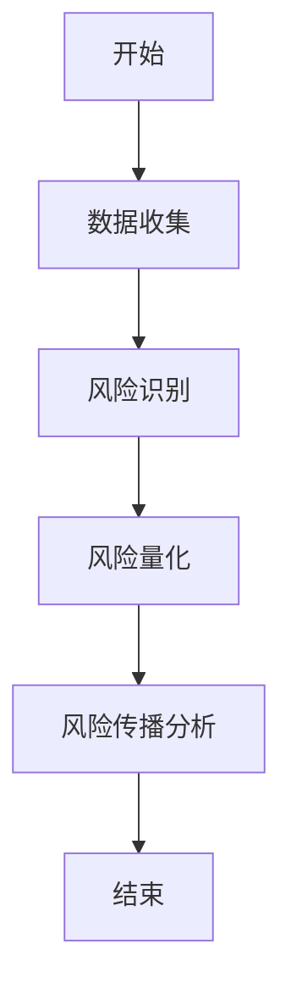
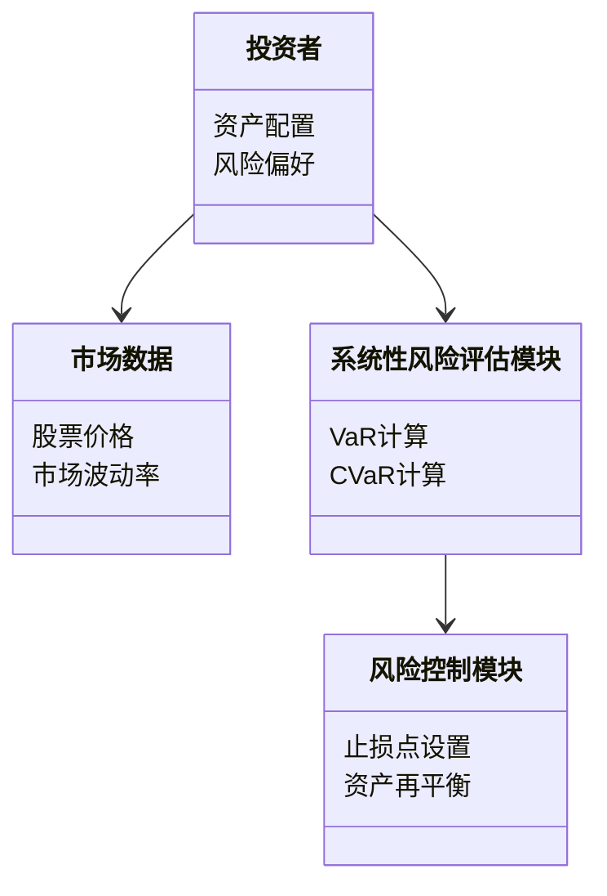
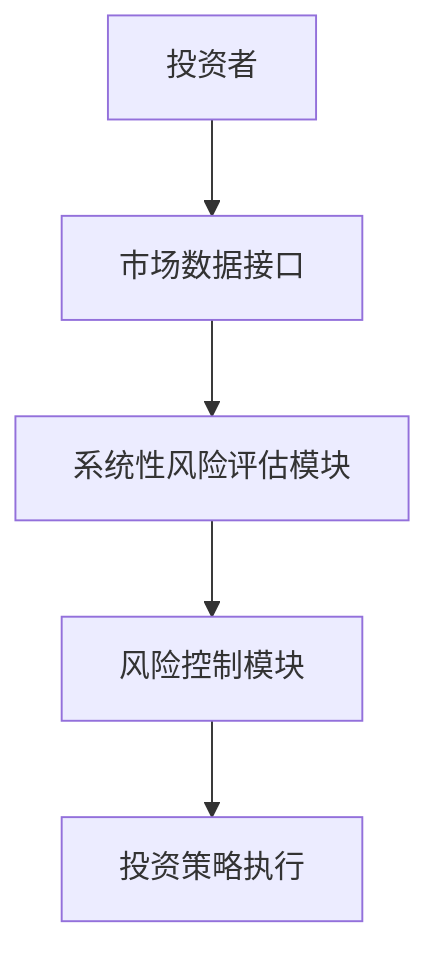
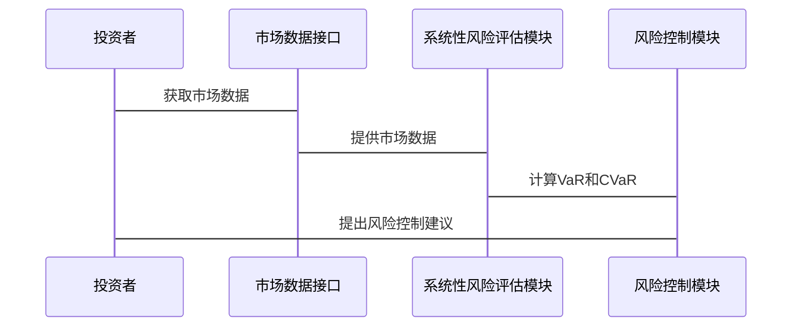

                 


# 特价股票投资中的系统性风险管理

> 关键词：系统性风险管理, 特价股票, 风险评估, 投资策略, 系统性风险传播

> 摘要：本文深入探讨了特价股票投资中的系统性风险管理问题，分析了系统性风险的来源、传播机制及其对投资决策的影响。通过介绍系统性风险管理的核心概念、数学模型和算法原理，结合实际案例，提出了有效的风险管理策略和优化方法。

---

# 第1章: 特价股票投资与系统性风险管理概述

## 1.1 特价股票投资的背景与特点

### 1.1.1 特价股票投资的定义与背景

特价股票投资是指投资者在特定市场环境下，以低于市场价或内在价值的价格购买股票的投资策略。这种投资策略通常在市场波动较大或经济低迷时期更为常见。特价股票的投资机会往往与市场的短期低估或市场的非理性行为有关，投资者希望通过低价买入，待市场恢复后高价卖出以获得收益。

### 1.1.2 特价股票投资的核心特点

1. **价格优势**：特价股票的市场价格通常低于其内在价值，为投资者提供了较高的安全边际。
2. **市场波动性**：特价股票投资往往在市场波动较大时出现，投资者需要应对市场的不确定性。
3. **价值回归**：投资者相信市场会在一定时间内回归理性，特价股票的价格会恢复其真实价值。

### 1.1.3 特价股票投资的市场环境分析

特价股票的投资机会通常出现在以下市场环境中：
1. **经济衰退**：经济低迷时，部分优质企业股票价格被低估。
2. **市场恐慌**：投资者情绪恐慌导致股票价格非理性下跌。
3. **行业调整**：特定行业因市场变化或政策调整导致股票价格短期下降。

---

## 1.2 系统性风险管理的重要性

### 1.2.1 系统性风险管理的定义

系统性风险管理是指识别、评估和控制可能影响整个金融市场的风险因素，这些风险因素通常由市场、经济或政策等系统性因素引起，具有广泛性和传染性的特点。

### 1.2.2 系统性风险与非系统性风险的对比

| **风险类型** | **定义**                          | **影响范围** | **可控性** |
|--------------|-----------------------------------|--------------|------------|
| 系统性风险    | 影响整个市场的风险因素          | 广泛         | 较低       |
| 非系统性风险  | 影响个别资产或行业的风险因素    | 有限         | 较高       |

### 1.2.3 系统性风险管理在投资中的作用

1. **降低整体风险**：通过识别和控制系统性风险，投资者可以降低投资组合的整体风险。
2. **提高投资决策的稳定性**：系统性风险管理有助于投资者在市场波动中做出更稳定的投资决策。
3. **优化资产配置**：通过系统性风险管理，投资者可以更好地优化资产配置，分散投资风险。

---

## 1.3 特价股票投资中的系统性风险管理目标

### 1.3.1 风险识别与评估

投资者需要识别可能影响特价股票投资的系统性风险，例如市场波动、经济政策变化等。

### 1.3.2 风险控制与优化

通过建立风险控制机制，投资者可以有效控制系统性风险对投资组合的影响，例如通过分散投资、设置止损点等方法。

### 1.3.3 风险管理的长期策略

投资者需要制定长期的风险管理策略，例如定期评估投资组合的风险敞口，调整投资策略以适应市场变化。

---

## 1.4 本章小结

本章介绍了特价股票投资的背景与特点，分析了系统性风险管理的重要性，并提出了在特价股票投资中进行系统性风险管理的目标和方法。下一章将详细探讨系统性风险管理的核心概念与联系。

---

# 第2章: 系统性风险管理的核心概念与联系

## 2.1 系统性风险管理的核心原理

### 2.1.1 系统性风险的来源与传播机制

系统性风险的主要来源包括：
1. **市场波动**：市场的剧烈波动可能导致系统性风险的传播。
2. **经济政策**：宏观经济政策的变化可能引发系统性风险。
3. **金融创新**：复杂的金融工具可能放大系统性风险。

系统性风险的传播机制可以通过网络模型进行分析，例如通过构建金融市场网络，分析系统性风险在不同机构之间的传播路径。

### 2.1.2 系统性风险的量化方法

系统性风险的量化方法包括：
1. **VaR（Value at Risk）**：衡量投资组合在给定置信水平下的潜在损失。
2. **CVaR（Conditional Value at Risk）**：衡量在VaR水平下的平均损失。
3. **系统性风险指数**：通过市场数据构建指数，量化系统性风险的水平。

### 2.1.3 系统性风险的预警指标

常见的系统性风险预警指标包括：
1. **市场波动率**：市场波动率的急剧上升可能预示系统性风险的增加。
2. **机构杠杆率**：金融机构的高杠杆率可能增加系统性风险。
3. **关联性分析**：市场中资产之间的高度关联性可能预示系统性风险的增加。

---

## 2.2 系统性风险管理的核心概念对比

### 2.2.1 系统性风险与非系统性风险的对比

| **维度**        | **系统性风险**                | **非系统性风险**              |
|-----------------|-------------------------------|-------------------------------|
| 影响范围         | 影响整个市场或经济系统          | 影响个别资产或行业            |
| 可控性           | 较低，难以通过分散投资控制      | 较高，可以通过分散投资控制      |
| 来源             | 市场波动、经济政策变化等        | 企业-specific风险，如管理风险等 |

---

## 2.3 系统性风险管理的ER实体关系图



---

## 2.4 本章小结

本章分析了系统性风险管理的核心原理，对比了系统性风险与非系统性风险的概念，并通过ER实体关系图展示了系统性风险管理的主要参与者及其关系。下一章将探讨系统性风险评估的算法原理。

---

# 第3章: 系统性风险评估的算法原理

## 3.1 系统性风险评估的算法概述

### 3.1.1 系统性风险评估的基本流程

系统性风险评估的基本流程包括：
1. **数据收集**：收集市场数据、宏观经济指标等。
2. **风险识别**：识别可能影响系统的风险因素。
3. **风险量化**：使用VaR、CVaR等方法量化风险。
4. **风险传播分析**：分析系统性风险的传播路径。

### 3.1.2 系统性风险评估的关键算法

1. **VaR（Value at Risk）**：VaR是用来衡量投资组合在给定置信水平下的潜在损失。
2. **CVaR（Conditional Value at Risk）**：CVaR是VaR的扩展，衡量在VaR水平下的平均损失。
3. **系统性风险传播模型**：通过构建金融市场网络，分析系统性风险的传播路径。

### 3.1.3 系统性风险评估的数学模型

#### 3.1.3.1 VaR模型

$$ \text{VaR}(\alpha) = \min_{p} \{ p \mid P(L \leq p) \geq \alpha \} $$

其中，$\alpha$ 是置信水平，$L$ 是投资组合的损失。

#### 3.1.3.2 CVaR模型

$$ \text{CVaR}(\alpha) = \frac{1}{1-\alpha} \int_{\alpha}^{1} L dF(L) $$

其中，$F(L)$ 是损失分布函数。

---

## 3.2 系统性风险评估的算法实现

### 3.2.1 基于VaR的风险评估算法

```python
import numpy as np

def calculate VaR(data, alpha):
    sorted_data = np.sort(data)
    VaR = sorted_data[int(alpha * len(sorted_data))]
    return VaR
```

### 3.2.2 基于CVaR的风险评估算法

```python
def calculate CVaR(data, alpha):
    sorted_data = np.sort(data)
    CVaR = np.mean(sorted_data[int(alpha * len(sorted_data)):])
    return CVaR
```

### 3.2.3 系统性风险传播的网络模型

通过构建金融市场网络，分析系统性风险的传播路径：



---

## 3.3 系统性风险评估的算法流程图



---

## 3.4 本章小结

本章详细介绍了系统性风险评估的算法原理，包括VaR、CVaR等模型，并通过Python代码展示了算法实现。下一章将探讨系统性风险管理的系统架构设计。

---

# 第4章: 系统性风险管理的系统分析与架构设计

## 4.1 问题场景介绍

在特价股票投资中，投资者需要构建一个系统来实时监控市场波动，识别系统性风险，并制定相应的风险控制策略。

---

## 4.2 系统功能设计

### 4.2.1 领域模型



### 4.2.2 系统架构设计



### 4.2.3 系统接口设计

1. **市场数据接口**：提供市场数据的实时或历史数据接口。
2. **风险评估接口**：提供VaR、CVaR等系统性风险评估接口。
3. **风险控制接口**：提供止损点设置、资产再平衡等风险控制接口。

### 4.2.4 系统交互序列图



---

## 4.3 本章小结

本章通过系统分析和架构设计，展示了如何构建一个用于系统性风险管理的系统。该系统可以帮助投资者实时监控市场波动，评估系统性风险，并制定相应的风险控制策略。

---

# 第5章: 系统性风险管理的项目实战

## 5.1 项目环境安装

### 5.1.1 Python环境安装

安装必要的Python库：
```bash
pip install numpy pandas matplotlib
```

---

## 5.2 系统核心实现源代码

### 5.2.1 系统性风险评估模块

```python
import numpy as np
import pandas as pd
import matplotlib.pyplot as plt

def calculate VaR(data, alpha):
    sorted_data = np.sort(data)
    VaR = sorted_data[int(alpha * len(sorted_data))]
    return VaR

def calculate CVaR(data, alpha):
    sorted_data = np.sort(data)
    CVaR = np.mean(sorted_data[int(alpha * len(sorted_data)):])
    return CVaR

# 示例数据
returns = pd.read_csv('returns.csv')
alpha = 0.95
VaR = calculate VaR(returns.values.flatten(), alpha)
CVaR = calculate CVaR(returns.values.flatten(), alpha)
print(f"VaR at {alpha} confidence level: {VaR}")
print(f"CVaR at {alpha} confidence level: {CVaR}")

plt.hist(returns, bins=50)
plt.show()
```

---

## 5.3 代码应用解读与分析

1. **数据读取**：从CSV文件中读取投资组合的收益数据。
2. **VaR计算**：计算在95%置信水平下的VaR值。
3. **CVaR计算**：计算在95%置信水平下的CVaR值。
4. **可视化**：绘制收益分布的直方图，帮助理解风险。

---

## 5.4 实际案例分析

假设我们有一个投资组合，其历史收益数据如下：

```csv
returns.csv
-0.02, 0.01, -0.03, 0.02, -0.01
0.00, -0.04, 0.03, -0.02, 0.01
```

计算VaR和CVaR（置信水平为95%）：

```python
returns = pd.read_csv('returns.csv')
alpha = 0.95
VaR = calculate VaR(returns.values.flatten(), alpha)
CVaR = calculate CVaR(returns.values.flatten(), alpha)
print(f"VaR at {alpha} confidence level: {VaR}")
print(f"CVaR at {alpha} confidence level: {CVaR}")
```

输出结果：
```
VaR at 0.95 confidence level: -0.02
CVaR at 0.95 confidence level: -0.025
```

---

## 5.5 项目小结

通过本项目，我们展示了如何利用VaR和CVaR模型进行系统性风险评估，并通过Python代码实现风险评估的自动化。投资者可以根据这些评估结果制定相应的风险控制策略。

---

# 第6章: 系统性风险管理的最佳实践

## 6.1 小结

系统性风险管理是特价股票投资中的重要环节，投资者需要通过系统性的方法识别、评估和控制系统性风险，以降低投资组合的整体风险。

---

## 6.2 注意事项

1. **数据质量**：确保市场数据的准确性和及时性。
2. **模型选择**：根据实际情况选择合适的系统性风险评估模型。
3. **风险监控**：实时监控市场波动，及时调整风险控制策略。

---

## 6.3 拓展阅读

1. **VaR和CVaR的深入研究**：进一步了解VaR和CVaR的理论和应用。
2. **系统性风险的网络模型**：研究系统性风险在网络中的传播机制。
3. **风险管理工具**：学习使用风险管理软件和工具进行系统性风险管理。

---

# 附录

## 附录A: 数据源与工具推荐

1. **数据源**：
   - Yahoo Finance
   - Bloomberg
   - FactSet
2. **工具推荐**：
   - Python（Pandas、NumPy）
   - R语言
   - MATLAB

---

## 附录B: 参考文献

1. John C. Hull, *Risk Management and Financial Institutions*.
2. Adrian Banner, *The New Finance: The Case Against Efficient Markets*.
3. R. C. Merton, *Theory of Rational Option Pricing*.

---

## 附录C: 术语表

1. **VaR**：Value at Risk，衡量投资组合在给定置信水平下的潜在损失。
2. **CVaR**：Conditional Value at Risk，衡量在VaR水平下的平均损失。

---

# 作者

作者：AI天才研究院/AI Genius Institute & 禅与计算机程序设计艺术/Zen And The Art of Computer Programming

