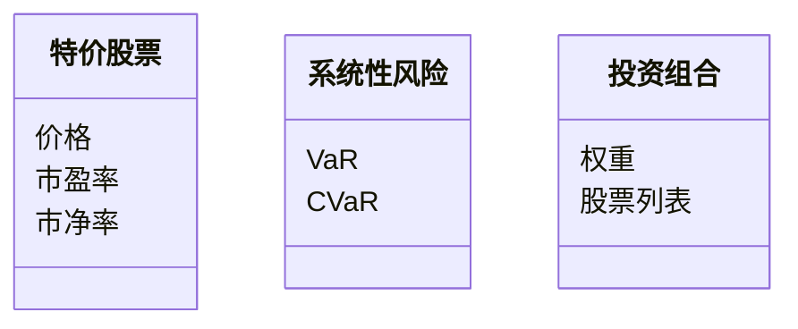

                 


# 特价股票投资中的系统性风险管理方法

## 关键词：
- 特价股票
- 系统性风险管理
- VaR模型
- CVaR模型
- 系统架构设计
- 项目实战

## 摘要：
本文深入探讨了特价股票投资中的系统性风险管理方法，从核心概念、数学模型、系统架构到项目实战，全面解析如何有效管理投资风险。通过VaR和CVaR模型的详细讲解，结合系统架构设计和实际案例分析，为投资者提供实用的风险管理策略。

---

# 第一部分：特价股票投资中的系统性风险管理背景

## 第1章：特价股票投资概述

### 1.1 特价股票的定义与特征

#### 1.1.1 特价股票的定义
特价股票通常指价格低于市场平均水平的股票，具有高波动性和高风险的特性。这些股票可能处于价值洼地，潜在回报较高，但同时也面临较高的市场风险。

#### 1.1.2 特价股票的市场特征
- 价格波动剧烈
- 市盈率、市净率等估值指标较低
- 公司基本面可能存在问题

#### 1.1.3 特价股票的投资价值
- 低价可能蕴含价值
- 市场波动时的反弹机会
- 投资组合中的风险分散作用

### 1.2 系统性风险管理的必要性

#### 1.2.1 系统性风险的定义
系统性风险是影响整个市场的风险因素，如经济衰退、政策变化等，无法通过分散投资来消除。

#### 1.2.2 系统性风险的来源
- 经济周期波动
- 政治政策变化
- 市场流动性危机
- 系统性金融事件（如金融危机）

#### 1.2.3 系统性风险管理的重要性
- 保护投资组合免受重大损失
- 确保投资策略的稳健性
- 符合监管要求和风险管理规范

## 第2章：系统性风险管理的核心概念

### 2.1 系统性风险与非系统性风险的对比

#### 2.1.1 系统性风险的特征
- 影响广泛
- 难以通过分散投资消除
- 来源外部性

#### 2.1.2 非系统性风险的特征
- 影响特定资产
- 可分散化
- 来源特定性

#### 2.1.3 两者对比分析
| 特性       | 系统性风险         | 非系统性风险       |
|------------|--------------------|--------------------|
| 影响范围     | 广泛               | 个别或局部         |
| 可分散性     | 不可分散           | 可分散             |
| 来源         | 宏观因素           | 微观因素           |
| 示例         | 经济衰退、疫情     | 公司财务危机       |

### 2.2 系统性风险管理的框架

#### 2.2.1 风险识别
- 识别系统性风险的来源
- 评估风险的可能性和影响程度

#### 2.2.2 风险评估
- 使用VaR、CVaR等模型量化风险
- 评估投资组合的系统性风险敞口

#### 2.2.3 风险控制
- 设置止损点
- 调整投资组合的权重
- 利用衍生品对冲风险

---

# 第二部分：系统性风险管理的数学模型与算法

## 第3章：VaR（Value at Risk）模型

### 3.1 VaR模型的原理

#### 3.1.1 VaR的定义
VaR是指在一定置信水平下，投资组合可能遭受的最大损失。

#### 3.1.2 VaR的计算方法
- 历史模拟法
- 方差-协方差法
- 蒙特卡洛模拟法

#### 3.1.3 VaR的应用场景
- 投资组合风险评估
- 风险限额设定
- 业绩评估

### 3.2 VaR模型的实现

#### 3.2.1 历史模拟法
```python
import numpy as np
import pandas as pd

# 示例数据
returns = np.random.normal(0, 1, 1000)
sorted_returns = np.sort(returns)

# 计算VaR（95%置信水平，对应5%分位数）
var_level = 0.05
var = -sorted_returns[int(len(sorted_returns) * (1 - var_level))]
print(f"VaR at 95% confidence level: {var}")
```

#### 3.2.2 方差-协方差法
$$
\text{VaR} = \mu + z \times \sigma
$$
其中，$\mu$是均值，$\sigma$是标准差，$z$是标准正态分布的分位数。

#### 3.2.3 蒙特卡洛模拟法
$$
\text{VaR} = \text{quantile}(\text{模拟收益}, \alpha)
$$
其中，$\alpha$是置信水平。

---

## 第4章：CVaR（Conditional Value at Risk）模型

### 4.1 CVaR模型的原理

#### 4.1.1 CVaR的定义
CVaR是指在VaR的基础上，考虑超过VaR水平的平均损失。

#### 4.1.2 CVaR与VaR的关系
CVaR在VaR的基础上，进一步量化超过VaR的损失。

#### 4.1.3 CVaR的优势
- 更加稳健
- 考虑尾部风险

### 4.2 CVaR模型的实现

#### 4.2.1 基于VaR的CVaR计算
$$
\text{CVaR} = \frac{1}{1 - \alpha} \int_{\alpha}^{1} \text{VaR}(p) dp
$$

#### 4.2.2 蒙特卡洛模拟法计算CVaR
```python
import numpy as np

# 示例数据
returns = np.random.normal(0, 1, 1000)
sorted_returns = np.sort(returns)

# 计算CVaR（95%置信水平）
var_level = 0.05
var_index = int(len(sorted_returns) * (1 - var_level))
cvar = np.mean(sorted_returns[var_index:])
print(f"CVaR at 95% confidence level: {cvar}")
```

---

# 第三部分：系统性风险管理的系统架构设计

## 第5章：系统需求分析

### 5.1 系统目标

#### 5.1.1 系统性风险管理的目标
- 量化系统性风险
- 监测系统性风险
- 控制系统性风险

#### 5.1.2 特价股票投资的目标
- 确保投资组合的安全性
- 实现长期收益最大化

### 5.2 系统功能需求

#### 5.2.1 风险评估模块
- 计算VaR和CVaR
- 生成风险报告

#### 5.2.2 风险控制模块
- 设置风险限额
- 调整投资组合

#### 5.2.3 数据采集模块
- 获取市场数据
- 更新投资组合

### 5.3 系统架构设计

#### 5.3.1 领域模型


#### 5.3.2 系统架构


---

## 第6章：系统实现与项目实战

### 6.1 环境搭建

#### 6.1.1 安装Python环境
```bash
pip install numpy pandas matplotlib
```

#### 6.1.2 安装Mermaid工具
```bash
npm install -g mermaid-cli
```

### 6.2 核心代码实现

#### 6.2.1 VaR模型实现
```python
import numpy as np

def calculate_var(returns, confidence_level=0.95):
    sorted_returns = np.sort(returns)
    var_level = 1 - confidence_level
    var_index = int(len(sorted_returns) * var_level)
    var = -sorted_returns[var_index]
    return var

# 示例数据
returns = np.random.normal(0, 1, 1000)
var = calculate_var(returns)
print(f"VaR at {confidence_level * 100}% confidence level: {var}")
```

#### 6.2.2 CVaR模型实现
```python
def calculate_cvar(returns, confidence_level=0.95):
    sorted_returns = np.sort(returns)
    var_level = 1 - confidence_level
    var_index = int(len(sorted_returns) * var_level)
    cvar = np.mean(sorted_returns[var_index:])
    return cvar

cvar = calculate_cvar(returns)
print(f"CVaR at {confidence_level * 100}% confidence level: {cvar}")
```

### 6.3 案例分析

#### 6.3.1 案例背景
假设我们有一个投资组合，包含多只特价股票，需要评估其系统性风险。

#### 6.3.2 数据准备
```python
import pandas as pd

# 示例数据
data = {
    '股票': ['A', 'B', 'C'],
    '价格': [2, 3, 1],
    '市盈率': [15, 20, 10],
    '市净率': [1.5, 2.5, 0.5]
}
df = pd.DataFrame(data)
print(df)
```

#### 6.3.3 风险评估
计算投资组合的VaR和CVaR，评估系统性风险。

### 6.4 项目小结
通过实际案例，验证了VaR和CVaR模型在系统性风险管理中的有效性，为投资者提供了实用的风险管理工具。

---

# 第四部分：最佳实践、小结与注意事项

## 第7章：最佳实践

### 7.1 小结
- 特价股票投资需重视系统性风险管理
- VaR和CVaR是有效的风险管理工具
- 系统架构设计需结合实际需求

### 7.2 注意事项
- 定期更新风险模型
- 结合非系统性风险进行综合管理
- 风险管理需与投资策略相结合

### 7.3 拓展阅读
- 《风险管理与VaR》
- 《系统性风险的识别与控制》

---

作者：AI天才研究院/AI Genius Institute & 禅与计算机程序设计艺术/Zen And The Art of Computer Programming

