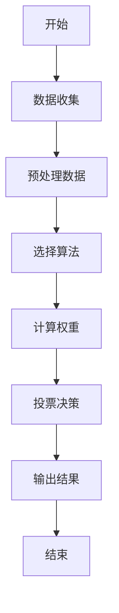
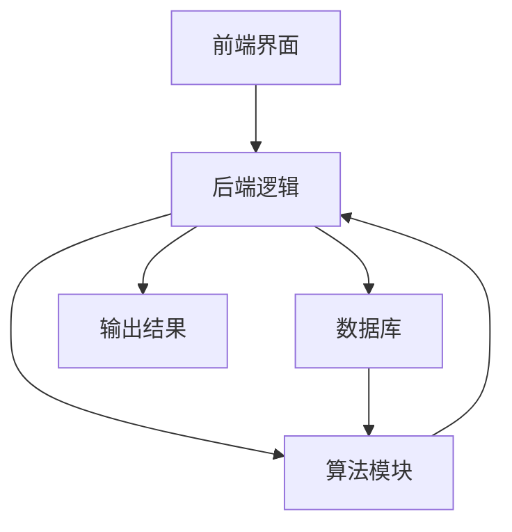
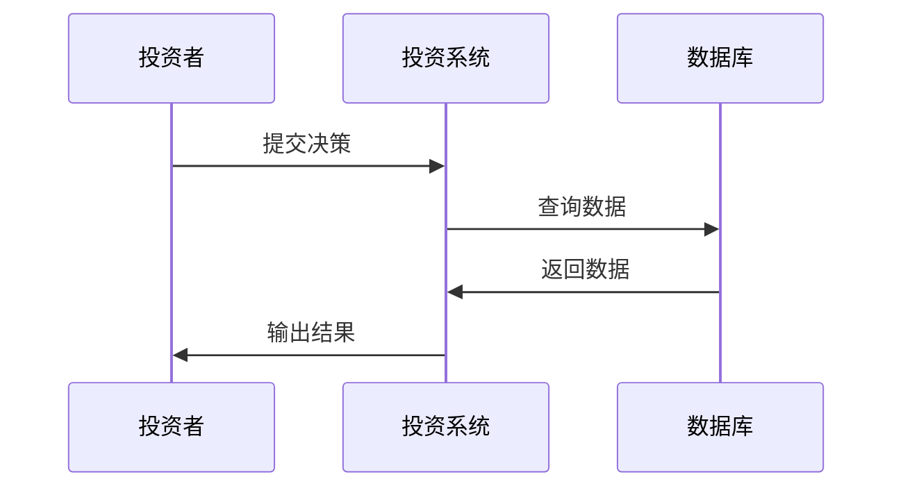

                 


# 特价股票投资中的群体智慧与集体决策方法

## 关键词：
特价股票、群体智慧、集体决策、投资决策、算法实现

## 摘要：
本文探讨了特价股票投资中的群体智慧与集体决策方法，通过分析特价股票市场的特点、投资者行为以及群体智慧在投资决策中的应用，结合数学模型和算法实现，为投资者提供了一种基于集体决策的投资策略。文章从理论到实践，详细阐述了如何利用群体智慧优化投资决策，并通过实际案例分析和代码实现，为读者提供了可操作的指导。

---

# 第一部分: 特价股票投资的背景与基础

## 第1章: 特价股票投资概述

### 1.1 特价股票的定义与特点
#### 1.1.1 特价股票的基本概念
特价股票是指价格低于面值的股票，通常分为可转换债券和公司债券两种类型。其特点包括低门槛、高潜在收益和较高的市场波动性。

#### 1.1.2 特价股票的市场特点
- 价格波动大，但潜在收益高。
- 市场流动性较低，但市场参与者多样。
- 信息不对称较为严重，需要依赖群体智慧进行决策。

#### 1.1.3 特价股票的投资价值分析
通过分析公司基本面、市场环境和行业趋势，判断特价股票的潜在价值。

### 1.2 群体智慧与集体决策的定义
#### 1.2.1 群体智慧的定义与特征
群体智慧是指通过集体决策来优化个体决策的智慧，具有多样性、冗余性和鲁棒性的特点。

#### 1.2.2 集体决策的定义与优势
集体决策是指通过多个个体的意见整合，形成最终决策的过程。其优势在于能够降低个体认知偏差的影响，提高决策的准确性。

#### 1.2.3 群体智慧与集体决策的关系
群体智慧是集体决策的结果，集体决策是实现群体智慧的手段。

### 1.3 特价股票投资的核心逻辑
通过群体智慧优化个体决策，降低投资风险，提高投资收益。

## 第2章: 特价股票市场的基本原理

### 2.1 特价股票市场的运作机制
#### 2.1.1 市场参与者的角色
包括机构投资者、个人投资者和市场中介。

#### 2.1.2 价格形成机制
市场供需关系和参与者行为共同影响价格波动。

#### 2.1.3 市场波动与投资者行为
投资者行为（如羊群效应）会加剧市场波动。

### 2.2 投资者行为分析
#### 2.2.1 理性决策与非理性决策
理性决策基于充分的信息和逻辑分析，非理性决策受情绪和认知偏差影响。

#### 2.2.2 行为金融学的基本理论
包括前景理论、损失厌恶理论等。

#### 2.2.3 投资者认知偏差与决策错误
常见的认知偏差包括确认偏误、过度自信等。

### 2.3 群体智慧与市场效率
群体智慧能够提高市场信息处理能力，但市场失灵可能导致群体决策失误。

## 第3章: 群体智慧在投资中的应用

### 3.1 群体智慧的核心概念
#### 3.1.1 群体智慧的数学模型
通过一致性算法、加权投票算法等模型实现群体决策。

#### 3.1.2 群体决策的优势与局限
优势包括多样性、冗余性；局限包括信息过载、协调成本高。

#### 3.1.3 群体智慧在金融领域的应用案例
如通过社交媒体分析投资者情绪，辅助决策。

### 3.2 群体智慧与投资决策的关系
群体智慧能够优化个体决策，但需结合个体经验进行调整。

---

# 第二部分: 集体决策方法与算法原理

## 第4章: 集体决策的数学模型与算法

### 4.1 集体决策的基本算法
#### 4.1.1 一致性算法
通过投票机制达成一致决策。

#### 4.1.2 加权投票算法
根据个体权重进行投票，最终形成加权决策。

#### 4.1.3 融合算法
结合个体意见，形成最终决策。

### 4.2 群体智慧的数学模型
#### 4.2.1 基于概率的群体决策模型
$$ P(A) = \sum_{i=1}^{n} w_i P(A|w_i) $$

#### 4.2.2 基于统计的群体决策模型
$$ \text{平均意见} = \frac{1}{n}\sum_{i=1}^{n} x_i $$

#### 4.2.3 基于网络的群体决策模型
通过社会网络分析，计算个体影响力。

### 4.3 算法实现的步骤
1. 数据收集与预处理
2. 算法选择与参数设置
3. 算法实现与结果分析

## 第5章: 集体决策的算法实现

### 5.1 加权投票算法的Python实现
```python
def weighted_vote(votes, weights):
    total_weight = sum(weights)
    weighted_sum = sum(v * w for v, w in zip(votes, weights))
    return weighted_sum / total_weight
```

### 5.2 融合算法的Python实现
```python
def fusion_algorithm(decisions):
    return max(decisions, key=lambda x: decisions.count(x))
```

### 5.3 算法流程图


---

# 第三部分: 系统分析与架构设计

## 第6章: 系统分析与架构设计

### 6.1 问题场景介绍
通过群体智慧优化投资决策，构建一个支持集体决策的投资系统。

### 6.2 系统功能设计
```mermaid
classDiagram
    class 投资者
        + 资金: float
        + 意见: string
        + 投票: bool
    class 投资系统
        + 投资者列表: list[投资者]
        + 决策算法: object
        + 输出结果: string
    class 数据库
        + 交易记录: list[交易]
        + 市场数据: list[数据]
    投资系统 --> 投资者
    投资系统 --> 数据库
```

### 6.3 系统架构设计


### 6.4 系统接口设计


---

# 第四部分: 项目实战

## 第7章: 项目实战

### 7.1 环境安装
- Python 3.8+
- Pandas、NumPy、Matplotlib

### 7.2 系统核心实现源代码
```python
def main():
    import pandas as pd
    import numpy as np
    data = pd.read_csv('market_data.csv')
    votes = data['vote'].tolist()
    weights = data['weight'].tolist()
    decision = weighted_vote(votes, weights)
    print(f"最终决策: {decision}")
```

### 7.3 代码应用解读与分析
- 数据读取：从CSV文件读取市场数据。
- 算法实现：通过加权投票算法计算最终决策。

### 7.4 实际案例分析
通过具体案例分析，验证算法的有效性。

### 7.5 项目小结
总结项目成果，提出改进建议。

---

# 第五部分: 总结与展望

## 第8章: 总结与展望

### 8.1 核心观点回顾
群体智慧能够优化投资决策，降低个体认知偏差的影响。

### 8.2 未来的研究方向
- 更复杂的算法优化
- 多因素模型的应用
- 人工智能与群体智慧的结合

### 8.3 对投资者的建议
- 结合个体经验与群体智慧进行决策
- 注意市场波动和信息过载的风险

---

# 附录

## 附录A: 关键术语解释
- 特价股票：价格低于面值的股票。
- 群体智慧：集体决策的结果。

## 附录B: 相关数学公式汇总
$$ P(A) = \sum_{i=1}^{n} w_i P(A|w_i) $$

## 附录C: 代码片段汇总
```python
def weighted_vote(votes, weights):
    return sum(v * w for v, w in zip(votes, weights)) / sum(weights)
```

---

# 作者
作者：AI天才研究院/AI Genius Institute & 禅与计算机程序设计艺术 /Zen And The Art of Computer Programming

