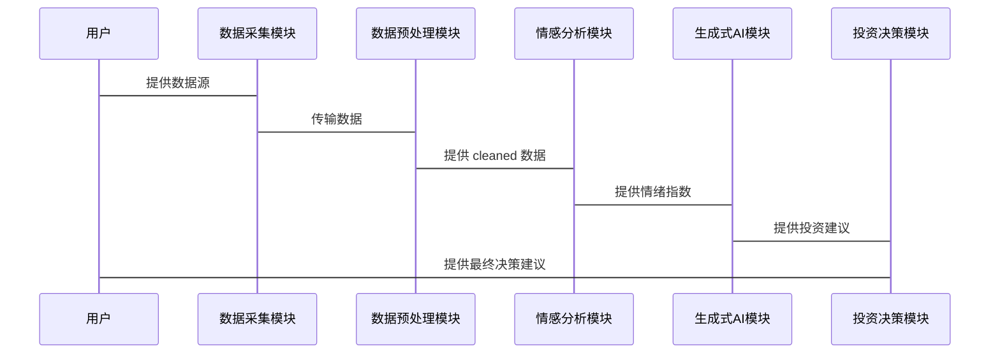

                 


# 特价股票投资中的自然语言处理与生成式AI辅助决策系统

## 关键词：特价股票，自然语言处理，生成式AI，投资决策，股票分析

## 摘要：本文探讨了如何利用自然语言处理和生成式AI技术辅助特价股票投资决策。文章首先介绍了特价股票投资的基本概念和特点，接着分析了自然语言处理和生成式AI的核心原理及其在金融领域的应用。随后，文章详细讲解了基于NLP和生成式AI的股票信息分析方法，包括文本数据预处理、市场情绪分析和生成式AI在投资决策中的应用。最后，文章通过实际案例展示了如何构建一个基于NLP和生成式AI的特价股票投资辅助决策系统，并提出了系统的优化建议和未来研究方向。

---

## 第1章: 特价股票投资与AI辅助决策概述

### 1.1 特价股票投资的背景与特点

#### 1.1.1 特价股票的定义与特征
- 特价股票是指价格低于市场平均水平的股票，通常具有较高的潜在增长空间。
- 特点包括低估值、高增长潜力和较高的波动性。

#### 1.1.2 特价股票投资的核心问题
- 信息不对称：投资者难以获取高质量的内部信息。
- 市场情绪影响：市场情绪波动对股价有显著影响。
- 数据复杂性：涉及大量非结构化数据，如新闻、社交媒体和公司报告。

#### 1.1.3 AI在股票投资中的应用价值
- AI可以帮助投资者从海量数据中提取有用信息。
- 通过自然语言处理技术分析文本数据，识别市场情绪和潜在投资机会。
- 生成式AI可以辅助生成投资报告和策略建议。

---

## 第2章: 自然语言处理与生成式AI的核心原理

### 2.1 NLP的核心技术与算法

#### 2.1.1 分词与词向量表示
- 分词：将文本分割成有意义的词汇或短语。
- 词向量表示：将词汇转换为向量形式，常用技术包括Word2Vec和 GloVe。

#### 2.1.2 语法分析与语义理解
- 语法分析：分析文本的语法结构，识别句子成分。
- 语义理解：理解文本的含义，常用技术包括基于规则的方法和深度学习模型（如BERT）。

#### 2.1.3 常见的NLP任务与模型
- 常见任务：文本分类、情感分析、实体识别。
- 常见模型：Word2Vec、GloVe、BERT、GPT。

### 2.2 生成式AI的算法原理

#### 2.2.1 变量自回归模型（如GPT）
- GPT模型通过自回归的方式生成文本。
- 基于上下文预测下一个词的概率分布。

#### 2.2.2 增量式生成算法
- 逐步生成文本，每次生成一个词。
- 基于概率论和马尔可夫链原理。

#### 2.2.3 梯度下降与损失函数优化
- 使用交叉熵损失函数衡量生成文本与真实文本的差距。
- 通过梯度下降优化模型参数。

---

## 第3章: 生成式AI在股票投资决策中的应用

### 3.1 生成式AI辅助投资决策的核心优势

#### 3.1.1 自动生成投资报告
- 基于市场数据和新闻生成投资报告。
- 提供市场趋势分析和投资建议。

#### 3.1.2 风险预警与机会发现
- 通过分析社交媒体和新闻识别市场风险。
- 发现潜在的投资机会。

#### 3.1.3 个性化投资策略生成
- 根据投资者的风险偏好生成个性化投资策略。
- 提供动态调整的建议。

---

## 第4章: 特价股票投资中的NLP与生成式AI结合应用

### 4.1 NLP在特价股票信息分析中的应用

#### 4.1.1 特价股票文本数据的获取与预处理
- 数据来源：新闻、社交媒体、公司财报。
- 数据清洗：去除噪声数据，提取有用信息。

#### 4.1.2 基于NLP的文本分类
- 分类任务：判断股票是否为特价股票。
- 分类算法：支持向量机（SVM）、随机森林（RF）、深度学习模型（如BERT）。

#### 4.1.3 市场情绪分析
- 情感分析算法：基于词袋模型和深度学习模型。
- 市场情绪对股价的影响：正面情绪提升股价，负面情绪降低股价。

### 4.2 生成式AI在投资决策中的应用

#### 4.2.1 自动生成投资策略
- 基于市场数据生成投资策略。
- 提供动态调整建议。

#### 4.2.2 风险预警与机会发现
- 通过分析社交媒体和新闻发现市场风险。
- 发现潜在的投资机会。

#### 4.2.3 个性化投资建议
- 根据投资者的风险偏好生成个性化投资策略。
- 提供动态调整的建议。

---

## 第5章: 基于NLP和生成式AI的特价股票投资辅助决策系统

### 5.1 系统功能设计

#### 5.1.1 数据采集模块
- 采集股票数据、新闻数据和社交媒体数据。
- 数据预处理：清洗、转换和存储。

#### 5.1.2 情感分析模块
- 基于NLP技术分析市场情绪。
- 生成情绪指数，辅助投资决策。

#### 5.1.3 生成式AI模块
- 自动生成投资报告和策略建议。
- 提供风险预警和机会发现。

### 5.2 系统架构设计

#### 5.2.1 系统架构图


#### 5.2.2 系统交互流程


---

## 第6章: 项目实战与系统实现

### 6.1 环境安装与配置

#### 6.1.1 安装Python环境
```bash
python --version
pip install numpy pandas scikit-learn transformers
```

#### 6.1.2 安装NLP库
```bash
pip install transformers
pip install sentencepiece
```

### 6.2 系统核心功能实现

#### 6.2.1 数据采集与预处理
```python
import pandas as pd
from transformers import AutoTokenizer, AutoModelForTokenClassification

# 数据采集
data = pd.read_csv('stock_data.csv')

# 数据预处理
def preprocess(text):
    # 分词
    tokenizer = AutoTokenizer.from_pretrained('bert-base-uncased')
    inputs = tokenizer(text, return_tensors='np')
    # 词向量提取
    model = AutoModelForTokenClassification.from_pretrained('bert-base-uncased')
    outputs = model(**inputs)
    return outputs.last_hidden_state.numpy().mean(axis=0)
```

#### 6.2.2 市场情绪分析
```python
from transformers import pipeline

# 情感分析模型
sentiment_analyzer = pipeline("sentiment-analysis")

def analyze_sentiment(text):
    result = sentiment_analyzer(text)
    return result[0]['label']

# 情绪分析案例
print(analyze_sentiment("The company reported a strong profit growth."))
```

#### 6.2.3 生成式AI生成投资报告
```python
from transformers import AutoTokenizer, AutoModelForCausalLM

# 生成式AI模型
tokenizer = AutoTokenizer.from_pretrained('gpt2')
model = AutoModelForCausalLM.from_pretrained('gpt2')

def generate_report(prompt):
    inputs = tokenizer(prompt, return_tensors='pt')
    outputs = model.generate(inputs.input_ids, max_length=100)
    return tokenizer.decode(outputs[0], skip_special_tokens=True)

# 生成报告
print(generate_report("Write a stock analysis report on the company."))
```

---

## 第7章: 总结与展望

### 7.1 本章小结
- 本文探讨了自然语言处理和生成式AI在特价股票投资中的应用。
- 提出了基于NLP和生成式AI的辅助决策系统，并通过实际案例展示了系统的实现过程。

### 7.2 注意事项
- 数据质量和模型训练数据对系统性能有重要影响。
- 需要结合实际情况调整模型参数和算法。

### 7.3 拓展阅读
- 《自然语言处理入门》
- 《生成式AI的原理与应用》
- 《股票投资策略与技术分析》

---

## 作者：AI天才研究院/AI Genius Institute & 禅与计算机程序设计艺术 /Zen And The Art of Computer Programming

