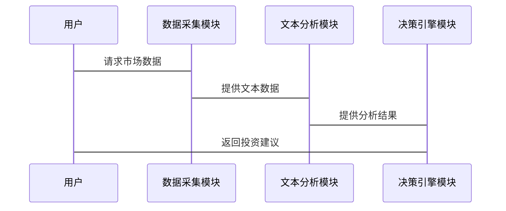

                 


```markdown
# 特价股票投资中的自然语言生成辅助决策系统

## 关键词
特价股票投资, 自然语言生成, 投资决策, 机器学习, 文本分析

## 摘要
本文探讨了自然语言生成技术在特价股票投资中的应用，详细分析了如何利用NLP技术辅助投资决策。通过背景介绍、核心概念解析、算法原理、系统架构设计和项目实战，本文为投资者提供了一套基于自然语言生成的辅助决策系统，帮助他们在复杂的金融市场中做出更明智的投资决策。

---

## 第1章: 特价股票投资与自然语言生成概述

### 1.1 特价股票投资的背景与意义
#### 1.1.1 特价股票投资的定义与特点
- **定义**: 特价股票投资是指以低于市场价购买股票，期望在价格回升时获利的投资策略。
- **特点**: 
  - 高风险高回报
  - 需要快速捕捉市场机会
  - 依赖于市场情绪和信息分析

#### 1.1.2 自然语言生成技术的引入
- **定义**: 自然语言生成（Natural Language Generation, NLG）是将结构化数据转化为自然语言文本的技术。
- **作用**: 
  - 快速生成市场分析报告
  - 提供实时市场情绪解读
  - 帮助投资者快速理解市场动态

#### 1.1.3 投资决策中的信息处理需求
- **信息来源**: 市场新闻、公司公告、社交媒体、专业分析报告
- **信息处理挑战**: 
  - 数据量大
  - 信息分散
  - 需要实时分析

### 1.2 自然语言生成技术的基本原理
#### 1.2.1 自然语言生成的定义与特点
- **定义**: 自然语言生成是将数据转化为自然语言文本的过程。
- **特点**: 
  - 自动化
  - 高效性
  - 可定制性

#### 1.2.2 自然语言生成的核心技术
- **文本生成模型**: 
  - 基于规则的生成
  - 统计模型（如n-gram）
  - 深度学习模型（如RNN、Transformer）
- **语言模型**: 
  - BERT
  - GPT
  - T5

#### 1.2.3 自然语言生成在投资决策中的应用潜力
- **市场报告生成**: 自动生成市场分析报告
- **情绪分析**: 分析社交媒体情绪，预测市场走势
- **投资建议**: 根据市场数据生成投资建议

## 第2章: 特价股票投资中的信息处理需求

### 2.1 特价股票投资中的信息来源
#### 2.1.1 市场新闻与公司公告
- **市场新闻**: 影响市场走势的重要新闻
- **公司公告**: 公司发布的财务报告、并购消息等

#### 2.1.2 社会媒体与投资者情绪
- **社交媒体数据**: Twitter、Reddit等平台的用户评论
- **情绪分析**: 通过NLP技术分析社交媒体中的情绪，预测市场走势

#### 2.1.3 专业分析报告
- **机构报告**: 专业机构发布的市场分析报告
- **行业分析**: 特定行业的市场分析

### 2.2 自然语言生成在信息处理中的作用
#### 2.2.1 文本信息抽取
- **实体识别**: 识别文本中的公司名称、日期、金额等实体
- **关系抽取**: 分析实体之间的关系

#### 2.2.2 文本摘要
- **自动摘要**: 从长文本中提取关键信息，生成摘要
- **摘要应用**: 帮助投资者快速获取关键信息

#### 2.2.3 自然语言问答
- **FAQ生成**: 根据市场数据生成常见问题解答
- **实时问答**: 根据用户输入生成实时市场分析

## 第3章: 自然语言生成辅助决策系统的算法原理

### 3.1 预训练模型
#### 3.1.1 BERT模型
- **结构**: 基于Transformer的双向编码器
- **应用**: 文本理解、问答系统

#### 3.1.2 GPT模型
- **结构**: 基于Transformer的生成模型
- **应用**: 文本生成、对话系统

### 3.2 文本分析算法
#### 3.2.1 分词算法
- **分词工具**: 使用jieba、spaCy等工具进行分词
- **分词步骤**: 将文本分割成词语或短语

#### 3.2.2 情感分析算法
- **算法原理**: 基于词袋模型或词嵌入模型（如Word2Vec）进行情感分类
- **应用**: 分析社交媒体中的投资者情绪

### 3.3 决策模型
#### 3.3.1 逻辑回归模型
- **原理**: 通过线性组合和sigmoid函数进行概率预测
- **应用**: 预测股票涨跌概率

#### 3.3.2 支持向量机模型
- **原理**: 在高维空间中构建超平面进行分类
- **应用**: 分类股票为买入、卖出或持有

## 第4章: 系统分析与架构设计

### 4.1 项目介绍
#### 4.1.1 项目目标
- 构建一个基于自然语言生成的股票投资辅助决策系统
- 提供实时市场分析和投资建议

#### 4.1.2 项目需求
- 实时数据处理
- 自然语言生成
- 用户界面友好

### 4.2 系统功能设计
#### 4.2.1 数据采集模块
- **功能**: 采集市场新闻、社交媒体数据等
- **工具**: 使用API接口或网络爬虫

#### 4.2.2 文本分析模块
- **功能**: 对采集的文本进行分词、情感分析等
- **算法**: 使用预训练模型进行文本分析

#### 4.2.3 决策引擎模块
- **功能**: 根据分析结果生成投资建议
- **模型**: 使用机器学习模型进行决策

### 4.3 系统架构设计
#### 4.3.1 模块划分
- 数据采集模块
- 文本分析模块
- 决策引擎模块
- 用户界面模块

#### 4.3.2 系统架构图


#### 4.3.3 系统接口设计
- 数据接口: REST API接口
- 文本分析接口: NLP处理接口
- 决策引擎接口: 投资建议生成接口

### 4.4 系统交互流程
#### 4.4.1 用户输入
- 用户输入查询条件
- 系统根据条件生成分析报告

#### 4.4.2 系统输出
- 自动生成市场分析报告
- 提供投资建议

#### 4.4.3 交互流程图


## 第5章: 项目实战

### 5.1 环境安装
#### 5.1.1 安装Python
- 使用Anaconda安装Python 3.8以上版本

#### 5.1.2 安装依赖库
- `pip install numpy pandas jieba transformers`

### 5.2 系统核心实现
#### 5.2.1 数据采集模块
- 使用API接口获取市场新闻
- 使用网络爬虫获取社交媒体数据

#### 5.2.2 文本分析模块
- 使用预训练模型进行文本分词和情感分析
- 示例代码：
```python
from transformers import pipeline

nlp = pipeline("text-classification", model="nlptown/sentiment")
text = "The company's revenue increased by 20%"
result = nlp(text)
print(result)
```

#### 5.2.3 决策引擎模块
- 使用逻辑回归模型进行股票涨跌预测
- 示例代码：
```python
from sklearn.linear_model import LogisticRegression
from sklearn.feature_extraction.text import TfidfVectorizer

vectorizer = TfidfVectorizer()
X = vectorizer.fit_transform(documents)
model = LogisticRegression()
model.fit(X, labels)
```

### 5.3 案例分析
- 案例背景: 某公司发布季度财报，净利润增长10%
- 系统分析: 社交媒体情绪分析显示正面情绪占70%
- 投资建议: 买入该股票

### 5.4 项目小结
- 项目实现了自然语言生成辅助决策系统
- 系统能够实时分析市场信息并生成投资建议
- 系统具有较高的准确性和实用性

## 第6章: 总结与展望

### 6.1 最佳实践
- 定期更新模型参数
- 优化文本分析算法
- 提供多语言支持

### 6.2 小结
本文详细介绍了自然语言生成技术在特价股票投资中的应用，通过背景介绍、算法原理、系统架构设计和项目实战，展示了如何利用NLP技术辅助投资决策。

### 6.3 注意事项
- 数据隐私问题
- 模型的可解释性
- 系统的实时性

### 6.4 拓展阅读
- 《自然语言处理实战》
- 《机器学习在金融中的应用》

---

## 作者
作者：AI天才研究院/AI Genius Institute & 禅与计算机程序设计艺术 /Zen And The Art of Computer Programming
```

