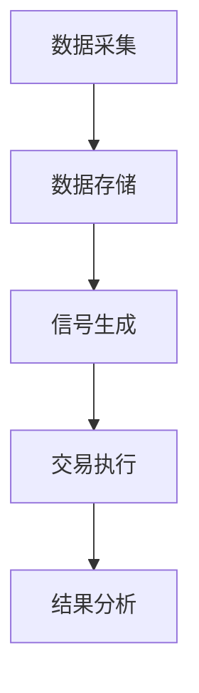

                 


# 第一部分: 特价股票投资中的行业轮动策略研究

## 第1章: 特价股票与行业轮动概述

### 1.1 特价股票的基本概念
#### 1.1.1 特价股票的定义
特价股票指的是价格低于市场平均水平的股票，通常具有较高的市盈率或市净率，可能处于困境或新兴阶段。这些股票可能被市场低估，具有较大的增长潜力。

#### 1.1.2 特价股票的特点
- 低估值：市盈率或市净率低于行业平均水平。
- 高波动性：价格波动较大，可能带来较高的收益或风险。
- 逆周期性：在经济低迷时可能表现不佳，但在经济复苏时可能有较大反弹。

#### 1.1.3 特价股票的投资价值
- 低价买入，高价卖出的潜力。
- 市场低估时的抄底机会。
- 行业轮动中的价格优势。

### 1.2 行业轮动的基本概念
#### 1.2.1 行业轮动的定义
行业轮动是指投资者根据市场环境的变化，将资金从表现不佳的行业转移到表现较好的行业，以捕捉更高的收益。

#### 1.2.2 行业轮动的驱动因素
- 经济周期：不同行业在不同经济周期的表现不同。
- 行业基本面：行业的盈利能力、成长性和财务状况。
- 市场情绪：投资者情绪影响资金流动。

#### 1.2.3 行业轮动的周期性分析
行业轮动具有周期性，通常与经济周期同步，不同行业在不同阶段表现不同。

### 1.3 特价股票与行业轮动的结合
#### 1.3.1 特价股票在行业轮动中的地位
作为低价股票，特价股票可能在某些行业轮动阶段被低估，成为投资机会。

#### 1.3.2 行业轮动对特价股票投资的影响
行业轮动策略可以帮助投资者在低价股票中找到具有上涨潜力的行业和个股。

#### 1.3.3 特价股票行业轮动的策略框架
- 选择具有上涨潜力的行业。
- 筛选低价股票。
- 在合适的时机买入并持有。

### 1.4 本章小结
本章介绍了特价股票和行业轮动的基本概念，探讨了两者结合的投资策略。

---

## 第2章: 行业轮动的驱动因素分析

### 2.1 经济周期与行业轮动
#### 2.1.1 经济周期的定义与阶段划分
经济周期分为衰退、复苏、增长和成熟四个阶段，不同阶段适合不同行业的投资。

#### 2.1.2 不同经济周期下的行业表现
- 衰退阶段：防御性行业如公用事业表现较好。
- 复苏阶段：原材料和工业品行业表现较好。
- 增长阶段：科技和消费行业表现较好。
- 成熟阶段：金融和房地产行业表现较好。

#### 2.1.3 经济周期对特价股票的影响
在经济衰退时，特价股票可能被进一步低估，而在复苏时可能有较大反弹。

### 2.2 行业基本面分析
#### 2.2.1 行业基本面的定义
行业基本面指行业的盈利能力、成长性、财务状况和市场地位。

#### 2.2.2 行业基本面指标的分析
- 净利润增长率：反映行业盈利能力。
- 营收增长率：反映行业成长性。
- 债务与股权比例：反映行业财务风险。

#### 2.2.3 行业基本面变化对股票价格的影响
基本面改善通常会导致股价上涨，反之则下跌。

### 2.3 市场情绪与技术分析
#### 2.3.1 市场情绪对行业轮动的影响
市场情绪高涨时，资金倾向于流入高风险行业；情绪低落时，资金倾向于防御性行业。

#### 2.3.2 技术分析在行业轮动中的应用
- K线图分析：识别趋势和反转信号。
- 成交量分析：确认趋势强度。
- 技术指标：如MACD、RSI等。

#### 2.3.3 市场情绪与技术指标的结合
结合市场情绪和技术指标可以更准确地判断行业轮动的时机。

### 2.4 本章小结
本章分析了经济周期、行业基本面和技术分析对行业轮动的影响。

---

## 第3章: 特价股票行业轮动的策略构建

### 3.1 行业轮动策略的核心要素
#### 3.1.1 行业选择标准
- 行业处于上升周期。
- 行业基本面良好。
- 行业估值低于市场平均水平。

#### 3.1.2 股票筛选 criteria
- 价格低于行业平均水平。
- 市盈率或市净率低于市场平均水平。
- 具有较高的成长性。

#### 3.1.3 入场时机的选择
- 行业处于低估阶段。
- 技术指标显示买入信号。
- 市场情绪开始转向积极。

### 3.2 行业轮动策略的数学模型
#### 3.2.1 行业轮动的量化指标
- 行业相对强弱指数（RSI）：衡量行业相对于市场的强弱。
- 行业动量策略：基于过去的表现预测未来的表现。

#### 3.2.2 行业轮动的数学模型
模型：如果行业RSI > 70，视为超买，考虑卖出；如果RSI < 30，视为超卖，考虑买入。

#### 3.2.3 模型的验证与优化
通过历史数据回测模型的准确性和稳定性，优化参数以提高预测能力。

### 3.3 特价股票行业轮动的实施步骤
#### 3.3.1 数据收集与处理
收集历史价格、财务数据和技术指标，进行清洗和标准化。

#### 3.3.2 策略回测与分析
使用历史数据模拟策略表现，计算收益率、波动率等指标。

#### 3.3.3 策略优化与调整
根据回测结果调整策略参数，提高策略的有效性。

### 3.4 本章小结
本章构建了基于行业轮动的特价股票投资策略，并介绍了实施步骤。

---

## 第4章: 行业轮动策略的算法实现

### 4.1 算法原理
#### 4.1.1 基于动量策略的行业轮动
动量策略：选择过去表现好的行业继续投资。

#### 4.1.2 基于相对强弱指数的行业轮动
RSI策略：根据行业RSI指标判断买入或卖出时机。

#### 4.1.3 基于移动平均收敛散度的行业轮动
MACD策略：通过MACD指标判断行业趋势和动能。

### 4.2 算法实现
#### 4.2.1 数据预处理
收集并清洗行业指数数据，计算技术指标。

#### 4.2.2 策略实现
编写代码实现动量、RSI和MACD策略，生成买卖信号。

#### 4.2.3 策略回测与分析
使用回测结果评估策略表现，计算收益、风险指标等。

### 4.3 算法优化
调整参数和策略组合，提高策略的稳定性和收益能力。

### 4.4 本章小结
本章详细讲解了行业轮动策略的算法实现及其优化。

---

## 第5章: 系统架构与项目实战

### 5.1 系统架构设计
#### 5.1.1 问题场景介绍
构建一个基于行业轮动的股票交易系统，实现数据采集、信号生成和交易执行。

#### 5.1.2 系统功能设计
- 数据采集模块：获取行业指数和个股数据。
- 信号生成模块：计算技术指标，生成买卖信号。
- 交易执行模块：根据信号下单，记录交易记录。
- 结果分析模块：计算收益，评估策略表现。

#### 5.1.3 系统架构图


### 5.2 项目实战
#### 5.2.1 环境安装
安装Python、Pandas、Matplotlib、Talib等库。

#### 5.2.2 核心实现源代码
```python
import pandas as pd
import talib as ta

# 数据预处理
data = pd.read_csv('industry_data.csv')
data['RSI'] = ta.RSI(data['Close'], timeperiod=14)

# 生成信号
data['Buy Signal'] = data['RSI'] < 30
data['Sell Signal'] = data['RSI'] > 70

# 交易模拟
positions = []
for i in range(len(data)):
    if data['Buy Signal'].iloc[i]:
        positions.append(1)
    elif data['Sell Signal'].iloc[i]:
        positions.append(-1)
    else:
        positions.append(positions[-1] if i > 0 else 0)

# 计算收益
returns = []
for i in range(1, len(data)):
    returns.append(data['Close'].iloc[i] / data['Close'].iloc[i-1] - 1)
```

#### 5.2.3 实际案例分析
使用过去5年的行业数据，测试策略的表现，分析其收益和风险。

### 5.3 本章小结
本章通过系统架构设计和实际案例分析，展示了如何实现行业轮动策略。

---

## 第6章: 最佳实践与总结

### 6.1 最佳实践
#### 6.1.1 小结
行业轮动策略结合特价股票投资，可以在不同市场环境中捕捉收益。

#### 6.1.2 注意事项
- 风险控制：设定止损点，避免重大损失。
- 税费和交易成本：考虑交易成本对收益的影响。
- 持续学习：关注市场变化，及时调整策略。

#### 6.1.3 拓展阅读
建议阅读相关书籍和文献，深入学习行业轮动和股票投资策略。

### 6.2 本章总结
总结全文内容，强调行业轮动策略在特价股票投资中的重要性。

---

## 附录

### 附录A: 数据来源
列出数据来源和获取方法。

### 附录B: 参考文献
列出参考的书籍、文章和网站。

### 附录C: 术语表
解释文中使用的专业术语。

---

# 作者：AI天才研究院  
# 日期：2023年10月

