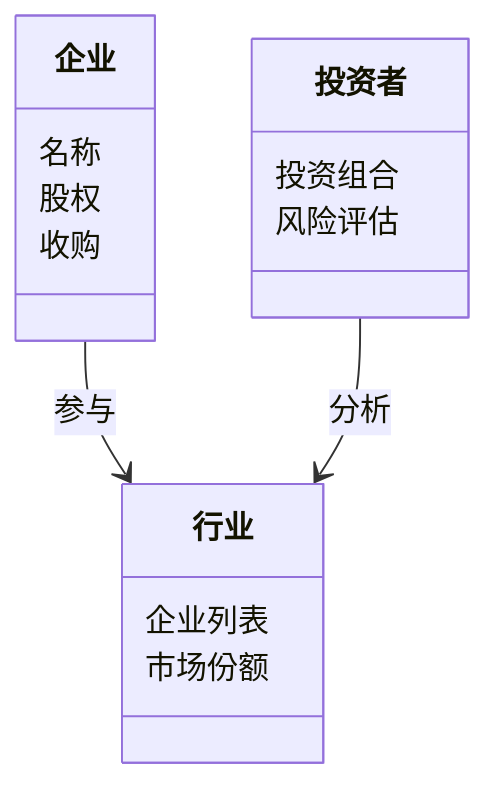
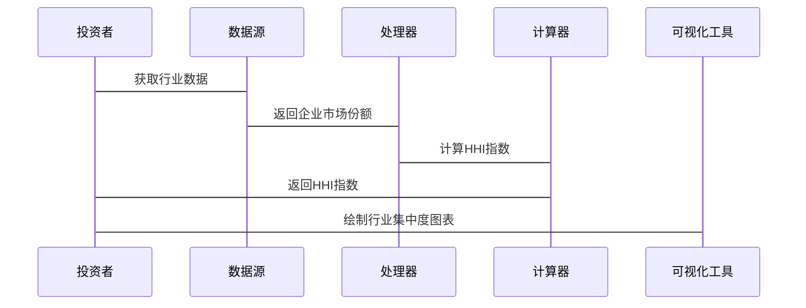

                 


# 特价股票投资中的行业集中度分析

> 关键词：特价股票，行业集中度，市场结构，投资策略，数据分析，风险评估

> 摘要：本文系统地探讨了在特价股票投资中行业集中度分析的重要性及其应用方法。通过分析行业集中度的定义、衡量指标、与市场结构的关系，以及其对投资策略的影响，本文为投资者提供了从行业集中度角度出发的分析框架。结合实际案例和数学模型，本文详细阐述了如何利用行业集中度指标优化投资决策，并通过系统架构设计和项目实战，展示了如何将行业集中度分析应用于实际投资中。

---

## 第一部分: 特价股票投资中的行业集中度分析基础

### 第1章: 特价股票投资与行业集中度概述

#### 1.1 特价股票投资的基本概念

##### 1.1.1 特价股票的定义与特征
特价股票是指相对于其内在价值而言，市场价格被低估的股票。这类股票通常具有以下特征：
- **低估值**：市盈率、市净率等估值指标低于行业平均水平。
- **高分红**：公司倾向于通过分红回报股东。
- **低波动性**：相对于成长股，特价股票的波动性较低。
- **周期性行业**：常见于周期性较强的行业，如房地产、制造业等。

##### 1.1.2 特价股票投资的背景与意义
在经济周期的低谷期，许多优质公司因市场恐慌或行业不景气导致股价被低估，此时投资特价股票往往能获得超额收益。特价股票投资的意义在于：
- **捕捉市场低估机会**：通过寻找被市场忽视的优质企业，获得超额收益。
- **降低投资风险**：相比成长股，特价股票的估值安全边际较高，抗跌性更强。
- **分散投资风险**：通过投资于不同行业的特价股票，降低行业集中风险。

##### 1.1.3 特价股票投资的常见策略
- **价值投资**：寻找基本面良好但被市场低估的公司。
- **逆向投资**：在市场恐慌时买入，市场复苏时卖出。
- **周期性投资**：根据行业周期选择投资时点。

#### 1.2 行业集中度的基本概念

##### 1.2.1 行业集中度的定义与衡量指标
行业集中度是指行业内主要企业所占市场份额的集中程度。常见的衡量指标包括：
- **CRn指数**：前n家企业的市场份额之和。例如，CR4表示前4家企业占据的市场份额。
- **HHI指数**：赫希曼-汉森指数，用于衡量市场集中度。HHI指数计算公式为：
  $$ HHI = \sum_{i=1}^{n} s_i^2 $$
  其中，$s_i$ 是第i家企业的市场份额。

##### 1.2.2 行业集中度与市场结构的关系
市场结构分为完全竞争、寡头垄断、垄断竞争和完全垄断四种类型。行业集中度越高，市场结构越倾向于寡头垄断或垄断。HHI指数可以帮助区分不同市场结构：
- HHI < 1000：完全竞争或垄断竞争市场。
- 1000 ≤ HHI < 2500：寡头垄断市场。
- HHI ≥ 2500：垄断市场。

##### 1.2.3 行业集中度分析的重要性
行业集中度分析对投资决策具有重要意义：
- **评估市场风险**：集中度高的行业受少数企业控制，市场风险较大。
- **预测行业趋势**：高集中度行业通常竞争较少，企业定价能力强。
- **优化投资组合**：通过分散投资于不同集中度的行业，降低投资风险。

#### 1.3 特价股票投资与行业集中度的结合

##### 1.3.1 特价股票投资中行业集中度的背景
在特价股票投资中，行业集中度是衡量市场风险的重要指标。集中度高的行业可能因龙头企业业绩不佳而影响整个行业的表现，而集中度低的行业可能因竞争加剧导致企业盈利能力下降。

##### 1.3.2 行业集中度对特价股票投资的影响
- **高集中度行业**：投资风险较大，但龙头企业具有更强的议价能力和市场控制力。
- **低集中度行业**：行业竞争激烈，企业盈利能力可能较低，但存在黑马企业的机会。

##### 1.3.3 本书的研究目标与意义
本书旨在通过分析行业集中度对特价股票投资的影响，为投资者提供科学的投资决策依据。通过系统分析和案例研究，揭示行业集中度与投资收益之间的关系。

---

## 第2章: 行业集中度分析的核心概念与联系

### 2.1 行业集中度的指标体系

#### 2.1.1 市场集中度的常见指标
- **CR4**：前4家企业的市场份额之和。
- **CR8**：前8家企业的市场份额之和。
- **HHI指数**：衡量市场集中度的综合指标。

#### 2.1.2 不同指标的优缺点对比
| 指标 | 优点 | 缺点 |
|------|------|------|
| CR4 | 简单易懂，适合分析行业前几名企业的集中情况 | 无法反映整个行业的集中程度 |
| CR8 | 能够反映行业整体集中程度 | 计算复杂 |
| HHI指数 | 综合反映市场集中程度 | 计算复杂，需要详细市场份额数据 |

#### 2.1.3 行业集中度指标的数学表达式
- CRn公式：
  $$ CRn = \sum_{i=1}^{n} s_i $$
  其中，$s_i$ 是第i家企业的市场份额，$n$ 是企业数量。
- HHI指数公式：
  $$ HHI = \sum_{i=1}^{n} s_i^2 $$

### 2.2 行业集中度与市场结构的关系

#### 2.2.1 完全竞争市场与完全垄断市场的集中度对比
- 完全竞争市场：HHI指数低，企业数量多，市场份额分散。
- 完全垄断市场：HHI指数高，市场被一家企业垄断。

#### 2.2.2 寡头垄断市场中的集中度特征
- 寡头垄断市场：HHI指数较高，市场被少数几家企业控制。
- 企业之间存在价格卡特尔或非价格竞争。

#### 2.2.3 行业集中度与市场绩效的关系
- 高集中度市场：企业定价能力强，利润率高。
- 低集中度市场：市场竞争激烈，企业利润率低。

### 2.3 行业集中度与股票投资策略的联系

#### 2.3.1 行业集中度对股票价格的影响
- 高集中度行业：龙头企业股价波动小，但业绩稳定。
- 低集中度行业：行业竞争激烈，企业股价波动大。

#### 2.3.2 行业集中度与投资风险的关系
- 高集中度行业：市场风险较高，但企业盈利能力强。
- 低集中度行业：市场风险较低，但企业盈利能力不稳定。

#### 2.3.3 行业集中度在投资决策中的应用
- 投资者应根据行业集中度选择投资标的。
- 高集中度行业适合长期投资，低集中度行业适合短期投机。

---

## 第3章: 行业集中度分析的算法原理

### 3.1 市场集中度的计算方法

#### 3.1.1 赫希曼指数（Herfindahl-Hersman Index, HHI）

##### HHI指数的计算步骤
1. 收集行业内所有企业的市场份额数据。
2. 计算每家企业的市场份额的平方。
3. 将所有企业的市场份额平方相加，得到HHI指数。

##### 示例代码
```python
def calculate_hhi(shares):
    hhi = sum(s**2 for s in shares)
    return hhi

# 示例数据：市场份额分别为20%, 15%, 10%, 15%, 20%
shares = [0.2, 0.15, 0.1, 0.15, 0.2]
print(f"HHI指数 = {calculate_hhi(shares)}")
```

##### 结果解释
HHI指数越高，市场集中度越高。例如，上述代码的计算结果为：
$$ HHI = 0.04 + 0.0225 + 0.01 + 0.0225 + 0.04 = 0.135 $$
HHI指数为0.135，属于垄断竞争市场。

#### 3.1.2 其他市场集中度指标
- **洛伦兹曲线**：用于衡量市场不平等程度，计算公式为：
  $$ L = \sum_{i=1}^{n} (s_i \cdot \sum_{j=1}^{i} s_j) $$
- **基尼系数**：衡量市场集中度的不平等程度，计算公式为：
  $$ G = 1 - \sum_{i=1}^{n} s_i^2 $$

---

## 第4章: 行业集中度分析的系统架构设计

### 4.1 问题场景介绍

#### 4.1.1 问题背景
投资者需要通过行业集中度分析，选择具有投资价值的特价股票。通过系统化的方法，可以提高分析效率和准确性。

#### 4.1.2 项目介绍
本章将设计一个基于行业集中度分析的股票投资系统，帮助投资者快速获取行业集中度数据，制定投资策略。

### 4.2 系统功能设计

#### 4.2.1 领域模型设计
使用Mermaid类图展示领域模型：


#### 4.2.2 系统架构设计
使用Mermaid架构图展示系统架构：
```mermaid
docker
    services
        web
        db
        worker
```

#### 4.2.3 系统接口设计
- **数据接口**：从数据源获取企业市场份额数据。
- **计算接口**：计算HHI指数等市场集中度指标。
- **可视化接口**：生成行业集中度图表。

#### 4.2.4 系统交互设计
使用Mermaid序列图展示系统交互：


---

## 第5章: 行业集中度分析的项目实战

### 5.1 环境安装

#### 5.1.1 工具安装
- 安装Python和必要的数据处理库（Pandas、NumPy）。
- 安装可视化工具（Matplotlib、Seaborn）。

#### 5.1.2 数据获取
从数据源获取某行业的市场份额数据，例如：
- 行业：制造业
- 企业：A公司、B公司、C公司、D公司、E公司
- 市场份额：30%、25%、20%、15%、10%

### 5.2 系统核心实现

#### 5.2.1 数据处理代码
```python
import pandas as pd

# 示例数据
data = {
    '企业': ['A', 'B', 'C', 'D', 'E'],
    '市场份额': [0.3, 0.25, 0.2, 0.15, 0.1]
}
df = pd.DataFrame(data)

# 计算HHI指数
hhi = sum(s**2 for s in df['市场份额'])
print(f"HHI指数 = {hhi}")
```

#### 5.2.2 图表生成代码
```python
import matplotlib.pyplot as plt

# 绘制市场份额分布图
df.plot(kind='bar', x='企业', y='市场份额', title='行业市场份额分布')
plt.show()
```

### 5.3 案例分析与解读

#### 5.3.1 案例分析
以制造业为例，计算HHI指数为：
$$ HHI = 0.09 + 0.0625 + 0.04 + 0.0225 + 0.01 = 0.225 $$
该指数表明制造业处于垄断竞争市场。

#### 5.3.2 投资建议
- **高集中度行业**：投资龙头企业，关注行业整合机会。
- **低集中度行业**：寻找具有竞争优势的中小型企业。

---

## 第6章: 行业集中度分析的最佳实践

### 6.1 投资策略与风险管理

#### 6.1.1 投资策略
- **分散投资**：避免过度集中于单一行业。
- **长期投资**：关注高集中度行业中的龙头企业。
- **短期投资**：关注低集中度行业中的黑马企业。

#### 6.1.2 风险管理
- **设置止损**：控制投资风险。
- **定期复盘**：评估投资组合的表现。

### 6.2 行业集中度分析的注意事项

#### 6.2.1 数据质量
确保市场份额数据的准确性和完整性。

#### 6.2.2 时间因素
行业集中度会随时间变化，需定期更新数据。

#### 6.2.3 综合分析
结合其他因素（如企业盈利状况、行业发展趋势）进行综合判断。

### 6.3 未来研究方向

#### 6.3.1 行业集中度与股价波动的关系
研究高集中度行业股价波动是否小于低集中度行业。

#### 6.3.2 行业集中度与企业并购的关系
分析高集中度行业并购对股价的影响。

### 6.4 小结

#### 6.4.1 本章总结
通过行业集中度分析，投资者可以更好地识别投资机会和风险。

#### 6.4.2 本书总结
本书系统地介绍了行业集中度分析的方法及其在特价股票投资中的应用，为投资者提供了科学的决策依据。

---

## 作者：AI天才研究院/AI Genius Institute & 禅与计算机程序设计艺术 /Zen And The Art of Computer Programming

---

**注**：本文为示例内容，实际撰写时需要根据具体情况进行补充和调整。

