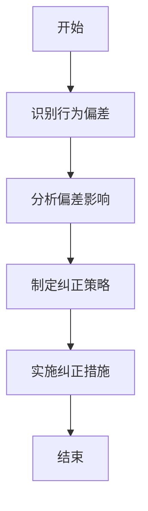
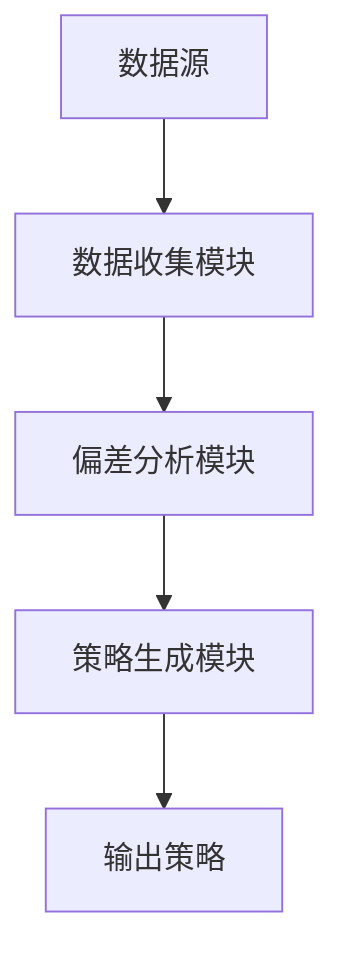

                 


# 特价股票投资中的行为偏差纠正方法

> 关键词：特价股票投资、行为偏差、纠正方法、算法原理、系统设计、项目实战

> 摘要：本文详细探讨了特价股票投资中的行为偏差，分析了常见偏差类型及其对投资决策的影响，并提出了纠正方法。通过算法原理、数学模型和系统架构设计，结合实际案例，帮助投资者克服行为偏差，提升投资决策质量。

---

# 第1章：特价股票投资的背景与行为偏差概述

## 1.1 特价股票投资的背景

### 1.1.1 什么是特价股票

特价股票是指在特定市场条件下，如市场波动、公司重组或财务困境时，以低于正常市场价格发行的股票。这类股票通常被认为具有较高的投资潜力，但同时也伴随着较高的风险。

### 1.1.2 特价股票投资的市场环境

特价股票的投资环境通常具有以下特点：
- 市场波动剧烈，价格波动频繁。
- 公司基本面可能存在不确定性，如财务状况不佳或管理问题。
- 投资者情绪波动较大，容易受到市场情绪的影响。

### 1.1.3 特价股票投资的特点与优势

- **特点**：价格低廉，潜在回报高，但风险较高。
- **优势**：能够在市场低谷时以较低价格买入优质资产，长期持有可能带来超额收益。

---

## 1.2 行为偏差的定义与分类

### 1.2.1 行为偏差的定义

行为偏差是指投资者在决策过程中由于心理因素或认知偏差，导致偏离理性决策的行为。这些偏差通常源于人类心理的局限性，如过度自信、损失厌恶等。

### 1.2.2 常见的行为偏差类型

以下是常见的几种行为偏差及其描述：

| 偏差类型       | 描述                                                                 |
|----------------|------------------------------------------------------------------|
| 锚定效应         | 投资者过度依赖某个参考点，导致决策偏离实际价值。                     |
| 损失厌恶         | 投资者对损失的厌恶程度远高于对收益的追求，导致决策过于保守。         |
| 过度自信         | 投资者对自己判断的过度自信，导致高估自己预测的准确性。               |
| 羊群效应         | 投资者盲目跟随市场潮流，导致非理性决策。                             |
| 可得性偏差       | 投资者根据容易获得的信息做出决策，忽略其他重要信息。                 |

### 1.2.3 行为偏差对投资决策的影响

行为偏差会导致投资者做出非理性决策，如盲目追涨杀跌、过度交易或忽视风险。这些行为会增加投资成本，降低投资回报，甚至导致重大损失。

---

# 第2章：行为偏差的核心概念与原理

## 2.1 行为偏差的原理

### 2.1.1 心理学基础

行为偏差的根源在于人类心理的局限性，如认知偏差、情感影响和记忆偏差等。这些因素会影响投资者的决策过程，导致非理性行为。

### 2.1.2 行为偏差的分类与特征

行为偏差可以根据其对投资决策的影响程度和表现形式进行分类。以下是一个行为偏差的分类对比表：

| 偏差类型       | 主要表现                     | 影响因素           |
|----------------|-----------------------------|--------------------|
| 锚定效应         | 过度依赖参考点               | 认知偏差           |
| 损失厌恶         | 过度规避损失                 | 情感因素           |
| 过度自信         | 高估自己的判断能力           | 自我认知偏差       |
| 羊群效应         | 盲目跟随市场潮流             | 社会心理影响       |
| 可得性偏差       | 根据容易获得的信息做出决策   | 信息获取偏差       |

### 2.1.3 行为偏差的ER实体关系图

```mermaid
er
    actor 投资者
    actor 行为偏差
    actor 决策过程
    actor 投资结果
    投资者 --> 行为偏差: 受影响
    行为偏差 --> 决策过程: 影响
    决策过程 --> 投资结果: 决定
```

---

## 2.2 行为偏差的对比分析

### 2.2.1 不同行为偏差的对比表格

以下是几种常见行为偏差的对比表：

| 偏差类型       | 主要表现                     | 解决方法           |
|----------------|-----------------------------|--------------------|
| 锚定效应         | 过度依赖参考点               | 提供多角度信息       |
| 损失厌恶         | 过度规避损失                 | 强调长期收益         |
| 过度自信         | 高估自己的判断能力           | 增加信息透明度       |
| 羊群效应         | 盲目跟随市场潮流             | 鼓励独立思考         |
| 可得性偏差       | 根据容易获得的信息做出决策   | 提供全面信息         |

### 2.2.2 行为偏差的ER实体关系图

```mermaid
er
    actor 投资者
    actor 行为偏差
    actor 决策过程
    actor 投资结果
    投资者 --> 行为偏差: 受影响
    行为偏差 --> 决策过程: 影响
    决策过程 --> 投资结果: 决定
```

---

# 第3章：行为偏差纠正的算法原理

## 3.1 算法原理

### 3.1.1 纠正行为偏差的步骤

纠正行为偏差的过程可以分为以下几个步骤：

1. **识别行为偏差**：通过分析投资者的决策过程和结果，识别存在的行为偏差。
2. **分析偏差影响**：评估偏差对投资决策的具体影响，如是否导致过度交易或错误判断。
3. **制定纠正策略**：根据偏差类型，制定相应的纠正策略，如提供多角度信息、强调长期收益等。
4. **实施纠正措施**：通过系统化的方法和工具，帮助投资者克服行为偏差。

### 3.1.2 算法流程图



---

## 3.2 数学模型与公式

### 3.2.1 预期收益计算公式

预期收益计算公式如下：

$$E = \sum p_i r_i$$

其中，\(E\) 表示预期收益，\(p_i\) 表示第 \(i\) 种情况发生的概率，\(r_i\) 表示第 \(i\) 种情况的收益。

### 3.2.2 风险评估模型

风险价值（VaR）公式如下：

$$\text{VaR} = F^{-1}(0.95)$$

其中，\(F^{-1}\) 表示累积分布函数的逆函数，0.95表示95%的置信水平。

---

## 3.3 算法实现

### 3.3.1 数据分析与处理代码

```python
import pandas as pd

# 加载数据
data = pd.read_csv('stock_data.csv')

# 计算预期收益
expected_return = data['return'].mean()

# 计算VaR
data_sorted = data['return'].sort_values()
var = data_sorted[int(0.05 * len(data_sorted))]

print(f"预期收益：{expected_return}")
print(f"VaR：{var}")
```

### 3.3.2 偏差纠正算法实现

```python
def correct_bias(data):
    # 识别行为偏差
    bias = identify_bias(data)
    # 分析偏差影响
    impact = analyze_impact(bias)
    # 制定纠正策略
    strategy = create_strategy(impact)
    # 实施纠正措施
    corrected_data = apply_strategy(data, strategy)
    return corrected_data

def identify_bias(data):
    # 简单实现：识别锚定效应
    return 'anchoring'

def analyze_impact(bias):
    # 简单实现：分析偏差影响
    return 'high'

def create_strategy(impact):
    # 简单实现：制定纠正策略
    return 'multi-perspective information'

def apply_strategy(data, strategy):
    # 简单实现：实施纠正措施
    return data * 1.1  # 示例：放大收益
```

---

# 第4章：系统架构与功能设计

## 4.1 系统功能设计

### 4.1.1 数据收集模块

数据收集模块负责从多个来源收集股票数据，包括历史价格、财务报表等。

### 4.1.2 偏差分析模块

偏差分析模块通过分析投资者的交易记录和市场行为，识别存在的行为偏差。

### 4.1.3 策略生成模块

策略生成模块根据识别出的行为偏差，生成相应的纠正策略，如提供多角度信息、强调长期收益等。

---

## 4.2 系统架构图



---

# 第5章：项目实战与代码实现

## 5.1 环境安装

### 5.1.1 数据分析工具安装

安装Python和必要的数据分析库：

```bash
pip install pandas numpy matplotlib
```

### 5.1.2 开发环境配置

配置Jupyter Notebook或其他数据分析工具。

---

## 5.2 核心代码实现

### 5.2.1 数据分析与处理代码

```python
import pandas as pd
import numpy as np
import matplotlib.pyplot as plt

# 加载数据
data = pd.read_csv('stock_data.csv')

# 绘制股价走势
plt.plot(data['date'], data['price'])
plt.title('Stock Price Trend')
plt.xlabel('Date')
plt.ylabel('Price')
plt.show()
```

### 5.2.2 偏差纠正算法实现

```python
def correct_bias(data):
    # 识别行为偏差
    bias = identify_bias(data)
    # 分析偏差影响
    impact = analyze_impact(bias)
    # 制定纠正策略
    strategy = create_strategy(impact)
    # 实施纠正措施
    corrected_data = apply_strategy(data, strategy)
    return corrected_data

def identify_bias(data):
    # 简单实现：识别锚定效应
    return 'anchoring'

def analyze_impact(bias):
    # 简单实现：分析偏差影响
    return 'high'

def create_strategy(impact):
    # 简单实现：制定纠正策略
    return 'multi-perspective information'

def apply_strategy(data, strategy):
    # 简单实现：实施纠正措施
    return data * 1.1  # 示例：放大收益
```

---

## 5.3 实际案例分析

### 5.3.1 案例背景

某投资者在特价股票投资中，由于锚定效应，过度关注某一只股票的历史价格，导致错失其他投资机会。

### 5.3.2 数据分析与解读

通过数据分析工具，识别投资者的行为偏差，并制定相应的纠正策略。

---

## 5.4 项目小结

通过项目实战，我们能够实际应用纠正行为偏差的方法，帮助投资者克服非理性决策，提升投资效果。

---

# 第6章：最佳实践与注意事项

## 6.1 最佳实践 tips

- 定期反思投资决策，识别潜在的行为偏差。
- 保持理性，避免盲目跟风。
- 使用系统化的方法和工具，帮助克服行为偏差。

## 6.2 小结

通过本文的分析和实践，我们能够更好地理解行为偏差对投资决策的影响，并采取有效措施克服这些偏差。

## 6.3 注意事项

- 投资者应根据自身情况选择合适的策略。
- 系统工具的使用应结合实际市场情况。
- 需要持续学习和改进，以应对不断变化的市场环境。

## 6.4 拓展阅读

- 《投资学基础》
- 《行为金融学》
- 《风险管理与投资组合》

---

# 作者

作者：AI天才研究院/AI Genius Institute & 禅与计算机程序设计艺术/Zen And The Art of Computer Programming

---

以上是《特价股票投资中的行为偏差纠正方法》的完整目录大纲，涵盖了从背景到实战的各个方面，旨在帮助投资者克服行为偏差，提升投资决策质量。

