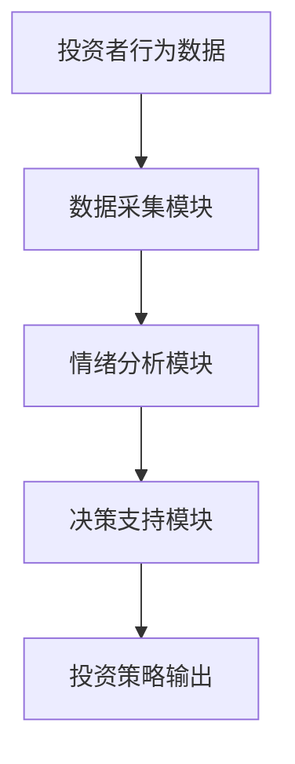

                 


# 特价股票投资中的行为科学应用技巧

> 关键词：行为科学，特价股票，投资技巧，认知偏差，情绪影响，系统架构

> 摘要：本文深入探讨了行为科学在特价股票投资中的应用，通过分析投资者的认知偏差和情绪影响，结合具体案例和系统架构，提供了一套科学的投资策略。文章从背景介绍、核心理论、策略制定、系统设计到实战案例，层层递进，帮助投资者更好地理解和应用行为科学原理，优化投资决策。

---

## 第一部分：特价股票投资的背景与行为科学基础

### 第1章：特价股票投资的背景与概念

#### 1.1 特价股票投资的定义与特点

**1.1.1 特价股票的定义**  
特价股票通常指在特定市场环境下价格被低估的股票。这些股票可能因市场波动、公司短期问题或市场情绪影响而价格低于其内在价值。

**1.1.2 特价股票投资的核心特点**  
- 价格与价值的偏离：股价低于公司基本面反映的价值。  
- 短期波动性：市场情绪和外部事件可能导致价格波动。  
- 投资机会：低价股票可能蕴含较高的潜在回报。

**1.1.3 特价股票投资的市场背景**  
特价股票投资常见于熊市或市场低迷时期，投资者通过寻找被市场错估的股票，利用价格波动获利。

#### 1.2 行为科学的基本概念

**1.2.1 行为科学的定义**  
行为科学是研究人类行为的跨学科领域，结合心理学、经济学和社会学，分析个体和群体的行为模式。

**1.2.2 行为科学在投资中的应用领域**  
- 认知偏差：投资者常见的心理偏差，如过度自信、从众心理。  
- 情绪影响：市场情绪如何影响投资决策。  
- 社会行为：群体行为对市场的影响。

**1.2.3 行为科学与传统金融理论的结合**  
行为金融学结合传统金融理论，解释市场中的非理性行为，帮助投资者制定更优策略。

#### 1.3 特价股票投资中的行为科学应用

**1.3.1 行为科学在特价股票投资中的重要性**  
行为科学帮助投资者识别和克服认知偏差，抓住市场错估的机会。

**1.3.2 特价股票投资中的常见行为偏差**  
- 过度悲观：投资者因市场低迷而过度卖出股票。  
- 从众心理：投资者跟随市场情绪而非基本面进行投资。  
- 处理间隔效应：投资者因信息过载而延迟决策。

**1.3.3 行为科学如何帮助投资者做出更优决策**  
通过识别和纠正行为偏差，投资者可以更好地捕捉特价股票的机会。

---

## 第二部分：行为科学的核心理论与模型

### 第2章：投资者行为分析

#### 2.1 投资者认知偏差与行为偏差

**2.1.1 认知偏差的核心概念**  
认知偏差是投资者因心理因素导致的判断错误，影响投资决策。

**2.1.2 认知偏差与行为偏差的对比**

| 概念 | 认知偏差 | 行为偏差 |
|------|----------|----------|
| 定义 | 思考过程中的错误 | 行动过程中的错误 |
| 示例 | 选择性记忆 | 过度交易 |

**2.1.3 常见认知偏差对投资决策的影响**  
- 过度自信：高估自身判断能力，导致投资失误。  
- 确认偏差：只关注支持自己观点的信息。  
- 损失厌恶：害怕损失，导致错失投资机会。

**2.1.4 投资者情绪对决策的影响**

**2.1.5 行为科学如何解释投资者情绪**  
情绪波动导致投资者在市场高峰期追涨，在低谷期杀跌。

---

## 第三部分：特价股票投资中的行为科学应用技巧

### 第3章：行为科学驱动的投资策略

#### 3.1 投资者情绪分析与策略制定

**3.1.1 投资者情绪的量化分析**  
通过市场情绪指标（如恐慌指数）量化投资者情绪，指导投资决策。

**3.1.2 基于情绪分析的策略制定**

- 当市场情绪低落时，寻找被低估的特价股票。  
- 当市场情绪高涨时，警惕潜在的回调风险。

#### 3.2 认知偏差与投资决策优化

**3.2.1 识别和纠正认知偏差**  
通过自我反思和数据验证，减少认知偏差对决策的影响。

**3.2.2 制定决策框架**

- 设定明确的投资目标。  
- 建立严格的投资纪律，避免情绪化决策。  
- 定期回顾和调整投资策略。

---

## 第四部分：系统架构与技术实现

### 第4章：行为科学驱动的系统架构设计

#### 4.1 系统功能设计

**4.1.1 系统功能模块**

- 数据采集模块：收集市场数据和情绪指标。  
- 分析模块：识别认知偏差和情绪影响。  
- 决策模块：制定基于行为科学的策略。

**4.1.2 系统架构图**



---

## 第五部分：项目实战与案例分析

### 第5章：基于行为科学的项目实战

#### 5.1 项目环境与工具安装

**5.1.1 环境要求**  
- 操作系统：Windows/Mac/Linux  
- 开发工具：Python, Jupyter Notebook  
- 数据源：股票数据 API（如Yahoo Finance）

#### 5.2 核心代码实现

```python
import pandas as pd
import numpy as np
from sklearn.model_selection import train_test_split
from sklearn.metrics import accuracy_score

# 数据预处理
def preprocess_data(data):
    data['情绪指数'] = data['情绪指数'].apply(lambda x: 1 if x > 0 else 0)
    return data

# 情绪分类模型
def emotion_classifier(data):
    X = data.drop('情绪指数', axis=1)
    y = data['情绪指数']
    X_train, X_test, y_train, y_test = train_test_split(X, y, test_size=0.2)
    # 假设使用简单的分类器（示例）
    from sklearn.linear_model import LogisticRegression
    model = LogisticRegression().fit(X_train, y_train)
    y_pred = model.predict(X_test)
    print(f"准确率: {accuracy_score(y_test, y_pred)}")
    return model

# 应用模型进行投资决策
def invest_decision(model, new_data):
    prediction = model.predict(new_data)
    if prediction == 1:
        return "买入"
    else:
        return "卖出"
```

---

## 第六部分：总结与展望

### 第6章：总结与最佳实践

#### 6.1 最佳实践

- 定期回顾投资决策，识别和纠正认知偏差。  
- 结合市场情绪和基本面分析，制定科学的投资策略。  
- 使用行为科学工具和技术优化投资流程。

#### 6.2 未来展望

行为科学在投资领域的应用将更加深入，结合人工智能和大数据技术，投资者将能够更精准地捕捉市场机会，优化投资决策。

---

## 作者：AI天才研究院/AI Genius Institute & 禅与计算机程序设计艺术 /Zen And The Art of Computer Programming

---

以上是文章的完整大纲和部分内容展示，您可以根据实际需要扩展每一部分的内容。

