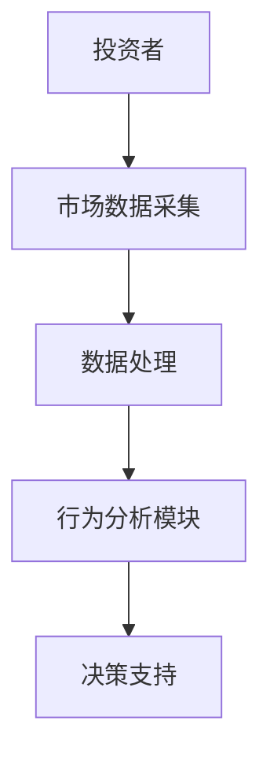

                 


# 特价股票投资中的行为金融学陷阱及其规避

---

## 关键词

- 行为金融学
- 特价股票投资
- 陷阱识别
- 心理偏差
- 市场情绪

---

## 摘要

行为金融学是研究投资者心理与市场行为的交叉学科，在特价股票投资中尤其重要。本文系统分析了行为金融学中的常见陷阱，包括心理偏差、市场情绪和信息偏差，并提出了基于行为金融学理论的识别与规避策略。文章结合算法模型和系统设计，探讨了如何通过技术手段辅助投资者避免行为陷阱，实现理性投资。

---

## 第一部分: 行为金融学与特价股票投资概述

### 第1章: 行为金融学的基本概念

#### 1.1 行为金融学的定义

行为金融学（Behavioral Finance）是研究投资者心理、情感和认知偏差如何影响金融市场行为的学科。它结合了心理学和经济学的理论，揭示了传统理性模型无法解释的市场现象。

#### 1.2 特价股票投资的定义与特点

特价股票投资是指以低于市场价或内在价值的价格买入股票，期望通过价格回归或公司价值提升实现收益的投资策略。其特点包括高风险、高收益、短期波动大、信息不对称等。

#### 1.3 行为金融学在特价股票投资中的作用

行为金融学帮助投资者识别和规避因心理偏差和市场情绪导致的非理性决策，从而提高投资成功率。

### 第2章: 行为金融学陷阱的类型与特征

#### 2.1 心理偏差类陷阱

心理偏差是人类认知过程中的系统性错误，如过度自信、确认偏差、损失厌恶等。这些偏差会导致投资者在特价股票投资中做出错误决策。

#### 2.2 市场情绪类陷阱

市场情绪波动是影响股票价格的重要因素。投资者因贪婪或恐惧情绪而追涨杀跌，往往导致投资亏损。

#### 2.3 信息偏差类陷阱

信息不对称和信息过载会导致投资者基于片面或错误信息做出投资决策。

### 第3章: 投资者行为与行为金融学陷阱的关系

#### 3.1 投资者行为分析

投资者在面对特价股票时，往往因心理偏差和市场情绪影响而做出非理性决策，如盲目跟风、过度交易等。

#### 3.2 陷阱对投资者决策的影响

心理偏差和市场情绪会导致投资者忽视基本面分析，过度依赖短期价格波动，增加投资风险。

### 第4章: 行为金融学陷阱的识别与规避方法

#### 4.1 陷阱识别的核心方法

通过分析投资者行为、市场情绪和信息偏差，识别潜在的行为陷阱。

#### 4.2 陷阱规避的具体策略

包括心理调节、市场分析和信息筛选等方法，帮助投资者避免行为陷阱。

---

## 第二部分: 行为金融学陷阱的系统分析与规避策略

### 第5章: 算法原理与数学模型

#### 5.1 前景理论模型

前景理论（Prospect Theory）由Kahneman和Tversky提出，解释了投资者在面对收益和损失时的不同决策倾向。

#### 5.2 损失厌恶模型

损失厌恶是人类对损失的敏感性高于收益的倾向，影响投资者在特价股票中的决策。

#### 5.3 算法实现

使用Python代码实现前景理论模型，模拟投资者决策过程。

```python
def prospect_theory(value, probability):
    # 简化的前景理论模型
    if value > 0:
        utility = (value ** 0.88) * (probability ** 0.52)
    else:
        utility = -(abs(value) ** 0.69) * (probability ** 0.52)
    return utility

# 示例
value = 100  # 收益
probability = 0.5
print(prospect_theory(value, probability))  # 输出：100^0.88 * 0.5^0.52
```

### 第6章: 系统分析与架构设计

#### 6.1 系统功能设计

设计一个投资决策支持系统，帮助投资者识别行为陷阱，优化决策过程。

#### 6.2 系统架构图

使用Mermaid绘制系统架构图，展示模块间的交互关系。



#### 6.3 系统接口设计

定义系统接口，确保模块之间的数据交互和通信。

### 第7章: 项目实战与案例分析

#### 7.1 项目环境安装

安装必要的工具和库，如Python、Pandas、Matplotlib等。

#### 7.2 系统核心实现

实现行为分析模块，检测市场情绪和投资者心理偏差。

#### 7.3 案例分析

分析一个具体案例，展示如何识别和规避行为陷阱。

#### 7.4 项目总结

总结项目成果，提出改进建议。

---

## 第三部分: 最佳实践与投资建议

### 第8章: 投资者行为的最佳实践

#### 8.1 心理调节策略

保持冷静，避免情绪化决策。

#### 8.2 信息筛选策略

依赖基本面分析，避免盲目跟风。

#### 8.3 决策优化策略

定期复盘，优化投资策略。

### 第9章: 总结与展望

#### 9.1 总结

行为金融学为投资者识别和规避陷阱提供了理论支持和技术工具。

#### 9.2 展望

未来，结合AI和大数据技术，行为金融学将在投资领域发挥更大作用。

---

## 作者

作者：AI天才研究院/AI Genius Institute  
& 禅与计算机程序设计艺术 /Zen And The Art of Computer Programming

