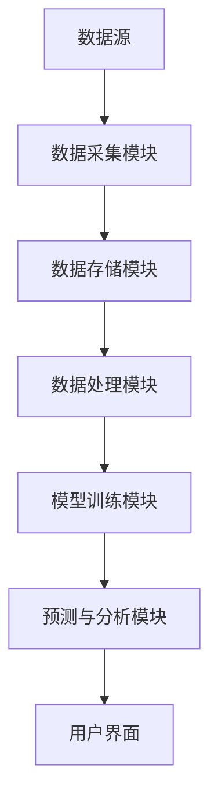

                 


# 特价股票投资中的计算社会科学与行为金融学应用

---

## 关键词：
- 特价股票投资
- 行为金融学
- 计算社会科学
- 机器学习
- 股票价格预测
- 大数据分析

---

## 摘要：
本文深入探讨了特价股票投资中计算社会科学与行为金融学的应用，结合背景介绍、行为金融学基础、计算社会科学的应用、算法与数学模型、系统架构设计、项目实战以及结论等部分，系统性地分析了如何利用这些学科的理论与方法进行股票投资。文章通过具体案例和数学模型，展示了如何在实际操作中应用这些方法，为投资者提供了理论与实践相结合的指导。

---

## 第一部分: 特价股票投资中的计算社会科学与行为金融学概述

### 第1章: 特价股票投资的背景与意义

#### 1.1 特价股票投资的定义与特点
- **1.1.1 特价股票的定义**  
  特价股票是指在特定市场条件下，价格低于其内在价值的股票。这些股票通常在市场下跌、公司业绩不佳或行业低迷时出现。

- **1.1.2 特价股票投资的特点**  
  特价股票投资具有高风险、高回报的特点，需要投资者具备较强的研究能力和市场敏感性。

- **1.1.3 特价股票投资的意义**  
  通过投资特价股票，投资者可以在市场低迷时以较低的价格购入优质资产，从而在市场回升时获得超额收益。

#### 1.2 行为金融学与计算社会科学的交叉应用
- **1.2.1 行为金融学的基本理论**  
  行为金融学研究投资者的心理和行为如何影响市场。核心理论包括有限理性、认知偏差和羊群效应。

- **1.2.2 计算社会科学的核心概念**  
  计算社会科学利用大数据分析、社会网络分析和自然语言处理等技术，研究社会现象对市场的影响。

- **1.2.3 两者的交叉与融合**  
  通过将行为金融学与计算社会科学结合，可以更准确地预测市场趋势和投资者行为。

---

### 第2章: 特价股票投资中的行为金融学基础

#### 2.1 行为金融学的核心理论
- **2.1.1 理性人假设的局限性**  
  理性人假设无法解释市场的非理性波动。

- **2.1.2 有限理性与认知偏差**  
  投资者由于认知偏差，如过度自信和确认偏差，往往做出非理性决策。

- **2.1.3 行为金融学的主要流派**  
  包括 prospect theory、bounded rationality 等。

#### 2.2 行为金融学在股票投资中的应用
- **2.2.1 市场情绪与股票价格的关系**  
  市场情绪可以通过大数据分析和社交媒体数据进行预测。

- **2.2.2 从众心理与羊群效应**  
  羊群效应在市场下跌时尤为明显，投资者往往跟随市场趋势，而非独立判断。

- **2.2.3 投资者心理与市场波动**  
  投资者情绪的波动会导致市场出现超涨或超跌，从而提供投资机会。

---

### 第3章: 计算社会科学在股票投资中的应用

#### 3.1 计算社会科学的基本概念
- **3.1.1 大数据分析在金融中的应用**  
  大数据分析技术可以帮助投资者发现市场趋势和潜在机会。

- **3.1.2 社会网络分析与金融**  
  通过分析社交网络数据，可以预测市场情绪和股票价格。

- **3.1.3 自然语言处理在金融中的应用**  
  自然语言处理技术可以分析财务报告和新闻，提取有用信息。

#### 3.2 计算社会科学在特价股票投资中的具体应用
- **3.2.1 利用大数据分析预测市场趋势**  
  通过分析历史数据，建立预测模型，判断市场走势。

- **3.2.2 社交媒体情绪分析与股票价格**  
  利用情感分析技术，从社交媒体数据中提取市场情绪，预测股票价格。

- **3.2.3 自然语言处理在财务报告分析中的应用**  
  通过分析财务报告中的关键词，预测公司业绩和股价走势。

---

## 第二部分: 特价股票投资中的算法与数学模型

### 第4章: 特价股票投资中的算法基础

#### 4.1 线性回归模型
- **线性回归模型的数学公式**  
  $$ y = \beta_0 + \beta_1 x + \epsilon $$
  其中，$y$ 是目标变量，$x$ 是自变量，$\beta_0$ 是截距，$\beta_1$ 是斜率，$\epsilon$ 是误差项。

- **线性回归的应用**  
  通过线性回归模型，可以预测股票价格的变化趋势。

#### 4.2 时间序列分析
- **时间序列分析的基本概念**  
  时间序列分析用于研究股票价格的变动规律，常用ARIMA模型。

- **ARIMA模型的数学公式**  
  $$ ARIMA(p, d, q) $$
  其中，$p$ 是自回归阶数，$d$ 是差分阶数，$q$ 是移动平均阶数。

- **时间序列分析的应用**  
  通过分析历史价格数据，预测未来价格走势。

#### 4.3 机器学习模型
- **随机森林模型**  
  随机森林是一种基于树的集成学习方法，适用于分类和回归问题。

- **神经网络模型**  
  神经网络模型通过多层网络结构，捕捉数据中的复杂模式。

---

### 第5章: 算法实现与代码示例

#### 5.1 线性回归模型的实现
```python
import numpy as np
from sklearn.linear_model import LinearRegression

# 数据准备
X = np.array([[1], [2], [3], [4], [5]])
y = np.array([2, 4, 5, 4, 6])

# 模型训练
model = LinearRegression()
model.fit(X, y)

# 预测
print(model.predict([[6]]))
```

#### 5.2 时间序列分析的实现
```python
from statsmodels.tsa.arima_model import ARIMA

# 数据准备
data = [1, 2, 3, 4, 5]

# 模型训练
model = ARIMA(data, order=(1, 1, 1))
model_fit = model.fit()

# 预测
print(model_fit.forecast(1))
```

#### 5.3 机器学习模型的实现
```python
from sklearn.ensemble import RandomForestRegressor

# 数据准备
X = [[1, 2], [3, 4], [5, 6], [7, 8], [9, 10]]
y = [2, 3, 4, 5, 6]

# 模型训练
model = RandomForestRegressor(n_estimators=100)
model.fit(X, y)

# 预测
print(model.predict([[11, 12]]))
```

---

## 第三部分: 系统分析与架构设计

### 第6章: 系统架构设计

#### 6.1 系统功能设计
- **功能模块划分**  
  1. 数据采集模块  
  2. 数据处理模块  
  3. 模型训练模块  
  4. 预测与分析模块  

#### 6.2 系统架构图


#### 6.3 接口设计
- **数据采集接口**  
  ```python
  def get_data():
      # 数据采集逻辑
  ```

- **模型训练接口**  
  ```python
  def train_model(data):
      # 模型训练逻辑
  ```

---

## 第四部分: 项目实战

### 第7章: 项目实战

#### 7.1 环境安装
```bash
pip install numpy pandas scikit-learn statsmodels
```

#### 7.2 核心代码实现
```python
import numpy as np
import pandas as pd
from sklearn.linear_model import LinearRegression
from statsmodels.tsa.arima_model import ARIMA

# 数据加载
data = pd.read_csv('stock_data.csv')

# 线性回归模型训练
model_lr = LinearRegression()
model_lr.fit(data[['open', 'close']], data['price'])

# 时间序列模型训练
model_arima = ARIMA(data['price'], order=(1, 1, 1))
model_arima_fit = model_arima.fit()
```

#### 7.3 实际案例分析
- **案例分析**  
  分析某公司的历史股价数据，利用线性回归和ARIMA模型进行预测，制定投资策略。

---

## 第五部分: 结论与展望

### 第8章: 结论与展望

#### 8.1 结论
通过结合计算社会科学和行为金融学的方法，投资者可以更准确地预测市场趋势和股票价格，从而制定有效的投资策略。

#### 8.2 展望
未来的研究可以进一步结合自然语言处理和深度学习技术，提升模型的预测精度和鲁棒性。

---

## 附录

### 附录A: 数据来源与处理代码
```python
import pandas as pd

# 数据加载
data = pd.read_csv('stock_data.csv')

# 数据清洗
data.dropna(inplace=True)
```

### 附录B: 预测模型代码
```python
from sklearn.ensemble import RandomForestRegressor

# 模型训练
model = RandomForestRegressor(n_estimators=100)
model.fit(X_train, y_train)

# 预测
y_pred = model.predict(X_test)
```

---

## 作者：AI天才研究院/AI Genius Institute & 禅与计算机程序设计艺术 /Zen And The Art of Computer Programming

---

**注：以上内容仅为示例，实际文章需要根据具体情况进行调整和补充。**

