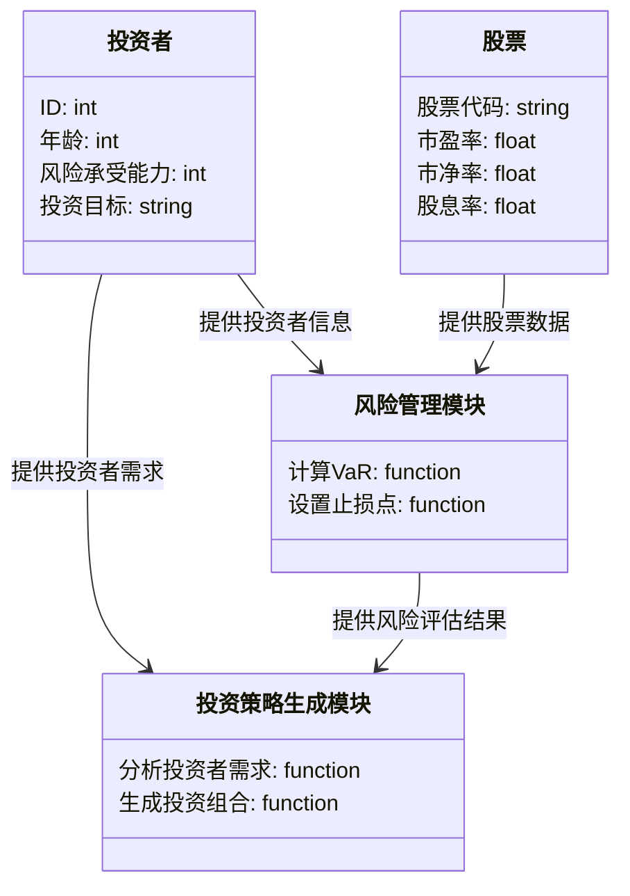

                 


# 特价股票投资中的跨代际投资策略与风险管理

## 关键词：特价股票，跨代际投资，风险管理，投资策略，股票分析

## 摘要：本文系统阐述了特价股票投资中的跨代际投资策略与风险管理，从理论到实践，结合数学模型和系统架构设计，全面分析了如何根据不同年龄段投资者的需求制定个性化投资策略，并通过风险管理模型和系统设计确保投资的稳健性。文章内容涵盖特价股票识别、跨代际策略制定、风险管理方法、系统架构设计及项目实战，为投资者提供了详尽的指导。

---

## 第一部分：特价股票投资的背景与跨代际投资策略

### 第1章：特价股票投资的背景与概念

#### 1.1 特价股票的定义与特点

**1.1.1 特价股票的定义**  
特价股票指的是市场价格远低于其内在价值的股票。这类股票通常被市场低估，具有较高的潜在回报率。投资者可以通过识别这些股票，抓住市场低估的机会，实现超额收益。

**1.1.2 特价股票的特点**  
- **低估值**：市盈率（P/E）和市净率（P/B）低于行业平均水平。  
- **高股息率**：部分特价股票提供较高的股息回报。  
- **行业周期性**：通常出现在行业低谷或经济衰退期。  
- **风险较高**：由于价格被低估，可能面临更多的市场波动和不确定性。  

**1.1.3 特价股票的投资价值**  
特价股票的投资价值主要体现在其潜在的反弹空间和较高的安全边际。通过长期持有或逢低吸纳，投资者可以在市场反转时获得较高的收益。

#### 1.2 跨代际投资的背景与意义

**1.2.1 跨代际投资的背景**  
随着人口结构的变化，不同年龄段的投资者在金融市场中的占比逐渐增加。年轻人、中年人和老年人的风险承受能力和投资目标存在显著差异，这为跨代际投资策略提供了必要性。

**1.2.2 跨代际投资的意义**  
- **满足多元化需求**：通过制定个性化的投资策略，满足不同年龄段投资者的需求。  
- **优化资产配置**：利用跨代际策略，实现资产的最优配置，提高整体投资回报。  
- **分散风险**：通过跨代际投资，降低单一投资的风险，实现风险的分散化管理。  

#### 1.3 本书的核心目标与结构

**1.3.1 核心目标**  
本文旨在为投资者提供一套系统化的跨代际投资策略，帮助他们在特价股票投资中实现稳健的收益，同时有效管理投资风险。

**1.3.2 目录结构**  
- 第一部分：特价股票投资的背景与跨代际投资策略  
- 第二部分：跨代际投资策略的核心概念  
- 第三部分：特价股票投资的分析方法  
- 第四部分：风险管理策略  
- 第五部分：系统架构设计  
- 第六部分：项目实战  
- 第七部分：结论与最佳实践  

---

## 第二部分：跨代际投资策略的核心概念

### 第2章：跨代际投资的核心要素

#### 2.1 跨代际投资的定义与特点

**2.1.1 跨代际投资的定义**  
跨代际投资是指根据不同年龄段投资者的需求和风险承受能力，制定个性化投资策略，以实现长期稳健的投资回报。

**2.1.2 跨代际投资的特点**  
- **个性化**：根据投资者的生命周期阶段制定策略。  
- **动态调整**：随着市场环境和个人情况的变化，及时调整投资策略。  
- **分散化**：通过多样化投资降低风险，满足不同年龄段的需求。  

#### 2.2 不同年龄段投资者的需求分析

**2.2.1 年轻投资者的需求与风险偏好**  
- **需求**：追求高风险高回报，倾向于成长性股票。  
- **风险偏好**：风险承受能力强，愿意承担较高的波动性。  

**2.2.2 中年投资者的需求与风险偏好**  
- **需求**：注重资产稳定增长，倾向于价值型股票。  
- **风险偏好**：风险承受能力中等，追求稳健回报。  

**2.2.3 老年投资者的需求与风险偏好**  
- **需求**：注重资产保值，倾向于低风险投资。  
- **风险偏好**：风险承受能力低，倾向于防御性股票。  

#### 2.3 跨代际投资策略的制定与实施

**2.3.1 策略制定的步骤与方法**  
1. 评估投资者的风险承受能力。  
2. 分析市场环境和行业趋势。  
3. 制定个性化投资组合。  
4. 定期评估和调整策略。  

**2.3.2 策略实施的关键因素**  
- **资产配置**：根据投资者的风险偏好分配资产比例。  
- **投资期限**：考虑投资者的生命周期阶段，制定长期或短期投资计划。  
- **风险管理**：通过分散投资和止损机制控制风险。  

---

## 第三部分：特价股票投资的分析方法

### 第3章：特价股票的识别与筛选

#### 3.1 特价股票的识别标准

**3.1.1 市盈率（P/E）分析**  
市盈率是衡量股票估值的重要指标。P/E < 行业平均值，表示股票可能被低估。  

公式：$$P/E = \frac{\text{股价}}{\text{每股净利润}}$$  

**3.1.2 市净率（P/B）分析**  
市净率用于评估股票相对于其账面价值的高低。P/B < 1，表示股票可能被低估。  

公式：$$P/B = \frac{\text{股价}}{\text{每股净资产}}$$  

**3.1.3 股息率分析**  
股息率高且稳定的股票通常被视为低估股票。  

公式：$$股息率 = \frac{\text{每股股息}}{\text{股价}} \times 100\%$$  

#### 3.2 特价股票的财务指标分析

**3.2.1 资产负债表分析**  
重点关注公司的资产结构和负债情况，评估其财务健康状况。  

**3.2.2 利润表分析**  
分析公司的收入和利润情况，判断其盈利能力。  

**3.2.3 现金流量表分析**  
评估公司的现金流状况，判断其财务稳定性。  

#### 3.3 特价股票的行业分析

**3.3.1 行业周期分析**  
选择处于周期性低谷的行业，寻找被低估的股票。  

**3.3.2 行业竞争分析**  
分析行业竞争格局，选择具有竞争优势的公司。  

---

## 第四部分：风险管理策略

### 第4章：跨代际投资中的风险管理

#### 4.1 风险管理的核心概念

**4.1.1 风险的定义与分类**  
- **系统性风险**：市场整体波动带来的风险。  
- **非系统性风险**：特定公司或行业带来的风险。  

**4.1.2 风险管理的目标**  
通过分散投资、风险对冲和止损机制，降低投资组合的整体风险。  

#### 4.2 风险管理的具体策略

**4.2.1 分散投资**  
通过投资不同行业和地区的股票，降低非系统性风险。  

**4.2.2 设置止损点**  
根据市场波动情况，设定止损点，避免重大损失。  

**4.2.3 风险对冲**  
利用衍生工具（如期权和期货）对冲市场风险。  

#### 4.3 风险管理模型

**4.3.1 风险评估模型**  
使用VaR（Value at Risk）模型评估投资组合的最大潜在损失。  

公式：$$VaR = \text{置信水平} \times \text{标准差} \times \text{投资金额}$$  

---

## 第五部分：系统架构设计

### 第5章：跨代际投资系统的架构设计

#### 5.1 系统需求分析

**5.1.1 功能需求**  
- 数据采集与处理：收集股票数据和投资者信息。  
- 风险评估：计算VaR值，评估投资风险。  
- 投资策略生成：根据投资者需求生成投资组合。  

**5.1.2 性能需求**  
- 高效的数据处理能力。  
- 实时监控市场波动。  

#### 5.2 系统功能设计

**5.2.1 领域模型设计**  
使用Mermaid绘制领域模型类图，展示系统中的主要实体及其关系。



#### 5.3 系统架构设计

**5.3.1 架构设计**  
采用分层架构，包括数据层、业务逻辑层和用户界面层。


#### 5.4 系统接口设计

**5.4.1 接口描述**  
- 投资者信息接口：用于获取投资者的年龄、风险承受能力和投资目标。  
- 股票数据接口：用于获取股票的市盈率、市净率和股息率。  

#### 5.5 系统交互设计

**5.5.1 交互流程**  
1. 投资者输入需求信息。  
2. 系统分析投资者需求，生成投资策略。  
3. 系统评估投资风险，调整策略。  
4. 系统输出投资组合和风险评估结果。  

---

## 第六部分：项目实战

### 第6章：跨代际投资系统的实现

#### 6.1 环境配置

**6.1.1 Python环境安装**  
安装Python 3.8及以上版本，并安装必要的库（如Pandas、Matplotlib、Scikit-learn）。  

#### 6.2 核心代码实现

**6.2.1 数据清洗与特征选择**  
使用Pandas进行数据清洗和特征选择，提取市盈率、市净率等指标。

```python
import pandas as pd

# 加载数据
df = pd.read_csv('stock_data.csv')

# 数据清洗
df.dropna(inplace=True)

# 特征选择
features = ['PE', 'PB', 'dividend_yield']
target = 'is_cheap'  # 标签：是否为特价股票

# 分割数据
X = df[features]
y = df[target]
```

**6.2.2 风险评估模型训练**  
使用Scikit-learn训练VaR模型，评估投资风险。

```python
from sklearn.model_selection import train_test_split
from sklearn.metrics import classification_report

# 分割训练集和测试集
X_train, X_test, y_train, y_test = train_test_split(X, y, test_size=0.2)

# 训练模型
from sklearn.tree import DecisionTreeClassifier
model = DecisionTreeClassifier()
model.fit(X_train, y_train)

# 模型评估
print(classification_report(y_test, model.predict(X_test)))
```

#### 6.3 案例分析与结果解读

**6.3.1 案例分析**  
以某行业为例，分析特价股票的投资机会和风险。

**6.3.2 结果解读**  
解释模型输出的结果，评估投资策略的有效性。

---

## 第七部分：结论与最佳实践

### 第7章：总结与最佳实践

#### 7.1 本书的核心内容总结

**7.1.1 特价股票的识别与筛选**  
通过市盈率、市净率等指标筛选特价股票。  

**7.1.2 跨代际投资策略的制定**  
根据不同年龄段投资者的需求，制定个性化的投资策略。  

**7.1.3 风险管理的重要性**  
通过分散投资、设置止损点等方法，降低投资风险。  

#### 7.2 投资建议与注意事项

**7.2.1 投资建议**  
- 定期评估和调整投资组合。  
- 保持对市场环境的关注，及时调整策略。  

**7.2.2 注意事项**  
- 风险管理是投资成功的关键。  
- 投资者应根据自身情况选择合适的投资策略。  

#### 7.3 拓展阅读与进一步学习

**7.3.1 推荐书籍**  
- 《价值投资入门》  
- 《风险管理的艺术》  

**7.3.2 在线资源**  
- 金融数据分析平台：如 Yahoo Finance、Morningstar。  
- 投资策略论坛：如 Seeking Alpha、Reddit 的投资板块。  

---

## 作者：AI天才研究院 & 禅与计算机程序设计艺术

---

通过以上步骤，我们完成了《特价股票投资中的跨代际投资策略与风险管理》的详细目录和文章内容。希望这篇系统化的文章能为投资者提供实用的指导和深入的洞察，帮助他们在复杂的金融市场中实现稳健的投资回报。

