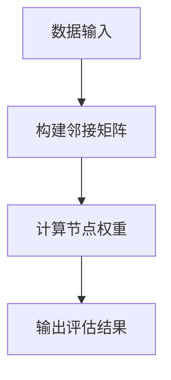
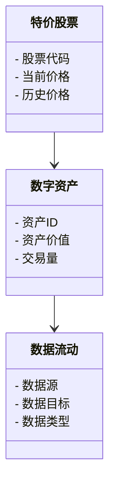
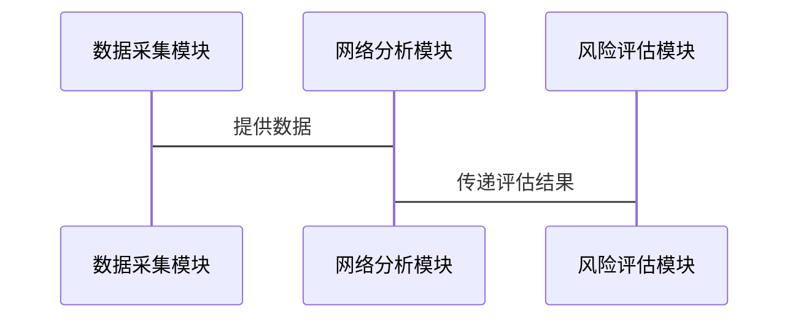

                 


# 特价股票投资中的跨境数据流动与数字资产价值网络拓扑评估策略

> 关键词：特价股票投资，跨境数据流动，数字资产，价值网络，拓扑评估，算法，系统架构

> 摘要：本文探讨了在特价股票投资中，跨境数据流动对数字资产价值网络的影响及其拓扑评估策略。通过分析数据流动的机制、数字资产网络的结构，结合图论算法，提出了一种评估策略，并通过Python代码实现，最后进行了实际案例分析。

---

# 目录

## 第一部分: 特价股票投资中的跨境数据流动与数字资产价值网络拓扑评估策略

## 第1章: 特价股票投资的背景与概述

### 1.1 特价股票投资的基本概念

#### 1.1.1 特价股票的定义与特点

特价股票是指价格低于其内在价值的股票，通常具有高成长潜力，吸引投资者在低价时介入。其特点包括低估值、高成长性和潜在的高回报。

#### 1.1.2 特价股票投资的市场背景

当前市场波动加剧，投资者寻求在市场低谷时介入，利用低价买入、高价卖出的策略获利。同时，全球经济一体化导致数据跨境流动频繁，为投资决策提供了更多数据支持。

#### 1.1.3 特价股票投资的核心目标

核心目标是在低价时买入，通过长期持有或市场回升时卖出获利。同时，利用跨境数据流动优化投资决策，提升投资效率。

### 1.2 跨境数据流动的定义与挑战

#### 1.2.1 跨境数据流动的基本概念

跨境数据流动指数据在不同国家或地区之间的传输，涉及金融、贸易等多个领域，对金融市场的影响日益显著。

#### 1.2.2 跨境数据流动的法律与技术挑战

法律方面包括各国数据保护法规的差异，技术方面涉及数据传输的安全性和效率。

#### 1.2.3 跨境数据流动对金融市场的意义

数据流动提供了全球市场信息，影响投资者决策，促进市场全球化和高效资源配置。

### 1.3 数字资产价值网络的构建

#### 1.3.1 数字资产的基本概念

数字资产包括比特币、以太坊等加密货币，以及NFT等数字权益，具有去中心化、可分割和便于跨境流动的特点。

#### 1.3.2 数字资产价值网络的定义

数字资产价值网络是通过数字资产之间的关联关系构建的网络，节点代表资产，边代表它们之间的价值关联。

#### 1.3.3 数字资产价值网络的拓扑结构

网络结构包括节点、边和权重，节点代表数字资产，边代表关联强度，权重反映关联程度。

## 第2章: 跨境数据流动与数字资产价值网络的核心概念

### 2.1 跨境数据流动的机制

#### 2.1.1 数据流动的路径与方向

数据从源国流向目的国，涉及金融机构、交易所等中间机构。

#### 2.1.2 数据流动的效率与成本

效率受网络延迟影响，成本包括带宽费用和技术实现的复杂度。

#### 2.1.3 数据流动的安全性与隐私保护

数据加密和传输安全协议是保障数据安全的关键，隐私保护涉及数据匿名化处理。

### 2.2 数字资产价值网络的拓扑特征

#### 2.2.1 网络节点的定义与属性

节点代表数字资产，属性包括市场价、交易量和波动率。

#### 2.2.2 网络边的定义与权重

边表示资产间的关联，权重由相关性或交易量决定。

#### 2.2.3 网络拓扑结构的分类

包括星型、网状和链式结构，不同结构代表不同的市场关系。

### 2.3 跨境数据流动与数字资产价值网络的关系

#### 2.3.1 数据流动对数字资产价值的影响

跨境数据流动提供全球市场信息，影响资产价格波动。

#### 2.3.2 数字资产价值网络对数据流动的反馈作用

资产价值变化影响数据流动的方向和强度，形成动态反馈机制。

#### 2.3.3 两者的协同优化机制

通过优化数据流动效率和网络结构，实现资产价值最大化和数据安全。

## 第3章: 数字资产价值网络拓扑评估的算法原理

### 3.1 网络拓扑分析的基本原理

#### 3.1.1 网络拓扑分析的目标

识别关键节点和高价值路径，优化网络结构。

#### 3.1.2 网络拓扑分析的关键指标

包括节点度、中心性和网络密度。

#### 3.1.3 网络拓扑分析的数学模型

使用邻接矩阵和度数向量表示网络结构。

### 3.2 基于图论的数字资产价值网络分析

#### 3.2.1 图论的基本概念

图论中的图、节点和边概念。

#### 3.2.2 基于邻接矩阵的网络表示

邻接矩阵的构造和应用。

#### 3.2.3 基于PageRank算法的节点重要性评估

PageRank算法原理及应用。

### 3.3 算法实现的流程图



### 3.4 Python代码实现

```python
import numpy as np

def pagerank(matrix, damping_factor=0.85):
    n = matrix.shape[0]
    ones = np.ones((n, 1))
    A = matrix.copy()
    D = np.diag(np.sum(A, axis=1))
    D_inv = np.linalg.inv(D)
    T = D_inv.dot(A)
    p = np.ones(n, dtype=np.float64) / n
    for _ in range(100):
        new_p = damping_factor * p.dot(T) + (1 - damping_factor) * p
        if np.allclose(p, new_p, atol=1e-6):
            break
        p = new_p
    return p

# 示例数据
matrix = np.array([[0, 1, 1],
                   [1, 0, 1],
                   [1, 1, 0]])

pagerank(matrix)
```

### 3.5 算法的数学模型和公式

节点重要性评估公式：

$$
P = (1 - d) \cdot \frac{1}{n} + d \cdot P \cdot T
$$

其中，\(d\) 是阻尼因子，\(T\) 是转移矩阵。

## 第4章: 系统分析与架构设计方案

### 4.1 问题场景介绍

分析跨境数据流动对数字资产价值的影响，构建评估模型。

### 4.2 系统功能设计

#### 4.2.1 领域模型设计



#### 4.2.2 系统架构设计


### 4.3 系统接口设计

#### 4.3.1 数据接口设计

API定义数据输入和输出格式，确保模块间高效交互。

#### 4.3.2 系统交互设计



## 第5章: 项目实战

### 5.1 环境安装

安装Python和必要的库，如numpy和networkx。

### 5.2 系统核心实现

实现数据采集、网络分析和风险评估模块。

### 5.3 实际案例分析

分析具体数字资产的网络结构，评估其价值。

### 5.4 项目总结

总结项目的实施过程和成果，提出改进建议。

## 第6章: 最佳实践

### 6.1 小结

本文通过分析跨境数据流动对数字资产的影响，提出了拓扑评估策略。

### 6.2 注意事项

注意数据安全和隐私保护，确保算法的准确性和效率。

### 6.3 拓展阅读

推荐相关领域的书籍和论文，供读者深入学习。

---

# 作者：AI天才研究院/AI Genius Institute & 禅与计算机程序设计艺术 /Zen And The Art of Computer Programming

这篇文章详细探讨了特价股票投资中的跨境数据流动与数字资产价值网络拓扑评估策略，结合了理论分析和实际案例，为投资者提供了新的视角和工具。

