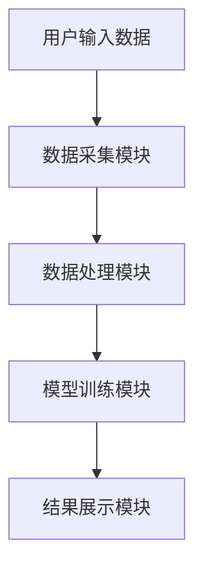
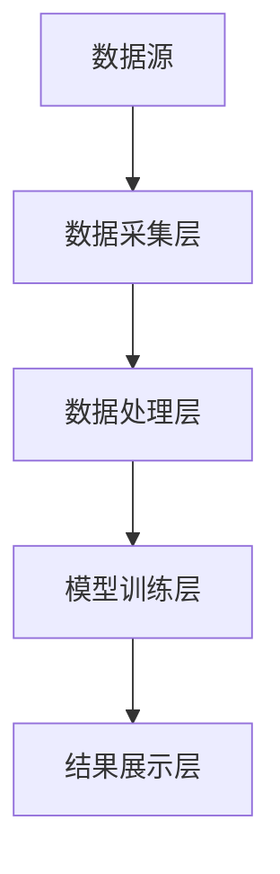
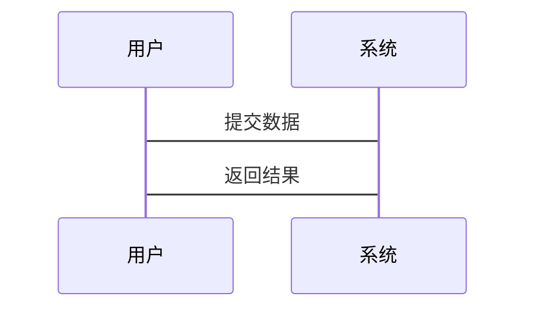

                 


# 特价股票投资中的跨境数据流动价值评估策略

> 关键词：特价股票投资、跨境数据流动、价值评估、数据流动、投资策略

> 摘要：本文探讨了特价股票投资中跨境数据流动的价值评估策略，通过分析数据流动对股票价值的影响机制，构建价值评估模型，并结合算法实现和系统设计，提供实际案例分析和最佳实践。

---

# 第一部分: 特价股票投资与跨境数据流动的背景与概念

## 第1章: 特价股票投资概述

### 1.1 特价股票投资的基本概念

#### 1.1.1 特价股票的定义

特价股票是指在特定市场环境下，价格被低估的股票。这些股票通常具有较高的潜在增值空间，吸引投资者关注。

#### 1.1.2 特价股票投资的核心目标

通过分析市场波动、公司基本面等因素，寻找价格低于其内在价值的股票，进行投资以获取超额收益。

#### 1.1.3 特价股票投资的市场定位

特价股票投资主要集中在价值投资领域，注重长期持有的投资策略，强调对公司基本面的深入分析。

### 1.2 股票投资的基本原理

#### 1.2.1 股票市场的运作机制

股票市场是投资者通过买卖股票进行投资的场所，价格由市场供需关系决定，受宏观经济、公司业绩、行业趋势等多种因素影响。

#### 1.2.2 股票价格波动的驱动因素

包括宏观经济环境、公司业绩、市场情绪、行业趋势等。这些因素共同作用，影响股票价格的波动。

#### 1.2.3 投资者行为对股价的影响

投资者的行为，如买卖决策、情绪波动等，也会对股票价格产生显著影响。

---

## 第2章: 跨境数据流动的价值与挑战

### 2.1 跨境数据流动的定义

#### 2.1.1 数据流动的基本概念

数据流动是指数据在不同系统或地理位置之间的传输和处理过程。

#### 2.1.2 跨境数据流动的特征

包括实时性、全球化、数据量大等。跨境数据流动需要考虑不同国家的法律法规和网络环境。

#### 2.1.3 跨境数据流动的经济价值

通过跨境数据流动，投资者可以获取全球市场信息，优化投资决策，提升投资收益。

### 2.2 跨境数据流动对股票投资的影响

#### 2.2.1 数据流动对市场信息的影响

跨境数据流动能够快速传递市场信息，帮助投资者及时了解全球市场动态。

#### 2.2.2 数据流动对股价波动的影响

跨境数据流动可能导致股价波动，尤其是在全球市场联动性增强的情况下。

#### 2.2.3 数据流动对投资策略的优化作用

通过跨境数据流动获取的信息，投资者可以优化投资组合，降低风险，提高收益。

---

# 第二部分: 跨境数据流动对股票价值评估的核心机制

## 第3章: 数据流动与股票价值评估的关系

### 3.1 数据流动对股票价值的影响路径

#### 3.1.1 数据流动如何影响市场信息

跨境数据流动使得市场信息传播更快，投资者能够更及时地获取信息，从而影响市场定价。

#### 3.1.2 市场信息如何影响股票价值

信息的传播会影响投资者对股票价值的评估，进而影响股价波动。

#### 3.1.3 数据流动与股票价值的动态关系

数据流动与股票价值之间存在动态关系，数据流动的变化会导致股票价值的波动。

### 3.2 数据流动对股票投资策略的影响

#### 3.2.1 数据流动如何优化投资决策

通过跨境数据流动，投资者可以获取更多市场信息，优化投资决策，提高投资收益。

#### 3.2.2 数据流动对风险评估的作用

数据流动可以帮助投资者更好地评估风险，制定更合理的风险管理策略。

#### 3.2.3 数据流动对投资组合的影响

通过分析跨境数据流动的影响，投资者可以优化投资组合，分散风险，提升整体收益。

---

## 第4章: 跨境数据流动的价值评估模型

### 4.1 数据流动价值评估模型的构建

#### 4.1.1 模型构建的基本思路

通过分析跨境数据流动对股票价值的影响，构建一个能够量化数据流动价值的模型。

#### 4.1.2 数据流动的量化指标

包括数据流动的频率、数据量、数据来源的多样性等。

#### 4.1.3 模型的输入变量与输出变量

输入变量包括市场数据、公司基本面数据等；输出变量为股票的价值评估结果。

### 4.2 数据流动价值评估模型的验证

#### 4.2.1 模型验证的方法

通过历史数据回测，验证模型的有效性和准确性。

#### 4.2.2 模型的准确性评估

通过统计指标如R²、MAE等，评估模型的预测准确性。

#### 4.2.3 模型的适用性分析

分析模型在不同市场环境下的适用性，提出改进方向。

---

# 第三部分: 跨境数据流动价值评估的算法与实现

## 第5章: 数据清洗与特征提取

### 5.1 数据清洗的基本方法

#### 5.1.1 数据清洗的目标

确保数据的完整性和准确性，去除噪音数据，提高模型的预测精度。

#### 5.1.2 数据清洗的步骤

包括数据去重、填补缺失值、处理异常值等。

#### 5.1.3 数据清洗的实现

使用Python的pandas库进行数据清洗，代码示例：

```python
import pandas as pd

# 假设data是原始数据
data_clean = data.drop_duplicates()
data_clean = data_clean.dropna()
data_clean = data_clean[abs(data_clean['price'] - data_clean['price'].mean()) < 2*data_clean['price'].std()]
```

### 5.2 数据特征提取的技术

#### 5.2.1 特征提取的基本概念

特征提取是从原始数据中提取能够反映数据本质特征的信息。

#### 5.2.2 常用的特征提取方法

包括主成分分析（PCA）、线性判别分析（LDA）等。

#### 5.2.3 特征选择的优化策略

通过交叉验证等方法，选择最优特征组合，提升模型性能。

---

## 第6章: 数据流动价值评估的算法实现

### 6.1 数据流动价值评估算法的选择

#### 6.1.1 算法选择的依据

根据数据特征和业务需求，选择合适的算法。常用算法包括线性回归、随机森林、神经网络等。

#### 6.1.2 算法实现的步骤

包括数据预处理、模型训练、模型评估等。

#### 6.1.3 算法实现的代码示例

使用Python的scikit-learn库进行模型训练：

```python
from sklearn.linear_model import LinearRegression

# 假设X是特征矩阵，y是目标变量
model = LinearRegression()
model.fit(X, y)
```

### 6.2 数据流动价值评估模型的优化

#### 6.2.1 模型优化的策略

包括参数调优、特征工程、模型集成等。

#### 6.2.2 模型优化的代码示例

使用网格搜索进行参数调优：

```python
from sklearn.model_selection import GridSearchCV

param_grid = {'alpha': [0.1, 1, 10]}
grid_search = GridSearchCV(LinearRegression(), param_grid)
grid_search.fit(X, y)
best_model = grid_search.best_estimator_
```

---

# 第四部分: 系统分析与架构设计方案

## 第7章: 系统架构设计

### 7.1 系统功能设计

#### 7.1.1 系统功能模块

包括数据采集、数据处理、模型训练、结果展示等模块。

#### 7.1.2 系统功能流程图

使用Mermaid绘制系统功能流程图：



### 7.2 系统架构设计

#### 7.2.1 系统架构图

使用Mermaid绘制系统架构图：



---

## 第8章: 系统接口设计

### 8.1 系统接口设计

#### 8.1.1 数据接口设计

定义数据接口的标准格式，如JSON、XML等。

#### 8.1.2 API接口设计

使用RESTful API设计接口，如：

- GET /data
- POST /model

### 8.2 系统交互流程图

使用Mermaid绘制系统交互流程图：



---

# 第五部分: 项目实战

## 第9章: 项目实战

### 9.1 项目环境安装

#### 9.1.1 环境搭建

安装Python、pandas、scikit-learn等库：

```bash
pip install pandas scikit-learn
```

### 9.2 系统核心实现源代码

#### 9.2.1 数据清洗代码

```python
import pandas as pd

def clean_data(data):
    # 去重
    data = data.drop_duplicates()
    # 填充缺失值
    data = data.dropna()
    # 处理异常值
    mean = data['price'].mean()
    std = data['price'].std()
    data = data[abs(data['price'] - mean) < 2*std]
    return data

# 示例数据
data = pd.DataFrame({'price': [100, 200, 300, 250, 150, 350, 200]})
data_clean = clean_data(data)
print(data_clean)
```

#### 9.2.2 模型训练代码

```python
from sklearn.linear_model import LinearRegression

def train_model(X, y):
    model = LinearRegression()
    model.fit(X, y)
    return model

# 示例数据
X = data_clean[['price']]
y = data_clean['price']
model = train_model(X, y)
print(model.coef_)
```

### 9.3 代码应用解读与分析

#### 9.3.1 代码解读

解释代码的功能和实现细节，帮助读者理解如何实现数据清洗和模型训练。

#### 9.3.2 代码优化建议

根据实际需求，提出代码优化的建议，如使用更高效的算法、增加更多的特征等。

### 9.4 实际案例分析

#### 9.4.1 案例背景

介绍一个实际的案例，说明如何利用跨境数据流动进行股票价值评估。

#### 9.4.2 数据分析与建模

展示数据分析和建模的过程，解释每一步的操作和结果。

#### 9.4.3 案例结果与解读

展示案例的结果，并进行解读，说明如何根据结果优化投资策略。

### 9.5 项目小结

总结项目的主要内容和成果，强调跨境数据流动在股票投资中的重要性。

---

# 第六部分: 总结与展望

## 第10章: 总结与展望

### 10.1 本文总结

总结全文的主要内容，强调跨境数据流动在股票价值评估中的重要性。

### 10.2 未来研究方向

提出未来可以进一步研究的方向，如更复杂的数据流动模型、多因素模型等。

### 10.3 投资策略优化的注意事项

提醒投资者在实际操作中需要注意的风险和挑战，如数据质量、模型的适用性等。

### 10.4 拓展阅读

推荐相关的书籍和资源，帮助读者进一步深入学习。

---

# 作者信息

作者：AI天才研究院/AI Genius Institute & 禅与计算机程序设计艺术 /Zen And The Art of Computer Programming

