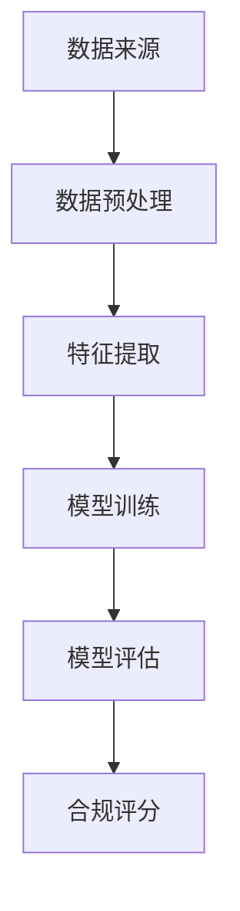
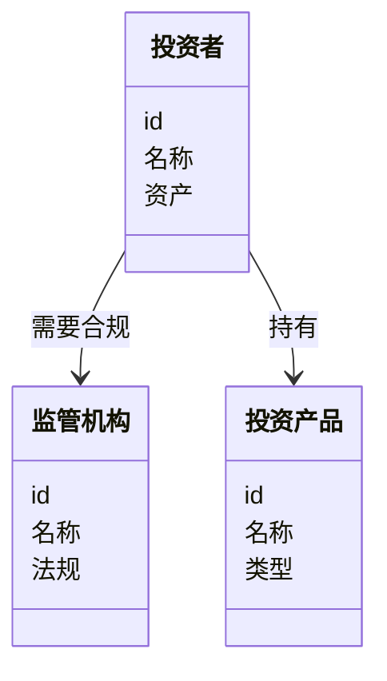
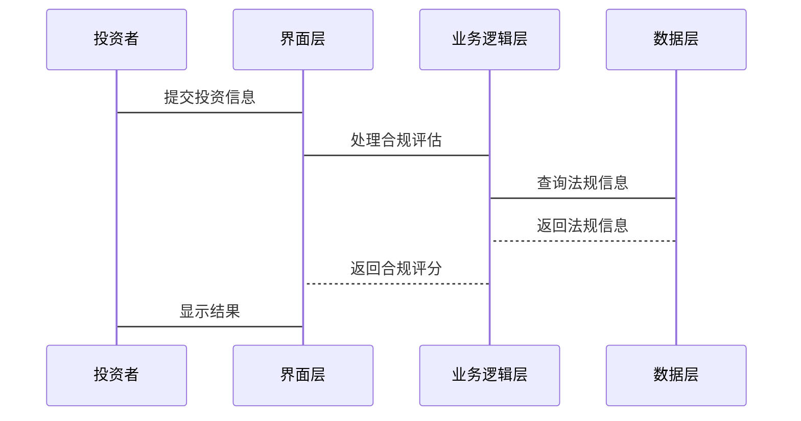

                 


# 特价股票投资中的跨境监管合规策略

**关键词**：特价股票投资、跨境监管、合规策略、金融监管、法律风险

**摘要**：本文探讨了在跨境环境下进行特价股票投资时面临的监管合规问题。通过分析全球主要金融市场的监管框架，提出了一套系统的合规策略，以帮助投资者在合法合规的前提下进行高效投资。文章还详细介绍了合规评分模型的算法原理、系统架构设计以及实际案例分析，为投资者提供了实用的指导。

---

## 第1章: 特价股票投资与跨境监管概述

### 1.1 特价股票投资的基本概念

#### 1.1.1 特价股票的定义与特点
- **定义**：特价股票是指在特定情况下以低于市场价出售的股票，通常因公司重组、财务困境或市场波动等原因出现。
- **特点**：
  - 价格波动大
  - 投资风险高
  - 机会与挑战并存

#### 1.1.2 特价股票投资的常见策略
- **价值投资**：寻找被市场低估的股票，长期持有。
- **短线交易**：利用价格波动，快速买卖获利。
- **套利策略**：利用不同市场或资产的价格差异进行无风险或低风险套利。

#### 1.1.3 特价股票投资的市场环境分析
- **全球市场概况**：全球主要股票市场的特点与趋势。
- **影响因素**：经济周期、政策变化、公司基本面等。

### 1.2 跨境监管的基本概念

#### 1.2.1 跨境投资的定义与特点
- **定义**：投资者在不同国家或地区进行的证券投资行为。
- **特点**：
  - 跨境交易复杂性高
  - 需遵守不同国家的法律法规
  - 风险与收益并存

#### 1.2.2 跨境监管的主要原则与框架
- **主要原则**：
  - 透明性
  - 防范系统性风险
  - 保护投资者利益
- **主要框架**：
  - 《巴塞尔协议》
  - 《金融工具市场指令》（欧盟）
  - 《证券法》（美国）

#### 1.2.3 跨境监管的国际差异与协调
- **差异**：不同国家的监管规则存在差异，如美国的SEC和欧盟的ESMA。
- **协调**：通过国际组织如国际证监会组织（IOSCO）推动监管协调。

### 1.3 特价股票投资中的跨境监管挑战

#### 1.3.1 跨境监管对投资行为的影响
- **合规成本**：遵守多个国家的法规增加了时间和资金成本。
- **法律风险**：违反监管规定可能导致罚款甚至市场禁入。

#### 1.3.2 特价股票投资中的法律风险
- **合规风险**：因不了解当地法规导致的法律纠纷。
- **操作风险**：跨市场交易中的操作失误。

#### 1.3.3 跨境监管合规的重要性与必要性
- **合规是投资的前提**：只有合规才能确保投资行为的合法性。
- **合规有助于风险管理**：通过合规可以降低因监管问题带来的风险。

### 1.4 本章小结
本章介绍了特价股票投资的基本概念和跨境监管的基本原则，分析了两者结合带来的挑战，并强调了合规的重要性。

---

## 第2章: 特价股票投资中的跨境监管合规框架

### 2.1 跨境监管合规的基本原则

#### 2.1.1 合规性原则
- **定义**：确保所有投资行为符合目标国家的法律法规。
- **实施**：在进行投资前，详细研究目标市场的监管规定。

#### 2.1.2 风险可控原则
- **定义**：通过合理配置资产，降低投资风险。
- **实施**：分散投资，避免过度集中于某一市场或资产。

#### 2.1.3 透明性原则
- **定义**：确保投资行为的透明，便于监管机构审查。
- **实施**：完整记录投资行为，及时披露相关信息。

### 2.2 跨境监管合规的主要框架

#### 2.2.1 主要国际金融监管框架
- **巴塞尔协议**：规范银行资本充足率，降低系统性风险。
- **金融工具市场指令**：规范金融工具的交易和披露。
- **证券法**：规范证券发行和交易行为。

#### 2.2.2 各国监管框架的差异与特点
- **美国**：严格的披露要求和监管执法。
- **欧盟**：统一的市场监管框架和严格的投资者保护。
- **中国**：严格的外汇管制和本地化要求。

#### 2.2.3 合规框架的选择与适用
- **选择依据**：目标市场的监管要求和投资规模。
- **适用策略**：根据目标市场的特点，制定相应的合规策略。

### 2.3 特价股票投资中的跨境监管合规流程

#### 2.3.1 合规需求分析
- **分析目标市场**：研究目标市场的监管规定和投资限制。
- **评估合规风险**：识别潜在的法律风险和合规障碍。

#### 2.3.2 合规策略制定
- **制定合规计划**：根据合规需求，制定详细的合规计划。
- **分配责任与资源**：明确团队成员的责任和所需资源。

#### 2.3.3 合规执行与监控
- **实施合规措施**：按照合规计划，执行各项合规措施。
- **持续监控**：定期检查合规情况，及时调整策略。

### 2.4 本章小结
本章详细介绍了跨境监管合规的基本原则和主要框架，并提出了合规流程的具体步骤，为后续策略的制定奠定了基础。

---

## 第3章: 特价股票投资中的跨境监管合规风险分析

### 3.1 跨境监管合规的主要风险类型

#### 3.1.1 法律风险
- **定义**：因违反目标市场的法律法规而面临法律制裁的风险。
- **表现形式**：罚款、市场禁入、刑事处罚。

#### 3.1.2 财务风险
- **定义**：因合规问题导致的财务损失风险。
- **表现形式**：资产被冻结、罚款支出增加。

#### 3.1.3 操作风险
- **定义**：因操作失误导致的合规问题。
- **表现形式**：交易错误、文件遗漏。

### 3.2 跨境监管合规风险的影响因素

#### 3.2.1 市场环境因素
- **经济波动**：经济危机可能导致监管加强。
- **政治环境**：政治动荡可能影响监管政策。

#### 3.2.2 政治环境因素
- **政策变化**：政府政策的突然变化可能带来合规风险。
- **地缘政治**：国际关系紧张可能导致监管收紧。

#### 3.2.3 经济环境因素
- **市场波动**：市场剧烈波动可能引发监管机构的审查。
- **通货膨胀**：经济环境变化可能影响投资回报。

### 3.3 跨境监管合规风险的管理策略

#### 3.3.1 风险识别与评估
- **方法**：通过尽职调查和风险评估，识别潜在风险。
- **工具**：使用风险评估模型，量化风险程度。

#### 3.3.2 风险 mitigation
- **措施**：制定应急预案，建立风险应对机制。
- **工具**：使用情景分析法，模拟不同情景下的应对策略。

#### 3.3.3 风险监控与报告
- **方法**：定期监控风险，及时报告异常情况。
- **工具**：使用监控系统，实时跟踪风险指标。

### 3.4 本章小结
本章分析了跨境监管合规的主要风险类型及其影响因素，并提出了相应的管理策略。

---

## 第4章: 特价股票投资中的跨境监管合规策略

### 4.1 合规评分模型的建立

#### 4.1.1 模型设计
- **目标**：评估不同市场的合规风险。
- **输入**：市场法规、投资产品特性、投资者背景。
- **输出**：合规评分。

#### 4.1.2 数据收集与预处理
- **数据来源**：各国监管机构的公开信息、市场数据。
- **预处理**：清洗数据，处理缺失值和异常值。

#### 4.1.3 特征提取
- **特征选择**：选择影响合规风险的关键特征。
- **特征工程**：构建特征向量，用于模型训练。

#### 4.1.4 模型训练
- **算法选择**：使用逻辑回归或决策树。
- **训练过程**：通过数据训练，优化模型参数。

#### 4.1.5 模型评估
- **评估指标**：准确率、召回率、F1值。
- **验证方法**：交叉验证，确保模型的泛化能力。

### 4.2 合规评分模型的实现

#### 4.2.1 模型流程图


#### 4.2.2 Python代码实现
```python
import pandas as pd
from sklearn.model_selection import train_test_split
from sklearn.linear_model import LogisticRegression
from sklearn.metrics import accuracy_score

# 数据加载
data = pd.read_csv('regulatory_data.csv')

# 数据预处理
data.dropna(inplace=True)
data['label'] = data['label'].astype(int)

# 特征提取
X = data.drop('label', axis=1)
y = data['label']

# 数据分割
X_train, X_test, y_train, y_test = train_test_split(X, y, test_size=0.2)

# 模型训练
model = LogisticRegression()
model.fit(X_train, y_train)

# 模型评估
y_pred = model.predict(X_test)
print("准确率:", accuracy_score(y_test, y_pred))
```

### 4.3 合规评分模型的数学模型

#### 4.3.1 线性回归模型
$$ \text{score} = \beta_0 + \beta_1x_1 + \beta_2x_2 + ... + \beta_nx_n $$

#### 4.3.2 决策树模型
使用决策树进行分类，根据特征的分裂情况确定合规评分。

### 4.4 案例分析

#### 4.4.1 案例背景
某投资者计划在欧盟市场进行特价股票投资，需评估其合规风险。

#### 4.4.2 模型应用
- **数据输入**：目标市场的法规、投资产品特性。
- **模型运行**：计算合规评分。
- **结果分析**：根据评分决定是否投资。

### 4.5 本章小结
本章详细介绍了合规评分模型的建立与实现，并通过案例分析展示了其应用。

---

## 第5章: 系统分析与架构设计方案

### 5.1 问题场景介绍

#### 5.1.1 问题描述
投资者在全球多个市场进行特价股票投资，需确保投资行为的合规性。

#### 5.1.2 项目介绍
开发一个跨境监管合规管理系统，帮助投资者进行合规管理。

### 5.2 系统功能设计

#### 5.2.1 领域模型


#### 5.2.2 系统架构设计


### 5.3 系统接口设计

#### 5.3.1 接口描述
- **输入接口**：接收投资者信息和投资产品信息。
- **输出接口**：提供合规评分和风险报告。

#### 5.3.2 接口交互


### 5.4 本章小结
本章详细描述了系统架构和接口设计，为后续开发奠定了基础。

---

## 第6章: 项目实战

### 6.1 环境安装

#### 6.1.1 安装Python
```bash
python --version
pip install --upgrade pip
```

#### 6.1.2 安装依赖库
```bash
pip install pandas scikit-learn matplotlib
```

### 6.2 系统核心实现

#### 6.2.1 核心代码实现
```python
import pandas as pd
from sklearn.model_selection import train_test_split
from sklearn.metrics import accuracy_score

def load_data():
    data = pd.read_csv('regulatory_data.csv')
    return data

def preprocess_data(data):
    data.dropna(inplace=True)
    data['label'] = data['label'].astype(int)
    return data

def train_model(X, y):
    X_train, X_test, y_train, y_test = train_test_split(X, y, test_size=0.2)
    model = LogisticRegression()
    model.fit(X_train, y_train)
    return model, X_test, y_test

def evaluate_model(model, X_test, y_test):
    y_pred = model.predict(X_test)
    print("准确率:", accuracy_score(y_test, y_pred))

if __name__ == "__main__":
    data = load_data()
    processed_data = preprocess_data(data)
    X = processed_data.drop('label', axis=1)
    y = processed_data['label']
    model, X_test, y_test = train_model(X, y)
    evaluate_model(model, X_test, y_test)
```

#### 6.2.2 代码解读与分析
- **数据加载**：读取CSV文件，加载数据。
- **数据预处理**：删除缺失值，转换标签为整数。
- **模型训练**：使用逻辑回归训练模型。
- **模型评估**：计算准确率，评估模型性能。

### 6.3 实际案例分析

#### 6.3.1 案例背景
某投资者计划在新加坡市场进行特价股票投资，需进行合规评估。

#### 6.3.2 案例分析
- **数据输入**：新加坡市场的法规、投资产品信息。
- **模型运行**：计算合规评分。
- **结果解读**：根据评分决定投资策略。

### 6.4 本章小结
本章通过实际案例展示了系统的实现与应用，验证了模型的有效性。

---

## 第7章: 最佳实践与总结

### 7.1 小结

#### 7.1.1 合规策略的核心要点
- 了解目标市场的监管法规。
- 制定详细的合规计划。
- 持续监控与调整。

### 7.2 注意事项

#### 7.2.1 合规风险的防范
- 定期进行合规检查。
- 及时更新合规策略。
- 建立应急预案。

#### 7.2.2 操作风险的控制
- 严格遵守操作流程。
- 培训员工合规意识。
- 使用技术手段辅助监控。

### 7.3 拓展阅读

#### 7.3.1 推荐书籍
- 《国际金融监管》
- 《证券投资合规实务》

#### 7.3.2 在线资源
- 国际证监会组织（IOSCO）官网
- 各国证券交易所的合规指南

### 7.4 本章小结
本章总结了全文内容，提出了最佳实践建议，并为读者提供了进一步学习的资源。

---

## 作者：AI天才研究院/AI Genius Institute & 禅与计算机程序设计艺术 /Zen And The Art of Computer Programming

---

**致谢**：感谢读者的耐心阅读，希望本文对特价股票投资中的跨境监管合规策略有所启发。

