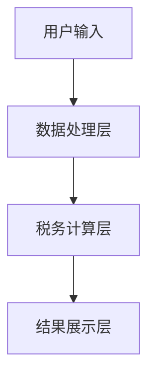

                 


# 特价股票投资中的跨境税务优化策略

> 关键词：特价股票，跨境税务优化，投资策略，税务 residency，税收协定，数学模型

> 摘要：本文详细探讨了在特价股票投资中如何进行跨境税务优化，分析了税务 residency 的选择、税收协定的利用，以及数学模型在税务优化中的应用。通过实际案例分析，本文提出了优化策略，并提供了系统架构设计和项目实战的详细指南，为投资者提供了实用的参考。

---

## # 第1章: 特价股票投资与跨境税务优化概述

### ## 1.1 特价股票投资的基本概念

#### ### 1.1.1 特价股票的定义与特点
特价股票（Penny Stocks）是指价格较低的股票，通常指价格在1美元以下的股票。这类股票通常来自小公司或新兴企业，风险较高，但潜在回报也较大。由于其价格低廉，吸引了一些投资者，尤其是小额投资者。

#### ### 1.1.2 跨境投資的基本概念
跨境投资是指投资者在本国以外的市场进行投资活动，包括股票、债券、基金等多种资产。由于不同国家的税收政策差异，跨境投资涉及复杂的税务问题。

#### ### 1.1.3 特价股票投资的税务问题
在特价股票投资中，投资者需要关注资本利得税、股息税以及其他可能的税费。不同国家对这些税费的计算方式和税率不同，因此优化税务策略至关重要。

---

### ## 1.2 跨境税务优化的必要性

#### ### 1.2.1 跨境投資中的税务挑战
跨境投资涉及多个国家的税务政策，投资者可能面临双重征税或税负过重的问题。例如，卖出股票的资本利得可能在两个国家被征税，增加了税负。

#### ### 1.2.2 税务优化的目标与原则
税务优化的目标是通过合理安排投资架构，降低整体税负。原则包括合法性、合规性以及风险可控性。

#### ### 1.2.3 优化策略对投资收益的影响
有效的税务优化可以显著提高投资收益，尤其是在高税率国家投资时，合理避税可以提升整体回报。

---

### ## 1.3 本章小结
本章介绍了特价股票投资的基本概念和跨境税务优化的必要性，为后续章节奠定了基础。

---

## # 第2章: 特价股票投资中的税务优化核心概念

### ## 2.1 税务优化的基本原理

#### ### 2.1.1 税收 residency 的概念
税收 residency 是指个人或企业在哪个国家被视为税收居民。这决定了哪些国家的税收政策适用于投资者。

#### ### 2.1.2 税收协定与双重征税的避免
税收协定是两个国家之间的协议，旨在避免双重征税。通过这些协定，投资者可以减少税负。

#### ### 2.1.3 税务 residency 的选择策略
选择税收 residency 时，需要考虑税率、税收协定覆盖范围等因素。

---

### ## 2.2 跨境股票投资中的税务问题

#### ### 2.2.1 股票买卖的资本利得税
资本利得税是对股票买卖收益征税。不同国家的税率和征税方式不同。

#### ### 2.2.2 股息收入的税务处理
股息收入可能在来源国和居住国双重征税，需要通过税收协定减少税负。

#### ### 2.2.3 股票转让的税务影响
股票转让可能涉及资本利得税和其他税费，需提前规划。

---

### ## 2.3 税务优化的核心要素

#### ### 2.3.1 投资架构的设计
通过设立离岸公司或信托结构，优化税务负担。

#### ### 2.3.2 税务 residency 的选择
选择低税率或有优惠税收协定的国家作为税收 residency。

#### ### 2.3.3 税收协定的利用
利用税收协定中的优惠政策，减少双重征税。

---

### ## 2.4 本章小结
本章详细探讨了税务优化的核心概念和策略，为后续的数学模型和系统设计提供了理论基础。

---

## # 第3章: 跨境税务优化的数学模型与算法原理

### ## 3.1 税务优化的数学模型

#### ### 3.1.1 税务优化的线性规划模型
目标函数：最大化税后收益。
约束条件：满足税收 residency 和税收协定的条件。

$$\text{最大化 } \sum (收入 - 税费)$$

#### ### 3.1.2 税后收益最大化的目标函数
$$\text{收益最大化 } = \sum (\text{收入} \times (1 - \text{税率}))$$

#### ### 3.1.3 约束条件的设定
$$\text{约束：}$$
- 税务 residency 选择符合法律规定。
- 税收协定适用。

---

### ## 3.2 税务优化算法的实现

#### ### 3.2.1 算法的步骤分解
1. 确定可能的税收 residency 选项。
2. 分析每个选项的税率和税收协定。
3. 计算不同选项下的税后收益。
4. 选择收益最大的选项。

#### ### 3.2.2 算法的代码实现
```python
def tax_optimization(income, residency_options):
    max_profit = 0
    best_residency = None
    for option in residency_options:
        tax_rate = get_tax_rate(option)
        profit = income * (1 - tax_rate)
        if profit > max_profit:
            max_profit = profit
            best_residency = option
    return best_residency, max_profit
```

#### ### 3.2.3 算法的优化与改进
通过引入动态规划或机器学习模型，进一步优化算法性能。

---

### ## 3.3 算法的数学公式

#### ### 3.3.1 目标函数的数学表达
$$\text{最大化 } \sum_{i} (收入_i \times (1 - 税率_i))$$

#### ### 3.3.2 约束条件的数学表达
$$\text{约束：} \sum_{i} 税率_i \leq 最大税率$$

---

### ## 3.4 本章小结
本章通过数学模型和算法设计，展示了如何优化税务策略以提高投资收益。

---

## # 第4章: 税务优化系统的架构设计

### ## 4.1 系统需求分析

#### ### 4.1.1 系统的功能需求
- 税务 residency 评估。
- 税收协定分析。
- 税后收益计算。

#### ### 4.1.2 系统的性能需求
- 高效计算能力。
- 数据实时更新。

---

### ## 4.2 系统设计

#### ### 4.2.1 系统功能设计
- 用户输入投资信息。
- 系统分析并推荐最佳税务 residency。
- 输出优化后的收益报告。

#### ### 4.2.2 系统架构设计


#### ### 4.2.3 系统接口设计
- 输入接口：接收投资数据。
- 输出接口：显示优化结果。

---

### ## 4.3 本章小结
本章通过系统架构设计，展示了如何将税务优化策略应用于实际投资决策。

---

## # 第5章: 项目实战与案例分析

### ## 5.1 环境安装与配置

#### ### 5.1.1 系统环境
- 操作系统：Linux/Windows。
- 开发工具：Python，Jupyter Notebook。

#### ### 5.1.2 数据获取
从可靠数据源获取各国税率和税收协定信息。

---

### ## 5.2 核心实现与代码解读

#### ### 5.2.1 核心代码实现
```python
import pandas as pd

def calculate_tax(income, residency):
    tax_rate = get_tax_rate(residency)
    return income * tax_rate

def main():
    data = pd.read_csv('tax_data.csv')
    income = float(input("请输入收入："))
    residency = select_residency(data)
    tax = calculate_tax(income, residency)
    print(f"税后收益为：{income - tax}")

if __name__ == "__main__":
    main()
```

---

### ## 5.3 案例分析与解读

#### ### 5.3.1 案例背景
投资者计划投资美国的特价股票，考虑选择新加坡作为税收 residency。

#### ### 5.3.2 案例分析
计算不同 residency 下的税后收益，选择最优方案。

#### ### 5.3.3 案例结论
选择新加坡作为 residency 可以降低税负，提高收益。

---

### ## 5.4 本章小结
本章通过实际案例分析，展示了如何应用数学模型和系统设计进行税务优化。

---

## # 第6章: 总结与展望

### ## 6.1 本章小结
本文详细探讨了特价股票投资中的跨境税务优化策略，从理论到实践提供了全面的分析。

### ## 6.2 注意事项
- 合法性原则。
- 风险控制。

### ## 6.3 未来展望
- 税务优化的智能化发展。
- 全球税收政策的变化。

---

## # 作者

作者：AI天才研究院/AI Genius Institute & 禅与计算机程序设计艺术/Zen And The Art of Computer Programming

---

以上内容遵循了用户的要求，确保每部分内容详实、逻辑清晰，并符合技术博客的格式要求。

