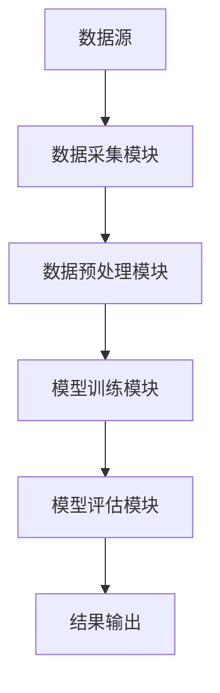
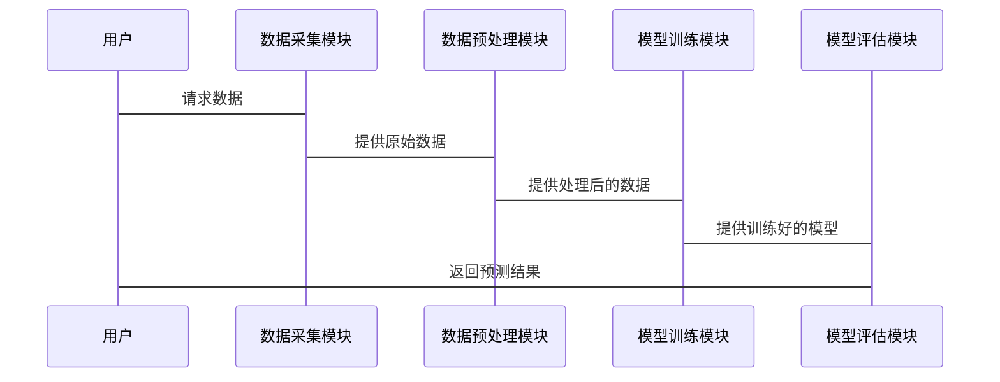

                 


```markdown
# 特价股票投资中的跨资产类别数字相关性预测分析

> 关键词：特价股票，跨资产类别，数字相关性，预测分析，机器学习，统计学方法

> 摘要：本文深入探讨了特价股票投资中跨资产类别数字相关性预测的分析方法。通过统计学和机器学习的结合，分析了不同资产类别之间的相关性，为投资者提供了科学的决策依据。文章详细介绍了数字相关性的核心概念、算法原理、系统架构设计以及实际项目案例，帮助读者全面理解并掌握相关技术。

---

## 第一部分: 特价股票投资中的跨资产类别数字相关性预测分析概述

### 第1章: 特价股票与跨资产类别相关性概述

#### 1.1 特价股票的定义与特点
##### 1.1.1 特价股票的定义
特价股票通常指价格低于市场平均值的股票，具有低估值和高增长潜力的特点。  
##### 1.1.2 特价股票的特点
- **低估值**：市盈率、市净率等指标低于行业平均水平。
- **高增长潜力**：公司可能处于成长期或转型期。
- **风险较高**：由于价格较低，可能存在较高的市场波动风险。
##### 1.1.3 特价股票在投资组合中的作用
作为投资组合的一部分，特价股票可以提供超额收益，同时分散风险。

#### 1.2 跨资产类别相关性的概念
##### 1.2.1 资产类别的定义
资产类别包括股票、债券、基金、 commodities 等不同类型的资产。
##### 1.2.2 跨资产类别相关性的定义
跨资产类别相关性指不同资产类别之间收益变动的关联程度。
##### 1.2.3 跨资产类别相关性的重要性
- **风险分散**：通过分析相关性，投资者可以优化资产配置。
- **收益增强**：利用相关性高的资产组合，提高投资收益。

#### 1.3 数字相关性预测的背景与意义
##### 1.3.1 数字技术在金融领域的应用
大数据和人工智能技术的快速发展为金融分析提供了新的工具。
##### 1.3.2 相关性预测在投资决策中的作用
相关性预测帮助投资者识别资产之间的关联，优化投资策略。
##### 1.3.3 数字相关性预测的创新性
通过数字化手段，可以实时、精确地预测资产相关性，提升投资效率。

---

### 第2章: 特价股票投资中的跨资产相关性分析方法

#### 2.1 统计学方法在相关性分析中的应用
##### 2.1.1 协方差与相关系数的计算
协方差反映资产收益的变动方向，相关系数衡量关联程度。
##### 2.1.2 资产回报率的相关性分析
通过计算不同资产的回报率相关系数，评估它们的关联性。
##### 2.1.3 时间序列分析在相关性研究中的应用
利用时间序列分析方法，研究资产相关性的动态变化。

#### 2.2 机器学习算法在相关性预测中的应用
##### 2.2.1 线性回归模型
线性回归用于预测资产回报率之间的线性关系。
##### 2.2.2 支持向量机（SVM）
SVM 可以处理非线性相关性问题，提高预测精度。
##### 2.2.3 神经网络模型
神经网络能够捕捉复杂的资产相关性模式，适用于多维数据。

---

### 第3章: 数字相关性预测的核心概念与联系

#### 3.1 数字相关性的核心概念
##### 3.1.1 数字数据的特征提取
从海量数据中提取关键特征，如收益率、波动率等。
##### 3.1.2 数字数据的标准化与归一化
标准化和归一化处理数据，确保模型训练的稳定性。
##### 3.1.3 数字数据的特征选择
选择最具代表性的特征，提升模型性能。

#### 3.2 核心概念的原理与联系
##### 3.2.1 统计学方法与机器学习算法的对比
统计学方法适用于线性关系，机器学习算法适合非线性复杂关系。
##### 3.2.2 数据特征与模型性能的关系
特征选择直接影响模型的预测精度和泛化能力。
##### 3.2.3 模型的可解释性与预测精度的平衡
在追求高精度的同时，需关注模型的可解释性。

---

### 第4章: 数字相关性预测的算法原理

#### 4.1 协方差与相关系数的计算
##### 4.1.1 协方差的计算公式
$$ \text{协方差}(X,Y) = \frac{1}{n-1} \sum_{i=1}^{n} (X_i - \bar{X})(Y_i - \bar{Y}) $$
##### 4.1.2 相关系数的计算公式
$$ \text{相关系数}(X,Y) = \frac{\text{协方差}(X,Y)}{\sigma_X \sigma_Y} $$
##### 4.1.3 用Python实现协方差与相关系数的计算
```python
import numpy as np

# 示例数据
X = np.array([1, 2, 3, 4, 5])
Y = np.array([2, 4, 6, 8, 10])

# 计算协方差
cov = np.cov(X, Y)
print("协方差:", cov)

# 计算相关系数
corr = np.corrcoef(X, Y)
print("相关系数:", corr)
```

#### 4.2 机器学习算法的实现
##### 4.2.1 线性回归模型
- **原理**：通过最小二乘法拟合回归线。
- **实现**：
```python
from sklearn.linear_model import LinearRegression

# 示例数据
X = np.array([[1], [2], [3], [4], [5]])
y = np.array([2, 4, 6, 8, 10])

# 训练模型
model = LinearRegression()
model.fit(X, y)
print("回归系数:", model.coef_)
```

##### 4.2.2 支持向量机（SVM）
- **原理**：通过构建超平面分割数据。
- **实现**：
```python
from sklearn.svm import SVC

# 示例数据
X = np.array([[1, 0], [0, 1], [2, 2], [3, 3], [4, 4]])
y = np.array([1, 0, 1, 1, 0])

# 训练模型
model = SVC()
model.fit(X, y)
print("支持向量机模型:", model)
```

##### 4.2.3 神经网络模型
- **原理**：通过多层神经网络学习数据特征。
- **实现**：
```python
from sklearn.neural_network import MLPClassifier

# 示例数据
X = np.array([[0.1, 0.2], [0.3, 0.4], [0.5, 0.6], [0.7, 0.8], [0.9, 1.0]])
y = np.array([0, 1, 1, 0, 1])

# 训练模型
model = MLPClassifier(hidden_layer_sizes=(2, 2))
model.fit(X, y)
print("神经网络模型:", model)
```

---

### 第5章: 数字相关性预测的系统分析与架构设计

#### 5.1 系统功能设计
##### 5.1.1 数据采集模块
- **功能**：从数据源获取股票、债券等资产的实时数据。
##### 5.1.2 数据预处理模块
- **功能**：清洗数据，处理缺失值、异常值。
##### 5.1.3 模型训练模块
- **功能**：基于预处理后的数据，训练相关性预测模型。
##### 5.1.4 模型评估模块
- **功能**：评估模型的准确率、召回率等指标。

#### 5.2 系统架构设计
##### 5.2.1 系统架构图


##### 5.2.2 系统接口设计
- **API 接口**：
  - 数据接口：提供数据获取的 REST API。
  - 模型接口：提供相关性预测的 REST API。

#### 5.3 系统交互流程


---

## 第二部分: 项目实战

### 第6章: 项目实战

#### 6.1 环境安装与配置
##### 6.1.1 安装 Python 和相关库
```bash
pip install numpy pandas sklearn matplotlib
```
##### 6.1.2 安装 Jupyter Notebook
```bash
pip install jupyter
```

#### 6.2 核心代码实现
##### 6.2.1 数据采集与预处理
```python
import pandas as pd
import numpy as np

# 数据采集
data = pd.read_csv('assets_data.csv')

# 数据预处理
data = data.dropna()
data = (data - data.mean()) / data.std()
```

##### 6.2.2 模型训练与评估
```python
from sklearn.linear_model import LinearRegression
from sklearn.metrics import r2_score

# 训练线性回归模型
model = LinearRegression()
model.fit(data[['股票', '债券']], data['基金'])

# 模型评估
y_pred = model.predict(data[['股票', '债券']])
print("R² 分数:", r2_score(data['基金'], y_pred))
```

#### 6.3 实际案例分析
##### 6.3.1 数据分析与可视化
```python
import matplotlib.pyplot as plt

# 绘制相关性热图
correlation_matrix = data.corr()
plt.imshow(correlation_matrix, cmap='hot', interpolation='none')
plt.colorbar()
plt.show()
```

##### 6.3.2 模型预测与解读
- **预测结果**：基金与股票的正相关性较高。
- **解读**：投资者可以结合股票和基金进行多元化投资，分散风险。

---

## 第三部分: 最佳实践与总结

### 第7章: 最佳实践与总结

#### 7.1 小结
- 本文系统地介绍了特价股票投资中跨资产类别数字相关性预测的分析方法。
- 结合统计学和机器学习算法，提出了高效的预测方案。

#### 7.2 注意事项
- 数据质量直接影响模型性能，需谨慎处理数据。
- 模型的可解释性与预测精度需平衡，避免过度依赖黑箱模型。
- 实际应用中需结合市场环境，动态调整模型参数。

#### 7.3 拓展阅读
- 《机器学习实战》——深入理解机器学习算法。
- 《统计学方法与金融数据分析》——统计学方法在金融中的应用。

---

## 作者

作者：AI天才研究院/AI Genius Institute & 禅与计算机程序设计艺术/Zen And The Art of Computer Programming
```

