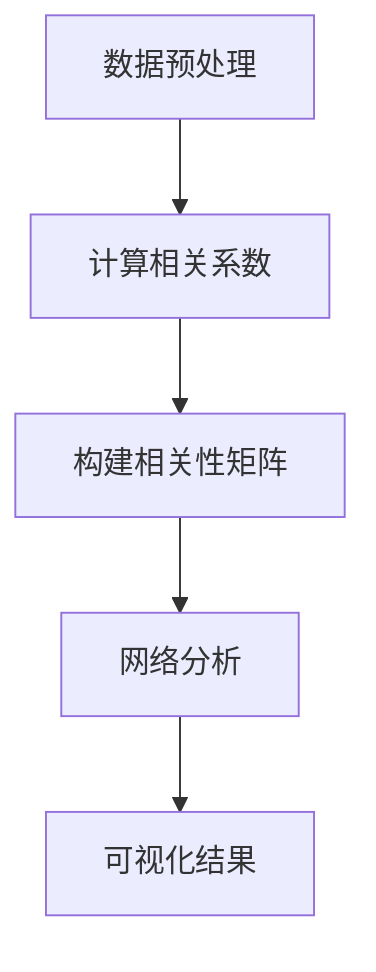

                 


# 特价股票投资中的跨资产类别相关性分析

> 关键词：特价股票，跨资产相关性分析，统计方法，网络分析，资产配置

> 摘要：本文探讨了特价股票投资中的跨资产类别相关性分析方法，通过统计和网络分析等手段，深入分析不同资产类别之间的相关性，为投资者提供科学的投资策略和资产配置建议。

---

## 第一部分: 特价股票与跨资产相关性分析概述

### 第1章: 特价股票的基本概念

#### 1.1 特价股票的定义与特点
特价股票通常指价格相对较低的股票，具有以下特点：
- 价格低廉：通常在1美元至5美元之间。
- 市值较小：多为中小型企业或新兴公司。
- 投机性较强：价格波动较大，容易受市场情绪影响。

#### 1.2 特价股票的投资价值
- 价格弹性高：容易因市场变化出现大幅波动。
- 投资门槛低：适合小额投资者。
- 风险较高：波动性大，风险也相对较高。

#### 1.3 特价股票与市场周期的关系
- 在熊市中，特价股票通常会受到更大的冲击。
- 在牛市中，特价股票可能因市场情绪好转而反弹。

### 第2章: 跨资产类别相关性分析的背景

#### 2.1 跨资产相关性的定义与意义
跨资产相关性指不同资产类别之间的回报率变动关系。了解这种相关性有助于优化投资组合，降低风险。

#### 2.2 跨资产相关性在金融投资中的应用
- 投资组合优化：通过分散投资降低风险。
- 资产配置：根据相关性调整不同资产的权重。
- 风险管理：提前预警潜在风险。

#### 2.3 特价股票与跨资产相关性的研究现状
当前研究主要集中在以下方面：
- 特价股票与大盘股的相关性分析。
- 特价股票与其他金融资产（如债券、黄金）的相关性研究。
- 利用大数据技术提高相关性分析的准确性。

---

## 第二部分: 跨资产类别相关性分析的核心概念与方法

### 第3章: 跨资产相关性分析的原理与方法

#### 3.1 跨资产相关性的统计分析方法
- 协方差与相关系数的计算公式：
  - 协方差公式：
    $$ \text{Cov}(X,Y) = E[(X - E[X])(Y - E[Y])] $$
  - 相关系数公式：
    $$ \rho_{X,Y} = \frac{\text{Cov}(X,Y)}{\sqrt{\text{Var}(X)} \cdot \sqrt{\text{Var}(Y)}} $$

- 相关性矩阵构建：
  | 资产 | 股票A | 股票B | 股票C |
  |------|--------|--------|--------|
  | 股票A | 1      | 0.6    | 0.8    |
  | 股票B | 0.6    | 1      | 0.5    |
  | 股票C | 0.8    | 0.5    | 1      |

#### 3.2 跨资产相关性的网络分析方法
- 资产相关性网络的构建：
  ```mermaid
  graph TD
      A[资产A] --> B[资产B]
      B --> C[资产C]
      C --> D[资产D]
      A --> D
  ```

- 网络分析方法的应用：
  - 网络可视化：帮助识别资产之间的强相关性。
  - 网络社区检测：发现具有相似波动模式的资产集群。

---

## 第三部分: 资产相关性分析的数学模型与公式

### 第4章: 资产相关性分析的数学模型

#### 4.1 主成分分析（PCA）
- PCA是一种降维技术，适用于高维数据。
- 步骤：
  1. 标准化数据。
  2. 计算协方差矩阵。
  3. 求特征值和特征向量。
  4. 选择主成分并重构数据。

#### 4.2 网络分析算法
- 资产相关性网络构建的Python代码示例：
  ```python
  import numpy as np
  import networkx as nx

  # 创建相关性矩阵
  corr_matrix = np.array([[1, 0.6, 0.8],
                           [0.6, 1, 0.5],
                           [0.8, 0.5, 1]])

  # 构建网络图
  G = nx.Graph()
  for i in range(3):
      for j in range(i+1, 3):
          weight = corr_matrix[i][j]
          G.add_edge(i, j, weight=weight)

  # 可视化网络图
  nx.draw(G, with_labels=True, node_size=500, edge_color='blue')
  ```

---

## 第四部分: 系统分析与架构设计方案

### 第5章: 资产相关性分析系统的构建

#### 5.1 系统架构设计


#### 5.2 系统功能设计
- 数据预处理：清洗和标准化数据。
- 模型训练：计算协方差和相关系数。
- 结果展示：生成相关性矩阵和网络图。

---

## 第五部分: 项目实战

### 第6章: 资产相关性分析的实战应用

#### 6.1 环境安装
- Python 3.8及以上版本。
- 安装必要的库：
  ```bash
  pip install numpy pandas networkx matplotlib
  ```

#### 6.2 核心实现代码
```python
import numpy as np
import pandas as pd
import networkx as nx
import matplotlib.pyplot as plt

# 示例数据
data = pd.DataFrame({
    '资产A': [0.1, 0.2, 0.3],
    '资产B': [0.2, 0.3, 0.4],
    '资产C': [0.15, 0.25, 0.35]
})

# 计算相关系数矩阵
corr_matrix = data.corr()

# 构建网络图
G = nx.Graph()
for i in range(len(corr_matrix.columns)):
    for j in range(i+1, len(corr_matrix.columns)):
        weight = abs(corr_matrix.iloc[i,j])
        G.add_edge(i, j, weight=weight)

# 可视化网络图
nx.draw(G, with_labels=True, node_size=500, edge_color='blue')
plt.show()
```

---

## 第六部分: 最佳实践与总结

### 第7章: 投资策略优化

#### 7.1 小结
- 通过跨资产相关性分析，投资者可以更好地优化投资组合。
- 统计方法和网络分析方法各有优劣，需结合实际场景选择。

#### 7.2 注意事项
- 数据质量直接影响分析结果。
- 相关性分析不能完全预测市场波动。
- 需定期更新数据以保持分析的准确性。

#### 7.3 拓展阅读
- 《投资学基础》
- 《网络科学导论》
- 《Python金融数据分析》

---

作者：AI天才研究院 & 禅与计算机程序设计艺术

