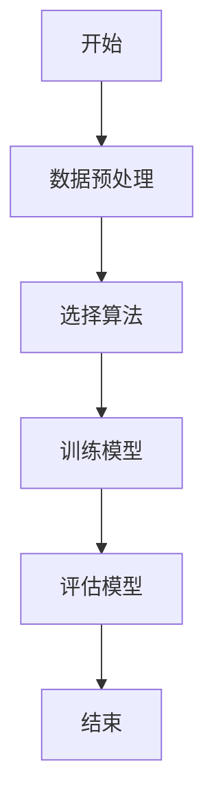
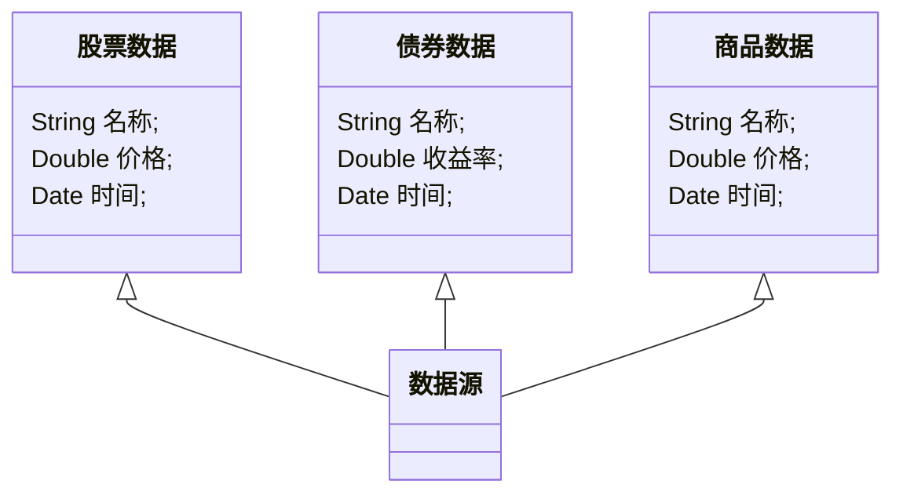

                 


# 特价股票投资中的跨资产类别相关性预测分析

## 关键词：特价股票投资、跨资产相关性、预测分析、数据挖掘、机器学习、时间序列分析

## 摘要：本文深入探讨了特价股票投资中跨资产类别相关性预测的关键问题，从理论基础、数据分析到算法实现，全面分析了跨资产相关性预测的重要性、方法及其在投资决策中的应用。文章结合实际案例，详细讲解了相关性预测的数学模型、算法流程和系统架构设计，为投资者提供了科学的投资决策支持。

---

## 第1章: 特价股票投资与跨资产相关性预测概述

### 1.1 特价股票投资的背景与意义

#### 1.1.1 什么是特价股票
特价股票是指在特定市场条件下价格被低估，具有较大上涨潜力的股票。这类股票通常由于市场波动、公司基本面变化或市场情绪影响，价格出现短期下跌，为投资者提供了低位买入的机会。

#### 1.1.2 特价股票投资的特点
- **价格低估**：股票价格低于其内在价值。
- **高波动性**：容易受到市场情绪和技术分析的影响。
- **周期性**：通常在市场低迷时期出现较多。

#### 1.1.3 特价股票投资的市场环境
- **宏观经济因素**：如利率、通货膨胀、经济周期等。
- **行业因素**：如行业周期、政策变化等。
- **公司基本面**：如盈利能力、财务状况等。

---

### 1.2 跨资产类别相关性预测的重要性

#### 1.2.1 跨资产相关性的定义
跨资产相关性指不同资产类别（如股票、债券、商品）之间的价格变动关系。例如，黄金与股票价格可能在市场波动时呈现负相关。

#### 1.2.2 跨资产相关性在投资中的作用
- **风险分散**：通过分析不同资产的相关性，投资者可以构建多元化的投资组合，降低整体风险。
- **收益增强**：通过识别正相关的资产，投资者可以在市场上涨时获得更高收益。
- **对冲策略**：利用负相关的资产对冲市场风险。

#### 1.2.3 特价股票与跨资产相关性的联系
特价股票的投资收益可能受到其他资产类别（如债券、商品）价格波动的影响。通过分析这些相关性，投资者可以更好地把握投资机会。

---

## 第2章: 相关性分析的理论基础

### 2.1 相关性分析的基本概念

#### 2.1.1 相关性的定义
相关性衡量两个变量之间线性关系的强度和方向。相关性范围在-1到+1之间，正数表示正相关，负数表示负相关。

#### 2.1.2 相关性的类型
- **皮尔逊相关系数**：衡量线性相关性。
- **斯皮尔曼相关系数**：衡量排名相关性。
- **肯德尔相关系数**：适用于有序数据。

#### 2.1.3 相关性的计算方法
皮尔逊相关系数公式：
$$ r = \frac{\sum (x_i - \bar{x})(y_i - \bar{y})}{\sqrt{\sum (x_i - \bar{x})^2 \sum (y_i - \bar{y})^2}} $$

---

### 2.2 资产类别相关性的特征

#### 2.2.1 股票与债券的相关性
- 股票和债券通常呈现负相关，因为当股市上涨时，债券收益率可能下降。

#### 2.2.2 商品与外汇的相关性
- 黄金价格与美元汇率通常呈现负相关，因为美元走强可能抑制黄金价格上涨。

#### 2.2.3 不同资产类别间的动态相关性
相关性并非固定不变，会受到市场环境的影响。例如，金融危机期间，许多资产的相关性可能上升。

---

### 2.3 相关性分析的数学基础

#### 2.3.1 协方差与相关系数的公式
协方差公式：
$$ \text{Cov}(X, Y) = \frac{1}{n-1} \sum_{i=1}^{n} (x_i - \bar{x})(y_i - \bar{y}) $$

相关系数公式：
$$ \rho_{X,Y} = \frac{\text{Cov}(X, Y)}{\sigma_X \sigma_Y} $$

其中，$\sigma_X$ 和 $\sigma_Y$ 分别是 $X$ 和 $Y$ 的标准差。

#### 2.3.2 相关性分析的假设检验
通过t检验可以判断相关性是否显著：
$$ t = r \sqrt{\frac{n-2}{1-r^2}} $$

---

## 第3章: 数据收集与预处理

### 3.1 数据来源与获取方法

#### 3.1.1 股票数据的获取
可以通过Yahoo Finance或Quandl等API获取股票价格数据。

#### 3.1.2 债券数据的获取
可以从Bloomberg或FRED等平台获取债券收益率数据。

#### 3.1.3 商品与外汇数据的获取
可以通过Quandl或Pandas DataReader获取商品价格和外汇汇率数据。

---

### 3.2 数据清洗与预处理

#### 3.2.1 数据清洗的步骤
- 删除缺失值。
- 处理异常值。

#### 3.2.2 数据标准化与归一化
标准化公式：
$$ z = \frac{x - \mu}{\sigma} $$
归一化公式：
$$ x' = \frac{x - \min(x)}{\max(x) - \min(x)} $$

#### 3.2.3 数据缺失值的处理
可以使用均值、中位数或插值方法填补缺失值。

---

### 3.3 时间序列数据的处理

#### 3.3.1 时间序列数据的特征
- 趋势性：数据呈现上升或下降趋势。
- 季节性：数据在特定时间段内呈现规律性波动。
- 噪声：随机波动。

#### 3.3.2 时间序列数据的分解
分解公式：
$$ X_t = T_t + S_t + R_t $$

其中，$T_t$ 是趋势部分，$S_t$ 是季节性部分，$R_t$ 是剩余部分。

#### 3.3.3 时间序列数据的可视化
可以使用折线图展示时间序列数据的趋势和波动。

---

## 第4章: 相关性预测模型

### 4.1 算法原理讲解

#### 4.1.1 相关性预测的算法选择
常用算法包括：
- 皮尔逊相关系数。
- 时间序列分析（如ARIMA）。
- 机器学习模型（如随机森林、神经网络）。

#### 4.1.2 相关性预测的流程图


#### 4.1.3 算法实现代码
```python
import pandas as pd
import numpy as np

# 示例数据
data = {'股票': [10, 20, 30, 40, 50],
        '债券': [5, 15, 25, 35, 45]}
df = pd.DataFrame(data)

# 计算皮尔逊相关系数
correlation = df['股票'].corr(df['债券'])
print(f"相关系数为：{correlation}")
```

---

### 4.2 数学模型与公式

#### 4.2.1 皮尔逊相关系数的计算
如前所述，皮尔逊相关系数公式：
$$ r = \frac{\sum (x_i - \bar{x})(y_i - \bar{y})}{\sqrt{\sum (x_i - \bar{x})^2 \sum (y_i - \bar{y})^2}} $$

#### 4.2.2 时间序列模型的构建
ARIMA模型公式：
$$ \phi(\theta) \cdot (1 - \theta B)X_t = c + \phi(\phi) \cdot \epsilon_t $$

---

## 第5章: 系统分析与架构设计

### 5.1 系统功能设计

#### 5.1.1 领域模型


#### 5.1.2 系统架构设计
```mermaid
rectangle 数据库 {
    股票数据表
    债券数据表
    商品数据表
}
rectangle 数据处理模块 {
    数据清洗
    数据标准化
}
rectangle 预测模块 {
    相关性计算
    模型训练
}
rectangle 展示模块 {
    可视化结果
    报告生成
}
数据库 --> 数据处理模块
数据处理模块 --> 预测模块
预测模块 --> 展示模块
```

---

## 第6章: 项目实战与案例分析

### 6.1 环境安装

#### 6.1.1 安装Python与库
```bash
pip install numpy pandas scikit-learn matplotlib
```

#### 6.1.2 数据获取
```python
import pandas_datareader as pdr
df = pdr.get_data_yahoo('AAPL', start='2020-01-01', end='2023-12-31')
```

---

### 6.2 核心代码实现

#### 6.2.1 数据清洗
```python
df.dropna(inplace=True)
df = df[df['close'].notna()]
```

#### 6.2.2 相关性计算
```python
correlation_matrix = df.corr()
print(correlation_matrix)
```

#### 6.2.3 模型训练
```python
from sklearn.linear_model import LinearRegression
model = LinearRegression()
model.fit(X, y)
```

---

## 第7章: 最佳实践与总结

### 7.1 小结
本文详细探讨了特价股票投资中跨资产相关性预测的理论与实践，结合实际案例展示了如何利用相关性分析优化投资策略。

### 7.2 注意事项
- 数据质量对预测结果影响重大，需谨慎处理缺失值和异常值。
- 相关性分析仅能揭示变量之间的关系，不能证明因果关系。

### 7.3 拓展阅读
建议读者深入学习时间序列分析、机器学习算法及其在金融领域的应用。

---

## 作者：AI天才研究院/AI Genius Institute & 禅与计算机程序设计艺术 /Zen And The Art of Computer Programming

