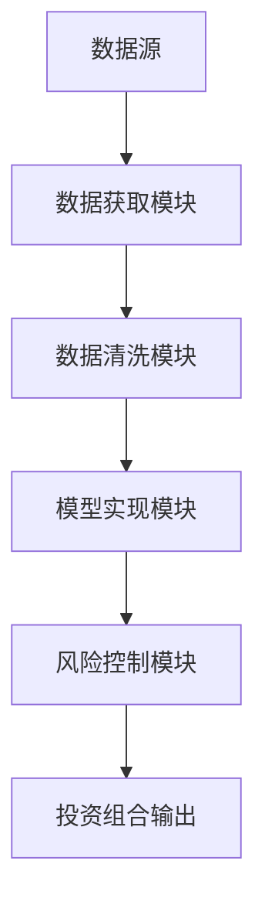

                 


# 特价股票投资中的跨资产类别配置方法

## 关键词：跨资产配置，特价股票，投资组合优化，风险管理，数学模型，Python算法

## 摘要：本文探讨了在特价股票投资中采用跨资产配置策略的方法，通过分析现代投资组合理论、数学模型和系统架构，结合实际案例，展示了如何通过跨资产配置优化投资组合的风险和收益。

---

# 第一部分：背景介绍

## 第1章：特价股票投资的背景与意义

### 1.1 特价股票的定义与特点

#### 1.1.1 特价股票的定义
特价股票是指价格低于其内在价值的股票，通常被认为是被市场低估的投资机会。

#### 1.1.2 特价股票的特点
- 价格低于合理估值
- 具备较高的安全边际
- 通常出现在市场低迷或公司困境时期

#### 1.1.3 特价股票的投资价值
- 提供较高的潜在回报
- 在市场复苏时具有上涨潜力
- 适合长期投资者

### 1.2 跨资产配置的必要性

#### 1.2.1 跨资产配置的基本概念
跨资产配置是指将资金分配到不同资产类别（如股票、债券、房地产等）中，以分散风险并优化收益。

#### 1.2.2 跨资产配置的优势
- 分散风险，降低投资组合的整体波动性
- 利用不同资产类别的相关性差异，优化收益
- 适应不同的市场环境

#### 1.2.3 跨资产配置的风险管理
- 通过多样化降低特定资产的风险
- 平衡不同资产的风险收益比
- 适应市场周期变化

---

# 第二部分：核心概念与原理

## 第2章：现代投资组合理论与有效前沿

### 2.1 现代投资组合理论（MPT）概述

#### 2.1.1 MPT的核心思想
MPT由Harry Markowitz提出，认为通过合理配置资产可以优化投资组合的风险和收益。

#### 2.1.2 有效前沿的定义与作用
有效前沿是指在给定风险下，能够提供最高收益的资产组合，或在给定收益下，风险最低的组合。

#### 2.1.3 风险与收益的平衡
通过资产配置，在风险和收益之间找到最佳平衡点。

### 2.2 均值-方差优化模型

#### 2.2.1 模型的数学表达
目标函数：最小化投资组合的方差，同时满足收益目标。
$$
\text{Minimize } \sum_{i=1}^{n} \sum_{j=1}^{n} w_i w_j \sigma_{ij}
$$
约束条件：收益目标
$$
\sum_{i=1}^{n} w_i r_i = R
$$
权重约束
$$
\sum_{i=1}^{n} w_i = 1
$$
其中，\( w_i \) 是资产 \( i \) 的权重，\( r_i \) 是预期收益，\( \sigma_{ij} \) 是资产 \( i \) 和 \( j \) 的协方差。

#### 2.2.2 模型的实现步骤
1. 收集各资产的收益和协方差数据。
2. 建立优化问题。
3. 使用优化算法求解。

---

# 第三部分：算法原理

## 第3章：风险平价模型与因子模型

### 3.1 风险平价模型

#### 3.1.1 模型原理
风险平价模型将风险分配到不同资产类别中，使每类资产的风险贡献相等。

#### 3.1.2 数学模型
$$
w_i = \frac{\sigma_i}{\sum_{j=1}^{n} \sigma_j}
$$
其中，\( \sigma_i \) 是资产 \( i \) 的波动率。

### 3.2 因子模型

#### 3.2.1 因子模型的原理
因子模型将资产收益分解为因子的贡献，常用在股票投资中。

#### 3.2.2 实现步骤
1. 确定因子（如市值、价值、动量等）。
2. 计算因子载荷。
3. 配置资产权重以匹配因子暴露。

---

# 第四部分：系统分析与架构设计

## 第4章：投资系统设计

### 4.1 问题场景介绍

#### 4.1.1 投资目标
优化投资组合的风险和收益。

#### 4.1.2 项目介绍
构建一个跨资产的投资系统，包括数据获取、模型实现和风险控制。

### 4.2 系统功能设计

#### 4.2.1 数据获取模块
- 获取股票、债券等资产的历史数据。
- 数据清洗和预处理。

#### 4.2.2 模型实现模块
- 计算资产的收益和风险指标。
- 应用优化算法生成投资组合。

#### 4.2.3 风险控制模块
- 实时监控投资组合的风险指标。
- 调整资产配置以应对市场变化。

### 4.3 系统架构设计

#### 4.3.1 系统架构图


### 4.4 系统接口设计

#### 4.4.1 数据接口
- 输入：资产数据。
- 输出：清洗后的数据。

#### 4.4.2 模型接口
- 输入：资产数据。
- 输出：优化后的投资组合。

### 4.5 系统交互设计

#### 4.5.1 交互流程图
```mermaid
sequenceDiagram
    participant 用户
    participant 数据获取模块
    participant 模型实现模块
    participant 风险控制模块
    用户->数据获取模块：获取数据
    数据获取模块->模型实现模块：传递数据
    模型实现模块->风险控制模块：传递投资组合
    风险控制模块->用户：输出结果
```

---

# 第五部分：项目实战

## 第5章：跨资产配置的实现

### 5.1 环境配置

#### 5.1.1 Python环境安装
安装必要的库：
```
pip install numpy pandas scipy matplotlib
```

### 5.2 核心实现代码

#### 5.2.1 数据获取
```python
import pandas as pd
import numpy as np

# 获取股票数据
def get_stock_data(tickers):
    data = pd.DataFrame()
    for ticker in tickers:
        data[ticker] = pd.read_csv(f'data/{ticker}.csv')['Close']
    return data
```

#### 5.2.2 优化算法实现
```python
import scipy.optimize as opt

def optimize_portfolio(returns):
    n = returns.shape[1]
    # 协方差矩阵
    cov = returns.cov().values
    # 约束条件
    cons = ({'type': 'eq', 'fun': lambda x: np.sum(x) - 1})
    # 目标函数
    def objective(x):
        return np.dot(x.T, np.dot(cov, x))
    # 求解
    res = opt.minimize(objective, np.ones(n)/n, constraints=cons)
    return res.x
```

### 5.3 案例分析

#### 5.3.1 数据获取与处理
```python
tickers = ['AAPL', 'GOOGL', 'MSFT']
data = get_stock_data(tickers)
```

#### 5.3.2 计算收益和协方差
```python
returns = data.pct_change().dropna()
cov = returns.cov()
```

#### 5.3.3 优化投资组合
```python
weights = optimize_portfolio(returns)
print(weights)
```

---

# 第六部分：最佳实践与小结

## 第6章：投资策略与注意事项

### 6.1 最佳实践

#### 6.1.1 风险管理
定期重新评估和调整投资组合。

#### 6.1.2 定投策略
定期投资，分散市场波动风险。

#### 6.1.3 长期投资
避免频繁交易，降低交易成本。

### 6.2 小结

跨资产配置是降低风险和优化收益的有效方法。通过合理配置股票、债券等资产，投资者可以在不同市场环境下实现稳健的投资回报。

---

# 作者

作者：AI天才研究院/AI Genius Institute & 禅与计算机程序设计艺术/Zen And The Art of Computer Programming

---

以上是《特价股票投资中的跨资产类别配置方法》的完整目录和部分章节内容。

