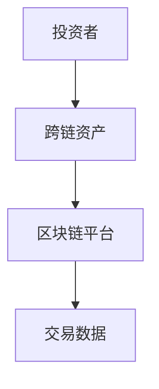
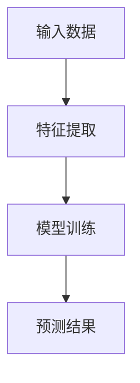
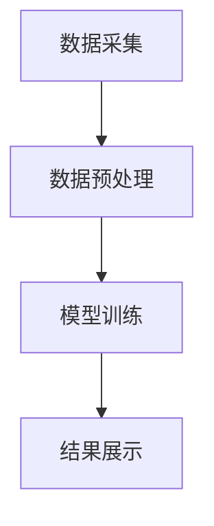

                 


# 特价股票投资中的跨链资产相关性预测分析

## 关键词：特价股票、跨链资产、相关性预测、投资分析、区块链、机器学习、数据挖掘

## 摘要：  
随着区块链技术的快速发展，跨链资产逐渐成为投资者关注的焦点。特价股票作为一种高风险高回报的投资标的，其价格波动与跨链资产之间可能存在潜在的相关性。本文通过分析跨链资产的特性，结合统计学和机器学习方法，构建相关性预测模型，为投资者提供科学的投资决策依据。文章详细探讨了跨链资产相关性预测的背景、核心概念、算法原理、系统架构、项目实战及最佳实践，为投资者在特价股票投资中提供新的视角和方法。

---

# 第一部分: 特价股票与跨链资产相关性预测的背景

# 第1章: 特价股票与跨链资产的定义与特性

## 1.1 特价股票的基本概念

### 1.1.1 特价股票的定义

特价股票通常指价格较低的股票，具有高波动性和高风险的特点，吸引了很多追求高回报的投资者。

### 1.1.2 特价股票的特性

- 高波动性：价格波动剧烈，短期内可能产生较大收益或损失。
- 高风险：适合风险承受能力强的投资者。
- 小盘股特性：多为市值较小的公司股票。

### 1.1.3 特价股票与传统股票的区别

| 属性         | 特价股票         | 传统股票       |
|--------------|-----------------|---------------|
| 市值         | 小              | 大            |
| 波动性       | 高              | 中            |
| 投资门槛     | 低              | 中            |

## 1.2 跨链资产的基本概念

### 1.2.1 跨链技术的定义

跨链技术是指在不同区块链之间实现资产转移和数据交互的技术，支持多种区块链平台的互联互通。

### 1.2.2 跨链资产的特性

- 跨平台性：可以在多个区块链之间流转。
- 透明性：通过区块链技术确保资产的透明性和可追溯性。
- 高流动性：在支持的区块链网络中具有较高的流动性。

### 1.2.3 跨链资产与传统资产的区别

| 属性         | 跨链资产         | 传统资产       |
|--------------|-----------------|---------------|
| 透明度       | 高              | 低            |
| 流动性       | 高              | 中            |
| 跨平台性     | 是             | 否            |

## 1.3 特价股票与跨链资产相关性的背景

### 1.3.1 投资者对跨链资产的关注度上升

随着区块链技术的普及，越来越多的投资者开始关注跨链资产，尤其是比特币、以太坊等主流加密货币。

### 1.3.2 特价股票与跨链资产相关性的研究意义

通过对特价股票与跨链资产相关性的研究，可以帮助投资者更好地理解市场波动，优化投资组合，降低风险。

### 1.3.3 相关性预测的边界与外延

- 数据范围：限定在一定时间窗口内，如1年、3年等。
- 跨链资产范围：限定在主流区块链资产，如比特币、以太坊等。

---

# 第2章: 跨链资产相关性预测的核心概念与联系

## 2.1 相关性预测的原理

### 2.1.1 统计学相关性分析的基本原理

相关性分析是通过计算两个变量之间的相关系数，判断它们之间的关联程度。相关系数的取值范围在-1到1之间，绝对值越大表示相关性越强。

### 2.1.2 机器学习在相关性预测中的应用

机器学习算法，如线性回归、随机森林等，可以通过历史数据训练模型，预测未来的价格走势。

## 2.2 核心概念的属性特征对比

### 2.2.1 跨链资产与传统资产的属性对比

| 属性         | 跨链资产         | 传统资产       |
|--------------|-----------------|---------------|
| 资产类型     | 数字资产        | 实体资产       |
| 资产特性     | 去中心化        | 中心化         |
| 技术支持     | 区块链技术      | 传统金融系统   |

## 2.3 ER实体关系图架构



## 2.4 本章小结

---

# 第3章: 跨链资产相关性预测的算法原理

## 3.1 算法原理概述

### 3.1.1 线性回归模型

线性回归模型是一种简单但有效的回归分析方法，适用于两个变量之间存在线性关系的情况。



### 3.1.2 时间序列分析

时间序列分析是一种通过分析数据随时间变化的模式，预测未来趋势的方法。

```python
# 线性回归模型示例
import numpy as np
from sklearn.linear_model import LinearRegression

X = np.array([1, 2, 3, 4, 5]).reshape(-1, 1)
y = np.array([2, 4, 5, 4, 6])

model = LinearRegression()
model.fit(X, y)
print(model.coef_)
```

## 3.2 数学模型与公式

### 3.2.1 相关性系数公式

$$ r = \frac{\sum (x_i - \bar{x})(y_i - \bar{y})}{\sqrt{\sum (x_i - \bar{x})^2 \sum (y_i - \bar{y})^2}} $$

### 3.2.2 线性回归模型公式

$$ y = \beta_0 + \beta_1 x + \epsilon $$

其中，$\beta_0$ 是截距，$\beta_1$ 是斜率，$\epsilon$ 是误差项。

---

# 第4章: 跨链资产相关性预测的系统架构设计

## 4.1 系统功能设计

### 4.1.1 数据采集模块

负责从多个区块链平台采集跨链资产的交易数据和市场数据。

### 4.1.2 数据预处理模块

对采集的数据进行清洗、归一化等预处理，确保数据质量。

### 4.1.3 模型训练模块

使用机器学习算法对预处理后的数据进行建模，训练相关性预测模型。

### 4.1.4 结果展示模块

将预测结果可视化，帮助投资者更好地理解和应用预测结果。

## 4.2 系统架构设计



---

# 第5章: 跨链资产相关性预测的项目实战

## 5.1 项目环境安装

```bash
pip install numpy pandas sklearn matplotlib
```

## 5.2 核心代码实现

```python
import numpy as np
from sklearn.linear_model import LinearRegression
import pandas as pd
import matplotlib.pyplot as plt

# 数据加载
data = pd.read_csv('chain_asset_data.csv')
X = data[['price']].values
y = data['volume'].values

# 模型训练
model = LinearRegression()
model.fit(X, y)

# 预测结果
y_pred = model.predict(X)

# 可视化
plt.scatter(X, y, color='blue', label='Actual')
plt.plot(X, y_pred, color='red', label='Predicted')
plt.xlabel('Price')
plt.ylabel('Volume')
plt.legend()
plt.show()
```

---

# 第6章: 跨链资产相关性预测的最佳实践

## 6.1 项目经验总结

### 6.1.1 数据质量的重要性

数据质量直接影响模型的预测效果，需要确保数据的完整性和准确性。

### 6.1.2 模型选择的策略

根据具体问题和数据特点选择合适的模型，避免盲目追求复杂算法。

### 6.1.3 结果验证的方法

通过回测和实际数据验证模型的准确性，确保模型在实际应用中有效。

## 6.2 项目注意事项

### 6.2.1 数据隐私保护

在处理敏感数据时，需要遵守相关法律法规，保护数据隐私。

### 6.2.2 模型更新频率

根据市场变化定期更新模型，确保预测结果的时效性。

### 6.2.3 风险控制

在投资决策中，需结合多种因素进行综合判断，避免过度依赖模型预测。

---

# 第7章: 总结与展望

## 7.1 本章总结

通过对跨链资产相关性预测的系统研究，本文为投资者提供了科学的投资决策依据，帮助其更好地理解市场波动，优化投资组合。

## 7.2 未来展望

随着区块链技术的不断发展，跨链资产相关性预测将更加精准和多样化，为投资者提供更高效的投资策略。

---

# 作者：AI天才研究院/AI Genius Institute & 禅与计算机程序设计艺术 /Zen And The Art of Computer Programming

