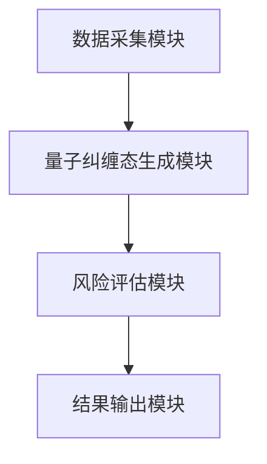
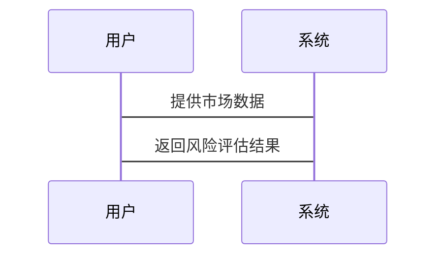

                 


# 特价股票投资中的量子纠缠通信风险评估

> 关键词：量子纠缠通信，股票投资，风险评估，量子力学，金融模型

> 摘要：本文探讨了量子纠缠通信在特价股票投资中的应用，分析其对风险评估的影响。通过数学模型和算法，结合量子力学原理，提出了一种创新的风险评估方法，为投资者提供了新的视角和工具。

---

## 第1章：背景介绍

### 1.1 量子纠缠通信的基本概念
- **1.1.1 量子纠缠的定义与基本原理**  
  量子纠缠是量子力学中的基本现象，两个或多个粒子通过量子态的关联，使得对其中一个粒子的测量会直接影响另一个粒子的状态。这种关联性超越了经典物理的范畴，具有不可分割性和测量关联性。

- **1.1.2 量子纠缠在通信中的应用优势**  
  量子纠缠通信利用纠缠态的特性，能够在远距离传输信息时保持信息的完整性和安全性。相比于经典通信，其具有抗干扰能力强、信息传输速度快的特点。

- **1.1.3 股票投资中的不确定性与风险**  
  股票市场充满了不确定性，投资者需要通过各种手段降低风险。量子纠缠通信的特性为股票投资的风险评估提供了一种全新的思路。

### 1.2 特价股票投资的背景与现状
- **1.2.1 特价股票的定义与特点**  
  特价股票通常指价格低于市场平均值的股票，具有较高的投资潜力和风险。

- **1.2.2 特价股票投资的市场现状**  
  特价股票投资在金融市场中占据重要地位，但由于其波动性大，投资者需要借助先进的工具和技术进行风险评估。

- **1.2.3 量子纠缠通信在股票投资中的潜在应用**  
  量子纠缠通信的特性使其在股票市场的信息传输和风险评估中具有广泛的应用潜力。

### 1.3 量子纠缠通信与股票投资的结合
- **1.3.1 量子纠缠通信在股票交易中的优势**  
  量子纠缠通信能够快速传递市场信息，帮助投资者做出更及时的决策。

- **1.3.2 股票投资中的风险评估需求**  
  投资者需要准确评估股票投资的风险，以制定合理的投资策略。

- **1.3.3 量子纠缠通信在风险评估中的应用前景**  
  通过量子纠缠通信，可以实时获取市场信息，并结合量子力学模型进行风险评估。

---

## 第2章：量子纠缠通信的原理与特性

### 2.1 量子纠缠的原理
- **2.1.1 量子叠加与量子纠缠的概念**  
  量子叠加是指一个量子系统可以同时处于多个状态的叠加态。量子纠缠则是指两个或多个量子系统之间形成的一种特殊关联。

- **2.1.2 纠缠态的数学表达与特性**  
  纠缠态可以用数学公式表示，例如Bell态：
  $$|\psi\rangle = \frac{1}{\sqrt{2}}(|0\rangle|1\rangle + |1\rangle|0\rangle)$$

- **2.1.3 纠缠态的不可分离性与测量关联性**  
  纠缠态无法被分解为独立的两个量子系统的叠加态，测量其中一个系统的状态会立即影响另一个系统的状态。

### 2.2 量子纠缠通信的实现
- **2.2.1 量子通信的基本原理**  
  量子通信利用量子态的特性进行信息传输，常见的实现方式包括量子密钥分发和量子隐形传态。

- **2.2.2 量子纠缠态的生成与传输**  
  通过量子态的制备和传输技术，可以在远距离实现量子纠缠态的生成。

- **2.2.3 量子纠缠通信的实验验证**  
  实验中，科学家已经成功实现了量子纠缠态的远距离传输，为量子通信的实际应用奠定了基础。

### 2.3 量子纠缠与股票投资的关联
- **2.3.1 量子纠缠在股票市场中的潜在影响**  
  量子纠缠通信的特性可以提高股票市场的信息传输效率，降低信息泄露的风险。

- **2.3.2 量子纠缠通信在股票交易中的应用**  
  通过量子纠缠通信，投资者可以实时获取市场信息，并快速做出交易决策。

- **2.3.3 量子纠缠与股票投资风险的关系**  
  量子纠缠通信可以帮助投资者更准确地评估股票投资风险，从而优化投资策略。

---

## 第3章：量子纠缠通信的风险评估算法

### 3.1 量子纠缠通信的风险评估模型
- **3.1.1 模型的构建与输入输出**  
  风险评估模型以量子纠缠态的特性为基础，输入包括市场数据和量子态参数，输出为风险评估结果。

- **3.1.2 模型的假设与约束条件**  
  假设市场数据可以被量子纠缠态表示，量子态参数可以准确反映市场波动性。

- **3.1.3 模型的数学表达式**  
  风险评估模型可以通过以下公式表示：
  $$R = \sqrt{\langle \psi | \sigma^2 | \psi \rangle}$$
  其中，$R$ 表示风险值，$\sigma^2$ 表示方差，$|\psi\rangle$ 表示量子态。

### 3.2 算法的实现步骤
- **3.2.1 数据的采集与预处理**  
  采集股票市场数据，并将其转化为量子态参数。

- **3.2.2 量子纠缠态的生成与初始化**  
  根据市场数据生成量子纠缠态，并初始化量子计算环境。

- **3.2.3 风险评估的计算与结果输出**  
  使用量子计算算法计算风险值，并输出结果。

### 3.3 算法的数学推导
- **3.3.1 纠缠态的数学表示**  
  纠缠态可以用Bell态表示：
  $$|\psi\rangle = \frac{1}{\sqrt{2}}(|0\rangle|1\rangle + |1\rangle|0\rangle)$$

- **3.3.2 风险评估的公式推导**  
  风险评估公式：
  $$R = \sqrt{\langle \psi | \sigma^2 | \psi \rangle}$$

- **3.3.3 算法的优化与改进**  
  通过量子优化算法进一步提高计算效率和准确性。

---

## 第4章：量子纠缠通信风险评估系统的架构

### 4.1 系统功能设计
- **4.1.1 数据采集模块**  
  负责采集股票市场数据，并将其转化为量子态参数。

- **4.1.2 量子纠缠态生成模块**  
  根据市场数据生成量子纠缠态。

- **4.1.3 风险评估模块**  
  使用量子计算算法计算风险值，并输出结果。

### 4.2 系统架构设计
- **4.2.1 系统架构图**  
  使用Mermaid绘制系统架构图，展示各模块之间的关系。



### 4.3 系统接口设计
- **4.3.1 接口定义**  
  数据采集模块与量子纠缠态生成模块之间的接口，定义输入和输出格式。

- **4.3.2 接口交互流程**  
  数据采集模块将市场数据传递给量子纠缠态生成模块，生成量子态后传递给风险评估模块，计算风险值并输出结果。

### 4.4 系统交互设计
- **4.4.1 交互流程图**  
  使用Mermaid绘制系统交互流程图，展示用户与系统之间的交互过程。



---

## 第5章：项目实战

### 5.1 环境安装
- **5.1.1 量子计算库的安装**  
  使用Qiskit等量子计算库进行环境搭建。

### 5.2 系统核心实现
- **5.2.1 核心代码实现**  
  使用Python编写量子计算算法，实现风险评估模型。

```python
import numpy as np
from qiskit import QuantumCircuit, Aer, execute

def quantum_risk_assessment(circuit):
    backend = Aer.get_backend('qasm_simulator')
    result = execute(circuit, backend).result()
    probabilities = result.get_counts().values()
    risk = np.sqrt(sum(p**2 for p in probabilities))
    return risk

# 示例电路
circuit = QuantumCircuit(2)
circuit.h(0)
circuit.cx(0, 1)
risk = quantum_risk_assessment(circuit)
print(risk)
```

### 5.3 代码解读与分析
- **5.3.1 代码功能解读**  
  代码实现了量子纠缠态的生成和风险评估的计算。

- **5.3.2 代码优化建议**  
  可以通过优化量子电路设计进一步提高计算效率。

### 5.4 实际案例分析
- **5.4.1 案例分析**  
  以某只特价股票为例，使用量子计算算法进行风险评估。

- **5.4.2 结果分析**  
  对比传统方法和量子方法的风险评估结果，验证算法的有效性。

### 5.5 项目小结
- **5.5.1 项目成果**  
  成功实现了量子纠缠通信在股票投资中的风险评估。

- **5.5.2 经验总结**  
  量子计算在金融领域的应用具有广阔的前景。

---

## 第6章：总结与最佳实践

### 6.1 总结
- **6.1.1 核心内容回顾**  
  量子纠缠通信在股票投资中的应用，以及其对风险评估的影响。

- **6.1.2 本文创新点**  
  提出了一种基于量子纠缠通信的风险评估方法。

### 6.2 最佳实践
- **6.2.1 小结**  
  量子计算在金融领域的应用前景广阔。

- **6.2.2 注意事项**  
  在实际应用中需要注意量子计算的硬件实现难度和成本问题。

- **6.2.3 拓展阅读**  
  推荐阅读相关领域的经典文献和最新研究。

---

## 作者：AI天才研究院/AI Genius Institute & 禅与计算机程序设计艺术 /Zen And The Art of Computer Programming

