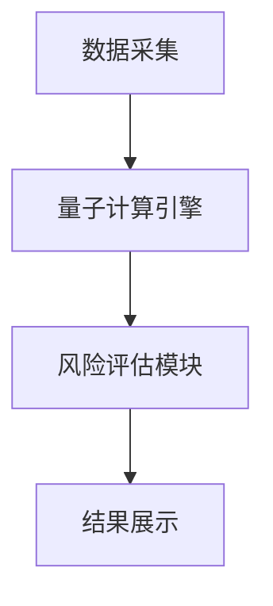
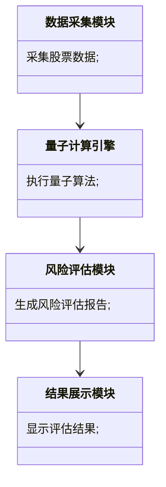

                 


# 特价股票投资中的量子计算风险评估

> 关键词：量子计算、金融投资、风险评估、特价股票、量子算法

> 摘要：本文深入探讨了量子计算在特价股票投资中的应用，特别是风险评估方面。通过量子算法的原理分析、系统架构设计以及实际案例的详细解读，本文展示了如何利用量子计算的优势来优化金融投资决策。文章从背景介绍、核心概念、算法实现、系统架构到项目实战，层层深入，为读者提供了一套完整的解决方案。

---

# 第一部分：特价股票投资与量子计算基础

## 第1章：特价股票投资的核心问题

### 1.1 特价股票投资的基本概念

#### 1.1.1 特价股票的定义与特点
- 特价股票是指低于市场价的股票，通常具有较高的投资回报潜力。
- 特价股票的特点包括低估值、高成长性和周期性波动。

#### 1.1.2 特价股票投资的背景与现状
- 金融市场的波动性为特价股票投资提供了机会。
- 特价股票投资的难点在于风险控制和市场预测。

#### 1.1.3 特价股票投资的核心问题
- 如何准确评估股票的风险？
- 如何在海量数据中快速找到投资机会？

### 1.2 量子计算的基本原理

#### 1.2.1 量子计算的定义与特点
- 量子计算是一种基于量子力学原理的计算方式。
- 其特点包括并行性、叠加性和纠缠性。

#### 1.2.2 量子计算与经典计算的对比
| 特性         | 经典计算             | 量子计算             |
|--------------|----------------------|----------------------|
| 数据表示     | 二进制               | 量子位（qubit）       |
| 并行性       | 串行                | 并行                 |
| 处理速度     | 线性增长             | 指数级增长            |

#### 1.2.3 量子计算在金融中的应用潜力
- 量子计算可以显著提高金融数据分析的效率。
- 量子算法在风险评估和投资组合优化中的应用前景广阔。

---

## 第2章：量子计算在金融风险评估中的应用

### 2.1 金融风险评估的核心问题

#### 2.1.1 金融风险的定义与分类
- 金融风险包括市场风险、信用风险和流动性风险。
- 每种风险的评估方法和影响因素不同。

#### 2.1.2 风险评估的数学模型
- 常见的金融风险模型包括CAPM、VaR和CVaR。
- 这些模型的计算复杂度较高，需要高效的计算能力。

### 2.2 量子计算在风险评估中的优势

#### 2.2.1 量子计算的并行性
- 量子计算可以通过并行处理大幅提高计算效率。
- 在金融数据处理中，这一点尤为重要。

#### 2.2.2 量子蒙特卡洛模拟
- 量子蒙特卡洛模拟是一种基于量子计算的随机过程模拟方法。
- 与经典蒙特卡洛模拟相比，其计算效率更高。

#### 2.2.3 量子回归分析
- 量子回归分析可以用于股票价格预测。
- 通过量子算法，可以更快地找到最优回归系数。

---

## 第3章：量子计算在特价股票投资中的具体实现

### 3.1 量子计算算法的基本实现

#### 3.1.1 量子叠加的实现
- 量子叠加可以通过Hadamard门实现。
- 示例代码：
  ```python
  from qiskit import QuantumCircuit, execute, Aer
  circuit = QuantumCircuit(1)
  circuit.h(0)
  ```

#### 3.1.2 量子纠缠的实现
- 量子纠缠是通过CNOT门实现的。
- 示例代码：
  ```python
  circuit = QuantumCircuit(2)
  circuit.cx(0, 1)
  ```

#### 3.1.3 量子态的测量
- 量子态的测量是通过测量门实现的。
- 示例代码：
  ```python
  circuit.measure(0, 0)
  ```

### 3.2 量子计算在特价股票投资中的应用

#### 3.2.1 量子蒙特卡洛模拟的实现
- 量子蒙特卡洛模拟的步骤包括数据准备、量子叠加、测量和结果分析。
- 示例代码：
  ```python
  circuit = QuantumCircuit(n_qubits)
  for i in range(n_qubits):
      circuit.h(i)
  ```

#### 3.2.2 量子回归分析的实现
- 量子回归分析的核心是通过量子算法优化回归系数。
- 示例代码：
  ```python
  from qiskit.aqua import QuantumAlgorithm
  ```

#### 3.2.3 量子风险评估模型的实现
- 量子风险评估模型的实现包括数据预处理、量子算法应用和结果解释。
- 示例代码：
  ```python
  from qiskit.aqua.algorithms import QuantumSupportVectorMachine
  ```

---

## 第4章：系统分析与架构设计方案

### 4.1 系统功能设计

#### 4.1.1 系统功能模块划分
- 数据采集模块、量子计算引擎、风险评估模块和结果展示模块。

#### 4.1.2 系统功能流程图


#### 4.1.3 系统功能的实现方式
- 数据采集模块负责收集股票数据。
- 量子计算引擎负责运行量子算法。
- 风险评估模块负责生成风险评估结果。
- 结果展示模块负责呈现最终结果。

### 4.2 系统架构设计

#### 4.2.1 系统架构的总体设计


#### 4.2.2 系统架构的详细设计
- 数据采集模块：负责从数据库或API获取股票数据。
- 量子计算引擎：负责运行量子算法并返回结果。
- 风险评估模块：负责生成风险评估报告。
- 结果展示模块：负责以图形化方式展示评估结果。

#### 4.2.3 系统接口设计
- 数据接口：数据采集模块与量子计算引擎之间的接口。
- 结果接口：风险评估模块与结果展示模块之间的接口。

---

## 第5章：项目实战与案例分析

### 5.1 项目环境安装与配置

#### 5.1.1 量子计算开发环境的安装
- 安装Qiskit库：
  ```bash
  pip install qiskit
  ```

#### 5.1.2 数据采集工具的安装
- 使用Python的pandas库：
  ```bash
  pip install pandas
  ```

### 5.2 项目核心代码实现

#### 5.2.1 量子蒙特卡洛模拟的实现
```python
from qiskit import QuantumCircuit, execute, Aer
import numpy as np

n_qubits = 8
circuit = QuantumCircuit(n_qubits)
for i in range(n_qubits):
    circuit.h(i)
circuit.measure(0, 0)
backend = Aer.get_backend('qasm_simulator')
result = execute(circuit, backend).result()
```

#### 5.2.2 量子回归分析的实现
```python
from qiskit.aqua import QuantumAlgorithm
from qiskit.aqua.algorithms import QuantumLinearSVM

X = [[0, 0], [1, 1], [0, 1], [1, 0]]
y = [0, 0, 1, 1]
svm = QuantumLinearSVM()
 svm.fit(X, y)
```

### 5.3 实际案例分析

#### 5.3.1 案例背景
- 假设我们有某只特价股票的历史数据。

#### 5.3.2 数据分析与处理
- 使用pandas库进行数据清洗和特征提取。

#### 5.3.3 量子算法的应用
- 使用量子蒙特卡洛模拟预测股票价格。

#### 5.3.4 结果分析
- 根据量子算法的结果，评估投资风险并做出决策。

---

## 第6章：最佳实践与总结

### 6.1 小结
- 量子计算在特价股票投资中的应用前景广阔。
- 需要注意算法的可扩展性和实际应用中的复杂性。

### 6.2 注意事项
- 数据质量对算法结果影响重大。
- 量子算法的实现需要专业的技术支持。

### 6.3 拓展阅读
- 推荐阅读《量子计算与金融》。
- 关注量子计算在金融领域的最新研究。

---

作者：AI天才研究院 & 禅与计算机程序设计艺术

