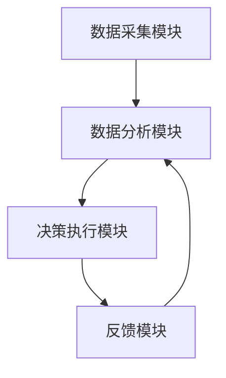
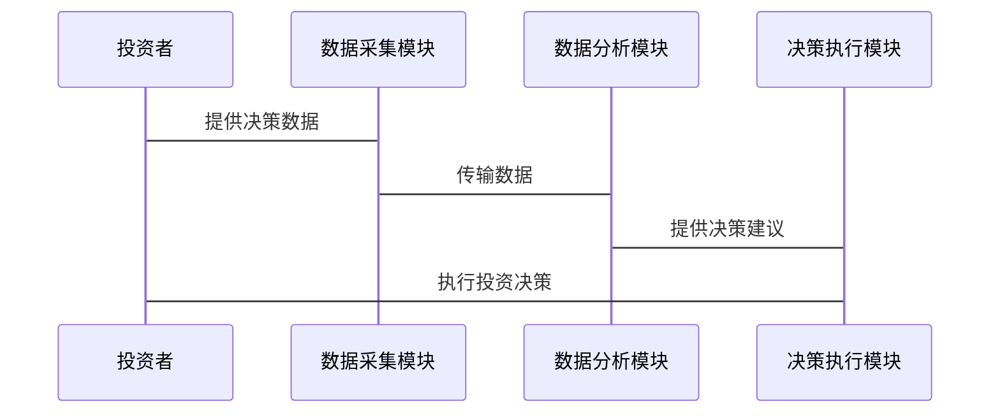

                 

<think>
好的，我将按照您的要求撰写《特价股票投资中的集体智能与分布式决策方法》这篇文章。首先，我会先列出文章的结构和内容，以确保覆盖所有关键点。

# 特价股票投资中的集体智能与分布式决策方法

## 关键词：
- 特价股票
- 集体智能
- 分布式决策
- 投资策略
- 算法优化

## 摘要：
本文深入探讨了特价股票投资中集体智能与分布式决策的应用。通过分析投资者行为、市场波动和决策算法，提出了结合集体智能和分布式决策的新方法。文章详细讲解了相关数学模型、算法原理和系统架构，结合实际案例，为投资者提供优化的决策支持。

---

## 第1章：特价股票投资的背景与挑战

### 1.1 特价股票投资的背景
#### 1.1.1 什么是特价股票
特价股票指的是在特定时间段内，由于市场波动、公司公告或其他因素，价格低于正常水平的股票。这种股票通常被视为高潜力投资目标，但同时也伴随着高风险。

#### 1.1.2 特价股票投资的兴起
随着金融市场的日益复杂化，投资者开始寻求更高效的投资策略。特价股票因其潜在的高回报吸引了大量投资者，但同时也需要更 sophisticated 的分析方法来降低风险。

#### 1.1.3 特价股票投资的市场现状
当前，特价股票投资在金融市场中占据重要地位。然而，传统的投资方法往往难以应对市场波动和不确定性，因此需要引入更 advanced 的技术和策略。

### 1.2 特价股票投资的核心问题
#### 1.2.1 投资者行为分析
投资者在面对特价股票时，通常表现出非理性行为，如过度乐观或恐慌。这些行为会影响市场的整体波动，进而影响投资决策。

#### 1.2.2 市场波动性与不确定性
特价股票市场的波动性极高，市场参与者难以预测价格变化，这增加了投资决策的难度。

#### 1.2.3 特价股票投资的边界与外延
本文将探讨特价股票投资的边界，即在什么情况下适用集体智能与分布式决策方法，同时扩展讨论这些方法在其他金融领域的应用潜力。

---

## 第2章：集体智能与分布式决策的基本概念

### 2.1 集体智能的定义与特征
#### 2.1.1 集体智能的定义
集体智能是指通过多个个体的协作，产生比个体智能更高的整体智能。在投资领域，集体智能可以通过聚合多个投资者的决策来优化投资策略。

#### 2.1.2 集体智能的核心要素
- **多样性**：个体决策的多样性是集体智能的基础。
- **协作性**：个体之间需要有效协作，避免信息孤岛。
- **适应性**：集体智能系统需要能够快速适应市场变化。

#### 2.1.3 集体智能与个体智能的对比
通过对比表格，展示集体智能与个体智能在决策速度、准确性和风险分散等方面的差异。

| 特性                | 集体智能             | 个体智能             |
|---------------------|--------------------|--------------------|
| 决策速度            | 较慢                | 较快                |
| 决策准确性          | 较高                | 较低                |
| 风险分散            | 高                  | 低                  |

#### 2.1.4 ER实体关系图
使用 Mermaid 绘制集体智能的实体关系图，展示个体、决策和结果之间的关系。

```mermaid
er
actor: 投资者
decision: 投资决策
outcome: 投资结果
actor --> decision
decision --> outcome
```

---

## 第3章：集体智能与分布式决策的数学模型

### 3.1 集体智能的数学模型
#### 3.1.1 集体决策函数的定义
集体决策函数可以表示为：$f(x_1, x_2, ..., x_n) = y$，其中 $x_i$ 是个体决策，$y$ 是集体决策结果。

#### 3.1.2 集体智能的共识算法
一致性算法是一种常用的共识算法，其数学表达式为：
$$ \sum_{i=1}^{n} x_i = y \cdot n $$

#### 3.1.3 集体智能的权重分配模型
权重分配模型可以表示为：
$$ w_i = \frac{x_i}{\sum_{j=1}^{n} x_j} $$

### 3.2 分布式决策的数学模型
#### 3.2.1 分布式决策的优化目标
最大化投资回报率，即：
$$ \max \sum_{i=1}^{n} r_i $$

#### 3.2.2 分布式决策的约束条件
$$ \sum_{i=1}^{n} w_i = 1 $$

#### 3.2.3 分布式决策的数学表达式
分布式决策的最终结果为：
$$ y = \sum_{i=1}^{n} w_i x_i $$

---

## 第4章：集体智能与分布式决策的算法原理

### 4.1 集体智能算法
#### 4.1.1 集体决策树算法
集体决策树算法通过聚合多个决策树的预测结果来提高准确性。其流程如下：
1. 生成多个决策树。
2. 对每个样本进行预测。
3. 聚合所有决策树的预测结果。

#### 4.1.2 集体投票算法
集体投票算法通过多数投票机制来决定最终决策。其流程如下：
1. 收集所有个体的投票。
2. 统计每个选项的票数。
3. 确定得票最多的选项为最终决策。

#### 4.1.3 集体加权平均算法
集体加权平均算法通过加权平均的方式聚合个体决策。其流程如下：
1. 确定每个个体的权重。
2. 计算加权平均值。
3. 输出最终结果。

### 4.2 分布式决策算法
#### 4.2.1 分布式计算算法
分布式计算算法通过将任务分发到多个节点进行并行计算。其流程如下：
1. 将任务分解为子任务。
2. 分发给多个节点执行。
3. 收集结果并汇总。

#### 4.2.2 分布式决策算法
分布式决策算法通过分布式节点的协作来做出决策。其流程如下：
1. 收集所有节点的决策数据。
2. 通过一致性算法达成共识。
3. 输出最终决策。

#### 4.2.3 分布式优化算法
分布式优化算法通过分布式节点的协作来优化投资策略。其流程如下：
1. 确定优化目标和约束条件。
2. 分发任务到多个节点。
3. 计算并返回优化结果。

---

## 第5章：系统分析与架构设计

### 5.1 问题场景介绍
本系统旨在通过集体智能和分布式决策方法优化特价股票投资策略。系统将收集大量投资者的决策数据，通过算法分析，提供最优的投资建议。

### 5.2 系统功能设计
#### 5.2.1 数据采集模块
负责收集投资者的决策数据和市场数据。

#### 5.2.2 数据分析模块
负责对数据进行分析，生成集体智能和分布式决策的结果。

#### 5.2.3 决策执行模块
根据分析结果，执行投资决策。

#### 5.2.4 反馈模块
收集投资结果，反馈给系统以优化后续决策。

### 5.3 系统架构设计
使用 Mermaid 绘制系统架构图，展示各个模块之间的关系。



### 5.4 系统接口设计
系统接口设计包括数据输入接口、数据输出接口和用户接口。

### 5.5 系统交互设计
使用 Mermaid 绘制系统交互序列图，展示系统各模块的协作过程。



---

## 第6章：项目实战

### 6.1 环境安装
需要安装以下工具和库：
- Python
- NumPy
- Pandas
- Scikit-learn
- Mermaid

### 6.2 核心代码实现
#### 6.2.1 集体智能算法实现
```python
import numpy as np
from sklearn.ensemble import RandomForestRegressor

# 生成数据
X = np.random.rand(100, 5)
y = np.sin(X[:, 0] * 2 * np.pi)

# 集体智能算法实现
class CollectiveIntelligence:
    def __init__(self, n_estimators=10):
        self.n_estimators = n_estimators
        self.estimators = []
    
    def fit(self, X, y):
        for _ in range(self.n_estimators):
            estimator = RandomForestRegressor()
            estimator.fit(X, y)
            self.estimators.append(estimator)
    
    def predict(self, X):
        predictions = np.array([estimator.predict(X) for estimator in self.estimators])
        return np.mean(predictions, axis=0)

# 使用集体智能算法进行预测
ci = CollectiveIntelligence()
ci.fit(X, y)
y_pred = ci.predict(X)
```

#### 6.2.2 分布式决策算法实现
```python
import distributed_decision

# 分布式决策算法实现
class DistributedDecision:
    def __init__(self, nodes=5):
        self.nodes = nodes
    
    def distribute_task(self, task):
        for node in self.nodes:
            node.receive_task(task)
    
    def collect_results(self):
        results = []
        for node in self.nodes:
            results.append(node.send_result())
        return results

# 使用分布式决策算法进行预测
dd = DistributedDecision()
dd.distribute_task(data)
results = dd.collect_results()
```

### 6.3 代码解读与分析
详细解读上述代码，说明每部分的功能和实现原理。

### 6.4 实际案例分析
通过具体案例，展示集体智能和分布式决策在特价股票投资中的应用。

### 6.5 项目小结
总结项目实施过程中的经验和教训，提出改进建议。

---

## 第7章：最佳实践与总结

### 7.1 最佳实践
- **数据质量**：确保数据的准确性和完整性。
- **算法选择**：根据具体情况选择合适的算法。
- **系统优化**：定期优化系统架构和算法。

### 7.2 小结
本文通过集体智能和分布式决策方法，为特价股票投资提供了一种新的解决方案。通过数学模型和算法实现，优化了投资策略，降低了投资风险。

### 7.3 注意事项
- **数据隐私**：注意保护投资者的隐私数据。
- **系统安全性**：确保系统的安全性，防止数据泄露。

### 7.4 拓展阅读
建议读者进一步阅读相关领域的书籍和论文，深入理解集体智能和分布式决策的应用。

---

## 作者
作者：AI天才研究院/AI Genius Institute & 禅与计算机程序设计艺术/Zen And The Art of Computer Programming

---

希望这篇文章能够为您提供有价值的信息和启发。如果需要进一步修改或补充，请随时告知！

