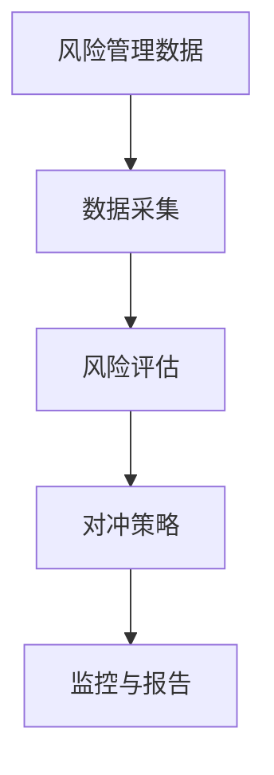

                 


# 特价股票投资中的风险管理

> 关键词：特价股票，风险管理，VaR模型，Python代码，系统架构，投资策略

> 摘要：本文深入探讨了在特价股票投资中如何进行有效的风险管理，从基础概念到数学模型，再到系统架构，详细讲解了风险管理的重要性、核心概念、量化模型和实战案例，帮助投资者在高风险市场中实现稳健投资。

---

## 第一部分：引言

### 第1章：背景与引言

#### 1.1 特价股票的定义与特点
特价股票是指以低于市场价格购入的股票，通常出现在市场波动、公司重组或财务困境等情况。其特点包括高波动性、潜在高回报和高风险。

#### 1.2 风险管理的重要性
在特价股票投资中，风险管理是确保投资组合稳健的关键。通过有效管理风险，投资者可以避免重大损失，抓住潜在收益。

---

## 第二部分：风险管理基础

### 第2章：风险管理的核心概念

#### 2.1 风险的定义与分类
风险是投资回报的不确定性，分为市场风险、信用风险、流动性风险和操作风险等。

#### 2.2 风险管理的目标
风险管理的目标是将潜在损失控制在可接受范围内，通过量化和对冲策略降低风险。

---

## 第三部分：风险量化模型

### 第3章：VaR模型

#### 3.1 VaR的定义与公式
VaR（Value at Risk）是衡量投资组合潜在损失的指标，公式为：$$ VaR = \mu + z \cdot \sigma $$，其中$\mu$是平均回报，$z$是标准正态分布的分位数，$\sigma$是标准差。

#### 3.2 计算VaR的Python代码
```python
import numpy as np

def calculate VaR(returns, confidence_level=0.95):
    sorted_returns = sorted(returns)
    alpha = confidence_level
    VaR = sorted_returns[int(len(returns) * (1 - alpha))]
    return VaR
```

### 第4章：CVaR模型

#### 4.1 CVaR的定义与公式
CVaR（Conditional Value at Risk）是VaR的延伸，计算在VaR水平下的平均损失。公式为：$$ CVaR = \frac{1}{1 - \alpha} \int_{-\infty}^{VaR} (x - VaR) dx $$

#### 4.2 计算CVaR的Python代码
```python
import numpy as np

def calculate CVaR(returns, confidence_level=0.95):
    sorted_returns = sorted(returns)
    alpha = confidence_level
    VaR = sorted_returns[int(len(returns) * (1 - alpha))]
    tail = sorted_returns[:int(len(returns) * (1 - alpha))]
    CVaR = np.mean(tail)
    return CVaR
```

---

## 第四部分：系统架构与实战

### 第5章：风险管理系统的架构设计

#### 5.1 系统模块划分
- 数据采集模块：实时获取股票价格和市场数据。
- 风险评估模块：计算VaR和CVaR等风险指标。
- 对冲策略模块：基于风险评估制定对冲策略。
- 监控与报告模块：实时监控风险指标并生成报告。

#### 5.2 系统架构图


---

## 第五部分：案例分析

### 第6章：实战案例分析

#### 6.1 案例背景
假设某投资者在特价股票市场中持有某只股票，历史回报数据如下：
$$ \text{returns} = [-0.02, 0.01, -0.03, 0.05, -0.01] $$

#### 6.2 计算VaR和CVaR
使用Python代码计算VaR（95%置信水平）和CVaR：
```python
returns = [-0.02, 0.01, -0.03, 0.05, -0.01]
VaR = calculate VaR(returns, 0.95)
CVaR = calculate CVaR(returns, 0.95)
print(f"VaR: {VaR}, CVaR: {CVaR}")
```

#### 6.3 对冲策略制定
根据计算结果，投资者决定使用衍生品对冲部分风险，降低潜在损失。

---

## 第六部分：结论

### 第7章：总结与展望

#### 7.1 总结
风险管理是特价股票投资中的核心，通过VaR和CVaR等模型，结合系统架构设计，投资者可以有效降低风险，实现稳健投资。

#### 7.2 展望
未来，随着人工智能和大数据技术的发展，风险管理将更加智能化和精准化，投资者需持续学习和优化策略。

---

## 附录

### 附录A：常用风险管理工具
- Python库：numpy, pandas, scipy
- 数据源：Yahoo Finance, Alpha Vantage

### 附录B：推荐阅读书籍
- 《风险管理与VaR》
- 《Python金融计算》

---

作者：AI天才研究院/AI Genius Institute & 禅与计算机程序设计艺术 /Zen And The Art of Computer Programming

