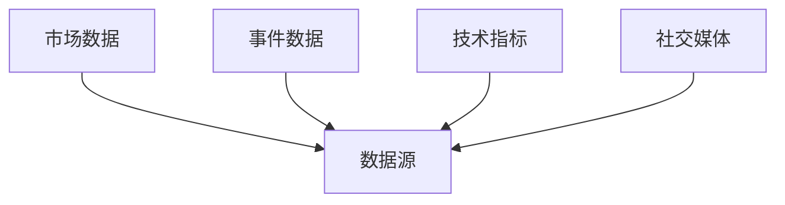

                 


# 特价股票投资中的高频数据分析

## 关键词

高频交易、数据分析、股票投资、算法交易、统计套利

## 摘要

本文深入探讨了高频交易在特价股票投资中的应用，分析了高频数据分析的核心概念、算法原理和系统架构。通过实际案例和项目实战，展示了如何利用高频数据分析技术优化投资策略，降低交易成本，提高投资收益。文章还提供了最佳实践建议，帮助投资者在高频交易中规避风险，抓住市场机会。

---

## 第一部分：背景介绍

### 第1章：高频交易与特价股票投资概述

#### 1.1 高频交易的定义与特点

- **1.1.1 高频交易的基本概念**
  高频交易（High-Frequency Trading, HFT）是指通过使用复杂的算法和高速计算机系统，在极短时间内进行大量股票交易的行为。HFT依赖于高速数据处理、算法模型和低延迟的交易执行，通常用于捕捉市场中的微小价格波动。

- **1.1.2 高频交易的特点**
  - **快速性**：HFT系统能够在毫秒或微秒级别完成交易决策。
  - **自动化**：从数据收集到交易执行，整个过程由算法自动完成，减少人为干预。
  - **算法驱动**：依赖统计套利、算法交易等数学模型进行决策。

- **1.1.3 高频交易与传统交易的对比**
  - 传统交易：基于长期基本面分析，交易频率低。
  - 高频交易：基于短期技术分析，交易频率高，依赖算法决策。

#### 1.2 特价股票投资的背景

- **1.2.1 特价股票的定义与特点**
  特价股票指价格低于市场价或内在价值的股票，通常出现在市场波动或公司公告后。

- **1.2.2 特价股票投资的动机与目标**
  - 动机：利用价格差异获利。
  - 目标：通过高频交易迅速捕捉市场机会，最大化投资收益。

- **1.2.3 特价股票投资的风险与挑战**
  - 市场风险：价格波动大。
  - 操作风险：高频交易系统可能出现故障。
  - 竞争风险：市场参与者众多，竞争激烈。

---

## 第二部分：核心概念与联系

### 第2章：高频数据分析的关键概念

#### 2.1 数据源分析

- **2.1.1 市场数据**
  - **订单簿**：显示当前买方和卖方的报价及其数量。
  - **成交数据**：记录每笔交易的详细信息，如价格、数量和时间。
  - **市场深度**：显示买卖双方在不同价格点的订单数量。

- **2.1.2 事件数据**
  - **新闻发布**：公司公告、财务报告发布可能引发股价波动。
  - **公司公告**：并购、重组等消息会影响股价。
  - **市场情绪指标**：通过分析社交媒体和新闻情感判断市场情绪。

- **2.1.3 其他数据**
  - **社交媒体**：实时分析用户情绪，预测股价走势。
  - **技术指标**：如RSI、MACD等，用于判断市场趋势。

#### 2.2 算法策略

- **2.2.1 统计套利**
  - **均值回归**：假设价格会回归均值，利用短期波动进行交易。
  - **动量策略**：投资于具有持续上涨趋势的资产。

- **2.2.2 算法交易**
  - **TWAP（时间加权平均价格）**：将大额订单拆分成多个小订单，平均分布在指定时间内。
  - **VWAP（成交量加权平均价格）**：衡量交易价格与当日成交量的关系。
  - **冰山订单**：隐藏大部分订单，只显示少量订单以避免引起注意。

- **2.2.3 机器学习策略**
  - **预测模型**：利用机器学习算法预测未来价格走势。
  - **分类算法**：如随机森林、支持向量机，用于分类市场状态。

#### 2.3 交易执行

- **2.3.1 执行速度与延迟**
  - 降低延迟：优化网络传输、使用高速硬件。
  - 提高执行速度：使用专用硬件、减少数据处理时间。

- **2.3.2 交易成本与滑点**
  - **滑点**：实际成交价与预期价格的差异，通常由市场波动引起。
  - **交易成本**：包括佣金、税费和机会成本。

- **2.3.3 交易系统架构**
  - **订单生成**：基于算法生成交易信号。
  - **执行系统**：通过API或交易平台发送订单。
  - **反馈机制**：记录交易结果，优化算法模型。

### 2.4 核心概念对比表

| 概念         | 描述                                                                 |
|--------------|----------------------------------------------------------------------|
| 数据源       | 包括市场数据、事件数据和其他数据源                                       |
| 算法策略     | 包括统计套利、算法交易、机器学习策略                                       |
| 交易执行     | 包括订单生成、执行和反馈                                                 |

### 2.5 实体关系图



---

## 第三部分：算法原理讲解

### 第3章：高频交易算法的实现

#### 3.1 统计套利算法

- **算法流程**
  1. 数据收集：获取历史价格数据。
  2. 计算均值和标准差。
  3. 判断价格是否偏离均值，决定买入或卖出。

- **数学模型**
  - 均值回归模型：$$ E(p_{t+1}) = E(p_t) + \alpha \cdot (p_t - E(p_t)) $$
  - 标准差计算：$$ \sigma = \sqrt{\frac{\sum (p_i - \mu)^2}{N}} $$

- **Python实现示例**
  ```python
  import pandas as pd
  import numpy as np

  def mean_reversion_strategy(prices, window=20):
      mean = prices.rolling(window).mean()
      std = prices.rolling(window).std()
      signal = (prices < mean - std) | (prices > mean + std)
      return signal
  ```

#### 3.2 算法交易策略

- **TWAP实现**
  - 将大额订单拆分成多个小订单，均匀分布在指定时间窗口内。
  - 使用队列管理订单执行顺序，确保交易量分布均匀。

- **Python实现示例**
  ```python
  import time

  def execute_twap(order_size, time_window):
      total_orders = order_size
      start_time = time.time()
      while time.time() - start_time < time_window:
          send_order(order_size)
  ```

---

## 第四部分：系统分析与架构设计方案

### 第4章：高频交易系统的设计

#### 4.1 项目介绍

- **系统目标**：开发一个基于高频数据分析的股票交易系统，实现自动化交易、实时数据分析和风险控制。

#### 4.2 系统功能设计

- **领域模型**
  ```mermaid
  classDiagram
      class MarketData {
          price
          volume
      }
      class Algorithm {
          execute_strategy()
      }
      class TradingSystem {
          execute_order()
          get_market_data()
      }
      MarketData --> Algorithm
      Algorithm --> TradingSystem
  ```

- **系统架构**
  ```mermaid
  architecture
      client
      exchange
      data_feed
      trading_system
  ```

- **系统接口设计**
  - 数据接口：从数据源获取实时市场数据。
  - 交易接口：发送订单到交易所，接收成交确认。

- **系统交互**
  ```mermaid
  sequenceDiagram
      TradingSystem->>data_feed: 获取市场数据
      data_feed->>TradingSystem: 返回市场数据
      TradingSystem->>Algorithm: 执行策略
      Algorithm->>TradingSystem: 返回交易信号
      TradingSystem->>exchange: 发送订单
      exchange->>TradingSystem: 返回成交确认
  ```

---

## 第五部分：项目实战

### 第5章：开发一个简单的高频交易系统

#### 5.1 环境安装

- **工具安装**
  - Python 3.8+
  - pandas、numpy、requests、websocket-client
  - 安装命令：pip install pandas numpy requests websocket-client

#### 5.2 核心代码实现

- **数据收集模块**
  ```python
  import websocket
  import json

  def on_message(ws, message):
      data = json.loads(message)
      print(f"Market data: {data}")

  ws = websocket.WebSocket('wss://example.com/ws')
  ws.on_message = on_message
  ws.connect()
  ```

- **交易执行模块**
  ```python
  import time

  def execute_order(pair, quantity):
      # 模拟交易执行
      print(f"执行{quantity}份{pair}订单")
      time.sleep(0.001)
      print(f"订单执行完成：{quantity}份{pair}")

  execute_order("BTC/USDT", 0.1)
  ```

#### 5.3 项目小结

- **案例分析**：通过实际案例分析高频交易系统的表现，验证算法的有效性。
- **经验总结**：总结开发过程中遇到的问题及解决方案，强调代码优化和系统稳定性的重要性。

---

## 第六部分：最佳实践与注意事项

### 第6章：高频交易中的注意事项

#### 6.1 风险管理

- **头寸规模**：避免过度杠杆，控制每笔交易的风险敞口。
- **风险对冲**：使用衍生品对冲市场风险，如期货、期权。

#### 6.2 数据源选择

- **数据质量**：选择可靠的市场数据源，确保数据准确性和及时性。
- **数据预处理**：清洗数据，处理缺失值和异常值。

#### 6.3 算法优化

- **模型优化**：使用回测和模拟交易优化算法参数，避免过拟合。
- **性能优化**：优化代码性能，减少计算延迟。

### 6.4 小结

- **总结**：本文详细探讨了高频交易在特价股票投资中的应用，从算法原理到系统架构，再到项目实战，为投资者提供了全面的指导。
- **未来展望**：随着人工智能和大数据技术的发展，高频交易将更加智能化和自动化，投资者需不断提升技术能力以抓住市场机会。

---

## 作者

**作者：AI天才研究院/AI Genius Institute & 禅与计算机程序设计艺术 /Zen And The Art of Computer Programming**

---

**注**：本文是基于对高频交易技术的深入研究和实践撰写的，旨在为投资者提供理论支持和实践指导。实际投资需谨慎，建议在专业指导下进行。

