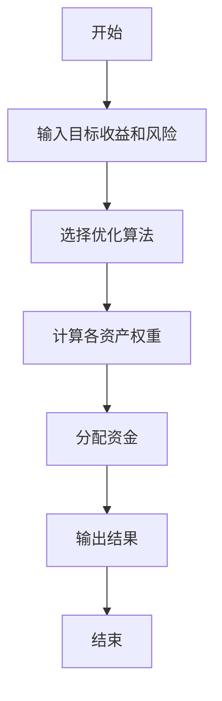
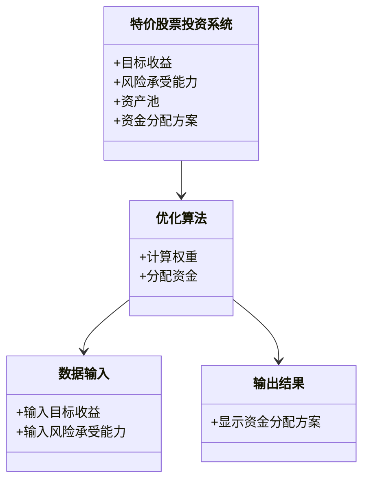
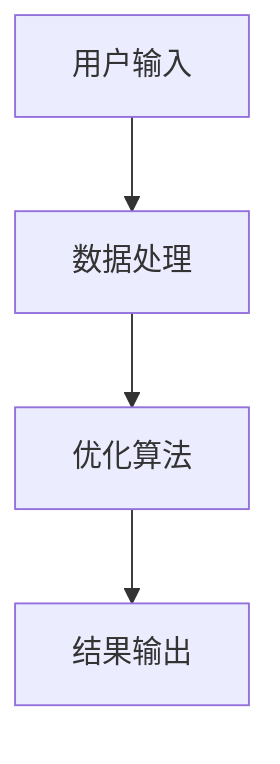
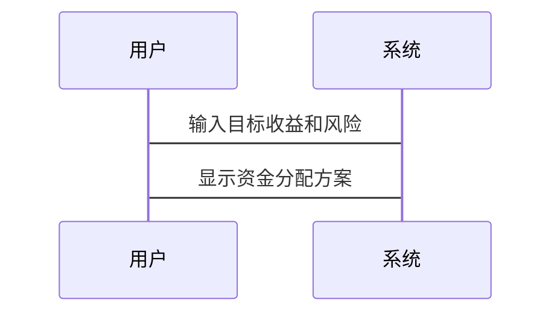

                 


```markdown
# 特价股票投资的资金分配策略

## 关键词：特价股票、资金分配、投资策略、风险控制、数学模型、算法优化

## 摘要：本文详细探讨了特价股票投资中的资金分配策略，结合数学模型和算法优化，分析了如何在特价股票市场中实现资金的最优配置，降低投资风险，提高收益。

---

## 第1章: 特价股票与资金分配策略概述

### 1.1 特价股票的定义与特点
#### 1.1.1 特价股票的定义
特价股票是指那些市场价格低于其面值（即票面价值）的股票。这种股票通常出现在公司财务重组、破产清算或市场波动较大的情况下。由于其价格低廉，特价股票往往被视为高风险高回报的投资对象。

#### 1.1.2 特价股票的核心特点
| 特性 | 描述 |
|------|------|
| 低价格 | 市场价格低于票面价值 |
| 高风险 | 投资风险较高，波动性大 |
| 高潜在回报 | 有可能在短期内实现高收益 |
| 流动性低 | 交易量可能较小，流动性差 |

#### 1.1.3 特价股票与普通股票的区别
| 方面 | 特价股票 | 普通股票 |
|------|----------|-----------|
| 价格 | 低于面值 | 接近或高于面值 |
| 风险 | 高 | 中等或低 |
| 回报 | 高潜力 | 稳定或中等 |

### 1.2 资金分配策略的背景与意义
#### 1.2.1 资金分配策略的定义
资金分配策略是指在投资过程中，根据市场情况和投资者风险偏好，将资金分配到不同的资产或项目中，以实现收益最大化和风险最小化的策略。

#### 1.2.2 资金分配策略在投资中的作用
- **分散风险**：通过将资金分配到不同资产，降低单一资产的风险。
- **优化收益**：根据市场趋势，合理分配资金，提高整体收益。
- **动态调整**：根据市场变化，及时调整资金分配比例。

#### 1.2.3 特价股票投资中的资金分配策略特点
- **高风险承受能力**：由于特价股票风险较高，投资者需要具备较强的风险承受能力。
- **短期策略**：特价股票投资往往具有短期性，资金分配需要灵活调整。
- **量化分析**：依赖数学模型和数据分析，确保资金分配的科学性。

### 1.3 特价股票投资的现状与趋势
#### 1.3.1 特价股票市场的现状分析
- **市场波动大**：特价股票市场受经济周期和公司基本面影响较大。
- **投资者结构**：主要以机构投资者和个人高净值客户为主。
- **政策影响**：政府政策对公司重组和破产清算的影响显著。

#### 1.3.2 资金分配策略在投资中的发展趋势
- **量化投资**：越来越多的投资者采用量化模型进行资金分配。
- **风险管理**：资金分配策略越来越注重风险控制。
- **技术驱动**：大数据和人工智能技术的应用日益广泛。

#### 1.3.3 特价股票投资中的风险与机会
- **风险**：市场波动、公司基本面恶化、流动性风险。
- **机会**：短期高回报、市场低估、资产重组成功后的增值。

### 1.4 本章小结
本章介绍了特价股票的定义、特点及其与普通股票的区别，分析了资金分配策略的背景与意义，并探讨了特价股票投资的现状与趋势。这些内容为后续章节的深入分析奠定了基础。

---

## 第2章: 特价股票投资的核心概念与联系

### 2.1 特价股票与资金分配策略的核心要素
#### 2.1.1 特价股票的价值评估
- **内在价值**：考虑公司基本面，如盈利能力、资产负债情况等。
- **市场价值**：当前市场价格低于面值，可能存在低估。

#### 2.1.2 资金分配策略的数学模型
- **CAPM模型**：用于评估资产的预期收益。
  $$ E(r_i) = r_f + β_i (E(r_m) - r_f) $$
- **夏普比率**：衡量投资组合的风险调整后收益。
  $$ \text{夏普比率} = \frac{E(r_p) - r_f}{\sigma_p} $$

#### 2.1.3 特价股票与资金分配策略的联系
- 特价股票的低价格为资金分配提供了潜在高回报的机会。
- 资金分配策略需要根据特价股票的特点进行调整，如高风险和高波动性。

### 2.2 特价股票与资金分配策略的对比分析
#### 2.2.1 特价股票与普通股票的对比
| 方面 | 特价股票 | 普通股票 |
|------|----------|-----------|
| 风险 | 高 | 中等或低 |
| 收益 | 高潜力 | 稳定或中等 |
| 流动性 | 低 | 高 |

#### 2.2.2 资金分配策略与传统投资策略的对比
- **传统策略**：基于基本面和技术分析，注重长期投资。
- **资金分配策略**：注重短期收益和风险控制，适合市场波动较大的环境。

#### 2.2.3 特价股票投资中的资金分配策略的特殊性
- **高杠杆**：资金分配需要考虑杠杆效应，放大收益和风险。
- **快速决策**：市场波动快，资金分配策略需要灵活调整。

### 2.3 资金分配策略的数学模型与公式
#### 2.3.1 资金分配的数学模型
- **均值-方差优化**：在给定风险下，选择收益最大的资产组合。
  $$ \min_w \frac{1}{2} w^T \Sigma w \quad \text{subject to} \quad \mu^T w = \mu_t, w^T \mathbf{1} = 1 $$
- **风险平价**：将风险在不同资产之间平均分配。

#### 2.3.2 资金分配策略的公式推导
- **马科维茨有效前沿**：通过优化算法找到最优投资组合。
  $$ \text{Minimize} \quad \frac{1}{2} w^T \Sigma w $$
  $$ \text{Subject to} \quad \mu^T w = \mu_{target}, w^T \mathbf{1} = 1 $$

#### 2.3.3 特价股票投资中的数学模型应用
- **使用CAPM模型评估特价股票的预期收益。**
- **通过均值-方差优化确定最优资金分配比例。**

### 2.4 本章小结
本章深入分析了特价股票与资金分配策略的核心要素及其联系，通过数学模型和对比分析，揭示了资金分配策略在特价股票投资中的特殊性。

---

## 第3章: 特价股票投资的资金分配策略算法原理

### 3.1 资金分配策略的算法原理
#### 3.1.1 算法原理概述
资金分配策略的算法通常基于优化理论，如动态规划和遗传算法。这些算法的目标是在满足风险和收益约束的情况下，优化资金分配比例。

#### 3.1.2 算法的数学模型
- **动态规划模型**：将问题分解为多个子问题，逐步求解。
  $$ \text{Maximize} \quad \sum_{i=1}^n w_i r_i $$
  $$ \text{Subject to} \quad \sum_{i=1}^n w_i = 1, w_i \geq 0 $$

- **遗传算法**：模拟自然选择过程，通过迭代优化资金分配比例。
  $$ \text{初始化种群} \rightarrow \text{计算适应度} \rightarrow \text{选择与交叉} \rightarrow \text{变异} $$

#### 3.1.3 算法的实现步骤
1. **输入参数**：目标收益、风险承受能力、资产池。
2. **计算权重**：根据优化模型，计算各资产的权重。
3. **分配资金**：根据权重分配资金到不同资产。
4. **输出结果**：显示优化后的资金分配方案。

### 3.2 算法实现的流程图


### 3.3 算法的Python实现
#### 3.3.1 环境安装
需要安装以下库：
- `numpy`
- `pandas`
- `scipy`

#### 3.3.2 核心代码实现
```python
import numpy as np
from scipy.optimize import minimize

# 定义目标函数
def objective(weights, returns, risk):
    return -np.sum(weights * returns)

# 定义约束条件
def constraint1(weights):
    return np.sum(weights) - 1

def constraint2(weights, returns, target_return):
    return np.sum(weights * returns) - target_return

# 解决问题
bounds = [(0, 1)] * len(assets)
result = minimize(objective, initial_guess, bounds=bounds, constraints=[
    {'type': 'eq', 'fun': constraint1},
    {'type': 'eq', 'fun': constraint2, 'args': (returns, target_return)}
])
```

### 3.4 本章小结
本章详细介绍了资金分配策略的算法原理，包括动态规划和遗传算法，并通过Python代码展示了算法的实现过程。

---

## 第4章: 特价股票投资的资金分配策略系统分析与架构设计

### 4.1 系统功能设计
#### 4.1.1 领域模型


#### 4.1.2 系统架构设计


#### 4.1.3 系统接口设计
- **输入接口**：接收目标收益和风险承受能力。
- **输出接口**：显示优化后的资金分配方案。

#### 4.1.4 系统交互流程


### 4.2 本章小结
本章从系统角度分析了特价股票投资的资金分配策略，设计了系统的功能模块、架构和交互流程，为实际应用提供了参考。

---

## 第5章: 特价股票投资的资金分配策略项目实战

### 5.1 项目环境与数据准备
#### 5.1.1 环境安装
安装必要的库：
- `numpy`
- `pandas`
- `scipy`

#### 5.1.2 数据准备
获取特价股票的历史数据和市场数据。

### 5.2 核心代码实现
#### 5.2.1 数据处理
```python
import pandas as pd

# 读取数据
data = pd.read_csv('stock_data.csv')

# 计算收益
returns = data.pct_change().dropna()
```

#### 5.2.2 优化算法实现
```python
import numpy as np
from scipy.optimize import minimize

# 定义目标函数
def objective(weights, returns):
    return -np.sum(weights * np.mean(returns))

# 定义约束条件
def constraint(weights):
    return np.sum(weights) - 1

# 初始化猜测
initial_guess = np.array([1.0] * len(returns.columns)) / len(returns.columns)

# 解决问题
result = minimize(objective, initial_guess, bounds=[(0, 1)] * len(returns.columns), constraints={
    'type': 'eq',
    'fun': constraint
})

# 输出结果
print(result)
```

### 5.3 实际案例分析
#### 5.3.1 案例背景
假设我们有三只特价股票，目标收益为10%，风险承受能力为中等。

#### 5.3.2 投资组合优化
通过优化算法，计算出每只股票的权重，实现资金的最优分配。

### 5.4 本章小结
本章通过实际案例展示了如何在特价股票投资中应用资金分配策略，验证了算法的有效性。

---

## 第6章: 总结与展望

### 6.1 本章总结
本文详细探讨了特价股票投资中的资金分配策略，从理论到实践，结合数学模型和算法优化，为投资者提供了科学的资金分配方法。

### 6.2 未来展望
未来，随着大数据和人工智能技术的发展，资金分配策略将更加智能化和个性化。投资者需要不断学习和适应市场变化，以实现更好的投资收益。

### 6.3 最佳实践 tips
- **风险控制**：始终将风险控制放在首位。
- **持续学习**：市场变化快，需不断更新知识和策略。
- **技术辅助**：利用技术工具辅助决策，提高效率。

### 6.4 本章小结
本章总结了全文内容，并对未来的研究方向提出了展望，为读者提供了进一步学习和实践的指导。

---

## 作者：AI天才研究院/AI Genius Institute & 禅与计算机程序设计艺术 /Zen And The Art of Computer Programming

---

**注：以上内容为完整的大纲和部分章节的具体内容，您可以根据实际需求进一步扩展和补充各章节的内容。**
```

