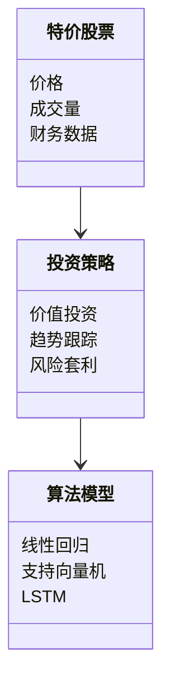
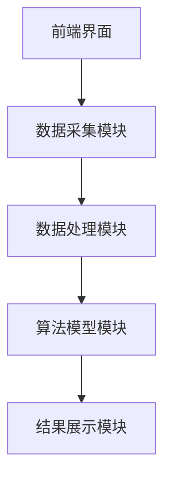
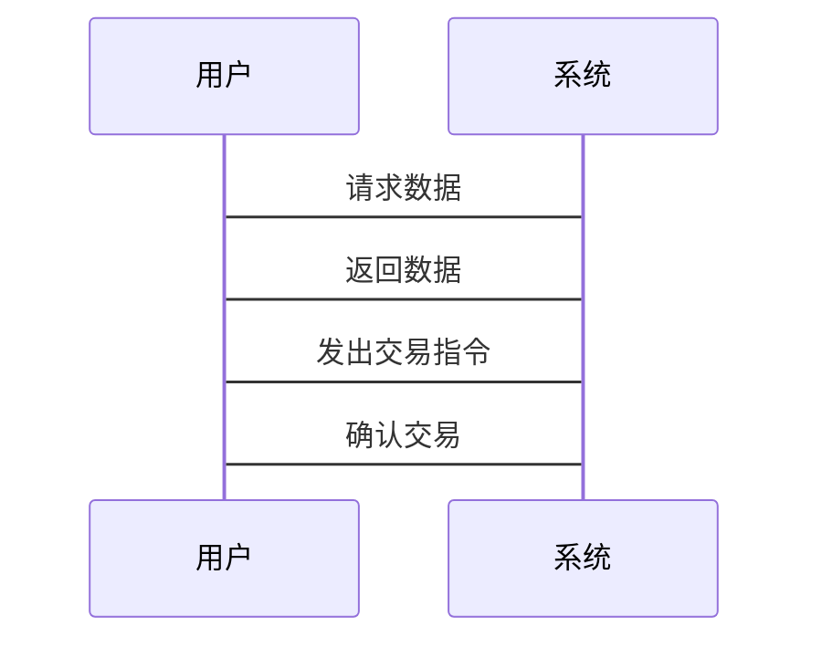

                 


```markdown
# 特价股票投资策略在前沿市场的适用性探讨

> **关键词**: 特价股票, 投资策略, 前沿市场, 量化分析, 算法模型, 系统架构

> **摘要**: 本文探讨了特价股票投资策略在前沿市场的适用性，通过分析特价股票的基本概念、投资策略的核心要素以及算法模型的实现，结合实际案例，详细阐述了如何在前沿市场中有效应用这些策略。文章从背景介绍、核心概念、算法原理、系统分析、项目实战到最佳实践，层层递进，为投资者提供了理论与实践相结合的深度解析。

---

# 第一部分: 特价股票投资策略背景与基础

## 第1章: 特价股票的基本概念

### 1.1 特价股票的定义与类型

#### 1.1.1 特价股票的定义
特价股票是指以低于面值价格发行或交易的股票，通常与公司财务困境、市场波动或特殊发行机制相关。其特点是高风险、高回报，适合有一定风险承受能力的投资者。

#### 1.1.2 特价股票的类型
- **优先股**：具有优先分红权和优先清偿权，风险较低。
- **可转换债券**：可转换为公司股票，兼具债券和股票特性。
- **认股权证**：赋予持有者以特定价格购买公司股票的权利。

#### 1.1.3 特价股票的发行机制
- **折价发行**：公司以低于面值的价格发行股票，常见于新成立的公司或急需资金的企业。
- **配股**：向现有股东以低于市场价格配售新股。
- **增发**：公司增发新股，价格低于市场价以吸引投资者。

### 1.2 前沿市场的定义与特点

#### 1.2.1 前沿市场的定义
前沿市场指新兴市场或转型期市场，通常具有高增长潜力，但市场波动较大，信息不对称严重。

#### 1.2.2 前沿市场的特点
- **高波动性**：市场波动剧烈，容易受政策和经济环境影响。
- **信息不对称**：市场透明度较低，投资者获取信息困难。
- **高增长潜力**：新兴行业和企业具有较高的增长空间。

#### 1.2.3 前沿市场的投资环境
- **政策风险**：政策变化对企业经营和市场有较大影响。
- **流动性风险**：市场流动性较低，可能难以快速变现。
- **竞争压力**：新兴市场中企业竞争激烈，生存压力大。

### 1.3 特价股票投资策略的背景

#### 1.3.1 特价股票投资的兴起
随着市场波动加剧，投资者开始关注低价股票，试图通过低价买入高价卖出获利。

#### 1.3.2 前沿市场中的投资机会
新兴市场中，许多企业因估值较低，吸引了大量投资者关注特价股票。

#### 1.3.3 特价股票投资的潜在风险
- **市场波动风险**：特价股票价格波动大，容易受市场情绪影响。
- **公司基本面风险**：企业可能处于财务困境，影响股票价值。
- **政策风险**：政策变化可能导致股价大幅波动。

### 1.4 本章小结
本章介绍了特价股票的定义、类型和发行机制，并分析了前沿市场的特点和投资环境，为后续策略分析奠定了基础。

---

## 第2章: 特价股票与投资策略的关系

### 2.1 特价股票的市场表现

#### 2.1.1 特价股票的波动性分析
特价股票价格波动较大，容易受到市场情绪和外部环境的影响。

#### 2.1.2 特价股票的市场情绪影响
投资者情绪对特价股票价格有显著影响，市场情绪高涨时，股价可能大幅上涨。

#### 2.1.3 特价股票的长期与短期表现
短期表现受市场波动影响较大，长期表现则取决于公司基本面和行业发展趋势。

### 2.2 投资策略的分类

#### 2.2.1 价值投资策略
寻找被市场低估的股票，长期持有，等待价值回归。

#### 2.2.2 趋势跟踪策略
根据市场趋势和技术指标进行买卖决策，追求短期收益。

#### 2.2.3 风险套利策略
通过套利机会获利，需对市场有深刻理解。

### 2.3 特价股票投资策略的核心要素

#### 2.3.1 市场分析
- **技术分析**：通过K线图、均线等技术指标预测价格走势。
- **基本面分析**：分析公司财务状况、行业地位等因素。

#### 2.3.2 公司基本面
- **财务状况**：关注公司盈利能力、资产负债情况。
- **管理团队**：优秀的管理团队有助于公司长期发展。

#### 2.3.3 技术分析
- **K线图**：通过形态分析判断股价走势。
- **均线系统**：利用短期、中期、长期均线判断趋势。

### 2.4 本章小结
本章分析了特价股票的市场表现和投资策略的分类，强调了市场分析、公司基本面和技术分析的重要性。

---

## 第3章: 量化分析与算法模型

### 3.1 量化分析的基本原理

#### 3.1.1 数据收集与处理
- **数据来源**：收集历史股价、成交量、财务数据等。
- **数据清洗**：处理缺失值、异常值，确保数据质量。

#### 3.1.2 数据特征提取
- **技术指标**：计算MACD、RSI等技术指标。
- **市场情绪指标**：分析社交媒体、新闻数据对市场情绪的影响。

#### 3.1.3 数据建模与预测
- **时间序列模型**：ARIMA、LSTM等模型用于预测股价走势。
- **机器学习模型**：随机森林、神经网络等用于分类和回归。

### 3.2 算法模型的选择与实现

#### 3.2.1 线性回归模型
用于预测股价走势，公式为：
$$y = \beta_0 + \beta_1x + \epsilon$$

#### 3.2.2 支持向量机模型
用于分类问题，公式为：
$$\text{最大化} \quad 1 - \xi_i$$
$$\text{满足} \quad y_i(\beta \cdot x_i + \b

---

## 3.3 算法实现的数学模型

### 3.3.1 线性回归模型
$$y = \beta_0 + \beta_1x + \epsilon$$

### 3.3.2 支持向量机模型
$$\text{最大化} \quad 1 - \xi_i$$
$$\text{满足} \quad y_i(\beta \cdot x_i + \b

---

## 3.4 本章小结
本章介绍了量化分析的基本原理和算法模型的选择与实现，强调了数学模型在特价股票投资中的重要性。

---

## 第4章: 系统分析与架构设计方案

### 4.1 问题场景介绍
分析特价股票投资策略在前沿市场中的应用，构建一个影响策略的因素框架。

### 4.2 项目介绍
通过实际案例分析，展示如何在特定市场中应用投资策略。

### 4.3 系统功能设计

#### 4.3.1 领域模型类图


### 4.4 系统架构设计

#### 4.4.1 系统架构图


### 4.5 系统接口设计
- **输入接口**：接收历史数据和实时数据。
- **输出接口**：展示预测结果和交易信号。

### 4.6 系统交互序列图



### 4.7 本章小结
本章通过系统架构设计，展示了如何将特价股票投资策略应用于实际系统中，强调了各模块之间的协作关系。

---

## 第5章: 项目实战

### 5.1 环境安装
- **工具安装**：安装Python、Pandas、Scikit-learn等工具。
- **数据源**：获取历史股价数据和市场数据。

### 5.2 系统核心实现源代码

#### 5.2.1 数据处理代码
```python
import pandas as pd

# 读取数据
data = pd.read_csv('stock_data.csv')

# 数据清洗
data.dropna(inplace=True)
data = data[['date', 'price', 'volume']]
```

#### 5.2.2 算法实现代码
```python
from sklearn.linear_model import LinearRegression

# 训练模型
model = LinearRegression()
model.fit(X_train, y_train)

# 预测结果
y_pred = model.predict(X_test)
```

### 5.3 代码应用解读与分析
- **数据处理**：清洗数据，提取特征。
- **模型训练**：使用线性回归模型进行训练。
- **结果分析**：分析预测结果与实际值的差异。

### 5.4 实际案例分析
通过具体案例分析，展示如何在前沿市场中应用投资策略。

### 5.5 项目小结
本章通过实际项目展示，验证了理论分析的可行性，为投资者提供了实践参考。

---

## 第6章: 最佳实践

### 6.1 小结
总结全文内容，强调特价股票投资策略在前沿市场的适用性。

### 6.2 注意事项
- **风险控制**：设置止损点，避免重大损失。
- **持续学习**：市场变化快，需不断更新知识和策略。
- **多元化投资**：分散投资，降低风险。

### 6.3 拓展阅读
推荐相关书籍和文献，帮助读者深入学习。

### 6.4 本章小结
本章提供了投资策略的注意事项和拓展阅读建议，帮助投资者在实际操作中规避风险。

---

## 作者：AI天才研究院/AI Genius Institute & 禅与计算机程序设计艺术 /Zen And The Art of Computer Programming
```

