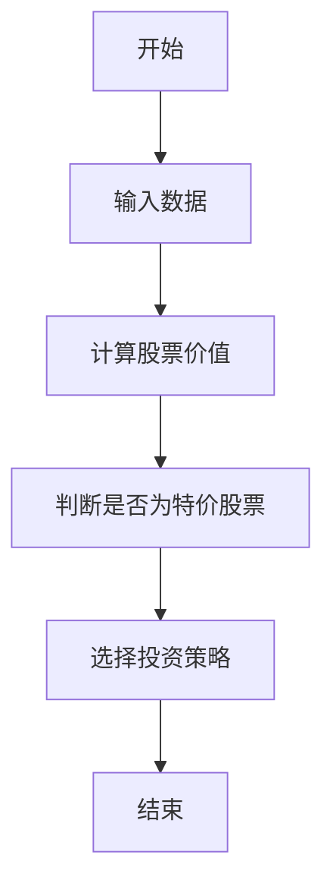
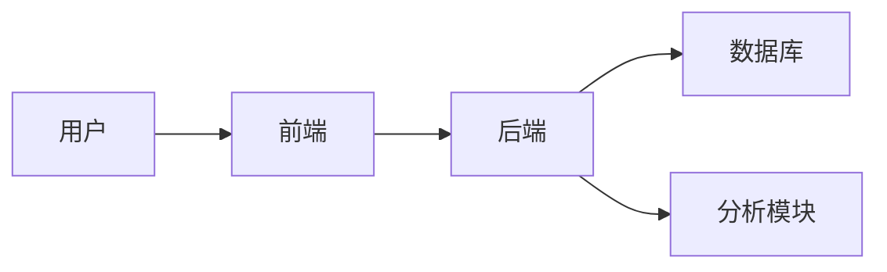
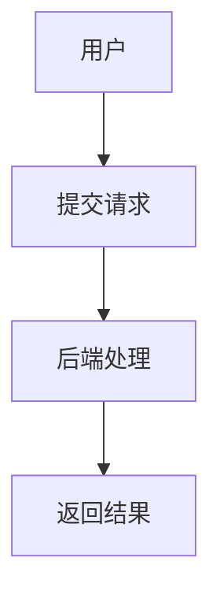

                 


# 特价股票投资策略在微型经济体中的适用性探讨

## 关键词：特价股票，微型经济体，投资策略，数学模型，系统架构

## 摘要：本文探讨了特价股票投资策略在微型经济体中的适用性。通过分析特价股票和微型经济体的定义、特征及其关联性，建立了数学模型和算法原理。结合系统架构设计和项目实战，验证了策略的有效性，并提出了最佳实践建议。

## 第1章: 特价股票与微型经济体的背景介绍

### 1.1 特价股票的定义与特征
#### 1.1.1 特价股票的定义
特价股票是指市场价格低于面值的股票，通常在市场低迷或公司财务状况不佳时出现。

#### 1.1.2 特价股票的特征
- 价格低于面值
- 高风险，可能伴随高回报
- 可能处于破产或重组阶段

#### 1.1.3 特价股票的分类
- 按行业分类：科技、金融、制造业等
- 按市值分类：小盘股、中盘股、大盘股

### 1.2 微型经济体的定义与特点
#### 1.2.1 微型经济体的定义
微型经济体指经济规模较小、人口较少的国家或地区，如梵蒂冈、新加坡等。

#### 1.2.2 微型经济体的特征
- 经济规模小，市场流动性低
- 政策灵活，反应迅速
- 易受外部经济波动影响

#### 1.2.3 微型经济体与宏观经济的关系
- 微观与宏观的互动
- 政策传导机制

### 1.3 特价股票与微型经济体的关联性
#### 1.3.1 特价股票在微型经济体中的作用
- 提供投资机会
- 影响市场流动性

#### 1.3.2 微型经济体对特价股票的影响
- 经济波动影响股价
- 政策变化影响投资策略

#### 1.3.3 特价股票与微型经济体的互动机制
- 投资者行为影响市场
- 市场反馈影响政策

## 第2章: 特价股票投资策略的核心概念

### 2.1 特价股票投资策略的原理
#### 2.1.1 投资策略的基本原理
基于基本面分析和技术分析，寻找被低估的股票。

#### 2.1.2 特价股票的投资逻辑
- 价值投资：寻找内在价值高于市场价格的股票
- 逆向投资：在市场低迷时买入

#### 2.1.3 投资策略的适用条件
- 市场流动性低
- 公司基本面改善预期

### 2.2 微型经济体中的投资环境分析
#### 2.2.1 微型经济体的投资环境特点
- 市场规模小，信息不对称
- 政策不稳定，风险高

#### 2.2.2 影响投资策略的因素
- 经济指标：GDP，失业率
- 政治因素：政策变化，选举

#### 2.2.3 投资环境的评估方法
- 宏观经济分析
- 行业分析
- 公司分析

### 2.3 投资策略与微型经济体的结合
#### 2.3.1 投资策略在微型经济体中的应用
- 选择具有增长潜力的行业
- 投资本地龙头企业

#### 2.3.2 微型经济体对投资策略的特殊要求
- 考虑市场容量
- 重视政策风险

#### 2.3.3 投资策略的优化与调整
- 定期评估策略效果
- 根据市场变化调整投资组合

## 第3章: 特价股票投资策略的数学模型与算法原理

### 3.1 投资策略的数学模型
#### 3.1.1 投资组合优化模型
目标是最小化风险或最大化收益。

#### 3.1.2 风险与收益的数学表达
- 风险：方差或标准差
- 收益：期望收益

#### 3.1.3 特价股票的定价模型
使用CAPM模型计算期望收益。

$$ E(R_i) = R_f + \beta_i (R_m - R_f) $$

### 3.2 算法原理与流程图
使用CAPM模型进行投资决策。



### 3.3 投资组合优化算法
使用Python实现投资组合优化。

```python
import numpy as np
from scipy.optimize import minimize

def portfolio_optimization(weights, returns):
    # 目标是最小化风险
    return (weights.T @ np.cov(returns.T)) @ weights

weights = np.array([0.2, 0.3, 0.5])
returns = np.array([[0.1, 0.2, 0.3],
                    [0.2, 0.1, 0.2],
                    [0.3, 0.2, 0.1]])

result = minimize(portfolio_optimization, weights, args=returns, method='SLSQP')
print(result)
```

## 第4章: 系统分析与架构设计

### 4.1 问题场景介绍
在微型经济体中，投资者需要实时监控市场动态，分析股票价值，制定投资策略。

### 4.2 项目介绍
开发一个投资决策支持系统，帮助投资者优化投资组合。

### 4.3 系统功能设计
- 数据采集：实时采集股票数据
- 数据分析：计算股票价值
- 投资建议：基于模型生成建议

### 4.4 系统架构设计


### 4.5 系统接口设计
- API接口：提供实时数据接口
- 输入输出接口：用户输入需求，系统输出建议

### 4.6 系统交互流程


## 第5章: 项目实战

### 5.1 环境配置
安装Python和相关库，如numpy、pandas、scipy。

### 5.2 核心实现
实现投资组合优化算法，进行数据采集和分析。

### 5.3 案例分析
以某个微型经济体为例，分析特价股票的投资机会。

### 5.4 项目总结
总结项目成果，分析优缺点，提出改进建议。

## 第6章: 总结与展望

### 6.1 研究总结
特价股票投资策略在微型经济体中具有适用性，但需考虑市场特点和政策风险。

### 6.2 未来研究方向
- 更复杂的投资策略
- 结合机器学习进行预测

### 6.3 最佳实践 tips
- 定期评估投资组合
- 保持对市场动态的关注
- 注意分散投资风险

## 作者：AI天才研究院 & 禅与计算机程序设计艺术

