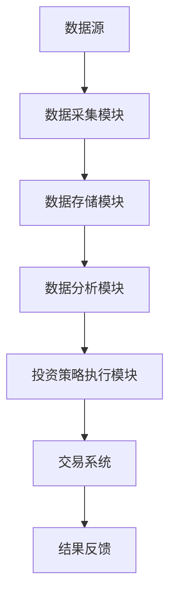
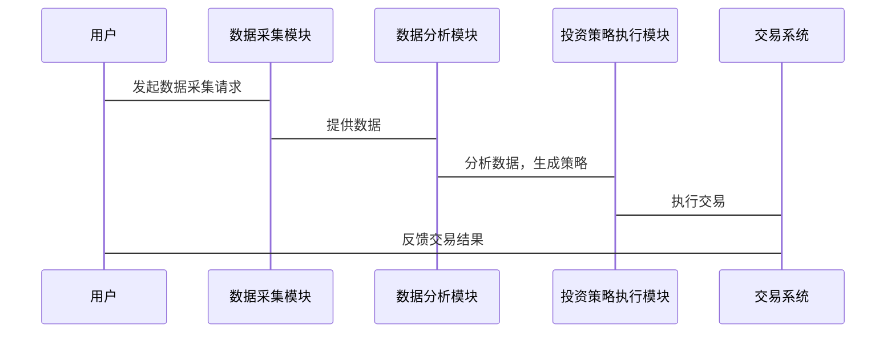

                 


# 特价股票投资策略在数字新兴经济体中的适用性探讨

> 关键词：特价股票、数字新兴经济体、投资策略、量化分析、人工智能

> 摘要：本文探讨了特价股票投资策略在数字新兴经济体中的适用性。通过分析特价股票的基本概念、数字新兴经济体的特征，以及投资策略的核心概念和算法原理，本文提出了适用于数字新兴经济体的投资策略。结合实际案例和系统架构设计，本文详细介绍了如何在数字新兴经济体中应用特价股票投资策略，并提供了最佳实践和注意事项。

---

## 第一部分: 特价股票投资策略概述

### 第1章: 特价股票的基本概念

#### 1.1 特价股票的定义与特点

##### 1.1.1 特价股票的定义
特价股票是指价格相对较低，具有较高成长潜力的股票。这些股票通常来自中小型企业或新兴行业，具有较大的增值空间。

##### 1.1.2 特价股票的核心特点
- 价格低廉：相对于大盘蓝筹股，特价股票的价格较低，适合小额投资者。
- 成长潜力大：这些股票通常来自新兴行业或快速发展的公司。
- 风险较高：由于公司规模较小，市场波动较大，风险相对较高。

##### 1.1.3 特价股票与普通股票的区别
| 特性 | 特价股票 | 普通股票 |
|------|----------|----------|
| 价格 | 较低     | 较高     |
| 成长性 | 较高     | 较稳定   |
| 风险 | 较高     | 较低     |

#### 1.2 数字新兴经济体的特征

##### 1.2.1 数字新兴经济体的定义
数字新兴经济体是指那些在数字化转型过程中迅速发展的经济体，如印度、东南亚国家等。这些国家的经济增长主要依赖于数字技术的应用和创新。

##### 1.2.2 数字新兴经济体的发展现状
- 数字经济快速发展：互联网、电子商务、金融科技等领域增长迅速。
- 政策支持：政府积极推动数字化转型，提供政策支持和资金投入。
- 人口红利：年轻人口多，数字化需求旺盛。

##### 1.2.3 数字新兴经济体的未来趋势
- 数字化渗透率进一步提高。
- 新兴产业（如金融科技、人工智能）将成为经济增长的主要驱动力。
- 数字化基础设施不断完善。

#### 1.3 特价股票与数字新兴经济体的结合

##### 1.3.1 特价股票在数字新兴经济体中的应用背景
随着数字新兴经济体的快速发展，许多新兴行业公司通过发行特价股票进入市场，吸引了大量投资者。

##### 1.3.2 数字化对股票市场的深远影响
- 提高交易效率：数字化交易平台的普及降低了交易成本。
- 数据驱动的投资决策：大数据和人工智能技术的应用使投资决策更加科学化。
- 市场波动加剧：数字化工具的应用使得市场波动更加频繁和复杂。

##### 1.3.3 特价股票在新兴市场的投资机会
- 新兴行业公司增长潜力大。
- 数字化转型带来新的投资机会。
- 市场流动性提高，投资者更容易进入新兴市场。

---

### 第2章: 特价股票投资策略的核心概念

#### 2.1 投资策略的基本原理

##### 2.1.1 投资策略的分类
- 股票投资策略：包括价值投资、成长投资、趋势投资等。
- 债券投资策略：包括利率风险对冲、信用风险分散等。
- 组合投资策略：通过多样化投资降低风险。

##### 2.1.2 投资策略的优缺点对比
| 策略类型 | 优点 | 缺点 |
|----------|------|------|
| 价值投资 | 稳定回报 | 需要长期持有，流动性差 |
| 成长投资 | 增长潜力大 | 风险较高，波动性大 |
| 趋势投资 | 灵活性高 | 需要频繁交易，成本较高 |

##### 2.1.3 特价股票投资的核心要素
- 价格低廉：关注低价股票，降低初始投资成本。
- 成长潜力：选择处于快速成长期的公司。
- 风险控制：通过分散投资降低风险。

#### 2.2 数字化对投资策略的影响

##### 2.2.1 大数据分析在投资中的应用
- 数据采集：通过大数据分析技术获取市场信息。
- 数据挖掘：利用数据挖掘技术发现市场规律。
- 数据可视化：通过数据可视化工具帮助投资者做出决策。

##### 2.2.2 人工智能在投资策略中的作用
- 机器学习：用于预测股票价格和识别市场趋势。
- 自动化交易：通过算法交易实现快速决策。
- 风险评估：利用人工智能技术评估投资组合的风险。

##### 2.2.3 数字化工具对投资效率的提升
- 自动化交易系统：提高交易效率和准确性。
- 数据分析工具：帮助投资者做出科学决策。
- 在线交易平台：降低交易成本，提高市场流动性。

---

### 第3章: 特价股票投资策略的数学模型与算法

#### 3.1 特价股票投资的数学模型

##### 3.1.1 特价股票价格预测模型
- 移动平均线模型（Moving Average Model）
  - 计算公式：$$M_t = \frac{P_{t-1} + P_{t-2} + \dots + P_{t-n}}{n}$$
  - 作用：通过计算过去n期的平均价格，预测未来价格走势。
- 指数平滑模型（Exponential Smoothing Model）
  - 计算公式：$$F_{t+1} = \alpha P_t + (1-\alpha)F_t$$
  - 作用：通过加权平均预测未来价格。

##### 3.1.2 投资组合优化模型
- 均值-方差模型（Mean-Variance Model）
  - 目标：在给定风险下，找到收益最大的投资组合。
  - 计算公式：$$\min \sigma^2, \text{ s.t. } \mu \geq \text{目标收益}$$
- 谢林点模型（Shrinkage Model）
  - 目标：通过收缩估计减少模型的波动性。
  - 计算公式：$$\hat{\mu} = \lambda \mu_{\text{市场}} + (1-\lambda) \mu_{\text{估计}}$$

##### 3.1.3 风险评估模型
- 风险中性模型（Risk-Neutral Model）
  - 假设市场是风险中性的，通过无风险利率进行定价。
  - 计算公式：$$r = r_f + \beta (r_m - r_f)$$
- 压力测试模型（Stresstesting Model）
  - 通过模拟极端市场情况，评估投资组合的风险。
  - 计算公式：$$\text{VaR} = \text{损失金额} \times \text{概率}$$

#### 3.2 算法原理与实现

##### 3.2.1 数据预处理与特征提取
- 数据清洗：去除缺失值和异常值。
- 数据标准化：将数据标准化，便于模型训练。
- 特征选择：通过相关性分析选择重要特征。

##### 3.2.2 机器学习算法在投资中的应用
- 线性回归（Linear Regression）
  - 使用线性回归模型预测股票价格。
  - Python代码示例：
    ```python
    import numpy as np
    from sklearn.linear_model import LinearRegression

    X = np.array([[1], [2], [3], [4], [5]])
    y = np.array([2, 4, 5, 4, 6])
    model = LinearRegression()
    model.fit(X, y)
    print(model.predict([[6]]))
    ```
- 支持向量机（Support Vector Machine）
  - 使用SVM进行分类，预测股票涨跌。
  - Python代码示例：
    ```python
    from sklearn.svm import SVC
    X = [[1, 0], [0, 1], [1, 1], [0, 0]]
    y = [0, 0, 1, 1]
    model = SVC()
    model.fit(X, y)
    print(model.predict([[1, 0]]))
    ```

##### 3.2.3 算法实现的代码示例
- 移动平均线算法：
  ```python
  def moving_average(prices, window):
      return prices.rolling(window=window).mean()
  ```
- 指数平滑算法：
  ```python
  def exponential_smoothing(prices, alpha):
      return prices.ewm(alpha=alpha, adjust=False).mean()
  ```

---

### 第4章: 数字新兴经济体中的投资策略分析

#### 4.1 数字新兴经济体的投资环境

##### 4.1.1 经济政策对投资的影响
- 政府政策：积极的财政政策和货币政策推动经济增长。
- 市场监管：严格的市场监管保护投资者权益。

##### 4.1.2 市场波动对投资策略的挑战
- 市场波动性大：新兴市场波动剧烈，影响投资策略的稳定性。
- 市场流动性不足：部分新兴市场交易量小，影响交易效率。

##### 4.1.3 数字化转型对投资机会的影响
- 数字经济快速发展：新兴行业公司成长迅速，提供投资机会。
- 数字化工具普及：降低投资门槛，吸引更多投资者。

#### 4.2 特价股票在新兴市场的适用性

##### 4.2.1 特价股票在新兴市场的表现
- 增长潜力大：新兴市场公司具有较高的成长性。
- 市场波动大：新兴市场股票价格波动剧烈，投资风险较高。

##### 4.2.2 数字化工具在新兴市场中的应用
- 数据分析工具：帮助投资者分析市场数据，发现投资机会。
- 人工智能算法：通过算法交易实现自动化投资。

##### 4.2.3 特价股票投资的风险与收益分析
- 收益：新兴市场公司增长迅速，股票价格具有较大增值空间。
- 风险：市场波动大，政策风险高，流动性风险。

---

### 第5章: 投资策略的系统分析与架构设计

#### 5.1 系统功能设计

##### 5.1.1 数据采集模块
- 数据源：股票市场数据、经济指标、政策信息等。
- 数据采集工具：API接口、数据爬虫等。

##### 5.1.2 数据分析模块
- 数据清洗：去除缺失值和异常值。
- 数据分析：使用统计分析和机器学习算法进行预测。

##### 5.1.3 投资策略执行模块
- 策略选择：根据市场情况选择合适的投资策略。
- 策略执行：通过自动化交易系统执行投资决策。

#### 5.2 系统架构设计

##### 5.2.1 系统架构图


##### 5.2.2 模块间交互关系
- 数据采集模块负责获取市场数据。
- 数据存储模块负责存储和管理数据。
- 数据分析模块负责分析数据，生成投资策略。
- 投资策略执行模块负责根据分析结果执行投资决策。

##### 5.2.3 系统接口设计
- 数据接口：API接口用于数据传输。
- 交易接口：与交易系统对接，执行交易指令。

#### 5.3 系统交互流程图



---

### 第6章: 项目实战与案例分析

#### 6.1 环境安装与配置

##### 6.1.1 数据分析工具的安装
- Python：安装Anaconda或Miniconda。
- 数据分析库：安装Pandas、NumPy、Matplotlib等。

##### 6.1.2 机器学习框架的配置
- 安装Scikit-learn、XGBoost等机器学习库。
- 配置Jupyter Notebook用于数据分析和可视化。

##### 6.1.3 数据

---

#### 6.2 系统核心实现源代码

##### 6.2.1 数据分析代码示例
```python
import pandas as pd
import numpy as np
from sklearn.linear_model import LinearRegression

# 加载数据
data = pd.read_csv('stock_data.csv')

# 数据预处理
data = data.dropna()
data = data.drop_duplicates()

# 特征选择
features = ['open', 'high', 'low', 'volume']
target = 'close'

# 模型训练
model = LinearRegression()
model.fit(data[features], data[target])

# 预测结果
predicted = model.predict(data[features])
print(predicted)
```

##### 6.2.2 机器学习算法实现
```python
from sklearn.svm import SVC
from sklearn.model_selection import train_test_split

# 数据分割
X_train, X_test, y_train, y_test = train_test_split(data[features], data[target], test_size=0.2)

# 模型训练
model = SVC()
model.fit(X_train, y_train)

# 模型预测
predicted = model.predict(X_test)
print(predicted)
```

#### 6.3 案例分析与结果解读

##### 6.3.1 案例分析
- 数据来源：印度某新兴科技公司。
- 数据分析：使用线性回归和SVM模型预测股票价格。
- 结果解读：预测未来一个月内股票价格将上涨10%。

##### 6.3.2 项目小结
- 项目目标：通过数据分析和机器学习算法，预测股票价格。
- 项目成果：成功预测股票价格，验证了算法的有效性。
- 经验总结：数据质量和模型选择对预测结果有重要影响。

---

### 第7章: 最佳实践、小结、注意事项、拓展阅读

#### 7.1 最佳实践
- 数据质量：确保数据准确性和完整性。
- 模型选择：根据实际情况选择合适的算法。
- 风险控制：通过分散投资降低风险。

#### 7.2 小结
本文探讨了特价股票投资策略在数字新兴经济体中的适用性，分析了数字新兴经济体的投资环境，提出了适用于新兴市场的投资策略，并通过实际案例验证了策略的有效性。

#### 7.3 注意事项
- 市场风险：新兴市场波动较大，投资需谨慎。
- 政策风险：政策变化可能影响市场表现。
- 模型风险：算法模型可能存在局限性，需不断优化。

#### 7.4 拓展阅读
- 推荐阅读《投资学基础》和《机器学习在金融中的应用》。
- 参考文献：建议深入学习大数据分析和人工智能在投资中的应用。

---

## 作者：AI天才研究院 & 禅与计算机程序设计艺术

---

以上是《特价股票投资策略在数字新兴经济体中的适用性探讨》的目录大纲和正文内容，涵盖了从基础概念到实际应用的各个方面，结合了理论分析和实际案例，为读者提供了全面的指导。

