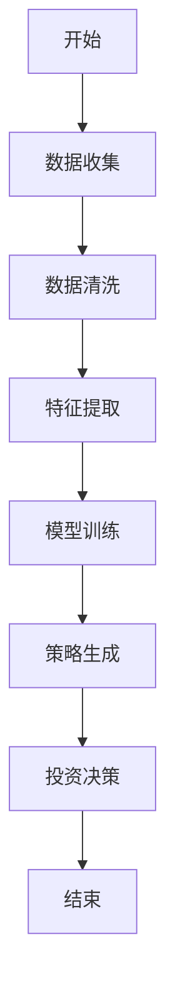
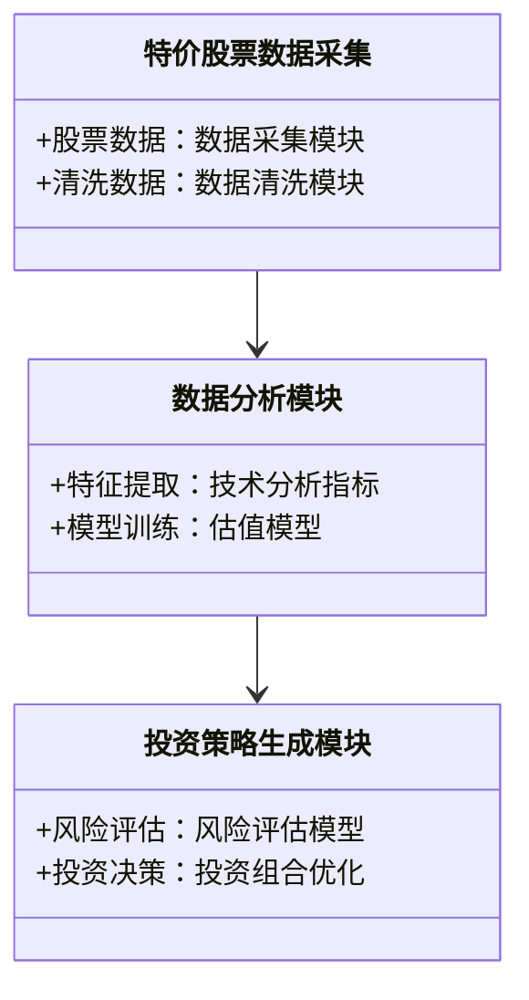
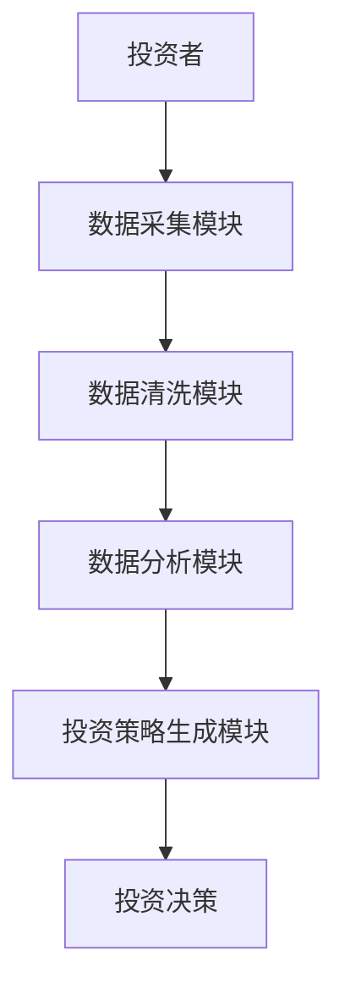
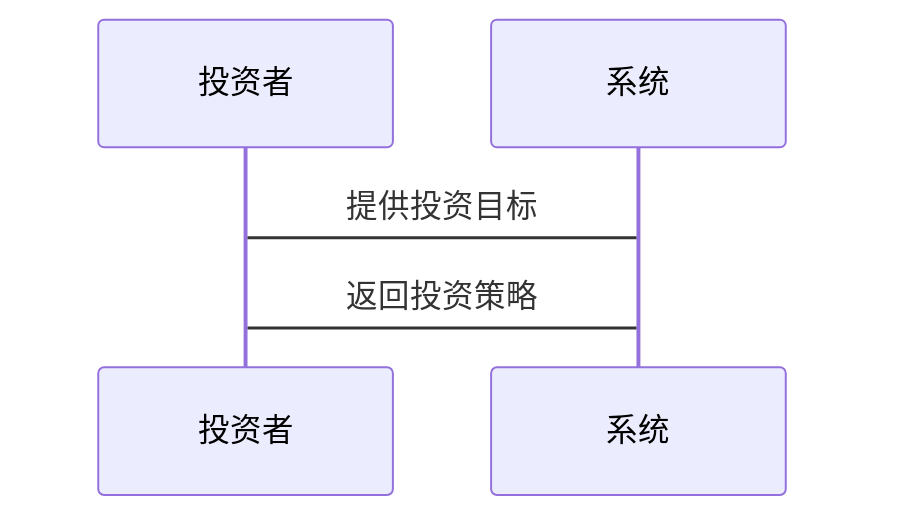

                 


# 特价股票投资策略在新兴市场的适用性探讨

**关键词**：特价股票、投资策略、新兴市场、金融数据分析、风险控制、投资组合优化

**摘要**：本文探讨了特价股票投资策略在新兴市场的适用性，分析了特价股票的特性、新兴市场的特点及其相互作用。通过理论分析和实证研究，提出了适用于新兴市场的投资策略，并设计了相应的数据分析系统。文章还提供了实战案例和最佳实践，帮助投资者在新兴市场中有效运用特价股票策略。

---

## 第一章: 特价股票与新兴市场概述

### 1.1 特价股票的基本概念

#### 1.1.1 特价股票的定义

特价股票指股价低于面值的股票，通常反映公司价值被市场低估的情况。这种股票可能源于公司重组、财务困境或市场低估。

#### 1.1.2 特价股票的特性

- **低估值**：通常市净率和市盈率较低。
- **高波动性**：价格波动较大，受市场情绪影响显著。
- **高风险**：存在较高的退市或财务危机风险。

#### 1.1.3 特价股票与普通股票的区别

| 特性 | 特价股票 | 普通股票 |
|------|----------|----------|
| 估值 | 通常低于面值 | 市场价值与面值相近 |
| 风险 | 高 | 中等 |
| 收益 | 可能高回报 | 稳定回报 |

### 1.2 新兴市场的定义与特点

#### 1.2.1 新兴市场的定义

新兴市场指经济快速发展、股市逐步建立的国家，如中国、印度等。这些市场具有高增长潜力，但同时伴随高风险。

#### 1.2.2 新兴市场的特点

- **高波动性**：市场波动剧烈，受政策和经济因素影响大。
- **信息不对称**：上市公司信息披露不完善，投资者获取信息困难。
- **政策影响**：政府政策变化对市场影响显著。

#### 1.2.3 新兴市场的风险与机会

- **风险**：政策变动、市场波动、信息不透明。
- **机会**：高增长潜力，新兴行业投资机会多。

### 1.3 特价股票与新兴市场的相关性

#### 1.3.1 特价股票在新兴市场的表现

新兴市场中，特价股票可能因公司重组或困境而出现，但受市场波动影响大。

#### 1.3.2 新兴市场中特价股票的特殊性

- **高波动性**：新兴市场中特价股票波动更大。
- **信息不对称**：投资者难以准确评估公司价值。

#### 1.3.3 特价股票在新兴市场中的投资机会

新兴市场的特价股票可能因重组或转机而带来高回报，但需谨慎评估风险。

---

## 第二章: 特价股票投资策略的理论基础

### 2.1 投资策略的基本理论

#### 2.1.1 有效市场假说

有效市场假说认为市场价格反映所有可用信息，但在新兴市场中，信息不透明可能影响市场有效性。

#### 2.1.2 技术分析与基本面分析

技术分析关注价格和成交量，基本面分析评估公司财务状况。新兴市场中，技术分析可能更适用，因信息有限。

#### 2.1.3 市场异效与套利机会

市场异效指价格偏离内在价值，套利机会可能存在于新兴市场的特价股票中。

### 2.2 新兴市场中的投资策略特点

#### 2.2.1 新兴市场的波动性与投资策略

新兴市场波动性高，投资者需采用短期策略，如波段操作。

#### 2.2.2 新兴市场的信息不对称问题

信息不对称增加投资难度，投资者需通过其他渠道获取信息。

#### 2.2.3 新兴市场的政策影响

政策变化对市场影响大，投资者需关注政策动向。

### 2.3 特价股票投资策略的核心要素

#### 2.3.1 特价股票的估值方法

使用市净率、市盈率等指标评估公司价值，考虑新兴市场中的特殊因素。

#### 2.3.2 特价股票的风险评估

评估公司财务状况、行业前景和政策风险，制定风险控制策略。

#### 2.3.3 特价股票的投资周期

新兴市场中，短期交易可能更合适，长期投资需谨慎评估公司基本面。

---

## 第三章: 特价股票投资策略的算法与模型

### 3.1 特价股票投资策略的数学模型

#### 3.1.1 估值模型的构建

使用市净率（P/B）和市盈率（P/E）评估股票价值，设定阈值筛选特价股票。

#### 3.1.2 风险评估模型的建立

结合波动率和贝塔系数，评估股票风险。

#### 3.1.3 投资组合优化模型

使用现代投资组合理论（MPT）优化投资组合，平衡风险与收益。

### 3.2 算法流程图



### 3.3 算法实现代码

#### 3.3.1 环境安装

```bash
pip install pandas numpy matplotlib
```

#### 3.3.2 数据清洗与特征提取

```python
import pandas as pd
import numpy as np

# 加载数据
data = pd.read_csv('em_stocks.csv')

# 数据清洗
data = data.dropna()
data = data[数据.columns[数据.isnull().mean() < 0.2]]

# 特征提取
features = ['P/B', 'P/E', '波动率']
target = '是否特价'
```

#### 3.3.3 模型训练与策略生成

```python
from sklearn.tree import DecisionTreeClassifier

# 训练模型
model = DecisionTreeClassifier()
model.fit(data[features], data[target])

# 生成策略
策略 = model.predict(new_data[features])
```

---

## 第四章: 系统分析与架构设计

### 4.1 问题场景介绍

新兴市场中，投资者需实时监控特价股票，分析市场动态，制定投资策略。

### 4.2 系统功能设计



### 4.3 系统架构设计



### 4.4 系统接口设计

- 输入接口：接收实时股票数据
- 输出接口：生成投资策略报告

### 4.5 系统交互序列图



---

## 第五章: 项目实战

### 5.1 环境配置

```bash
pip install pandas numpy scikit-learn
```

### 5.2 核心实现代码

#### 数据处理

```python
import pandas as pd
import numpy as np

# 加载数据
data = pd.read_csv('em_stocks.csv')

# 数据清洗
data = data.dropna()
data = data[数据.columns[数据.isnull().mean() < 0.2]]

# 特征提取
features = ['P/B', 'P/E', '波动率']
target = '是否特价'
```

#### 模型训练

```python
from sklearn.tree import DecisionTreeClassifier

# 训练模型
model = DecisionTreeClassifier()
model.fit(data[features], data[target])
```

#### 投资策略生成

```python
# 生成策略
策略 = model.predict(new_data[features])
```

### 5.3 案例分析

分析新兴市场中的某公司特价股票，评估其投资价值，制定相应的投资策略。

---

## 第六章: 总结与展望

### 6.1 研究总结

本文分析了特价股票在新兴市场的适用性，提出了相应的投资策略和系统架构，为投资者提供了理论和实践指导。

### 6.2 研究局限

新兴市场的不确定性和信息不对称增加了研究难度，未来研究可考虑更多因素，如宏观环境和行业趋势。

### 6.3 未来展望

未来研究可结合大数据和机器学习，开发更智能的投资策略，提升在新兴市场中的投资效果。

---

**作者：AI天才研究院 & 禅与计算机程序设计艺术**

---

**注**：本文为技术博客文章，内容涉及专业领域，仅供参考，不构成投资建议。

