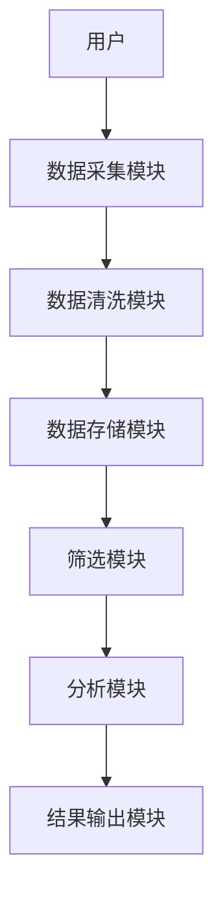

                 


```markdown
# 特价股票投资策略在新兴经济体中的适用性探讨

> 关键词：特价股票，新兴经济体，投资策略，股票筛选，市场分析

> 摘要：本文探讨了特价股票投资策略在新兴经济体中的适用性。通过分析特价股票的定义、特征以及新兴经济体的市场特点，结合算法模型和实际案例，深入探讨了特价股票在新兴经济体中的投资机会与风险，并提出了相应的策略建议。

---

## 第一部分：特价股票投资策略的背景与概念

### 第1章：特价股票投资策略的定义与特征

#### 1.1 特价股票的定义
- **1.1.1 特价股票的定义与内涵**
  特价股票是指相对于其内在价值而言，市场价格被低估的股票。这种低估可能是由于市场情绪、信息不对称或其他外部因素导致的。特价股票的核心在于“价值”而非“价格”，即寻找被市场低估的优质资产。

- **1.1.2 特价股票的核心特征**
  - 低估值：市盈率（P/E）和市净率（P/B）低于行业平均水平。
  - 高分红：部分公司可能提供较高的股息收益率。
  - 弱势市场中的机会：在市场低迷时，特价股票更容易出现。

- **1.1.3 特价股票与普通股票的区别**
  | 特性 | 特价股票 | 普通股票 |
  |------|----------|----------|
  | 估值 | 低于行业平均 | 接近或高于行业平均 |
  | 风险 | 较高 | 较低 |
  | 收益 | 中长期可能高收益 | 短期波动较大 |

#### 1.2 新兴经济体的特征
- **1.2.1 新兴经济体的定义**
  新兴经济体是指处于经济转型期，经济增长迅速但尚未完全工业化的国家，如中国、印度、巴西等。

- **1.2.2 新兴经济体的经济特点**
  - 经济增长快，但波动性较大。
  - 金融市场不成熟，信息透明度较低。
  - 政策风险较高，受政府干预较多。

- **1.2.3 新兴经济体的市场特征**
  - 股市波动性大，但成长空间广阔。
  - 市场参与者以散户为主，机构投资者较少。
  - 市场流动性在某些情况下可能不足。

### 第2章：特价股票投资策略在新兴经济体中的适用性背景

#### 2.1 特价股票投资策略的背景
- **2.1.1 特价股票投资策略的起源**
  价值投资理念起源于本杰明·格雷厄姆和戴维·多德的“安全边际”理论，强调寻找被市场低估的股票。

- **2.1.2 特价股票投资策略的发展**
  随着金融市场的成熟，价值投资策略逐渐被机构投资者采纳，但在新兴市场中的应用仍需谨慎。

- **2.1.3 特价股票投资策略的现状**
  在新兴经济体中，特价股票投资策略逐渐受到关注，但实施难度较高。

#### 2.2 新兴经济体中的投资环境
- **2.2.1 新兴经济体的投资机会**
  - 经济增长带来的企业扩张机会。
  - 低估值股票的潜在增值空间。

- **2.2.2 新兴经济体的投资风险**
  - 政策风险：政府干预可能影响市场。
  - 市场风险：股市波动较大。
  - 信息风险：信息透明度较低。

- **2.2.3 新兴经济体与发达国家市场的对比**
  | 特性 | 新兴市场 | 发达市场 |
  |------|----------|----------|
  | 市场成熟度 | 低 | 高 |
  | 信息透明度 | 低 | 高 |
  | 投资机会 | 高成长性 | 稳定性 |

---

## 第二部分：特价股票投资策略的核心概念与联系

### 第3章：特价股票投资策略的核心原理

#### 3.1 特价股票投资策略的核心原理
- **3.1.1 价值投资的基本原理**
  - 市场价格与内在价值的差异是投资机会的来源。
  - 长期持有优质资产，等待市场回归理性。

- **3.1.2 市场情绪与股票价格的关系**
  - 市场情绪影响短期价格波动。
  - 在市场恐慌时，特价股票可能被低估。

- **3.1.3 特价股票的估值方法**
  - 市盈率（P/E）：净利润与股价的比率。
  - 市净率（P/B）：净资产与股价的比率。
  - 股息率：股息与股价的比率。

#### 3.2 新兴经济体中的特价股票特征
- **3.2.1 新兴经济体中特价股票的定义**
  在新兴经济体中，特价股票是指那些市场价格显著低于内在价值的股票。

- **3.2.2 新兴经济体中特价股票的筛选标准**
  - 低市盈率：P/E < 行业平均。
  - 高股息率：股息收益率高于行业平均水平。
  - 强大的基本面：净利润增长稳定。

- **3.2.3 新兴经济体中特价股票的市场表现**
  - 在市场复苏时，特价股票可能表现优异。
  - 在市场低迷时，可能面临进一步下跌风险。

### 第4章：特价股票投资策略与新兴经济体的关联

#### 4.1 特价股票投资策略在新兴经济体中的应用
- **4.1.1 特价股票投资策略在新兴经济体中的适用性**
  - 新兴经济体中存在大量低估值股票。
  - 市场波动为投资者提供了廉价买入的机会。

- **4.1.2 新兴经济体市场中特价股票的分布特点**
  - 主要集中在传统行业，如金融、能源和制造业。
  - 小盘股和中盘股中更容易发现特价股票。

- **4.1.3 新兴经济体市场中特价股票的投资机会**
  - 高成长性行业中的低估股票。
  - 政策支持的行业中有潜力的股票。

#### 4.2 新兴经济体中特价股票投资策略的局限性
- **4.2.1 新兴经济体市场中的信息不对称问题**
  - 信息透明度低，难以准确评估股票价值。
  - 缺乏专业的研究机构支持。

- **4.2.2 新兴经济体市场中的政策风险**
  - 政府干预可能导致股价波动。
  - 行业政策变化可能影响公司业绩。

- **4.2.3 新兴经济体市场中的流动性风险**
  - 部分股票流动性差，难以在短时间内变现。
  - 市场波动大时，流动性风险加剧。

---

## 第三部分：特价股票投资策略的算法与数学模型

### 第5章：特价股票筛选算法

#### 5.1 特价股票筛选算法的核心原理
- **5.1.1 算法目标**
  通过量化指标筛选出潜在的特价股票。

- **5.1.2 算法步骤**
  ```mermaid
  graph TD
      A[开始] --> B[输入数据]
      B --> C[计算市盈率]
      C --> D[计算市净率]
      D --> E[计算股息率]
      E --> F[比较指标与行业平均]
      F --> G[筛选出符合条件的股票]
      G --> H[输出结果]
  ```

- **5.1.3 算法实现**
  ```python
  import pandas as pd

  def screen_cheap_stocks(data, industry_avg):
      # 计算市盈率
      data['pe_ratio'] = data['净利润'] / data['股价']
      # 计算市净率
      data['pb_ratio'] = data['净资产'] / data['股价']
      # 计算股息率
      data['dividend_yield'] = data['股息'] / data['股价']
      # 筛选条件
      mask = (
          data['pe_ratio'] < industry_avg['pe_avg'] &
          data['pb_ratio'] < industry_avg['pb_avg'] &
          data['dividend_yield'] > industry_avg['dividend_avg']
      )
      return data[mask]
  ```

- **5.1.4 算法的数学模型**
  - 市盈率公式：$$ PE = \frac{\text{净利润}}{\text{股价}} $$
  - 市净率公式：$$ PB = \frac{\text{净资产}}{\text{股价}} $$
  - 股息率公式：$$ Dividend Yield = \frac{\text{股息}}{\text{股价}} $$

### 第6章：系统架构与功能设计

#### 6.1 系统功能设计
- **6.1.1 数据采集模块**
  - 从新兴经济体的股票市场获取数据。
  - 数据清洗与预处理。

- **6.1.2 筛选模块**
  - 使用上述算法筛选出特价股票。
  - 输出筛选结果。

- **6.1.3 分析模块**
  - 对筛选出的股票进行深入分析。
  - 提供投资建议。

#### 6.2 系统架构设计


---

## 第四部分：项目实战与案例分析

### 第7章：项目实战

#### 7.1 环境安装
- 安装Python和相关库：
  ```bash
  pip install pandas numpy matplotlib
  ```

#### 7.2 核心代码实现
```python
import pandas as pd
import numpy as np

def main():
    # 示例数据
    data = pd.DataFrame({
        '公司名称': ['公司A', '公司B', '公司C'],
        '股价': [10, 15, 20],
        '净利润': [5, 7, 10],
        '净资产': [8, 12, 15],
        '股息': [1, 2, 3]
    })
    
    industry_avg = {
        'pe_avg': 15,
        'pb_avg': 2,
        'dividend_avg': 1
    }
    
    # 筛选特价股票
    cheap_stocks = screen_cheap_stocks(data, industry_avg)
    print("筛选出的特价股票：")
    print(cheap_stocks)

if __name__ == "__main__":
    main()
```

#### 7.3 案例分析
- **案例：印度市场中的某公司股票分析**
  - 公司基本面分析。
  - 股价走势分析。
  - 投资建议。

---

## 第五部分：总结与展望

### 第8章：总结与最佳实践

#### 8.1 总结
- 特价股票投资策略在新兴经济体中有其独特的适用性。
- 新兴经济体的市场特点需要投资者特别注意。

#### 8.2 最佳实践
- **注意市场波动**：新兴市场波动较大，投资需谨慎。
- **关注政策风险**：及时关注政府政策变化。
- **分散投资**：避免过度集中于单一行业或公司。

#### 8.3 注意事项
- 避免盲目跟风。
- 保持对市场的持续关注。

#### 8.4 拓展阅读
- 建议阅读《价值投资》相关书籍。
- 关注新兴经济体的经济动态。

---

## 作者：AI天才研究院/AI Genius Institute & 禅与计算机程序设计艺术/Zen And The Art of Computer Programming
```

