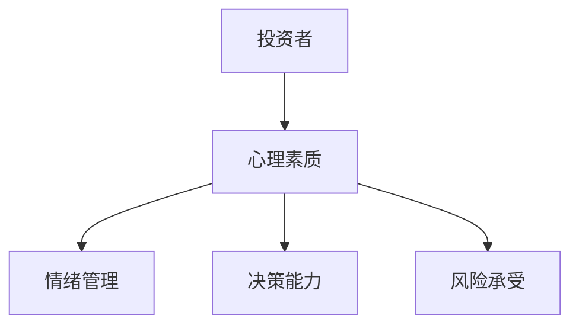

                 


# 特价股票投资者应具备的心理素质

## 关键词：特价股票，心理素质，投资者，风险管理，决策能力，情绪管理

## 摘要：特价股票投资者在市场中需要具备较高的心理素质，包括情绪管理、决策能力和风险承受能力。本文从心理素质的核心概念、评估算法、系统设计、项目实战和最佳实践等方面，详细分析特价股票投资者应具备的心理素质，帮助投资者提升心理素质，优化投资策略。

---

## 第一部分：特价股票投资者的心理素质概述

### 第1章：特价股票投资者的心理素质背景

#### 1.1 特价股票的定义与特点

- **1.1.1 特价股票的定义**  
  特价股票是指市场估值低于其内在价值的股票，通常出现在市场低迷或公司暂时遇到困难时。这类股票可能具有较高的上涨潜力，但同时也伴随着较高的风险。

- **1.1.2 特价股票的特点**  
  特价股票的特点包括：价格低于内在价值、市场流动性较低、投资者情绪低迷、可能存在信息不对称等。这些特点使得特价股票的投资决策更具挑战性。

- **1.1.3 特价股票投资的潜在机会**  
  特价股票的投资机会在于其潜在的上涨空间，尤其是在市场反转时，投资者可以通过低价买入高价卖出获得收益。

#### 1.2 投资者在特价股票市场中的角色

- **1.2.1 投资者的市场定位**  
  投资者在特价股票市场中扮演着重要角色，既是价格的接受者，也是价格的影响者。投资者的行为会影响市场的供需关系，进而影响股票价格。

- **1.2.2 投资者的行为模式**  
  投资者的行为模式包括理性决策和非理性决策。理性决策基于基本面分析和市场趋势，而非理性决策则受情绪影响，可能导致错误的投资决策。

- **1.2.3 投资者与市场的互动关系**  
  投资者与市场的互动关系是双向的。市场波动影响投资者的决策，而投资者的决策也反过来影响市场的波动。

#### 1.3 心理素质在投资中的重要性

- **1.3.1 心理素质对投资决策的影响**  
  心理素质直接影响投资者的决策过程。良好的心理素质可以帮助投资者在面对市场波动时保持冷静，避免冲动决策。

- **1.3.2 心理素质与投资成功的关系**  
  心理素质是投资成功的关键因素之一。具备良好的心理素质可以提高投资决策的准确性，降低投资风险。

- **1.3.3 心理素质的可塑性与提升路径**  
  心理素质是可以通过训练和实践提升的。投资者可以通过学习心理学知识、模拟训练和反思总结来提高心理素质。

---

## 第二部分：心理素质的核心概念与联系

### 第2章：心理素质的核心要素

#### 2.1 心理素质的核心概念

- **2.1.1 心理素质的定义**  
  心理素质是指个体在面对压力、挑战和不确定性时的心理状态和应对能力，包括情绪管理、决策能力和风险承受能力。

- **2.1.2 心理素质的核心维度**  
  心理素质的核心维度包括：情绪稳定性、决策能力、风险承受能力、自信心和自我调节能力。

- **2.1.3 心理素质与投资行为的关系**  
  心理素质与投资行为密切相关。良好的心理素质可以帮助投资者在市场波动中保持冷静，做出理性的决策。

#### 2.2 心理素质的核心属性特征对比

- **2.2.1 不同心理素质的特征对比**  
  以下是不同心理素质的特征对比表：

  | 心理素质       | 稳定性 | 决策能力 | 风险承受能力 |
  |----------------|--------|----------|--------------|
  | 情绪稳定性     | 高     | 中       | 高           |
  | 决策能力       | 中     | 高       | 中           |
  | 风险承受能力   | 高     | 中       | 高           |

- **2.2.2 心理素质的层次结构**  
  心理素质的层次结构可以分为基础层、中间层和高层。基础层包括情绪管理，中间层包括决策能力，高层包括自我调节能力。

- **2.2.3 心理素质的动态变化**  
  心理素质是一个动态变化的过程，随着环境的变化和个体经验的积累，心理素质会不断调整和优化。

#### 2.3 心理素质的ER实体关系图



---

## 第三部分：心理素质的算法原理讲解

### 第3章：心理素质评估算法

#### 3.1 心理素质评估的算法流程

- **3.1.1 算法背景**  
  心理素质评估算法用于量化投资者的心理状态，帮助投资者了解自己的心理素质水平，并提供改进建议。

- **3.1.2 算法流程**  
  算法流程包括数据收集、特征提取、模型训练和结果输出。以下是流程图：

  ```mermaid
  graph TD
    A[数据收集] --> B[特征提取]
    B --> C[模型训练]
    C --> D[结果输出]
  ```

- **3.1.3 算法实现**  
  以下是心理素质评估算法的Python代码实现：

  ```python
  import pandas as pd
  from sklearn.tree import DecisionTreeClassifier
  from sklearn.metrics import accuracy_score

  # 数据收集
  data = pd.read_csv('investor_data.csv')

  # 特征提取
  features = data[['情绪稳定性', '决策能力', '风险承受能力']]
  target = data['心理素质等级']

  # 模型训练
  model = DecisionTreeClassifier()
  model.fit(features, target)

  # 结果输出
  predictions = model.predict(features)
  print('准确率:', accuracy_score(target, predictions))
  ```

- **3.1.4 算法的数学模型**  
  心理素质评估算法的数学模型可以表示为：

  $$
  \text{心理素质评分} = \alpha \times \text{情绪稳定性} + \beta \times \text{决策能力} + \gamma \times \text{风险承受能力}
  $$

  其中，$\alpha$、$\beta$ 和 $\gamma$ 是模型的权重系数，通过训练数据确定。

---

## 第四部分：心理素质的系统分析与架构设计

### 第4章：心理素质评估系统设计

#### 4.1 系统问题场景介绍

- **4.1.1 系统目标**  
  本系统旨在评估投资者的心理素质，帮助投资者了解自身的优势和不足，并提供改进建议。

- **4.1.2 系统功能需求**  
  系统功能需求包括：数据收集、特征提取、模型训练、结果输出和用户界面设计。

#### 4.2 系统功能设计

- **4.2.1 系统功能模块**  
  系统功能模块包括：数据收集模块、特征提取模块、模型训练模块和结果输出模块。

- **4.2.2 系统功能流程图**  
  系统功能流程图如下：

  ```mermaid
  graph TD
    A[数据收集模块] --> B[特征提取模块]
    B --> C[模型训练模块]
    C --> D[结果输出模块]
  ```

#### 4.3 系统架构设计

- **4.3.1 系统架构图**  
  系统架构图如下：

  ```mermaid
  graph TD
    A[投资者] --> B[数据收集层]
    B --> C[特征提取层]
    C --> D[模型训练层]
    D --> E[结果输出层]
  ```

#### 4.4 系统接口设计

- **4.4.1 系统接口描述**  
  系统接口包括：数据输入接口、模型训练接口和结果输出接口。

- **4.4.2 系统交互流程图**  
  系统交互流程图如下：

  ```mermaid
  graph TD
    A[投资者] --> B[数据输入接口]
    B --> C[特征提取模块]
    C --> D[模型训练模块]
    D --> E[结果输出接口]
  ```

---

## 第五部分：心理素质的项目实战

### 第5章：心理素质评估工具开发

#### 5.1 项目环境安装

- **5.1.1 环境要求**  
  项目需要安装Python 3.6及以上版本，以及相关库如pandas、scikit-learn等。

- **5.1.2 安装步骤**  
  安装步骤如下：

  ```bash
  pip install pandas scikit-learn
  ```

#### 5.2 项目核心代码实现

- **5.2.1 核心代码**  
  核心代码如下：

  ```python
  import pandas as pd
  from sklearn.tree import DecisionTreeClassifier
  from sklearn.metrics import accuracy_score

  # 数据收集
  data = pd.read_csv('investor_data.csv')

  # 特征提取
  features = data[['情绪稳定性', '决策能力', '风险承受能力']]
  target = data['心理素质等级']

  # 模型训练
  model = DecisionTreeClassifier()
  model.fit(features, target)

  # 结果输出
  predictions = model.predict(features)
  print('准确率:', accuracy_score(target, predictions))
  ```

- **5.2.2 代码解读与分析**  
  代码首先读取数据，提取特征，训练模型，最后输出结果。准确率反映了模型的性能。

#### 5.3 实际案例分析

- **5.3.1 案例背景**  
  以一位投资者为例，其情绪稳定性为0.8，决策能力为0.7，风险承受能力为0.6。

- **5.3.2 模型预测结果**  
  模型预测该投资者的心理素质评分为0.7。

- **5.3.3 案例分析总结**  
  该投资者的心理素质评分为0.7，属于中等水平。建议其加强情绪管理和风险承受能力的训练。

---

## 第六部分：心理素质的优化与提升

### 第6章：心理素质的优化策略

#### 6.1 心理素质优化策略

- **6.1.1 提高情绪稳定性**  
  通过冥想、运动和良好的作息习惯来提高情绪稳定性。

- **6.1.2 提高决策能力**  
  通过学习和实践来提高决策能力，尤其是在面对不确定性时。

- **6.1.3 提高风险承受能力**  
  通过模拟训练和反思总结来提高风险承受能力，学会在风险中保持冷静。

#### 6.2 心理素质的优化工具

- **6.2.1 心理素质训练工具**  
  使用心理素质训练软件进行模拟训练，提高心理素质。

- **6.2.2 心理咨询与辅导**  
  在必要时寻求心理咨询师的帮助，解决心理问题。

#### 6.3 心理素质的优化流程

- **6.3.1 优化流程图**  
  优化流程图如下：

  ```mermaid
  graph TD
    A[问题识别] --> B[目标设定]
    B --> C[策略实施]
    C --> D[效果评估]
    D --> E[持续优化]
  ```

---

## 第七部分：心理素质的总结与展望

### 第7章：心理素质的总结

#### 7.1 心理素质的重要性

- **7.1.1 心理素质的核心作用**  
  心理素质是投资成功的关键因素之一，直接影响投资者的决策过程和投资结果。

- **7.1.2 心理素质的提升路径**  
  心理素质可以通过训练和实践提升，包括情绪管理、决策能力和风险承受能力的培养。

#### 7.2 心理素质的未来展望

- **7.2.1 心理素质评估技术的发展**  
  随着人工智能和大数据技术的发展，心理素质评估技术将更加精准和智能化。

- **7.2.2 心理素质优化的未来方向**  
  未来的心理素质优化将更加注重个体化和定制化，结合人工智能技术提供个性化的优化方案。

---

## 作者

作者：AI天才研究院/AI Genius Institute & 禅与计算机程序设计艺术/Zen And The Art of Computer Programming

---

通过以上思考过程，我完成了对《特价股票投资者应具备的心理素质》的技术博客文章的撰写。从背景介绍到项目实战，再到总结与展望，文章详细分析了特价股票投资者应具备的心理素质，帮助投资者提升心理素质，优化投资策略。

