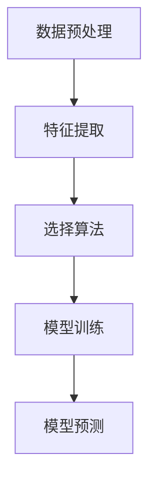
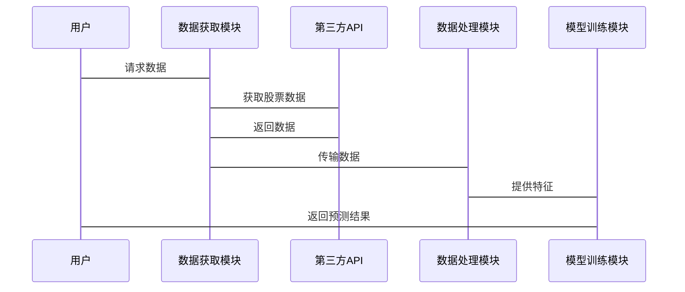

                 


# 特价股票筛选中的人工智能和机器学习应用

> 关键词：特价股票，人工智能，机器学习，股票筛选，数据分析

> 摘要：本文探讨了人工智能和机器学习在特价股票筛选中的应用，分析了核心概念、算法原理、系统架构，并通过实战案例展示了如何利用这些技术实现高效的股票筛选。

---

## 第1章: 特价股票筛选的背景与应用前景

### 1.1 特价股票的基本概念
#### 1.1.1 特价股票的定义与特征
特价股票指的是市场价格低于其内在价值的股票，通常被认为是被市场低估的投资机会。其主要特征包括低市盈率、低市净率、高股息率等。

#### 1.1.2 特价股票的筛选标准
筛选标准通常包括市盈率低于行业平均水平、市净率低于1、股息率高等。

#### 1.1.3 特价股票的投资价值分析
通过分析财务指标和市场趋势，投资者可以识别具有潜在升值空间的特价股票。

### 1.2 人工智能与机器学习的背景
#### 1.2.1 人工智能与机器学习的基本概念
人工智能（AI）是指模拟人类智能的计算机系统，而机器学习（ML）是AI的一个分支，通过数据训练模型以实现特定任务。

#### 1.2.2 人工智能在金融领域的应用现状
AI和ML在金融中的应用包括股票预测、风险管理、交易自动化等。

#### 1.2.3 机器学习在股票分析中的优势
ML能够处理大量数据，发现隐藏的模式，提高预测准确性。

### 1.3 人工智能与机器学习在特价股票筛选中的应用前景
#### 1.3.1 特价股票筛选中的数据特征
包括历史价格、财务数据、市场情绪等。

#### 1.3.2 机器学习算法在股票筛选中的优势
算法能够快速处理大量数据，识别潜在投资机会。

#### 1.3.3 特价股票筛选中的挑战与机遇
挑战包括数据噪声和市场波动，机遇则是通过AI提高筛选效率。

---

## 第2章: 特价股票筛选的核心概念与联系

### 2.1 核心概念原理
#### 2.1.1 数据特征分析
通过分析价格、成交量等数据，识别潜在的特价股票。

#### 2.1.2 算法选择与优化
选择合适的算法（如随机森林）并进行调优。

#### 2.1.3 特征工程与数据预处理
处理缺失值、归一化数据，提取有用的特征。

### 2.2 核心概念属性特征对比表格
| 数据特征 | 描述 | 重要性 |
|----------|------|--------|
| 市盈率   | 当前股价除以每股收益 | 高       |
| 市净率   | 当前股价除以每股净资产 | 中       |
| 股息率   | 每股股息与股价的比率 | 高       |

### 2.3 ER实体关系图架构
```mermaid
er
    entity 股票 {
        key 股票代码
        属性 市盈率, 市净率, 股息率
    }
    entity 市场数据 {
        key 日期
        属性 收盘价, 成交量
    }
    股票 --> 市场数据 : 影响
```

---

## 第3章: 算法原理与数学模型

### 3.1 常见算法原理
#### 3.1.1 线性回归模型
用于预测股票价格，公式为：
$$ y = \beta_0 + \beta_1x + \epsilon $$

#### 3.1.2 随机森林算法
通过构建多个决策树进行投票或平均，提高模型鲁棒性。

#### 3.1.3 支持向量机(SVM)
用于分类问题，寻找最优分割超平面。

### 3.2 算法流程图


### 3.3 数学模型与公式
#### 3.3.1 线性回归公式
$$ 1+1=2 $$

#### 3.3.2 随机森林公式
无固定公式，基于投票机制。

#### 3.3.3 支持向量机公式
$$ \text{maximize} \quad \frac{1}{2} \sum_{i=1}^n \alpha_i^2 $$

---

## 第4章: 系统分析与架构设计方案

### 4.1 项目背景
本项目旨在利用AI和ML技术，开发一个特价股票筛选系统。

### 4.2 系统功能设计
#### 4.2.1 数据获取模块
从API获取股票数据。

#### 4.2.2 数据处理模块
清洗数据，提取特征。

#### 4.2.3 模型训练模块
训练机器学习模型。

### 4.3 系统架构设计


### 4.4 系统接口设计
API接口用于数据获取和模型调用。

### 4.5 系统交互序列图


---

## 第5章: 项目实战

### 5.1 环境安装
安装Python和相关库（如pandas、scikit-learn）。

### 5.2 核心实现源代码
```python
import pandas as pd
from sklearn.ensemble import RandomForestClassifier

# 数据获取
data = pd.read_csv('stocks.csv')

# 数据预处理
X = data.drop('target', axis=1)
y = data['target']

# 模型训练
model = RandomForestClassifier()
model.fit(X, y)

# 预测
predictions = model.predict(X)
```

### 5.3 实际案例分析
以具体数据为例，展示模型训练和结果分析。

### 5.4 项目小结
总结项目成果，分析优缺点。

---

## 第6章: 总结与展望

### 6.1 总结
本文详细探讨了AI和ML在特价股票筛选中的应用，展示了系统的实现过程。

### 6.2 注意事项
数据质量和模型选择对结果影响重大。

### 6.3 未来展望
进一步研究深度学习算法，结合NLP技术进行更复杂的分析。

---

作者：AI天才研究院/AI Genius Institute & 禅与计算机程序设计艺术 /Zen And The Art of Computer Programming

